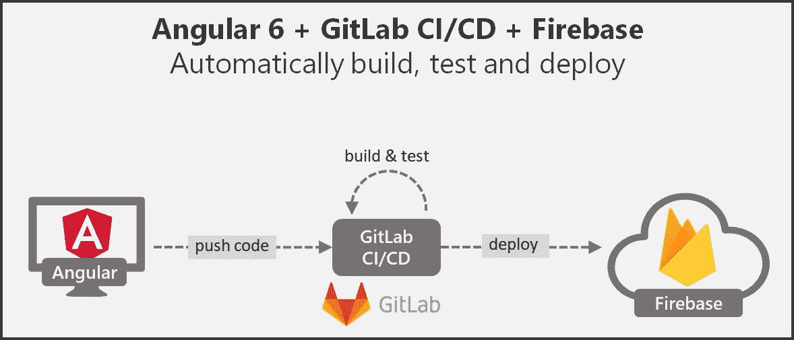
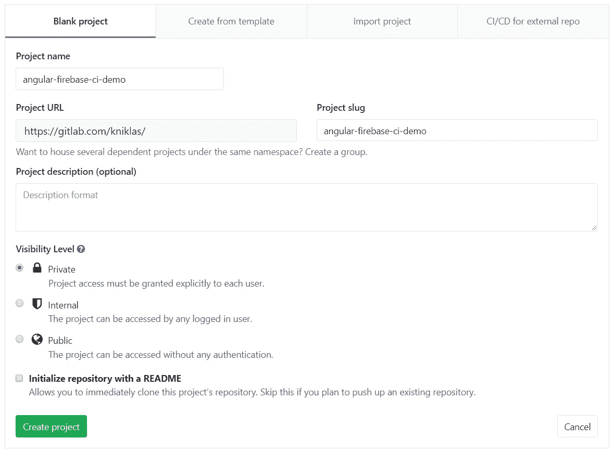
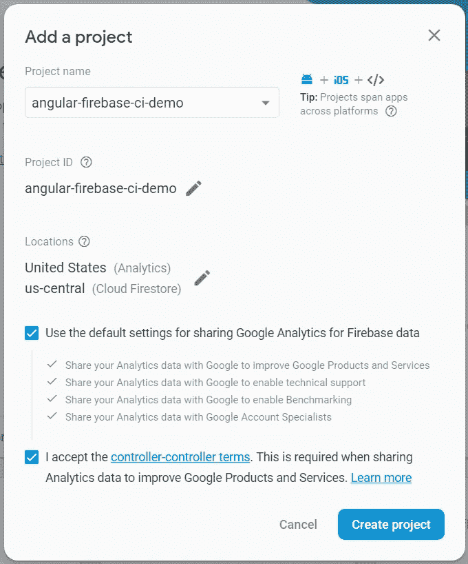
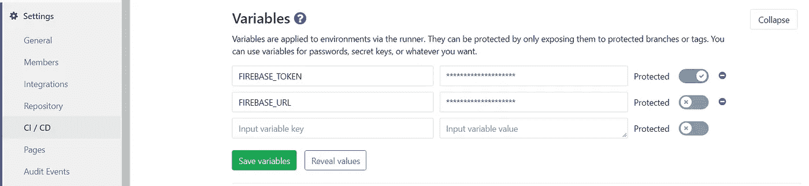

# 带 Angular 6 和 Firebase 和 GitLab 的 CI/CD

> 原文：<https://medium.com/hackernoon/ci-cd-with-angular-6-firebase-gitlab-5118ad469e4d>

## 使用 GitLab CI/CD 自动构建、测试和部署



我最近写了一篇关于如何用 Angular 6、Firebase 和 Bitbucket 管道进行 CI/CD 的文章。我收到的反馈也是试用 [GitLab](https://gitlab.com/) 。开始了。

# 概述

1.  创建 GitLab 存储库
2.  创建 Angular 6 演示应用程序
3.  CI/CD 配置角度 6(构建、测试、部署)
4.  创建 Firebase 项目
5.  在 GitLab 中配置 CI/CD

# 先决条件

*   [GitLab](https://gitlab.com) 和 [Firebase](https://firebase.google.com/) 账号
*   安装在本地开发机器上的 [Git](https://git-scm.com/) 和 [Node.js](https://nodejs.org) 10.x

# (1)创建 GitLab 资源库

首先，我们创建一个新的 GitLab 存储库。你可以在这里找到我的演示库:[https://gitlab.com/kniklas/angular-firebase-ci-demo](https://gitlab.com/kniklas/angular-firebase-ci-demo)



# (2)创建 Angular 6 演示应用程序

在这个演示中，我们用 [Angular CLI](https://angular.io/guide/quickstart) 创建我们的 Angular 应用程序。如果您尚未安装 CLI，请使用以下命令进行安装:

```
npm install -g @angular/cli
```

如果您已经安装了旧版本的 angular CLI，请使用以下命令升级到最新版本，如这里的[所述](https://www.npmjs.com/package/@angular/cli):

```
npm uninstall -g @angular/cli
npm cache verifynpm install -g @angular/cli@latest
```

然后，我们可以创建我们的角骨架应用程序:

```
ng new angular-firebase-ci-demo
```

如果您对刚刚创建的内容感兴趣，请从内置服务器开始:

```
cd angular-firebase-ci-demo 
ng serve -o
```

该命令应该会自动启动您的浏览器并导航到 [http://localhost:4200/](http://localhost:4200/) 。

# (3)用于构建、测试和部署的配置角度 6

Angular 6 附带 2 个测试工具: [Karma](https://karma-runner.github.io/) 用于单元测试，[量角器](https://www.protractortest.org/)用于 end-2-end 或集成测试。你可以在这里找到更多关于差异[的信息。这两种方法的共同点是，它们打开浏览器来执行测试(这听起来很合理，因为我们正在构建一个前端)。在开发过程中，我们可以使用命令`ng test`运行基于 Karma 的测试，该命令打开浏览器(Chrome ),执行测试并在代码发生变化时重新运行所有测试。为了执行基于量角器的测试，我们使用命令`ng e2e`，它也打开一个浏览器并运行测试。](https://www.protractortest.org/#/faq)

在我们的 CI 环境中，我们只需要执行我们的测试用例，而不需要浏览器的 GUI 和内存开销。有了 chrome 的[无头模式，这才有可能。](https://developers.google.com/web/updates/2017/04/headless-chrome)

## 操纵木偶的人

首先，我们需要在 CI 环境中包含一个浏览器。我们将使用捆绑了 chrome 的节点库[木偶师](https://github.com/GoogleChrome/puppeteer)。有了它，我们可以确保无论是在我们的开发环境中还是在我们的 CI 环境中，我们都有合适的浏览器。

```
npm install --save-dev puppeteer
```

## Karma 构型

我们在`karma.conf.js`中添加了一个定制的启动器，在 CI 环境中以无头模式启动 Chrome。此外，我们需要使用选项`--no-sandbox`，使其工作，因为我们没有在 docker 映像上进行额外的用户配置。

```
# ./angular-firebase-ci-demo/**src/karma.conf.js****const puppeteer = require('puppeteer');
process.env.CHROME_BIN = puppeteer.executablePath();**module.exports = function (config) {
  config.set({
    (...) **customLaunchers: {
      ChromeHeadlessNoSandbox: {
        base: 'ChromeHeadless',
        flags: ['--no-sandbox']
      }
    },** (...)});
};
```

## 量角器配置

对于 e2e 测试，我们添加了以下配置文件，以便能够在无头模式下使用选项`--no-sandbox`调用 chrome。

```
# ./angular-firebase-ci-demo/**e2e/protractor-ci.conf.js**const config = require('./protractor.conf').config;
const puppeteer = require('puppeteer');config.capabilities = {
  browserName: 'chrome',
  chromeOptions: {
    args: ['--headless', '--no-sandbox'],
    binary: puppeteer.executablePath()
  }
};exports.config = config;
```

## 为 CI/CD 添加节点脚本

为了在 CI 上正确地构建、测试和部署，我们将以下脚本添加到我们的`package.json`配置文件中。

```
"scripts": {
  "**build-prod**": "ng build --prod",
  "**test-ci**": "ng test --no-watch --no-progress --browsers=ChromeHeadlessNoSandbox",
  "**e2e-ci**": "ng e2e --protractor-config=e2e/protractor-ci.conf.js",
  "**deploy**": "firebase deploy --token $FIREBASE_TOKEN --non-interactive"
}
```

## 提交到 GitLab

现在我们可以与 GitLab 中的远程存储库共享我们的本地代码。您可以在 GitLab 资源库概述中找到 git URL。对我来说，这些命令看起来像这样:

```
# switch to project folder in ./angular-firebase-ci-demogit remote add origin [https://gitlab.com/kniklas/angular-firebase-ci-demo.git](https://gitlab.com/kniklas/angular-firebase-ci-demo.git) git push origin master
```

代码现在应该在我们的 GitLab 库中可见。

# (4)创建 Firebase 应用程序

在[https://console.firebase.google.com/](https://console.firebase.google.com/)上创建新项目。



New Firebase Project

## 安装 Firebase 工具

因为我们想要部署到 firebase，所以我们需要 [firebase 工具](https://www.npmjs.com/package/firebase-tools)。让我们将它们添加到我们的开发依赖项中，并在我们的机器上全局安装它们:

```
npm install --save-dev firebase-tools
npm install -g firebase-tools
```

## 添加 Firebase 的配置

常规 Firebase 项目配置。您需要使用项目 id **而不是**项目名称:

```
# ./angular-firebase-ci-demo/**.firebaserc**{
  "projects": {
    "default": "angular-firebase-ci-demo"
  }
}
```

Firebase 托管配置:让我们只部署 dist 文件夹中的内容，它是在产品构建期间创建的。

```
# ./angular-firebase-ci-demo/**firebase.json**{
  "hosting": {
    "public": "dist/angular-firebase-ci-demo",
    "rewrites": [
      {
        "source": "**",
        "destination": "/index.html"
      }
    ]
  }
}
```

## 提交 Firebase 配置

我们现在将所有更改推送到我们的主分支。

```
git add -A
git commit -m "firebase config"
git commit git push origin master
```

# (5)在 GitLab 中设置和配置 CI/CD

## 配置配置项/光盘

GitLab CI/CD 配置了一个名为`.gitlab-ci.yml`的特殊文件，需要放在项目的根文件夹中。GitLab 自动检测文件，并根据配置运行管道。让我们添加以下文件，从一个简单的 3 步管道开始，它包括构建、测试和部署到生产环境，并缓存和存储构建工件。

## 已配置管道的说明

通过`image: node:10`,我们告诉管道哪个 docker 容器应该用于构建。对于角度 6，我们需要节点 10.x。

我们把流水线分成三个工作:`build`、`test`和`deploy_prod`。每一步都在我们定义的图像上一个接一个地独立执行。每当出现错误时，管道就会停止。*例*:如果`build`失败，则`test`和`deploy_prod`不会被执行。

使用`caches: path: node_modules/`,我们缓存在依赖项安装期间下载的所有 node_modules。这将加速管道的后续作业，因为它们都是在空白映像上执行的。默认的缓存策略是`pull-push`。这意味着，在作业中运行任何脚本之前，将从缓存存储库中提取定义为缓存的文件。所有脚本运行后，文件被推回到缓存存储库。

对于`test`和`deploy_prod`作业，我们使用缓存策略`pull`定义了要缓存的相同文件夹，因为我们不需要写回缓存。这加快了进程。

使用命令`only: master`,我们告诉`deploy_prod`作业只在主分支发生变化时运行。有了它，我们就可以确保，不是特性或其他分支上的每一个变化都会被部署到生产中。

通过命令`dependencies: build`我们告诉`deploy_prod`作业获取我们在构建作业中定义的工件。这样，我们就不需要再次构建它，并确保不部署其他东西。

为了跟踪生产环境的部署，我们使用命令`environment`告诉 GitLab 将该作业视为生产部署。在这里找到更多关于 [GitLab 环境](https://docs.gitlab.com/ee/ci/environments.html)的信息。

每项工作的主要部分是`script:`部分，其任务如下:

1.  **构建**:安装所有在`package.json`中描述的所需模块，并构建我们想要部署的工件。
2.  **测试**:按照[木偶师故障诊断文档](https://github.com/GoogleChrome/puppeteer/blob/master/docs/troubleshooting.md)中的讨论，安装所需的库来运行 docker 映像上的 chrome。然后执行因果报应和量角器测试。
3.  **部署**:将工件部署到火焰基地。

如果任何命令失败，整个管道都会失败。这意味着，失败的测试将阻止部署到服务器上(这很好，因为我们不想破坏生产)。

## 在 GitLab 中设置环境变量

在我们的管道脚本中，我们定义了两个环境变量。

1.  `FIREBASE_TOKEN`，用于验证 GitLab 对 Firebase 和
2.  `FIREBASE_URL`，这是我们项目的 URL，仅用作我们在 GitLab 中的环境配置的元信息。

我们通过在命令行上键入以下内容来获得令牌:

```
firebase login:ci
```

我们在**设置> CI/CD >变量**中配置的令牌。



CI/CD variables in GitLab

**重要提示:**请勿将密码或其他机密信息存储在 git 中。而是利用环境变量。

## 测试管道

现在提交任何对 master 的更改或合并到 master，您将看到 Firebase 的部署。如果您提交到任何其他分支，将只运行构建和测试作业。

## 替代码头工人图像

管道目前“中毒”了，声明安装 chrome 所需的库。如果没有这些库，chrome 就不能工作，并且会出错。一种更干净的方法是使用包含这些库的自定义 docker 容器。这对于维护和加速管道来说更为友好。[木偶师的故障诊断文档](https://github.com/GoogleChrome/puppeteer/blob/master/docs/troubleshooting.md)中描述了这种情况。

# 想多读点吗？

订阅我的 [**关于现代软件架构的时事通讯**](https://mailchi.mp/7f46c21dfc63/better-software-architect) 。增长您的技能，成为更好的软件架构师。

支持我的工作，并查看我的书“[成为一名更好的软件架构师——来自实践经验的行动和见解](http://bettersoftwarearchitect.com)”。


[Become a Better Software Architect — Actions and insights from practical experience](http://bettersoftwarearchitect.com)

# 奖金

## 跳过管道中的作业

有时候，我们只是想更新一个不重要的文件，比如 readme，而不想运行管道或者只是其中的一部分。这可以通过向作业添加例外来实现。在这个场景中，我向所有三个已定义的作业添加了以下配置:

```
except:
    variables:
      - $CI_COMMIT_MESSAGE =~ /skip-ci/
```

如果我们现在在提交消息中包含关键字`skip-ci`，那么除了配置之外的作业将不会被执行。

*原载于 2018 年 12 月 23 日*[*kai-niklas . de*](https://kai-niklas.de/163/ci-cd-with-angular-6-firebase-gitlab/)*。*