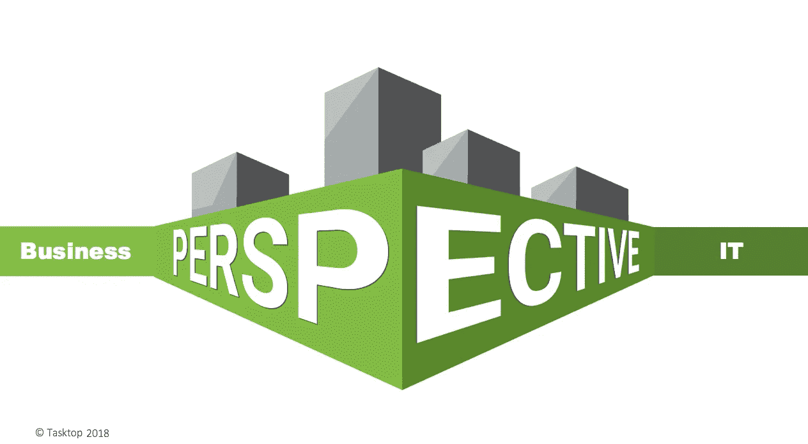
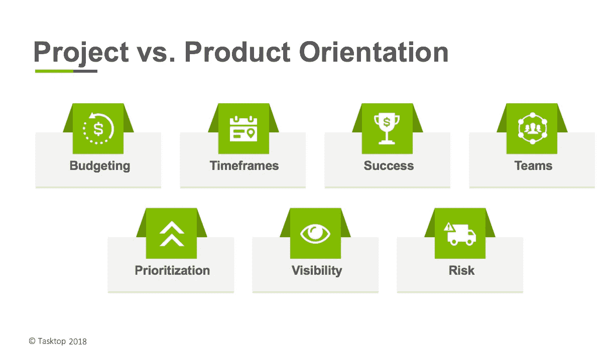

# 亲爱的首席信息官们，把软件交付变成你们最大的资产

> 原文：<https://medium.com/hackernoon/cios-turn-software-delivery-into-your-strongest-asset-cd549426d3f9>

# 从向软件时代的过渡中幸存下来

在道琼斯工业平均指数 110 年后，它的最后一批原始成员已经出局。今年 6 月，通用电气从著名的美国经济风向标指数中除名。工业时代的巨人通用电气，在美国经济中不再是一个重要的角色。

通用电气的困境并非独一无二。许多企业在向“软件时代”过渡的过程中苦苦挣扎。正当科技巨头如[谷歌](https://hackernoon.com/tagged/google)、[脸书](https://hackernoon.com/tagged/facebook)和亚马逊发现进入新市场非常容易时，传统企业发现适应新的现实异常困难，在这个现实中，软件对他们提供的价值份额越来越大。

[如果“软件正在吞噬世界](https://www.wsj.com/articles/SB10001424053111903480904576512250915629460)”，成功之路无疑是解决软件交付的挑战。首席信息官正迅速成为谈判桌上最重要的高管。

但是对于那些从传统企业(而不是创业公司)走上来的首席信息官来说，困扰软件交付的问题可能感觉无法克服。尽管在加速和扩展软件交付方面进行了大量投资，内部客户仍然抱怨 IT 交付价值的速度不够快，相比之下，敏捷的新来者紧随其后。

那么首席信息官们能做些什么来把软件交付从一个负担变成他们最强的资产呢？

# 对变革型领导和愿景的需求

如果公司要在这个新时代茁壮成长，开发和交付新的软件产品无疑是首席信息官工作中最重要的部分。由于 devo PS Research and Assessment(DORA)的联合创始人、首席执行官兼首席科学家 Nicole Forsgren 博士的研究，我们知道任何公司的技术组织的高绩效都是其商业成功和最终生存的强有力预测因素。

在最近于伦敦举行的 DevOps 企业峰会上，Forsgren 博士向技术和商业领袖观众展示了她的研究。她发现，拥有高绩效技术组织的企业达到或超过生产率、盈利能力、市场份额和客户数量等商业目标的可能性是其他企业的两倍。他们还将在三年内实现 50%以上的市值增长。

一个技术组织如何成为高绩效者？通过变革型领导和愿景。变革型领导者不会坐等草根倡议冒泡并请求资助。相反，他们自己对组织的长期目标有远见和理解，他们可以沟通、激励和支持他们的团队执行该战略。

今天任何组织的最高目标之一是通过软件交付加速价值创造。

# 敏捷+开发运维是不够的

在过去的十年里，大多数首席信息官已经为敏捷和 DevOps 的实施分配了一些预算。人们只能想象这些首席信息官也参加了数字化转型计划的指导委员会。

然而，现实仍然是，除了软件交付中的一些孤立的成功之外，作为一个整体，它仍然交付得不够快。因此，该业务仍然无法达到真正脱离竞争并摆脱初创公司和科技巨头的破坏威胁所需的速度。

有三件事阻碍了它。如果首席信息官解决了这些核心问题，她就能拨正船，带领公司度过这个动荡的时代。它们是:

1)面向项目的思维

2)断开的价值流网络

3)过时的管理框架。

## 面向项目的思维

大多数传统的 IT 组织仍然在项目模式下运行，这是失败的原因。预算是按年分配的，项目是根据固定的时间表和里程碑运行的，很少有改变优先级的灵活性，并且没有对客户的长期考虑。更不用说即将到来的 11 月份，随着项目的收尾，所有活动都将陷入停顿。员工很快被重新分配到一个新的项目，几乎没有机会在转移到新的项目之前提升、稳定和专业化。Nationwide Insurance 的 Carmen DeArdo 最近描述了一家正在经历数字化转型的*财富* 100 强公司的这种运营模式的不足之处。

相比之下，科技公司从不资助“项目”。他们为长期的以产品为导向的价值流提供资金和人员，并根据业务成果对其进行衡量。被授权的高绩效团队通过在整个产品生命周期内创造越来越多的价值来取悦他们的客户，而不是在一个财年内。

## 断开的价值流网络

谷歌和微软等科技巨头已经投资数亿美元来创建内部工具链，在软件交付过程中提供端到端的流程。这为他们提供了所需的效率、可见性和控制力，以便以极快的速度交付正确的东西。

当然，不能期望传统企业建立他们自己的集成软件交付工具链——也不应该。毕竟不是他们的核心业务。尽管如此，这是他们必须具备的关键任务能力。

正如微软技术研究员兼首席架构师杰弗里·斯诺弗所言，[端到端集成软件交付工具链是组织必须进行的基本基础设施投资，以便拥有带宽来加速其核心任务关键型活动。](https://www.youtube.com/watch?v=nKyF8fzed0w)

## 过时的管理框架

最后，传统企业仍然在应用以前时代的管理框架，在软件交付上过度应用制造原则。但是适用于装配线的方法并不适用于软件所需的快速设计、开发和部署的创造性和迭代过程。

数字原住民直观地知道这一点。他们都有精通业务的技术人员掌舵，其中许多人本身就是工程师，他们深刻理解如何根据业务成果管理复杂的软件交付组织。

传统企业拥有同样聪明和忠诚的领导者，但往往缺乏同样的直觉或经验。他们需要一些规范性管理框架形式的帮助来管理他们的软件交付组织，比如科技公司。这样的框架将帮助他们将软件交付的价值流与可测量的业务成果联系起来，[task top](https://www.youtube.com/watch?v=g5cIqV1YWzw)的首席执行官 Mik Kersten 博士如是描述。然而，为了能够提取端到端的流量指标，支持价值创造的技术基础设施必须完全连接、抽象和建模。

# 首席信息官是最终的变革推动者

传统企业需要首席信息官带领他们完成这一关键转型。在合适的人手里，软件交付可以从 IT 负债转变为公司最大的资产和增长引擎。一个有远见卓识的首席信息官，如果能为一个高性能的技术组织带来业务成果，将会获得丰厚的回报，并成为这个过渡期的新赢家之一。