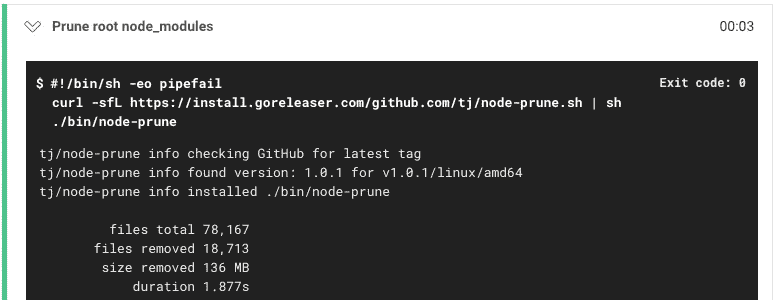
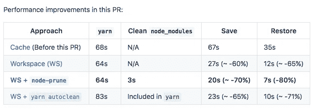

# 缓存和工作区之间的 CircleCI 性能差异

> 原文：<https://medium.com/hackernoon/circleci-performance-difference-between-cache-and-workspace-5567679c3601>

## 坚持~快 70%；恢复速度提高约 80%，您的里程数可能会有所不同

访问 https://www.mikenikles.com****获取我的最新博文。****

**几天前，[save_cache](https://medium.com/u/25e2a0e23a81#save_cache)指令需要替换为`[persist_to_workspace](https://circleci.com/docs/2.0/configuration-reference/#persist_to_workspace)`。同样，任何出现的`[restore_cache](https://circleci.com/docs/2.0/configuration-reference/#restore_cache)`都需要用`[attach_workspace](https://circleci.com/docs/2.0/configuration-reference/#attach_workspace)`指令替换。**

**在我们的例子中，仅这一更改就将数据的持久性提高了约 60%(从 67 秒写入缓存到 27 秒持久保存到工作区)，而在后续作业中恢复数据从 35 秒(使用缓存)下降到 12 秒(使用工作区)(大约 65%的性能提升)。**

# **奖金提高—修剪`node_modules`**

**到目前为止还不错，但是当我在做的时候，我挖得更深了一点。一段时间以来，我一直在关注我们的`node_modules`目录大小…🙀你检查过你的吗？如果是这样，我很肯定你会支持我。如果没有，继续检查你的，然后回到这里——我会等着。**

****

**Heaviest objects in the universe — based on estimates**

**好了，现在所有的读者都明白我的意思了，让我们继续。在我们的例子中，`node_modules`的大小是 553 MB。一定要这样吗？肯定不是！不需要有`*.md`文件、文档资产、测试、临时文件等。当我们在 CircleCI 上跨作业共享这些文件时，无论我们使用的是缓存还是工作空间，所有这些文件都必须被压缩和解压缩。**

**我知道有两个选项，所以我实现了这两个选项，并对它们进行了比较，以做出明智的选择。**

## **`node-prune`**

**TJ Holowaychuk 为他的一个产品制作了这个，并在 https://github.com/tj/node-prune 开源。这是一个很小的 Go 命令，可以安装在一行中。在我们的例子中，安装和运行该命令需要 3 秒钟。该命令的输出如下所示:**

****

**node-prune doing its job on CircleCI**

**从`node_modules`目录中删除了 136 MB 不必要的文件。在将数据从一个 CircleCI 作业传递到下一个作业时，需要压缩和解压缩的数据也减少了 136 MB。**

**现在，将数据保存到工作区需要 20 秒，与使用缓存的原始实现相比，大约提高了 70%。恢复这些数据只需 7 秒钟，比我们原来的速度快了 80%。**

## **纱线自动清洁**

**我不满足于只有一个选项可以修剪。只要有可能，拥有一些额外的数据点是一个好主意。**

**我在[https://yarnpkg.com/lang/en/docs/cli/autoclean/](https://yarnpkg.com/lang/en/docs/cli/autoclean/)找到了记录的`yarn autoclean`。作为`yarn install`命令的一部分，该命令清理`node_modules`。**

**与`node-prune`相比，运行速度稍慢。`yarn install`多花了大约 20 秒(因为它运行了`autoclean`),这比`node-prune`安装和删除依赖项所需的时间多了 17 秒。将存储库保存到工作区需要 23 秒(比缓存快 65%)，恢复工作区“只”快 70%。**

# **结论**

**这张表格摘自我在工作中打开的 PR，它总结了结果:**

****

**CircleCI cache vs workspace**

**我现在完全放弃了缓存，主要是为了保持较小的 PR 和可管理性。我想看看缓存是否有助于加速多个工作流的运行。**

**在我们的例子中，我们为 CircleCI 上的整个工作流程节省了 2.6 分钟。**

**如果你有类似的结果，或者完全不同的经历，我很想听听你的看法。如果你觉得这很有趣，请留下评论或鼓掌(这些掌声鼓励你写下并分享更多😀).**