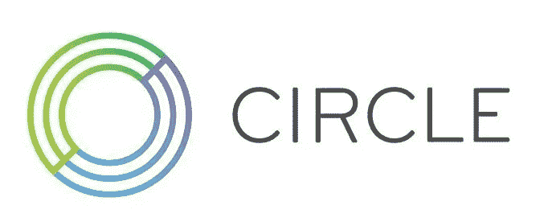

# Circle 收购 Poloniex

> 原文：<https://medium.com/hackernoon/circles-acquisition-of-poloniex-d8b1d413a477>

## 简明谁，什么和为什么:用通俗易懂的语言

**ACQUIRES**

**交易概述**

据[财富](http://fortune.com/2018/02/26/circle-cryptocurrency-trade-bitcoin/)报道，2018 年 2 月 26 日，Circle 互联网金融(私人)宣布了一项[协议，以约 4 亿美元的代价收购](https://poloniex.com/press-releases/2018.02.26-Poloniex-joins-Circle/)加密资产交易所 Poloniex(私人)。

**目标描述**

[Poloniex](https://poloniex.com/) 提供一个位于美国的中央加密资产交易所，允许加密资产的交易。Poloniex 支持非常广泛的加密货币对交易，包括 65 个 BTC 对、12 个以太对、8 个 XRP 对和 12 个美元对。从贸易量的角度来看，大多数消息来源表明，波洛涅克斯通常排在第 10-15 位，在全球的市场份额大约为 1%-2%。

Poloniex 由 Tristan D'Agosta 于 2014 年创立。从历史上看，Poloniex 对其运营一直非常保密，因此融资历史和员工信息不会公开。

**买家描述**

Circle 是最著名的加密企业之一，拥有大量传统风险投资和加密专家投资者资金。今天，Circle 提供两个核心产品，I)一个名为 Circle Pay 的移动应用程序，允许消费者免费向朋友和家人汇款，ii) Circle Trade，作为场外市场的做市商，为机构和大型加密投资者提供数字资产流动性。Circle Trade 为大型加密资产持有者提供服务，最小订单规模为 25 万美元，每月交易量超过 20 亿美元。Circle 还在 2017 年底宣布了第三个名为 Circle Invest 的项目，该项目将为消费者提供一个易于使用的应用程序来投资加密资产。Circle Invest 至今尚未发布。

Circle Pay 的竞争对手包括各种各样的消费者支付应用程序，如 Venmo、Paypal、Apple Pay、Facebook Messenger Payments 和 Zelle 等。Circle Trade 与 Cumberland Mining、Genesis Trading、IBC 集团、ItBit 和 Octagon Trading 等机构交易台竞争。新宣布的 Circle Invest 的竞争对手包括比特币基地/GDAX 和罗宾汉。

2017 年 10 月，Circle 收购了提供移动应用程序的 [Trigger Finance](https://blog.circle.com/2017/10/16/circle-acquires-trigger-and-opens-new-york-office/) ，该应用程序旨在帮助散户投资者进行非加密资产组合管理。

Circle 由杰里米·阿莱尔和肖恩·内维尔于 2013 年创立。杰里米·阿莱尔之前建立了几家风险投资支持的企业，包括阿莱尔和 Brightcove。Circle 已从布雷耶资本(吉姆·布雷耶，前 Accel)、高盛和 IDC Capital Partners 筹集了总计 1.36 亿美元的资金，作为多轮融资的主要投资者。其他著名投资者包括 General Catalyst、数字货币集团(Digital Currency Group)、潘迪拉资本(Bernstein Capital)、分布施资本(Fenbushi Capital)等十几家公司。

**交易参数**

Circle 以大约 4 亿美元的价格收购 Poloniex。考虑到交易的规模，报酬的具体形式没有披露，但可能包括相当大比例的 Circle 股权。据《财富》杂志报道，目前合并后的公司收入超过 10 亿美元。

加密市场中的 M&A 活动处于非常早期的阶段，还没有完成这种规模的交易。其他更温和的 crypto /区块链·M&A 交易包括 [BitGo 在 2018 年 1 月收购 Kingdom Trust](https://www.coindesk.com/bitgo-acquires-kingdom-trust/) ，这也在一定程度上受到加密资产未满足监管合规要求的推动。

**战略理念**

Circle 的目标是建立一个密码时代的金融服务公司。他们打算为消费者和成熟的投资者提供应用和服务，让加密资产像法定货币一样容易使用，像公开股票一样容易投资。

今天，基本上所有的加密交换都是秘密的，不受监管，并遭受严重的信任和信誉问题。Circle 的战略机遇是建立一套可信的、完全受监管的、专业管理的产品和服务，以服务于快速增长的加密资产市场。消费者和成熟的机构投资者同样受益于迄今为止如此普遍的狂野西部行为的“成熟”。尽管采取了略有不同的策略，但比特币基地正寻求实现类似的目标。

在这种情况下，人们有理由问为什么 Poloniex 会考虑出售，而不是继续建设。如上所述，所有加密资产交易所都经历了规模和声誉方面的挑战，包括 Poloniex。构建可扩展的基础设施极具挑战性，需要毅力、人才和资本。此外，随着 SEC 更加重视对加密市场的监管，很明显，他们认为交易所受 SEC 和 FINRA 的监管，应该获得电子交易市场(ATS)的许可。这给传统上在经营中相当“随心所欲”的企业带来了更大的负担。Circle 为 Poloniex 提供了一个机会，使其能够作为一个拥有经验丰富的专业人员、对未来充满雄心的愿景并拥有成功所需的财务资源和机构信誉的组织的一部分，继续发挥其潜力。

**架构师合作伙伴的意见**

随着加密市场开始走向成熟，M&A 将变得越来越普遍。不仅是人才和能力提升的传统驱动因素，也是重建信誉和专业精神的一种机制。虽然 Kyle Samani 在他最近出版的[关于 crypto M & A](https://multicoin.capital/2017/10/16/crypto-acquisitions-theory-no-practice/) 的观点中有许多有效的观察，但即使是在 ico 中发行了令牌的项目也将参与进来，既作为收购方，也作为目标方。

**备注:**

Vinny Lingham 在 2016 年 6 月的这篇文章中很好地总结了 cypto OTC 市场的角色。

**其他选定来源**

圈[博文](https://blog.circle.com/2018/02/26/circle-acquires-poloniex/)

波洛涅克斯[新闻稿](https://poloniex.com/press-releases/2018.02.26-Poloniex-joins-Circle/)

纳撒尼尔·波普，《纽约时报》，推特:@纳撒尼尔·波普