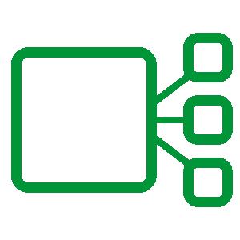

# Lagom 微服务中的断路器

> 原文：<https://medium.com/hackernoon/circuit-breaker-in-lagom-microservices-cfc705b3a917>

微服务背后的主要目标之一是构建相互隔离的系统或子系统，其中每个系统或子系统都有一个单独的职责，通过协同工作，可以构建更大、更复杂的系统。

在大多数情况下，我们需要不同服务之间的通信。应该以弹性和容错的方式进行通信。通过避免跨服务传播错误来处理级联故障非常重要。

让我们将 Lagom 与其他广泛采用的库进行比较。

# 拉戈姆

在 Lagom 中定义微服务是一项简单的任务。首先，我们需要定义我们的服务接口或合同。这些合同将会暴露给客户。

为了简单起见，让我们实现一个返回国家列表的小型微服务，然后用它来显示一些重要的结构。

正如我们所看到的，我们公开了`/countries`，它应该返回一个`Country`类的列表。

[***我不打算详细介绍 Lagom 是如何工作的，但是您可以查看 Lagom 文档***](https://www.lagomframework.com/documentation/)

现在，我们需要实现我们的服务。

注意，国家列表来自`countriesRepository`，服务通过`ICountriesRepository`接口使用底层数据访问实现。

使用此服务时，可能来自另一个服务。谁使用了`CountriesService`实现，我们就说它是服务的`client`。

此时，我们至少引入了两个故障点，一个是`CountriesService`本身，另一个是`CountriesService`正在使用的底层数据访问。问题是如何管理这些依赖关系的故障，这样我们就不会将它们串联起来，导致整个子系统发生故障。

# 断路器

断路器是避免级联故障的标准方法，它在下游依赖关系发生故障时停止下游调用。

我们对断路器的需求很少。

*   一旦下游服务发生了大量连续错误，它就应该自己打开。
*   它应该在一定时间后自动关闭，并且下游服务已经恢复。
*   它应该提供某种监控来帮助理解断路器的状态。

断路器的出路似乎是 Hystrix，一个由网飞创建的开源库。Hystrix 提供了一种可靠的断路器实施方案，已被业界广泛采用。

尽管 Hystrix 提供了大量的断路器模式，但是将这样的库添加到现有的和正在进行的项目中是有相关成本的。代码的复杂性将会增加，而新组件的添加需要开发团队的学习曲线。

让我们比较一下 Hystrix 提供的和我们在 Lagom 框架中已经拥有的。

# 管理数据访问失败

从`CountriesService`的角度来看，检索国家列表的数据访问的底层实现是一个潜在的失败点。网络呼叫超时、连接中断或数据访问子系统降级只是可能出错的几个例子。

通过使用 Hystrix，当数据访问层出现问题时，我们可以避免服务质量下降。

从`CountriesService`、`ICountriesRepository`的角度来看，断路器是一个依赖项，是一个客户端的问题，我们应该在客户端管理它们，在本例中为`CountriesService`。

我们可以创建一个 Hystrix 命令，以下面的方式包装对`ICountriesRepository`的调用。

我们的服务需要更改，因此它使用命令，而不是直接调用存储库。

如果访问`ICountriesRepository`使用的底层数据有问题，断路器(hystrix 命令)将按预期激活。

注意，这种模式的复杂性迅速增加，因为每次调用`ICountriesRepository`我们都需要创建一个 Hystrix 命令。

基于微服务原则，每个微服务必须拥有自己的数据，我们是否应该说，如果微服务无法访问其底层存储(Cassandra、Kafka、MySQL 等)，微服务本身就失败了？

Lagom 考虑到了这一点，服务的数据层上的异常可以通过服务传播，该服务激活服务级别上的断路器，以保护我们服务的客户端。这意味着我们从 Hystrix 获得的额外保护在这一点上是多余的。

# 数据即服务

假设我们服务的数据来自另一个服务。在这种情况下，我们的服务是数据服务的客户端。让我们看看我们服务的另一个实现。

在这种情况下，我们的服务几乎是相同的。我们将对依赖关系的调用包装在一个 Hystrix 命令中，如果依赖关系有问题，该命令将管理断路器逻辑。

在某些情况下，如果我们的依赖关系出现故障，我们希望提供一个回退结果，我们可以在 Hystrix 命令中通过以下方式实现`getFallback()`来实现这一点。

如果 ContentService 依赖项上有错误，将提供回退值，直到断路器关闭，这意味着我们的依赖项可以再次使用。

另一方面，Lagom 已经提供了相同的功能，而没有引入新概念。让我们看看怎么做。

注意，我们使用`.exceptionally`来提供回退值。此外，Lagom 会在服务依赖发生故障时激活断路器，这与我们从 Hystrix 获得的行为相同。同时，我们不需要为依赖项上的每个调用创建 Hystrix 命令，这降低了我们代码的复杂性。

# 服务客户

从我们的客户(调用我们的服务以获得特定功能的服务)的角度来看，我们使用什么样的断路器库并不重要，因为断路器是客户的责任，而不是服务的责任。我们的客户应该有一种方法来监控来自我们服务的异常，这样他们就可以采取必要的措施来避免级联故障。

我们服务的客户端是另一个 Lagom 服务，这个功能已经内置，正如我们在使用`ContentService`时看到的。是我们服务的客户端，是另一种应用程序，他们可以使用他们喜欢的断路器策略以及他们选择的库。同样，这是客户的问题，而不是服务的问题。

# 结论

*   如果在实现 Lagom 服务时，我们需要调用依赖项，这些依赖项可以通过托管和非托管 Lagom 服务访问，对这些依赖项的调用已经内置了断路器，并通过`.exceptionally`函数实现了回退功能。
*   如果我们的 Lagom 服务直接访问一个数据层，而这个访问失败了，我们可能希望我们的服务失败，因为数据归服务所有，而服务不能适当地执行它的功能。这应该会激活我们服务的客户端中的断路器，以便它们采取所需的措施。
*   Hystrix 非常强大，但在这个级别上，它并没有提供与我们在 Lagom 中已经拥有的不同的功能。
*   Lagom 断路器功能比 Hystrix 提供的功能简单得多，但在保持简单性的同时，通过重用已知的语言功能，可以很好地与 Lagom 产品集成。
*   使用 Lagom 时，我们应该只在服务层抛出异常来通知内部服务错误，以便我们服务的客户端采取必要的措施来防止级联故障。我们倾向于抛出异常来表达一些业务逻辑，这应该避免，并以不同的方式建模，因为异常激活上游服务中的断路器逻辑，有时在我们的服务本身中没有这样的故障。

*如果您真的需要在数据访问调用时使用断路器，即 Cassandra 和其他，Hystrix 似乎是一个不错的选择。*