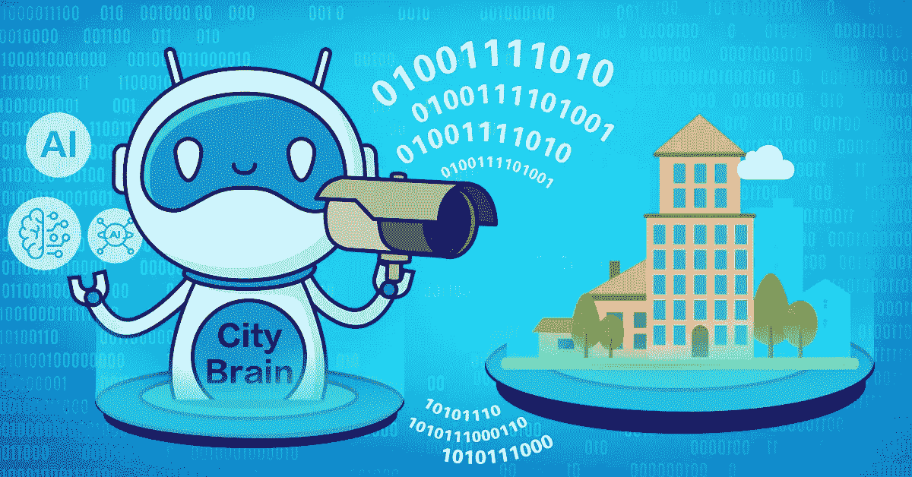
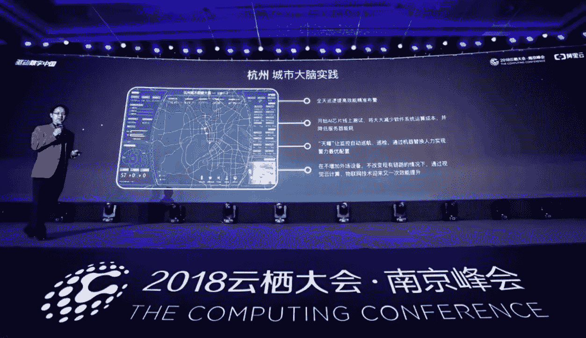

# 城市大脑:相机在杭州获得新的视角

> 原文：<https://medium.com/hackernoon/city-brain-cameras-get-a-new-perspective-in-hangzhou-d598e266762d>

*阿里巴巴将一座城市的安全摄像头与人工智能连接起来，人工智能可以在问题发生前发现问题*

安全摄像头和“一群试图描述一头大象的盲人”有什么共同点？阿里巴巴的杰出工程师华贤生博士表示，这个古老的印度寓言是一个很好的比喻，人们在其中摸索对整个动物的感觉，这是对智能机器只能处理眼前事物的一个很好的比喻。

这绝不是对技术缺陷的哀叹，而是这个“为树而林”的问题，是华博士最近在南京举行的计算大会上，为观众勾勒出一个新的阿里巴巴人工智能项目“城市大脑”的方式。城市大脑旨在更智能地利用老化的摄像头基础设施，协调城市安全系统中每个摄像头的数据，以增强每个节点的智能功能，并提供可行的见解，从交通预测到事故响应。随着城市大脑的三个组成产品之一现已在杭州市部署，众所周知的盲象调查已经让位于近 1000 万人口的视觉增强型数字交通管理。

# 危机应对和预防

“城市大脑”的第一个组件“天钥”将 24 小时行人和车辆交通监控与识别异常并向当局通知交通拥堵和车辆碰撞等事件的算法相结合。它还随着时间的推移处理图像馈送，以识别高事件频率的站点，帮助人类管理员定位问题并集中解决方案以实现最大影响。此外，天药还会对这些解决方案的有效性提供即时反馈。在实践中，天药已经被证明是杭州交通巡逻人员的有效替代者，即使在光线较暗的情况下，也可以解放人力资源来处理更紧急的任务和紧急情况。

# 图像识别

通过城市大脑的第二个天鹰组件，阿里巴巴引入了一种在行人识别方面比拥有相同视觉反馈的人类代理更有效的技术。天鹰借鉴了阿里巴巴二十年的图像识别研究，特别关注索引对象(如感兴趣的人)的概念以及可以在相机扫描中描述和确认该对象的视觉线索。它的识别成功率为 96%，高于人类平均 94%的识别成功率，为快速准确地识别失踪人员或跟踪肇事逃逸逃犯提供了一个强大的工具，例如，让人类代理专注于追捕和逮捕。

# 为更智能的交通管理铺平道路

城市大脑的最后一个组件 TianJi 仍在开发中，是一个针对车辆和行人交通流量的预测分析工具。随着苏州市的早期测试证实它可以准确预测几分钟到一小时的交通模式，天脊为更好的交通管理带来了希望，并可能很快实现早期预警，以帮助个人通勤者规划他们的出行。

作为中国科技部选择的首批四个人工智能开放创新平台之一，大多数城市大脑目前都向公众开放，为发展做出贡献。随着早期实施能够满足真实城市环境的需求，阿里巴巴预计城市大脑和其他人工智能系统将在不久的将来证明是一种不可或缺的城市资源，可与公用事业和物理基础设施相媲美。

了解更多阿里巴巴的城市大脑:

[https://hacker noon . com/city-brain-cloud-computing-and-data-technology-help-our-city-think-deep-382 e 72 f 7 f 7 f](https://hackernoon.com/city-brain-cloud-computing-and-data-technology-help-our-city-think-deeply-382e72f7f7f)

# 阿里巴巴科技

第一手、详细、深入的阿里巴巴最新技术信息→脸书: [**【阿里巴巴科技】**](http://www.facebook.com/AlibabaTechnology) 。Twitter:[**“AlibabaTech”**](https://twitter.com/AliTech2017)。