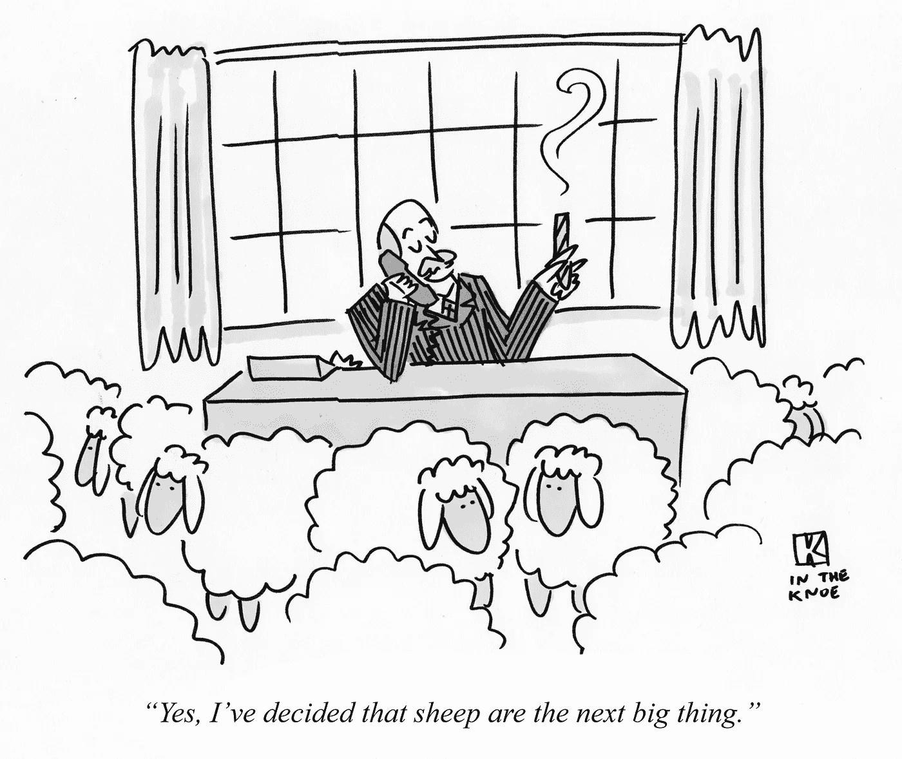
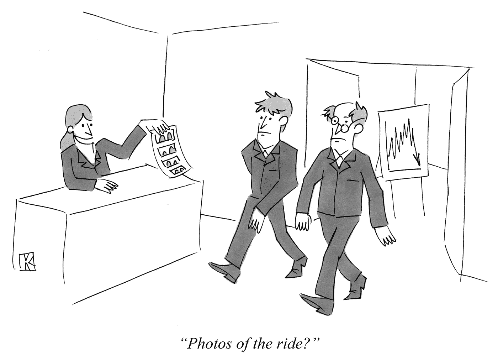
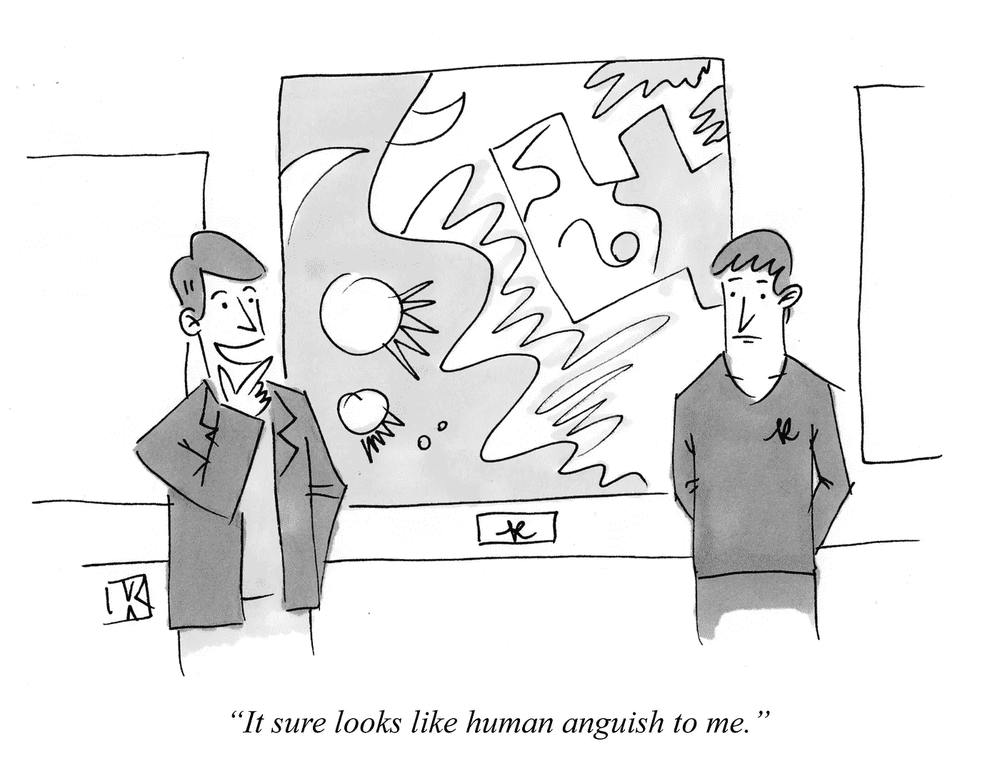

# 清晰度被低估了

> 原文：<https://medium.com/hackernoon/clarity-is-underrated-cfd128b55350>

*(原载于* [*B2B 创业成长博客*](https://www.gkogan.co/blog/clarity/) *)。)*

为什么顾问“被付钱来告诉你你已经知道的事情？”为什么有些聪明的人不善于表达自己的想法？为什么有些网站上的信息这么少？

答案是清晰。以直接、清晰、准确的方式传达信息或思想的能力，不需要任何额外的东西，是非常有价值和被低估的。在这篇文章中，我解释了为什么我会这样想，为什么寻求清晰是值得的，以及如何实现它。

# 为什么清晰度被低估了

很容易漏掉。因为清晰吸引了对信息的注意，而不是它本身，我们注意到它的缺失而不是它的存在。当我们收到一个明确的信息时，我们并不欣赏所有必须删除的部分和替代方案。

清晰很容易被忽略。当提出一个清晰的想法时，很容易想到“我已经知道了”，就像人们在看到马列维奇的[黑色方块](http://www.tate.org.uk/art/research-publications/the-sublime/philip-shaw-kasimir-malevichs-black-square-r1141459)时认为“我本来可以做到的”。也许你确实知道，但你能表达得这么清楚吗？为什么你还没有呢？

我们的心理图像没有我们想象的那么完整。在我们的脑海中很容易描绘出一辆自行车，但是[试图画一辆](http://road.cc/content/blog/90885-science-cycology-can-you-draw-bicycle)却显示出我们是多么的自欺欺人。结合后见之明的偏见(我们高估了我们过去所知道的)，我们很容易将一个清晰的表达视为我们已经知道或可能已经完成的事情。

# 清晰的价值

清晰地传达你的信息有助于听众听到、分析、理解并记住它。这在任何专业交流中都很重要，尤其是在管理和营销领域。

清晰导致行动，因为它提出了一个[明显的下一步](https://www.gkogan.co/blog/ridiculously-obvious-next-step/)或通过消除选择。这减少了拖延的可能性，加快了未来决策的速度。

它消除了对你和观众的干扰，把所有的注意力都集中到本质元素上。

很稀缺。将一个想法浓缩到它的本质需要技巧和对主题的深刻理解。不是很多人两者都有。

清晰表现出自信和经验。

很有说服力。

它节省时间。说或写的时间更少，观众处理的时间也更少。写冗长的电子邮件、拉长演示文稿或延长会议会降低清晰度*和*浪费时间。

# 警告:并非所有清晰的东西都是有价值的

清晰度的好处使它成为[扯淡艺术家](https://www.gkogan.co/blog/bad-marketing-advice/)的有效工具。如果有疑问，考虑来源和他们是如何得到他们的想法。幸运的是，一个清晰的陈述更容易被证实，所以不真实但清晰的仍然比不真实且模糊的要好。

# 如何更清楚

理解主题。这没有捷径可走。如果你不能清晰地传达一个想法，那你就理解得不够好。理查德·费曼[说](https://kottke.org/17/06/if-you-cant-explain-something-in-simple-terms-you-dont-understand-it)，“我不能降低到大一的水平。这意味着我们真的不了解它。”

除此之外，使用这些提示让你自己更清楚:

*   设置限制。看看你是否能让你的电梯推销达到 30 秒，[文章达到 300 字](https://www.gkogan.co/blog/b2b-seo/)，[营销邮件达到 15 字](https://www.gkogan.co/blog/increase-reply-rates/)，等等。(除了增加清晰度，[约束会让你更有创造力](https://hackernoon.com/constraints-and-creativity-14831a538643)。)
*   把它从你的脑海中抹去，就像自行车的例子一样。把它写下来或者对别人说——你会发现差距在哪里，下次可以把它们补上。
*   使用清晰简洁的语言。当你可以说“这很简单”时，不要说“这再简单不过了”，或者当“我不同意”时，不要说“不幸的是，我不确定我能同意”。参见本[便捷指南(PDF)](https://writing.wisc.edu/Handbook/Clear,_Concise,_and_Direct_Sentences.pdf) 。
*   剪，剪，剪…剪到你只剩下最重要的部分。“完美不是在没有更多可以添加的时候达到的，而是在没有更多可以去除的时候达到的。”(安托万·德·圣埃克苏佩里)而不是问“这部分增加了什么吗？”问“移除这部分会伤害到什么吗？”