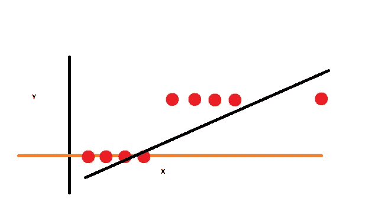
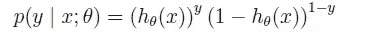

# 线性回归失败时如何分类？

> 原文：<https://medium.com/hackernoon/classification-and-logistic-regression-8a20a5c9603d>

[线性回归](https://hackernoon.com/tagged/linear-regression)是解决我们分类问题的简单方法，但是当它失败时会发生什么呢？正如我们将在下面的问题中看到的

假设我们要分类 **Y= {0，1}** 和 **X** 是**数据样本**。是二元分类。让我们用线性回归来试试

哇，线性回归完成了这项工作。这确实是一个很好的选择，但是如果我向给定的数据集中添加一个新的数据，会发生什么呢？

真是个烂[解](https://hackernoon.com/tagged/solution)。线性回归不起作用。下一步我们应该做什么？有问题就有解决方案，解决方案是 [**逻辑回归**](https://hackernoon.com/tagged/logistic-regression) **。**让我们从形式定义开始，了解一下什么是线性回归和逻辑回归:

在 [***线性回归***](https://towardsdatascience.com/deep-dive-into-supervised-learning-e7952c0692e9) 中，结果(因变量)是连续的。它可以有无限个可能值中的任何一个。在**逻辑回归**中，结果(因变量)只有有限数量的可能值。**当响应变量本质上是分类变量时，使用逻辑回归**。

直观上，在已知 y ∈ {0，1}的情况下，h(x)取大于 1 或小于 0 的值也是没有意义的。为了解决这个问题，让我们改变假设 h(x)的形式。我们将选择如下假设:

g(z)称为 ***乙状结肠函数*** 或 L ***逻辑函数*** 。它看起来如下:

让我们假设

如果我们将上述等式结合在一起，它可以改写如下:

如上式当 **y =0** 时，h(x)将变为 1，p(y | x；theta) = (1-h(x))而当 **y =1** ，(1-h(x))就会变成 1，p(y | x；θ)= h(x)

现在，**参数**的可能性由下式给出

而当我们将**的对数似然最大化时，它将由* 给出:*

**

*现在我们可以用**梯度下降**，我们已经知道 h(x)由 sigmoid 函数给出。*

**

*为方便起见，g(z)相对于 z 的偏导数由下式给出*

**

*现在，如果通过对对数似然性对θ取 ***的偏导数来应用梯度下降****

**

*如果我们将上述规则与最小均方法相比较，看起来是一样的，但事实并非如此。这是一个不同的[学习](https://hackernoon.com/tagged/learning)算法，因为 h(x)现在被定义为 theta 转置* x[i]的非线性函数。*

**

*如果你发现我的帖子有不一致的地方，欢迎在评论中指出。感谢阅读。*

*如果你想和我交流。请随时在 LinkedIn 上与我联系。*

* [## Sameer Negi -自动驾驶汽车运输公司- Infosys | LinkedIn

### 查看 Sameer Negi 在全球最大的职业社区 LinkedIn 上的个人资料。Sameer 有 3 份工作列在他们的…

www.linkedin.com](https://www.linkedin.com/in/sameer-negi-356881115/)*