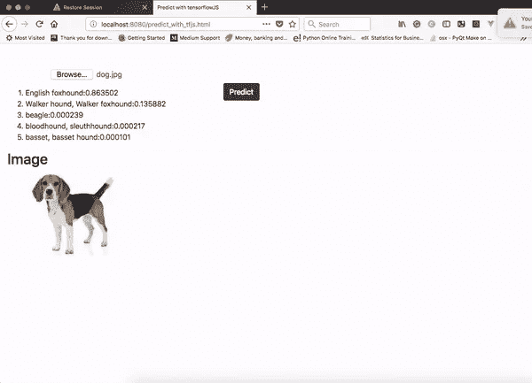
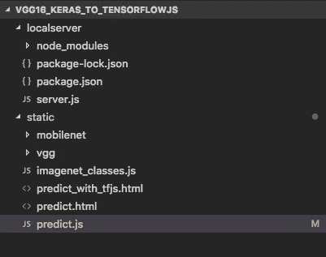
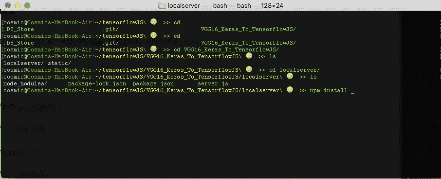
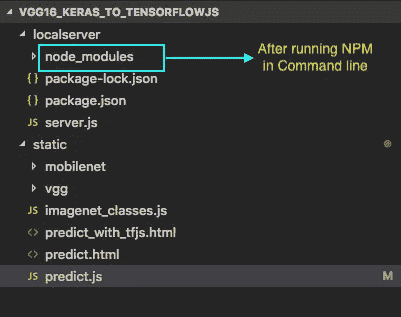
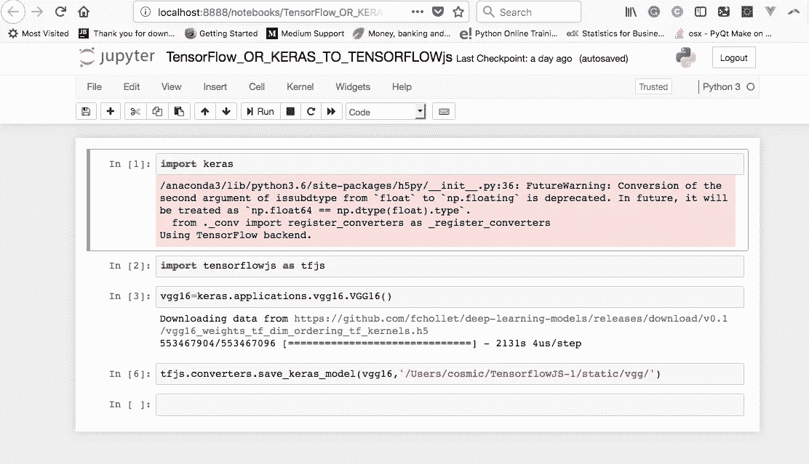
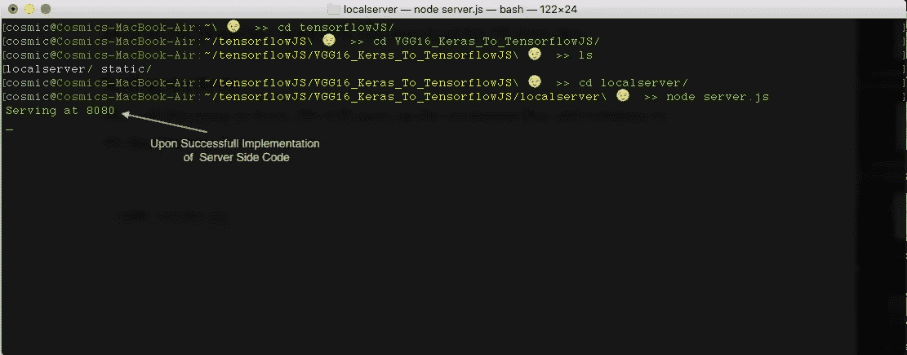

# 使用 TensorFlow.js 和 Keras 对图像分类

> 原文：<https://medium.com/hackernoon/classifying-images-using-tensorflow-js-keras-58431c4df04>


[Image Source](http://www.fictiontofact.com/files/media/43803/neuralnet.gif)

我们将使用[JavaScript](https://hackernoon.com/tagged/javascript)&tensor flow . js 构建一个深度神经网络，它可以在客户端以高精度识别图像，同时解释整个过程中使用的技术。

阅读下面的文章，了解 TensorFlow.js 的最新动态:-

[](https://medium.freecodecamp.org/get-to-know-tensorflow-js-in-7-minutes-afcd0dfd3d2f) [## 7 分钟了解 TensorFlow.js

### 并了解如何在浏览器中直接运行 ML/DL 模型

medium.freecodecamp.org](https://medium.freecodecamp.org/get-to-know-tensorflow-js-in-7-minutes-afcd0dfd3d2f) 

下面是最终 Web 应用程序的屏幕截图:



Screenshot of the Web App

首先，我们将创建一个文件夹**(vgg 16 _ Keras _ To _ TensorflowJS)**，其中包含两个子文件夹**local server**&**static。localserver** 文件夹应当包含所有的 server [**NodeJS**](https://hackernoon.com/tagged/nodejs) 代码，static 将拥有所有的 CSS、HTML & JS 代码。



Screenshot Showing the Folder structure

> 注意:您可以根据自己的选择命名文件夹和文件。

## **服务器**配置 **:**

我们将用下面的代码手动创建一个 **package.json** 文件

```
{"name": "tensorflowjs","version": "1.0.0","dependencies": {"express": "latest"}}
```

**package.json** file 记录我们将在该项目中使用的所有第三方包。保存 **package.json** 文件后，我们将在命令行中打开命令行&，我们将导航到 **localserver** 文件夹，并将执行:-

```
npm install
```



Command Line for MacOS

这样，NPM 将执行并确保 **package.json** 中提到的所有必需的包都已安装并准备就绪。您将在 **localserver 文件夹中看到一个 **node_modules** 文件夹。**



我们将用下面的代码创建一个 **server.js** 文件

**server.js** 包含 NodeJS 代码，允许本地服务器托管我们的 WebApp 运行。

## 客户端配置:

接下来我们将创建一个 **predict_with_tfjs.html** 。下面是相同的代码:-

predict_with_tfjs.html

HTML 代码完成后，我们将创建 JavaScript 文件，并将其命名为 **predict.js** 。下面是代码

## 型号配置:

一旦客户端和服务器端代码完成。我们现在需要一个 DL/ML 模型来预测图像。我们将训练好的模型(VGG16)从 Keras 导出到 TensorFlow.js，并将输出保存在静态文件夹内名为 VGG 的文件夹中。



Screenshort of Jupyter Notebook For Model Conversion

## 定义类别

我们将把 **imagenet_classes.js** 保存在**静态**文件夹中。该文件包含所有 ImageNet 类的列表。*你可以从* [*这里*](https://github.com/ADLsourceCode/TensorflowJS/blob/master/VGG16_Keras_To_TensorflowJS/static/imagenet_classes.js) *下载这个文件。*

## 测试代码

所有设置完成后，我们将打开命令行并导航到 **localserver** 文件夹执行:

```
node server.js
```

我们应该观察到以下输出:-



成功实现服务器端代码后，我们现在可以去浏览器打开[**http://localhost:8080/predict _ with _ tfjs . html**](http://localhost:8080/predict_with_tfjs.html)。
如果客户端代码没有错误，应用程序将启动，模型将自动加载。

一旦模型加载完毕…你就可以进行**预测**。

> 我的下一篇文章将涉及**金融时间序列分析**使用 Tensorflow.js… [敬请关注](https://goo.gl/u72j6u)。

**项目的 GitHub 存储库:-**

[](https://github.com/ADLsourceCode/TensorflowJS/tree/master/VGG16_Keras_To_TensorflowJS) [## ADLsourceCode/TensorflowJS

### GitHub 是人们构建软件的地方。超过 2800 万人使用 GitHub 来发现、分享和贡献超过…

github.com](https://github.com/ADLsourceCode/TensorflowJS/tree/master/VGG16_Keras_To_TensorflowJS) 

**你可以在下面的视频中看到完整的代码解释和实现:-**

Source : ADL

祝你好运！👍

**感谢阅读**。如果你有任何问题，请在下面的评论或者 [**推特**](https://twitter.com/I_AM_ADL) 告诉我。订阅我的 YouTube 频道获取更多科技视频: [**ADL**](https://goo.gl/u72j6u) 。