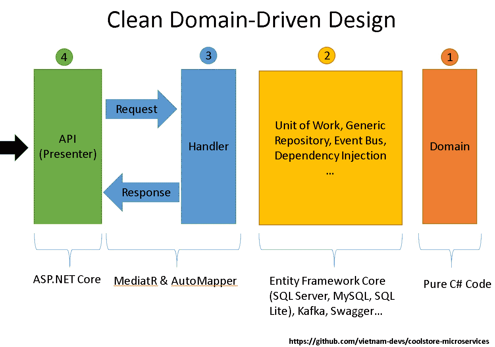
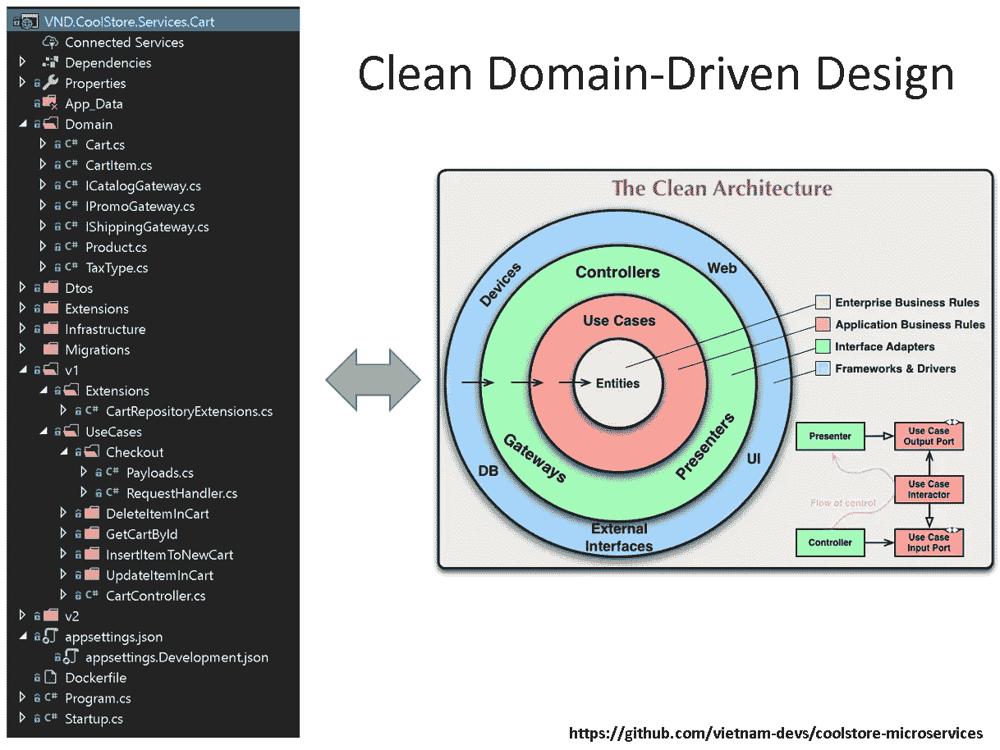
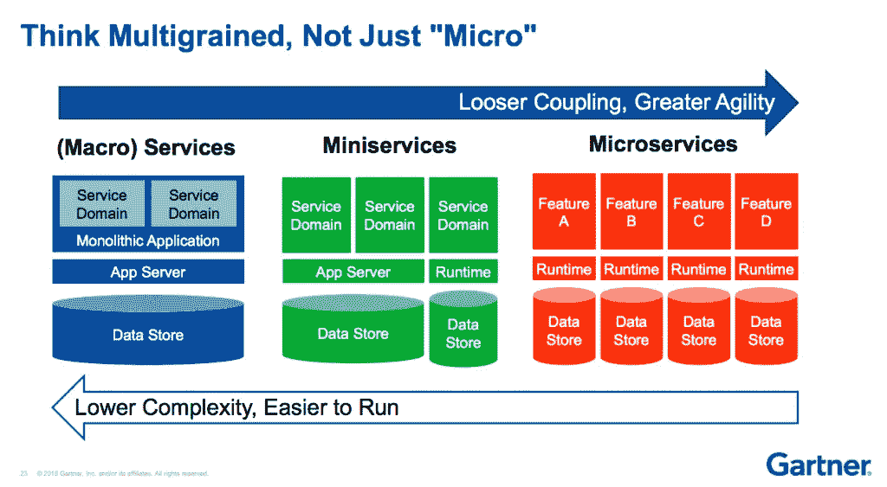
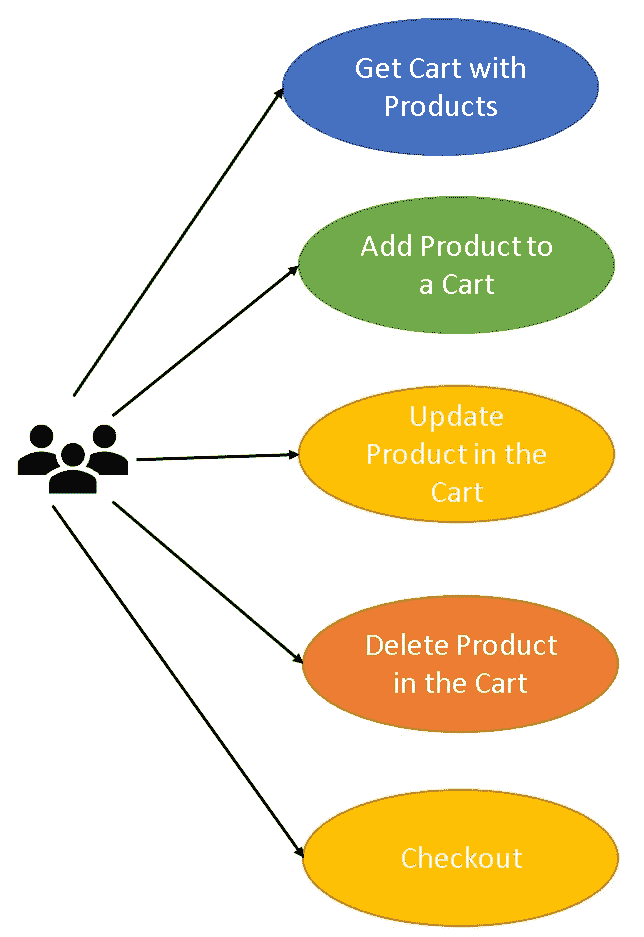
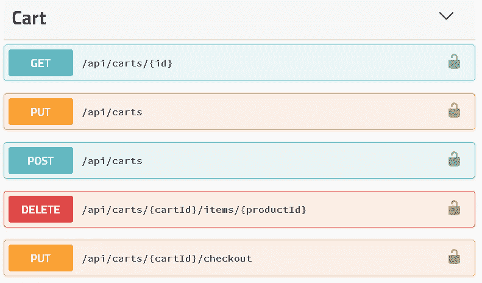
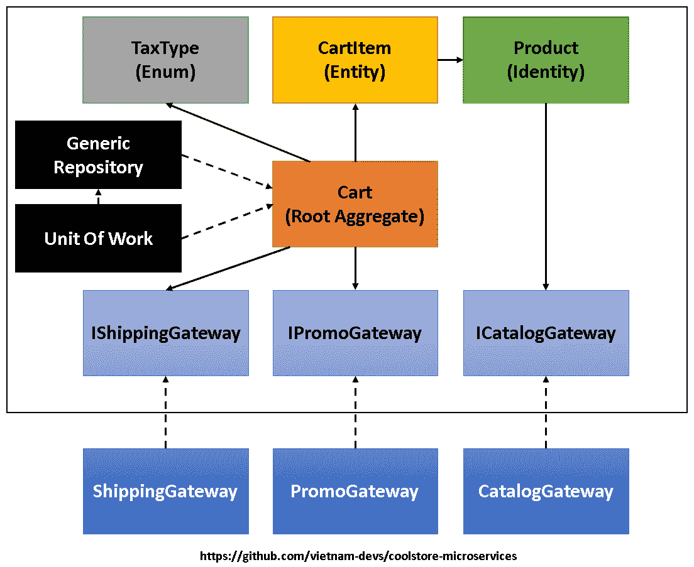
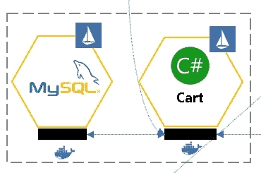

# 10 分钟内完成领域驱动的设计

> 原文：<https://medium.com/hackernoon/clean-domain-driven-design-in-10-minutes-6037a59c8b7b>

[Source](https://pixabay.com/en/water-lily-aquatic-plant-nature-3504363/)

# 关键要点

*   [领域驱动的设计](https://www.amazon.com/Domain-Driven-Design-Tackling-Complexity-Software/dp/0321125215) (DDD)与[干净的架构](https://8thlight.com/blog/uncle-bob/2012/08/13/the-clean-architecture.html)(加州)一起工作
*   切实清洁 DDD([微服务](https://www.martinfowler.com/microservices/))
*   在[云上清理 DDD——原生方式](https://landscape.cncf.io/)

我去年写了关于 CA 的话题，今天我将写出它的另一部分。CA 有助于使软件架构更加简洁和易于管理，但样板代码也很庞大(如果你曾经实现过它，你就会明白我的意思——需要创建大量的请求、响应、交互器或用例、接口和类，参见我在[https://github.com/thangchung/blog-core](https://github.com/thangchung/blog-core)的实现)。回到过去，当我们实现[命令查询责任分离](https://martinfowler.com/bliki/CQRS.html) ( [CQRS](https://cqrs.files.wordpress.com/2010/11/cqrs_documents.pdf) )和[事件源](http://codebetter.com/gregyoung/2010/02/20/why-use-event-sourcing/) (ES)模式时，会让许多人对那些样板代码感到不满。这就是我研究并写出我所知道和学到的使 CA 更实用和可维护的方法的原因。

对于那些不熟悉 CA 的人，请参见我以前的文章，在[https://hacker noon . com/applying-clean-architecture-on-web-application-with-modular-pattern-7 b11 f1 b 89011](https://hackernoon.com/applying-clean-architecture-on-web-application-with-modular-pattern-7b11f1b89011)

让我们从我以 CA 方式工作的应用程序的整体情况开始，如下所示

1.  不依赖于任何框架或库的领域代码。它使得这些核心组件可以在将来重复使用
2.  域代码的一个外层，就像适配器一样，我们用它来实现工作单元(UOW)、通用存储库(GR)、事件总线、依赖注入和许多其他东西
3.  带有请求和响应 dto 及其处理程序的部分 CA 模式。我们利用[mediator](https://github.com/jbogard/MediatR)和 [AutoMapper](https://github.com/AutoMapper/AutoMapper) 库来简化这类工作，这也是它很酷的另一个原因😍谢谢[吉米](https://github.com/jbogard)！
4.  Web API 的部分演示者

在实现之后，它将会以如下的代码结构结束

这里没有什么要说的，很简单，很干净，对吗？让我们深入细节，这样我们会对它有更多的了解。我将向您展示购物车服务( [miniservices](https://thenewstack.io/miniservices-a-realistic-alternative-to-microservices) 模式)的业务，例如向购物车添加新产品，向购物车添加更多产品，获取包含产品的当前购物车，更新购物车，从当前购物车中删除产品，最后的操作是检查购物车。

[https://www.gartner.com/webinar/3437517](https://www.gartner.com/webinar/3437517)

就是这样。然后我们有这样的用例

如果你喜欢 API 优先的方法，那么我们应该把 OpenAPI 作为

让我们缩小到代码，因为我知道我们都是开发人员，所以代码应该更容易理解，对不对？

# 领域组件(主要是 DDD 模式)

Cart.cs

CartItem.cs

产品. cs

# 基础设施组件

工作单元、通用存储库、事件总线、ClientRequest、依赖注入…组件都在 NetCoreKit 中，NetCoreKit 是一组用于的云原生工具和实用程序。NET Core——这是我自己开发的([https://github.com/cloudnative-netcore/netcorekit](https://github.com/cloudnative-netcore/netcorekit))。

# 请求/响应处理程序

*   获取装有产品的购物车

*   将产品添加到购物车

*   更新购物车中的产品

*   删除购物车中的产品

*   检验

# Web API 演示者

# 云原生部件

这是云原生应用程序，因此我们可以将其打包到一个容器中，并在需要时托管到 Kubernetes。要做的工作如下

Dockerfile 文件

Kubernetes 载货清单

今天到此为止。希望大量的代码不会让你头晕🙏。

# 概述

近年来，世界发生了很大的变化，所以我们需要学习和适应。在本文中，我向您展示了如何将 CA 与 DDD 结合起来，并将其托管到云原生平台(在本例中为 Kubernetes)。这些知识是我自己的，你可以用另一种方式思考或者为你自己创建另一个堆栈。

> *本文的源代码可以在*[https://github.com/vietnam-devs/coolstore-microservices](https://github.com/vietnam-devs/coolstore-microservices)找到

感谢阅读！如果你喜欢这篇文章，请点击👏符号，以便其他人可以看到它。