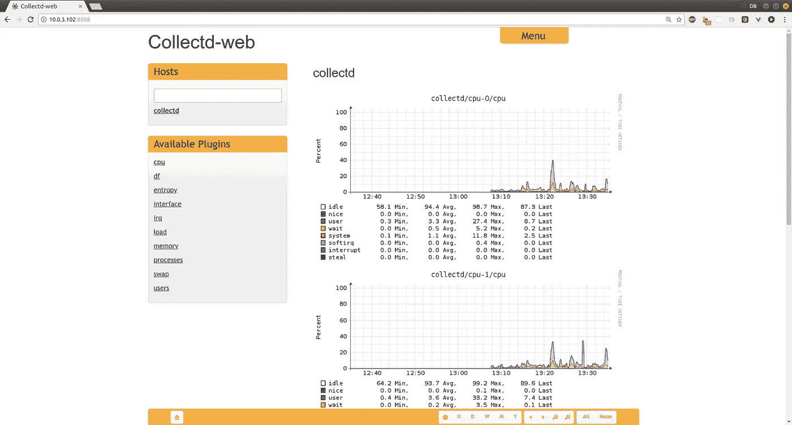
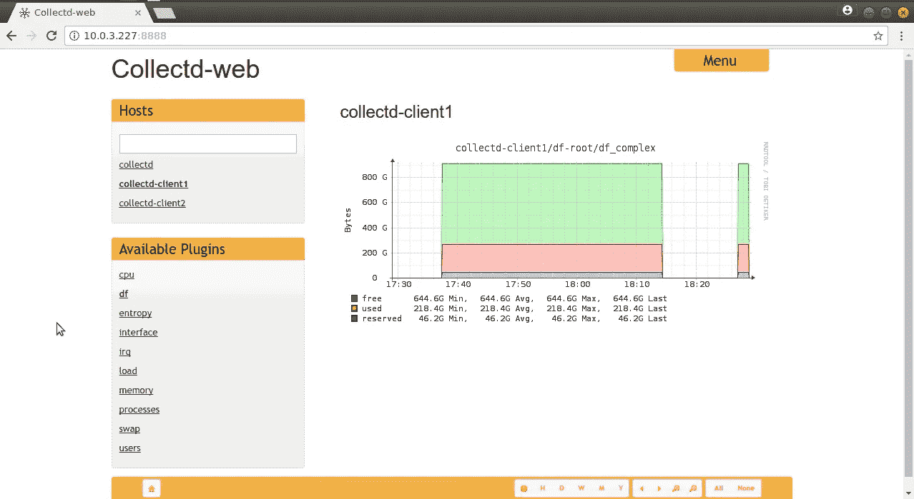

# Spectre 和 Meltdown 之后的清理工作:弄清楚它们使您的服务器变慢的程度

> 原文：<https://medium.com/hackernoon/cleaning-up-after-spectre-and-meltdown-figuring-out-how-badly-they-slowed-down-your-servers-9bd96da07cf7>

*这篇文章基于我在 plur sight**上的* [*Linux 性能监控和调优课程，巧合的是，该课程恰好在 Spectre 和 Meltdown 的新闻爆出之前发布。*](http://pluralsight.pxf.io/c/1191769/424552/7490?subId1=solving&u=https%3A%2F%2Fapp.pluralsight.com%2Fprofile%2Fauthor%2Fdavid-clinton)

到目前为止,[幽灵和崩溃漏洞](https://www.techrepublic.com/article/spectre-and-meltdown-cheat-sheet/)的关键阶段已经基本结束。受影响的操作系统的补丁已经写好了，假设你保持你的服务器正确更新，你应该是安全的。

这是容易的部分。真正的问题是该补丁可能会降低系统速度——尤其是如果您正在运行经常与内核交互的应用程序。所以你会想知道你受到了多大的打击，以及你需要什么样的升级才能让你回到你应该在的地方。

我最近的【Pluralsight 课程讨论了理解、诊断、调优和监控 Linux 服务器的性能。这些都是针对这个问题所要求的评估和管理的工具，所以我想我应该制作这个指南来安装和使用 collectd 守护进程来收集和监控本地或整个网络的性能指标。

除了 collectd，本课程还包括 Nagios、Munin 和 nmon 监控工具，以及分析指标和优化现有堆栈。

理想情况下，您应该有一些旧的、Spectre 之前的性能数据可以用作基线。但即使你不得不从头开始，用不了多久 collectd 就会开始针对你的痛点指指点点。

## 安装集合 d

collectd 是一个 Linux 系统守护进程，它收集系统性能数据并将其组织到循环数据库(RRD)文件中，这些文件通常保存在/var/lib/collectd/rrd/目录树中。

我将带您完成安装和配置 collectd 的过程。然后，我将演示一个名为 collectd-web 的工具，它可以将 RRD 数据转换成图表。完成所有这些工作后，我将向您展示如何将几个远程服务器设置为 collectd 客户机，这样我们就可以在一台服务器上访问整个车队的数据。但是一次只能做一件事。

将 collectd 独立安装很简单:您只需要 collectd 包。另一方面，安装并运行 collectd-web 工具可能有点小技巧。因为客户机只需要 collectd，所以我将集中精力设置我们的 collectd 服务器。我将在运行 Ubuntu 16.04 的 LXC 容器上做这件事。

这是包裹清单。

```
# apt install -y collectd python build-essential \
 librrds-perl librrds-perl libjson-perl libhtml-parser-perl \
 apache2
```

让我给你解释一下。我们将需要 Python 来运行 collectd-web 工具和 build-essential 来构建我们稍后将获得的源代码。这些 Perl 库将解释 RRD 数据库文件，并添加 JSON 和 CGI 功能。最后，我们将使用 Apache 作为我们的 web 服务器来处理 web 请求本身。我会让一切顺其自然，跳过无聊的细节。接下来，我将使用 a2enmod 来启用 CGI 模块，这将允许 Apache 管理一些可视化。

```
# a2enmod cgi cgid
```

cpan 将安装几个 Perl 模块。确保 JSON 和 CGI 使用大写字母。

```
# cpan JSON
# cpan CGI
```

我将使用一个文本编辑器向/etc/apache2/sites-available/目录中的 000-default.conf 文件添加一个部分，该部分将支持从 web 服务器端处理 Apache CGI 脚本。

```
<Directory /var/www/html/collectd-web/cgi-bin>
Options Indexes ExecCGI
AllowOverride All
AddHandler cgi-script .cgi
Require all granted
</Directory>
```

完成这些后，只剩下一件事要做了，就是按照我们想要的方式获得 Apache。查看 apache2.conf 配置文件，向下滚动到 Include 行，在那里我们设置监听的网络端口。注意它是如何被卸载到一个名为 ports.conf 的文件中的。

```
# Include list of ports to listen on
Include ports.conf
```

如果我们希望能够通过浏览器远程访问我们的数据，那就是我们想要编辑的文件。我将确保 ports.conf 中的“Listen”行显示为 0.0.0.0:80，这样我们就不会仅限于本地来宾。

```
Listen 0.0.0.0:80
```

我们所有的 Apache 工作都完成了，现在是重新启动它的时候了，这样所有的东西都得到了适当的更新。

```
# systemctl restart apache2
```

现在我们应该快速查看一下/etc/collect TD/目录中的 collectd.conf 配置文件。这是一个很大的文件，大多数默认设置现在对我们来说都适用，但是您应该知道您可以添加的东西的种类以及它们是如何配置的。collectd 的大部分功能都是通过它的插件提供的，这些插件是在 LoadPlugin 部分加载的(通过取消注释)。一些插件可能已经被加载了，比如 apache 和 cpu。

```
LoadPlugin apache
#LoadPlugin apcups
#LoadPlugin ascent
[…]
LoadPlugin cpu
```

这意味着，在下面正确配置的情况下，collectd 将监视和报告 Apache 和 CPU 的行为。

您还需要在下面的配置部分配置您的每个插件。cpu 配置被注释掉了，但是它将使用其缺省值正常工作。在这种情况下，配置部分只是为那些想要定制它的人准备的。

```
#<Plugin cpu>
# ReportByCpu true
# ReportByState true
# ValuesPercentage false
#</Plugin>
```

如果编辑配置文件，请确保使用 systemctl 重新启动守护程序。这也是在出现问题时查找错误消息的好地方。密切注意您收到的任何错误消息，尤其是通过系统日志，并仔细检查您在配置文件中使用的语法。也有可能您遗漏了一两个 Perl 模块。

```
# systemctl restart collectd
# systemctl status collectd
```

但是在所有这些有用之前，我们需要安装 collectd-web 工具本身。我将首先安装 git，然后克隆 collectd-web 存储库。这将把源代码保存到一个名为 collectd-web 的新目录中。

```
# apt install git
$ git clone [https://github.com/httpdss/collectd-web.git](https://github.com/httpdss/collectd-web.git)
```

在 cgi-bin 子目录中有一个脚本，我们必须将其设置为可执行的，因此我将更改为 cgi-bin，并使用 chmod 向 graphdefs.cgi 添加一个可执行位，然后我将返回到 collect TD-web 目录的一个级别，以便对 Python runserver 脚本进行一次编辑。

```
$ cd collectd-web/cgi-bin
$ chmod +x graphdefs.cgi
$ cd ..
$ nano runserver.py
```

我将更改 127.0.0.1 引用 localhost 的两个位置，并通过将其编辑为 0.0.0.0，向整个互联网开放。这将允许 collectd 监听来自其他机器的数据。

就这样，我们都准备好了。确保您在 collectd-web 目录中，并运行 runserver.py 脚本。我将添加&字符，这样它将在后台运行，我将得到我的命令行。不过，最好留意这个 shell，因为事件打印在这里，有时会很有用。

```
$ ./runserver.py &
```

现在，我将启动一个浏览器，将它指向 LXC 容器的 IP 地址，指定端口 8888。说到网络端口，如果你运行的是防火墙，你需要打开端口 8888 和 25826。您可以单击您的主机名称，然后从下面显示的指标中进行选择。



The CPU display for the local machine (called collectd)

## 多主机集合配置

如果到目前为止您一直在跟随演示，那么您已经获得了通过本地 web 服务显示的单个服务器的指标。但是如果你有很多服务器，你可能不会喜欢为每一个打开一个新的浏览器标签——尤其是当你在工作日中需要周期性地浏览它们的时候。

那么，为什么不将数据发送到一台服务器呢？就这么办吧。我已经启动了两台服务器，并在每台服务器上只安装了 collectd 包。它们的主机名是 collectd-client1 和 collectd-client2，这将使以后更容易识别它们。

我登录到我的一个客户端，我将编辑 collectd.conf 配置文件。至少，我需要确保网络插件已启用，然后进入配置页面进行设置。我需要做的就是取消对打开和关闭插件网络行、打开和关闭服务器行的注释，然后编辑服务器 IP 地址以匹配我的 Collectd 服务器使用的 IP。这是为了让客户端可以将数据推送到服务器。我将保留其他行的默认值。

```
LoadPlugin network<Plugin network>
# # client setup:
# Server “ff18::efc0:4a42” “25826”
 <Server “10.0.3.102” “25826”>
# SecurityLevel Encrypt
# Username “user”
# Password “secret”
# Interface “eth0”
# ResolveInterval 14400
 </Server>
# TimeToLive 128
#
# # server setup:
# Listen “ff18::efc0:4a42” “25826”
# <Listen “239.192.74.66” “25826”>
# SecurityLevel Sign
# AuthFile “/etc/collectd/passwd”
# Interface “eth0”
# </Listen>
# MaxPacketSize 1452
#
# # proxy setup (client and server as above):
# Forward true
#
# # statistics about the network plugin itself
# ReportStats false
#
# # “garbage collection”
# CacheFlush 1800
</Plugin>
```

就是这样。您将重新启动 collectd 服务，然后在您想要监视的任何其他客户端上重复该过程。

```
# systemctl restart collectd
```

现在，回到服务器上，我将编辑相同的配置文件，并确保联网已启用。同样，和以前一样，我将向下滚动到 networking configuration 部分并取消对插件行的注释，但是这一次，我将取消对 Server Setup 部分的注释并编辑它，而不是客户机部分。在这里，我将 Listen 行改为 0.0.0.0，这样服务器将监听来自任何地方的传入数据。

```
# server setup:
# Listen “ff18::efc0:4a42” “25826”
 <Listen “0.0.0.0” “25826”>
# SecurityLevel Sign
# AuthFile “/etc/collectd/passwd”
# Interface “eth0”
 </Listen>
```

我将保存并关闭文件，然后重启 collectd 和 apache 服务。

```
# systemctl restart collectd
```

然后，确保 Python runserver 脚本尚未运行——如果已经运行，您应该使用 kill 关闭它——再次启动它。

```
$ ./runserver.py &
```

现在回到浏览器并刷新页面。你的每个客户的链接应该立即出现，让我们在视图之间进行选择。



A multi-host configuration. Note links to three hosts in the left panel

您可能需要重新启动服务器，并希望第一次就能成功。它可能有点挑剔。但你肯定会欣赏结果的。

*解释您得到的结果并采取行动是您的职责，但是我的* [*Pluralsight Linux 性能监控和调优课程*](http://pluralsight.pxf.io/c/1191769/424552/7490?subId1=solving&u=https%3A%2F%2Fapp.pluralsight.com%2Fprofile%2Fauthor%2Fdavid-clinton) *涉及了许多您需要了解的内容。对 Linux 管理感兴趣吗？在我的 Bootstrap IT 网站上还有很多，包括我的手册《Linux in Action》的链接，以及一个名为*[*Linux in Motion*](https://www.manning.com/livevideo/linux-in-motion?a_aid=bootstrap-it&a_bid=0c56986f&chan=motion1)*的混合课程，它由两个多小时的视频和大约 40%的 Linux in Action 文本组成。*