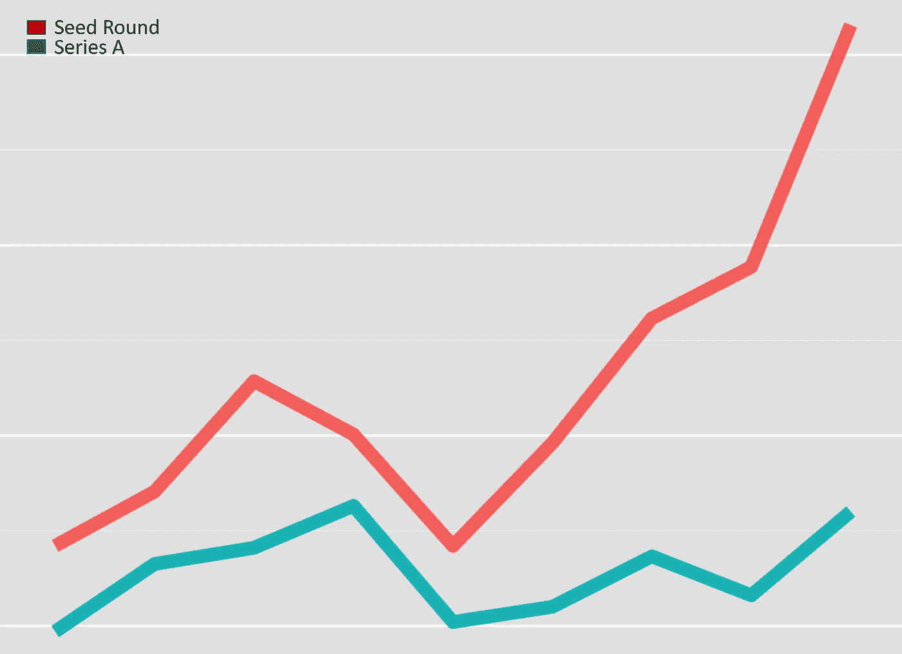
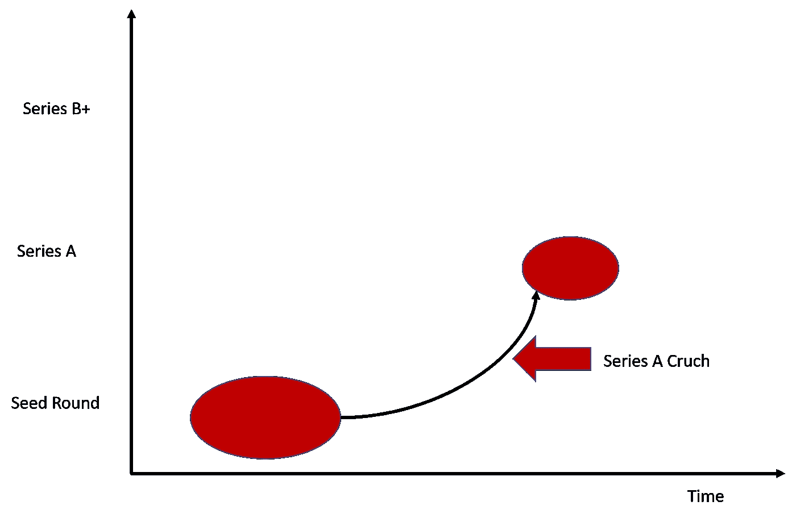

# 清理炒作:安全令牌初创公司面临的不可避免的 A 轮危机

> 原文：<https://medium.com/hackernoon/clearing-through-the-hype-the-inevitable-series-a-crunch-facing-security-token-startups-a60dfdae25a8>

安全令牌已经迅速发展成为加密资产生态系统中最重要的趋势之一。因此，我们已经看到尝试启用加密安全解决方案的不同组件的创业公司数量激增。这些初创企业的实施需要的资本水平是风险投资或私募股权市场所不具备的。因此，安全令牌空间可能会出现融资周期中常见的现象:A 轮危机。

*在深入探讨关于安全令牌的 A 系列危机争论之前，我想澄清一下，我在这里的意图不是预测安全市场空间的任何灾难性的短期未来，而是分析一个不应被忽视的重要市场动态。我也明白，这篇文章可能很难被许多投资于安全令牌产品的热情创始人阅读，但希望这些论点足够务实，有助于提供关于安全令牌市场近期未来的更好视角。*

首轮融资危机是一种现象，发生在快速增长、通常被夸大的市场中，当种子轮可用的资本、初创公司在市场上获得的价值和可用于首轮融资的资金池之间出现错位时。从市场动态的角度来看，A 轮融资危机导致大量初创公司获得天使轮或种子轮融资，但没有提供足够的价值来进行 A 轮融资。从图形上看，A 轮融资危机类似于以下情况:

从概念上讲，A 轮融资危机是在一个发展速度超过风险投资池的市场中相对容易获得早期资本的结果。任何首轮融资危机通常都会导致大部分创业公司倒闭，少数资本雄厚的公司引领市场进入下一阶段，这将产生更多的创业公司。

# A 系列危机和安全令牌

在安全令牌的背景下，一系列的危机似乎是不可避免的。除了少数资本雄厚的公司，大多数安全令牌初创公司在 10-12 个月前筹集了小额资金，这意味着他们正在进入融资周期的下一阶段。不幸的是，在安全令牌领域获得 A 轮资本仍然非常有限，该领域的技术基础仍然非常不成熟。这似乎是首轮危机的完美风暴。如果您仍然持怀疑态度，让我们更深入一点，探索一些导致安全令牌领域 A 轮危机的关键市场动态。下面，我列出了证明安全令牌系列 A crunch 论点的 10 个论据:

1.**大多数风险投资基金还没有发展出关于安全代币的理论:**除了像 Andreessen-Horowitz 或 Union Square Ventures 这样的一级基金，大多数风险投资基金还没有将安全代币作为其投资理论的一部分，而是等待市场进一步发展，然后再下注。

2.**安全令牌初创公司在 2017 年健康的加密环境中获利:**2017 年的加密热潮使得安全令牌初创公司相对容易筹集天使轮或种子轮，但不足以进行首轮融资

3.**加密风险投资和对冲基金表现不佳:**投资界中超级看好加密的部分，如加密对冲基金，在当前市场中表现不佳，它们自己也在经历资金短缺。

4.**安全令牌市场可能需要数年时间才能成为主流:**我认为安全令牌初创公司社区的乐观情绪与市场现实并不相关。该领域的每一个数据点都表明，安全令牌市场可能需要几年时间才能达到主流采用水平。

5.没有太多伟大的安全令牌项目:没有任何批评任何具体项目的兴趣，我想我们都同意迄今为止发行的大多数安全令牌都不伟大。围绕科学和区块链资本等代币的交易有很多预期，因此希望这将有助于市场的势头。

6.**公共技术市场的调整:**科技股正在经历一次相当不错的调整，大约 80%的科技股平均比 52 周高点下跌了 10%。公共技术市场的悲观情绪通常转化为保守的技术风险投资环境。

7.**加密市场大屠杀:**加密货币价值的大幅下跌导致了风险投资界的怀疑。

8.**证券代币交易所需要很长时间才能推出:**证券代币市场不可或缺的组成部分(如交易所)需要一段时间才能实现，这导致大多数投资者采取观望策略。

9.**缺乏加密经济学:**市场上的大多数安全令牌平台都没有在产品中注入明确的加密经济学，或者甚至没有令牌。对于风险投资者将资本投入加密和区块链初创公司而言，代币经济学一直是最具吸引力的因素之一。这一因素的缺失导致了大多数风险投资集团的财务怀疑。

10.**有限的货币化和可扩展的收入模式:**从风险投资者的角度来看，只有少数安全令牌初创公司提供了足够的价值来证明 A 轮投资的合理性。除了像稳定硬币这样的工具，这个领域的大多数货币化都是基于相对难以扩展的一个个项目的基础。在周期性和可扩展的收入模式开始变得对安全令牌更加可行之前，大多数风险投资者可能会保持观望。

# 安全令牌市场 A 系列危机的副作用

如果我们承认证券代币的 A 轮危机是该领域发展过程中不可避免的一部分，那么下一个合乎逻辑的步骤就是尝试评估在这一市场现象中会发生什么。在这里，我们可以从最近的技术运动中吸取一些教训，如大数据或虚拟现实，它们经历了自己的 A 轮危机。这里有一些想法:

1) **许多安全令牌初创公司将在未来几个月内倒闭:**许多在未来几个月内无法筹集到大量资金的安全令牌供应商很可能将被迫关闭

2) **资金将主要分配给交易所和端到端平台令牌化平台:**在市场的早期阶段，端到端平台产品对风投更具吸引力，并有可能获得该领域部署的部分重要资本。

3) **垂直战略投资者将在证券代币市场的下一阶段发挥作用:**在缺乏主流风险投资的情况下，来自房地产或金融等行业的垂直集团的资本来源可能会发挥重要作用。

4) **更多稳定币和实用代币:**期待更多玩家推出稳定币或 SmartValor，或将实用代币整合到他们的产品中以提高货币化。

5) **只有少数初创公司能够生存到市场的下一阶段:**根据安全令牌初创公司目前筹集的资金，我认为很有可能市场的下一阶段将由极少数资金充足的公司主导，这些公司等待空间的发展，并建立正确的基础设施构建模块。在此之后，我们应该会看到新的安全令牌创业公司的重新出现，这些公司将涉足新的市场领域。

预测市场从来都不是我的强项，也不是我特别喜欢做的事情。安全令牌市场上发生的一系列事件使得一场危机看起来很有可能发生。虽然短期内会很痛苦，但这种调整可能会消除安全令牌领域的许多噪音，并推动最佳项目进入市场的下一阶段。有一件事是肯定的，我们将很快发现谁是这个空间中真正的人。