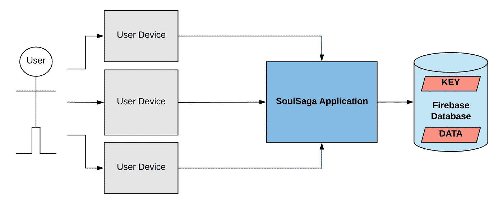
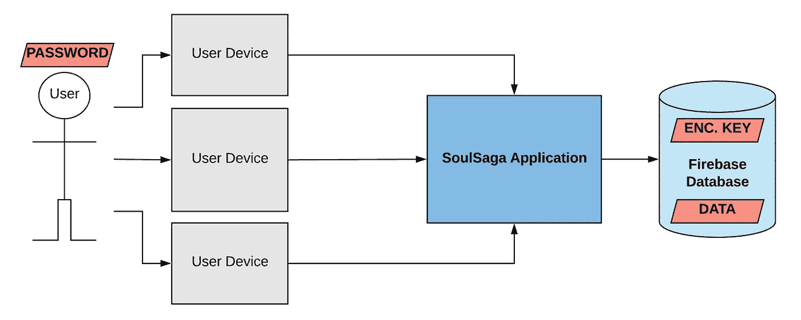
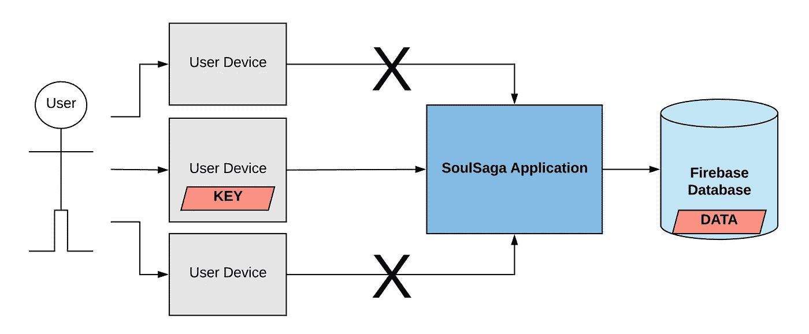
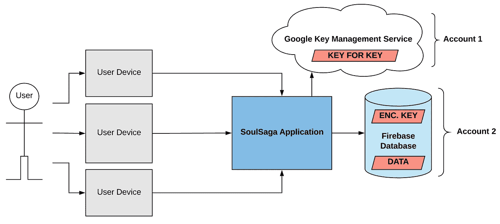
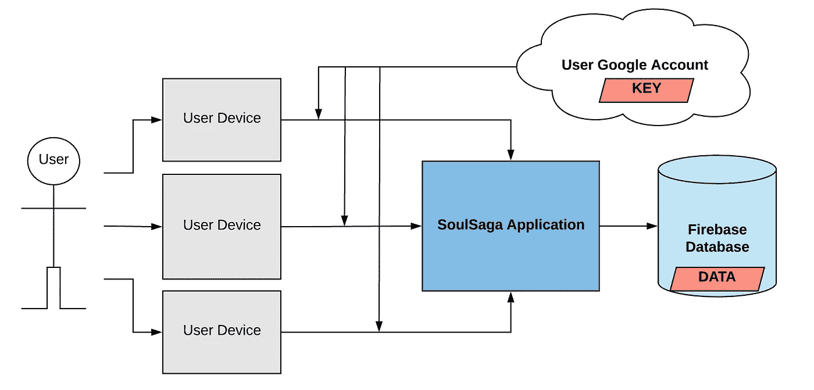
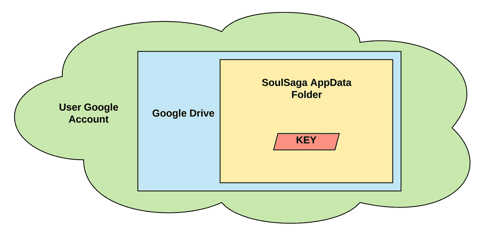

# Firebase 数据库和存储中的客户端加密

> 原文：<https://medium.com/hackernoon/client-side-encryption-in-firebase-database-60dd55abadb2>

*声明:我绝不是* [*安全*](https://hackernoon.com/tagged/security) *专家。我的项目只需要一些客户端加密，并尽我所能理解选项，并在这里展示出来。欢迎所有的反馈和更正，我为任何错误提前道歉！*

在过去的几个月里，我一直在做一个兼职项目，SoulSaga。我想建立一个空间，让人们能够反思他们的生活、身份和个人成长。换句话说，一个拥有大量敏感用户信息的应用程序。

Firebase 解决了很多这样的问题，包括安全传输和服务器端加密。但是，任何使用过 Firebase 数据库或存储的人都会很快意识到，作为管理员，您可以看到存储在其中的任何用户数据。因此，开箱即用的 Firebase 是好的，但还不够好——用户信任需要并且应该得到全面保护，因此某种形式的客户端加密(发送到数据库之前的加密)是必要的。

在本文中，我希望列举一些我考虑过的解决方案，最后一个是我选定的。

加密本身很简单，可以用现有的库来执行，使用对称密钥(既可以加密数据，也可以解密加密数据的密钥)，如 AES。通常的问题是，我们现在需要找到一个安全的地方来存储这个万能的密钥。

如果存储在你自己的服务器上，它不提供安全，因为你自己可以用这个密钥来解密你的用户数据，因此任何入侵你系统的人都可以这样做。它甚至不应该是一个选项，所以我们称它为选项 0 :P

Option 0: Storing Key With Data

**选项 1:密码加密密钥**

您可以将密钥存储在您的服务器上，并要求用户保留一个强密码来加密密钥。这并不理想，因为它需要在用户端进行工作，如果用户忘记了密码，密钥很可能无法恢复。也就是说，这种选择有其优点，而且似乎是一种相对受欢迎的选择。

Option 1: Password Encrypted Keys

**选项 2:在用户设备上存储密钥**

这与端到端加密非常相似，它将密钥存储在用户的设备上，因此密钥永远不会在应用服务器上。但是这种方法的问题是，密钥以及数据不能从其他设备访问。这是一个不错的解决方案，取决于具体情况，但肯定不是我想要的。

Option 2: Storing Key in User Device

**选项 3:用于密钥加密的谷歌密钥管理服务(KMS)**

至此，我们已经穷尽了在这条管道上放置密钥的所有选项，但是通过添加其他系统，还有更多的选项可以考虑。

Andy Geers 提出了一个广受欢迎且经过深思熟虑的解决方案[,该方案涉及使用存储在谷歌](http://www.geero.net/2017/05/how-to-encrypt-a-google-firebase-realtime-database/)[密钥管理服务](https://cloud.google.com/kms/)中的另一个数据密钥对密钥进行加密。用户的密钥对数据进行加密，然后用 KMS 密钥对密钥进行加密，并存储在数据库中。正如安迪指出的那样，

> 重要的是，KMS 密钥与 Firebase 数据库属于不同的 Google 帐户，因此任何用户(例如我)都无权读取数据和解密数据。黑客需要破坏两个帐户才能访问未加密的数据。

Option 3: Storing Key with Key Management Service

我个人希望设计一个系统，其中密钥仍然在用户手中，并且不希望有管理两个帐户的负担。

**选项 4:把密钥藏在用户的谷歌账户里！(经用户同意)**

我已经在使用 Firebase 认证作为我的 Google 账户认证解决方案，所以这个解决方案是它的自然延伸。现在，锁定 Google 作为唯一的身份验证提供者是这种方法的一个相当大的缺点，但是我希望这个概念可以启发一些人，或者其他身份验证提供者也有类似的 API。

当用户登录时，我们从用户的 Google 帐户获得 OAuth 凭证来请求用户的个人加密密钥，或者如果我们找不到，就创建一个。这样，密钥总是完全掌握在用户手中，但他们永远不会直接处理它。获取密钥需要侵入用户的谷歌账户，此时黑客可以读取应用程序中的数据。

Option 4: Storing Key in User’s Google Account

那么，把密钥“藏”在某人的谷歌账户里是什么意思呢？Google Drive [提供了一个 API](https://developers.google.com/drive/api/v3/appdata) 用于创建一个特殊的应用数据文件夹(OAuth 期间需要用户同意)。这个文件夹的内容对用户是不可见的，并且只能通过您的应用程序的凭证来访问！

警告——用户可以看到应用程序在他们的驱动器中占用了多少空间，并有能力清除应用程序的数据，因此这种方法依赖于用户不会意外删除他们自己的加密密钥。

Key Storage in App Data folder in Google Drive

感谢阅读！