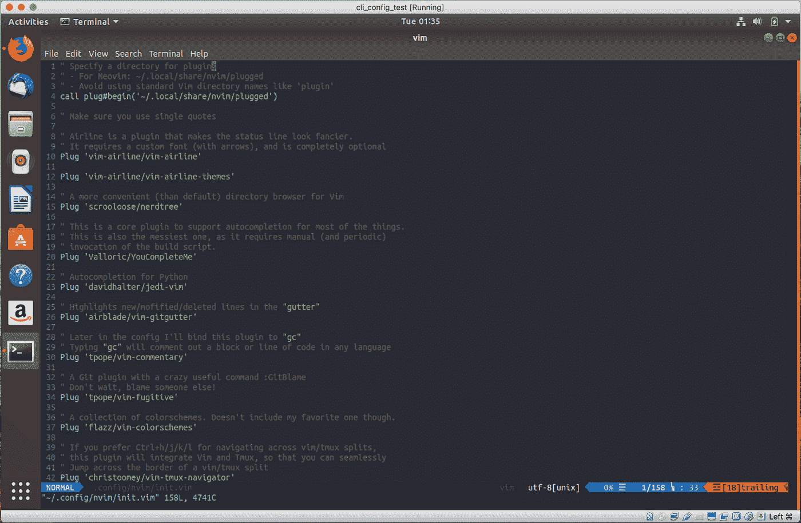

# CLIfe 或我的开发设置

> 原文：<https://medium.com/hackernoon/clife-or-my-development-setup-67868b86cb57>

像许多其他人一样，我通过使用庞大、强大、笨拙的 ide 开始了我的编程之旅。我用过 *Borland Delphi，MS VS，Netbeans，Eclipse，IntelliJ IDEA* 等。随着时间的流逝，我越来越深入到 web 开发中，我转向了更轻松的选择。有一段时间，我选择的编辑一直是*崇高文本*。大约三年前，我已经完全迁移到了 *Vim* 、 *Tmux* ，以及其他非 GUI 工具，到目前为止我完全爱上了它们！


两件事引发了这次迁移。首先，在我的新工作中，我们都有笔记本电脑用于远程工作，但大部分开发工作都是在位于办公室的强大的固定工作站上进行的。在不稳定的互联网连接上使用 SSHFS 或 VNC 是一件痛苦的事情，所以我需要一个更好的选择。第二，我正在做越来越多的 DevOps 类型的工作，这需要我每天在几十台远程机器上编辑文件，而 *Vi* 是唯一随处可用的编辑器。切换到 *Vim* 为我解决了这两个问题，并且在我发现[人体工程学](https://blog.onebar.io/hjkl-or-how-to-feel-less-tired-after-a-day-of-coding-48f975ba4091)和[插件生态系统](https://vimawesome.com/)之后，我彻底抛弃了 *Sublime* 作为我的主要编辑。最近我注意到越来越多的人一看到我的屏幕就问我的设置，所以我决定在博客上分享一下。

# 安装 Neovim

Neovim 是一个雄心勃勃的项目，从零开始重构一个有 27 年历史的 vim 代码库。你可以在这里阅读更多关于他们愿景的信息。
安装 *Neovim* 的方法因操作系统而异，所以最好参考[原始指南](https://github.com/neovim/neovim/wiki/Installing-Neovim)。从现在开始，我假设 Ubuntu 18.04 是独立于操作系统的，只有安装步骤不同。
在 *Ubuntu 18.04* 中 *Neovim* 包含在发行版中，所以你可以直接做

```
sudo apt-get install neovim
```

在 *Mac OS* 上，可以通过*自制软件*获得:

```
brew install neovim
```

要调用 *Neovim* ，你需要调用`nvim`，它比`vim`多一个字母，并且与只有常规 vim 可用的机器不兼容。要解决这个问题，您可以在 rc 脚本中定义一个别名:

```
alias vim=’nvim’
```

我个人选择了一个硬核的方式:删除了一个`/usr/bin/vim`，换成了 Neovim 的符号链接:

```
sudo rm /usr/bin/vim && sudo ln -s /usr/bin/nvim /usr/bin/vim
```

# 安装插头

在用 *Vim* 做其他事情之前，最好安装一个插件管理器。我选择了 [vim-plug](https://github.com/junegunn/vim-plug) ，因为它非常简约，而且仍然有效。为 *Neovim* 安装*塞*:

```
curl -fLo ~/.local/share/nvim/site/autoload/plug.vim --create-dirs \
    https://raw.githubusercontent.com/junegunn/vim-plug/master/plug.vim
```

*Vim-plug* 是唯一需要手动添加的插件，其余插件将通过 Plug 安装*。*

# 安装 Tmux

接下来我们要配置的是 *Tmux* 。Tmux 是一个终端多路复用器，它允许我们完成以下关键任务:

*   将终端窗口拆分为水平和垂直面板
*   将单个终端拆分为多个窗口
*   让所有运行在 Tmux 中的进程保持活动状态，即使我们失去了一个 SSH 连接。

Tmux 在远程端运行(如果我们谈论的是在远程机器上的开发的话),它本身被分成一个*Tmux-服务器*和一个*Tmux-客户端*。当您通过 *SSH* 连接到您的工作站时，您首先启动一个 *tmux-client* ，它然后连接到一个 *tmux-server* ，作为一个守护进程运行在同一台机器上。当连接断开时， *SSH* 只终止 *tmux-client* 部分，因为它是由 *SSH* 进程启动的唯一子进程。现在，在 *Ubuntu 18.04* 上，一个足够新鲜的 *Tmux* 已经包含在分发中了，所以只要做:

```
sudo apt-get install tmux
```

在其他平台上，请确保你正在安装`tmux >= 2.0`，因为我的配置中的一些东西与旧版本不兼容。

# 安装 Zsh

与 bash 相比，我更喜欢 *Zsh* ，因为它提供了一些额外的特性:在所有运行的 shells 之间共享的命令历史，更好的命令自动完成，以及通过 [oh-my-zsh](https://ohmyz.sh/) 的可扩展性。在 *Ubuntu* 运行时:

```
sudo apt-get install zsh
```

然后让它成为您的用户的默认 shell:

```
chsh -s /bin/zsh
```

(然后重新登录)

添加 *oh-my-zsh* :

```
sh -c "$(curl -fsSL [https://raw.github.com/robbyrussell/oh-my-zsh/master/tools/install.sh](https://raw.github.com/robbyrussell/oh-my-zsh/master/tools/install.sh))"
```

# Fzf

谁不喜欢模糊搜索？

```
sudo apt-get install git
git clone --depth 1 https://github.com/junegunn/fzf.git ~/.fzf
~/.fzf/install
```

然后对所有的问题都回答是，这会让你的 ZSH 在几个方面变得模糊。试试按 Ctrl+R 或者 Ctrl+T 就行了。


# ~/.zshrc 定制

以下是我喜欢放在 rc 文件中的一些内容:

最后，我们已经安装了所有的核心工具，现在可以开始配置了。先来看看我的 *Vim* config。

根据自己的口味调整一下，放在`~/.config/nvim/init.vim`下，打开 *Vim* ，然后运行`:PlugInstall`安装所有插件(打开 *Vim* 时忽略启动错误)。

要完成 *YCM* 的安装:

```
cd ~/.local/share/nvim/plugged/YouCompleteMe
sudo apt-get install build-essential python-dev cmake
./install.py
```

然后，去掉你的 *Vim* 底部的这些奇怪符号:

```
sudo apt-get install fonts-powerline
```

(安装字体后，您可能需要重新启动终端)

在所有的操作之后，你的 Vim 应该看起来像这样:



# Tmux 配置

我也对我的 *Tmux* 配置做了一些调整。
和 *Vim* 一样，你应该从安装一个[插件管理器](https://github.com/tmux-plugins/tpm)开始:

```
git clone [https://github.com/tmux-plugins/tpm](https://github.com/tmux-plugins/tpm) ~/.tmux/plugins/tpm
```

这是我完整的 Tmux 配置:

把它放在`~/.tmux.conf`(和`~/.tmuxline`)下，然后(重新)启动你的 *Tmux* 。第一次启动时，按`prefix I`安装 Tmux 插件(默认前缀是 Ctrl+b)

下面是完成以上所有步骤后的截图:


你应该可以通过复制粘贴这篇文章来重新创建我的设置。CLI 工具的真正魅力在于它们具有难以置信的可定制性。你一定要把这个配置作为你自己实验的模板！

# 最后还有一些提示:

*   Vim 没有 *Vim* 导航就没有意义了，习惯那些该死的 [HJKL](https://blog.onebar.io/hjkl-or-how-to-feel-less-tired-after-a-day-of-coding-48f975ba4091) 。
*   尝试将*顶锁*重新映射到 *Esc* ，尤其是在新的 Mac 笔记本电脑上
*   给自己买一个弯曲的键盘，你的手会感谢你的！


这就是这篇文章的内容。如果你喜欢，你也可以看看[我用所有这些工具](https://onebar.io)在构建什么。

## 链接

[我的工程故事](https://hackernoon.com/my-engineering-journey-to-date-8250d69fd079)

[码头集装箱速度慢的另一个原因](https://hackernoon.com/another-reason-why-your-docker-containers-may-be-slow-d37207dec27f)

[一个正好在你空闲时间的知识库](https://onebar.io)