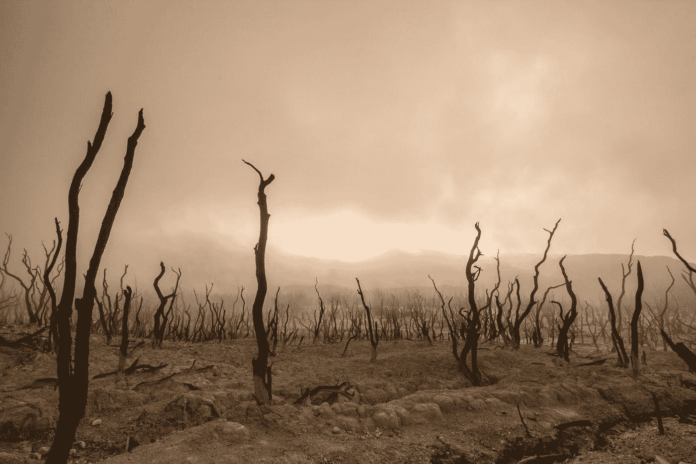
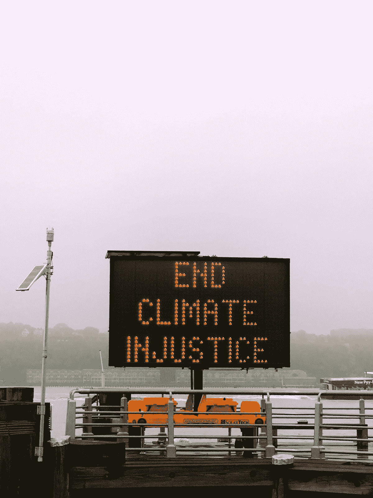

# 气候变化、区块链和巴黎协定:新的希望

> 原文：<https://medium.com/hackernoon/climate-change-blockchain-and-the-paris-agreement-a-new-hope-f1386b70fb6d>

## 让 196 个国家合作是我们不能失败的挑战。

Photo by [Dikaseva](https://unsplash.com/photos/zvf7cZ0PC20?utm_source=unsplash&utm_medium=referral&utm_content=creditCopyText)

毫无疑问，我们都意识到遏制全球碳排放的重要性。我们已经开始走上通往可持续未来的道路。但问题仍然存在:我们能否足够迅速地合作，以防止对世界各地的社会造成严重损害？

这正是 2015 年巴黎协定想要实现的目标。人类历史上第一次，196 个国家承诺携手应对气候变化。当这些会谈接近尾声时，来自世界各国的政治家们一起鼓掌欢呼。这是否已经转化为到 2050 年防止前工业化时期气温上升 2 摄氏度所需的真正的全球行动？

咨询巨头普华永道发布的低碳经济指数报告于上周出炉。报告指出，世界上没有一个国家按照设定的目标做了足够多的工作来减少碳排放。一周后，联合国在世界领先的气候科学家的帮助下，发布了[一份报告](http://www.ipcc.ch/report/sr15/)，称我们有 12 年的时间将全球变暖保持在最高 1.5 摄氏度。他们表示，为了防止环境灾难，迫切需要前所未有的变化。

这些报告要求我们做得更好。它们迫使我们审视以往气候协议的失败，并迫切要求我们从集体错误中吸取教训。

# 我们是怎么到这里的？

我们多次未能让气候协议发挥作用。1997 年的《京都议定书》试图考虑不同国家的经济状况，并提出了两种方案。他们首先为发达国家制定了具有法律约束力的目标。任何被视为“发展中”的国家，如中国和印度，都没有被法律要求减排。他们的人均排放量要低得多，而且还在增长。他们这次会得到一张通行证。

接下来发生了什么？美国工厂只是搬到了法律不会伤害他们的海外。美国和加拿大都退出了具有法律约束力的协议，没有受到惩罚。欧洲、日本和新西兰对排放做了一些小的积极改变，但中国和印度燃烧了如此多的煤，增长如此之快，以至于全球排放飙升。

快进到 12 年后的哥本哈根会谈。所有国家，无论贫富，都必须做出具有法律约束力的承诺。争论爆发了。发展中国家坚持认为，该轮到他们无限制地燃烧煤炭了。毕竟，美国和欧洲这样做了多年，并从中获益。谈判悲惨地结束了，协议含糊不清，没有任何东西让一个国家为不作为负责。

回到巴黎协定。这和以前的失败有什么不同吗？每个国家都提交了一份自愿承诺，声明他们将如何应对气候变化。这是有道理的。每个国家都可以分析它认为政治上可行、技术上可行的东西。他们可以根据自己的情况调整自己的气候努力。中国做出承诺，将改善城市空气污染，减少温室气体排放。印度可以通过改变农村的能源基础设施来适应太阳能，从而专注于为农村供电。这在理论上听起来很棒，但没有任何法律约束力——这些自愿承诺就足够了吗？

# 透明度和区块链技术

为了成功追踪排放，每个国家都应该有一个碳账户。每个国家的碳账户都需要与世界上所有其他的碳账户相连。没有人能对其他人隐瞒自己的排放数据。这些信息必须让所有人都能看到，这样我们才能共同面对这一挑战。

Photo by [Jon Tyson](https://unsplash.com/photos/M6bsFPIfl1Y?utm_source=unsplash&utm_medium=referral&utm_content=creditCopyText)

要做到这一点，我们需要一个公开、透明的体系，确保国际合作比过去容易得多。各国也需要一个系统来提供减少排放的激励。这必须被设计好，这样它就不能以他人为代价被操纵。

我们不能仅仅依靠政治意愿来实现这样的制度。它每次都让我们失望。如果我们要求地球上的每个国家合作解决人类面临的最大挑战之一，那么这个体系必须属于全世界。它不能集中在少数有权有势的人手中，他们可以根据自己的利益操纵它。

# 设计全球透明系统

使用一个公开、开源的区块链协议，[气候基金会的区块链](https://www.blockchainforclimate.org/)计划创建一个完全像这样的系统。它将使用巴黎协定的一个重要部分——国际转移减缓成果(ITMOs)的设计参数。

简单地说，ITMO 代表着可以与其他国家进行交易的减排或清除量。它们可以用二氧化碳的吨数来衡量。这些减排量具有价值，可以在区块链上使用独特的可替代代币(uft)进行交易。

这些代币代表已经减少的二氧化碳排放量。一个令牌持有关于特定的二氧化碳减排吨的信息和数据。有关这种减排是如何产生的信息，以及标准和来源，都与一个令牌相关联。令牌可以在区块链上交易多次，数据仍将与它绑定在一起。

# 《巴黎协定》为什么需要区块链？

3 个主要原因:

*   以透明和安全的方式记录每个国家的减排情况
*   让世界各国、企业和公民将他们的气候目标联系起来
*   通过使减排成为可交易的资产来激励一个国家减少排放

如果我们要实现全球减排目标，每个国家之间的合作绝对至关重要。国与国之间的关系很复杂。他们既有亲密关系，也有死敌。这就是为什么我们必须有一个系统，允许各方合作，即使他们不信任对方，沟通已经破裂。

我们不知道未来的政治紧张局势，但我们知道不合作和未能保持在前工业变暖 2 摄氏度以内的代价。碳交易，如区块链的 uft，将涉及稀缺的资源、价值和商业，很容易成为政治崩溃的催化剂。我们必须有一个未来的证明体系，将政治紧张的风险降至最低，同时在国家间沟通中断的情况下仍能发挥作用。

Photo by [Wilco Van Meppelen](https://unsplash.com/photos/a0pIZartksk?utm_source=unsplash&utm_medium=referral&utm_content=creditCopyText)

# 最后的想法

[区块链促进气候基金会](https://www.blockchainforclimate.org/)正试图创建一个全球性的激励性碳核算系统，激励各国更快地减少排放。这个系统是透明的，让各国很难隐瞒或谎报他们的排放量。他们是负责任的，这进一步增加了减排的动力。这个系统不需要信任，如果将来国与国之间的交流中断，它仍然可以工作。可悲的是，历史表明这是极有可能的。

将《巴黎协定》置于区块链之上不会解决我们所有的问题。按照目标减少我们的全球排放需要许多不同的复杂解决方案，这些方案必须协同工作。

不过，我们可以乐观一点。我们正试图创造另一个强大的工具来帮助我们一起工作。解决我们环境问题的关键是人类历史上从未有过的全球合作水平。我们必须在这里集中努力。

## 这位作者的更多阅读:

[*区块链和水:你需要知道的一切。*](https://hackernoon.com/blockchain-and-water-everything-you-need-to-know-b7e753108715)

[*区块链与能源:你需要知道的一切。*](https://hackernoon.com/blockchain-and-energy-everything-you-need-to-know-2c56977614aa)

## 是时候开始对话了

*想听听大家的想法。让我知道你对把巴黎协定放在区块链的想法。*