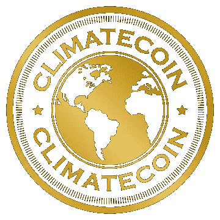

# 气候变化:让碳信用交易在区块链上变得可行

> 原文：<https://medium.com/hackernoon/climatecoin-making-carbon-credit-trading-accessible-on-the-blockchain-7199d5e53ba1>

# 关于气候币的信息

自从 1997 年签署京都议定书以来，各国已经开始限制每年产生的温室气体量。他们这样做的一种方式是通过在世界范围内建立排放交易机制(ETS ),要求某些地区的工业参与进来。这为超过预定上限的温室气体(GHG)设定了每公吨的价格，因为参与者被迫购买补偿。这也导致了一个自愿的市场，个人和公司可以购买碳补偿来限制他们自己的碳足迹。用于购买补偿的钱被用于以某种方式减少 GHG 排放的项目。《京都议定书》建立了清洁发展机制(CDM)，该机制对项目进行验证和衡量，以确保它们产生真正的效益。合格项目被认证为 CDM 黄金标准。

清洁发展机制黄金标准认证的碳信用有多种类型，包括自愿减排(VER)、可再生能源证书(REC)、核证减排量(CER)、联合国降低森林砍伐和退化所致排放量方案(UN-REDD)以及随着巴黎协定的实施，国际航空碳抵消和减排计划(CORSIA)。到目前为止，这个市场一直是分裂的和地区性的，但是气候联盟正计划通过使碳信用以统一的名义进行交易来改变这种状况。他们将通过建立一个令牌化碳信用的交易门户来做到这一点。企业和个人将能够通过智能合同购买不同类型的碳信用额。这将为个人和企业创造一个中心，他们可以购买他们想要的碳信用来减少他们自己的碳足迹，使用 Climatecoin 推出的新硬币 CO2。Climatecoin 还宣布了与碳交易交易所(CTX)的战略协议，根据该协议，二氧化碳是 CTX 全球交易所接受的唯一加密货币，这是世界上第一个全球碳信用电子交易所。

**硬币名称:**气候币(CO2)

**总供应量:** 5 亿

**Ico 价格:** 210 CO2 = 1 ETH

**投资合格的可持续项目**

任何符合 CDM 黄金标准的项目都将能够创造自己的代币，附带碳信用额。这些代币将在 eToken1 智能合约中发行，与以太坊区块链相连接。令牌还与 EIP20 兼容，以确保与交易所的顺利集成。通过这种方式，碳信用的生产者可以直接出售给感兴趣的买家

二氧化碳。

65%的 CO2 ICO 收益将用于建设交易门户和投资 CDM 黄金标准认证项目，并帮助他们在平台上推出令牌。另外 15%将作为未来投资和市场支持的储备。外部审计师将在任何投资发生之前对项目进行尽职调查，剩余资金将存放在瑞士比特币公司的冷库中。Climatecoin 通过排放二氧化碳获得的任何利润都将用于资助更多合格的项目，从而确保该平台有更多的流动性。

通过为全球众多 EMT 提供一个中央平台来发行代币，代币以加密货币命名，持有者还可以访问 CTX，这将使企业能够快速有效地履行其自身碳减排计划下的义务。它还赋予个人交易碳信用头寸的能力，为市场提供流动性。我们的目标是让它成为一个中心平台，在这里，资本从那些需要购买碳补偿的人那里有效地分配到寻找资金的有价值的项目。如果是这样，对二氧化碳的需求将会很大。

**社交媒体**

**脸书 **

网址:——[https://www.facebook.com/climatecoinofficial/](https://www.facebook.com/climatecoinofficial/)

喜欢:**271**喜欢和 **292** 关注者

***推特***

网址:[https://twitter.com/infoclimatecoin](https://twitter.com/infoclimatecoin)

追随者:**3560 名**追随者*名*

***电报***

网址:——[https://t.me/joinchat/Fy8RMAvg7dTdD0ZhOu1a1w](https://t.me/joinchat/Fy8RMAvg7dTdD0ZhOu1a1w)

用户: **206** *成员*

**讨论**

***松弛***

网址:——【https://climatecoinofficial.slack.com/ 

**Reddit**

网址:——[https://www.reddit.com/user/CLIMATECOIN/](https://www.reddit.com/user/CLIMATECOIN/)

读者: **—** *读者*

***Youtube***

网址:——[https://www.youtube.com/channel/UCa5Q35bRxMZDBcEAEgfisKA](https://www.youtube.com/channel/UCa5Q35bRxMZDBcEAEgfisKA)

订户: **109** *订户*

***中等***

网址:——[https://medium.com/@Climatecoin](/@Climatecoin)

跟随者: **-138** *跟随者*

***LinkedIn***

网址:——[https://www.linkedin.com/company/11229823/](https://www.linkedin.com/company/11229823/)

追随者:**318**追随者

***GitHub***

网址:——[https://github.com/climatecoinio/](https://github.com/climatecoinio/)

**员工/团队信息:**

姓名:**詹姆斯·哈夫特**

头衔: **CEO**

简历:企业家和商业银行家，在企业家驱动的企业的组建、管理、咨询、融资和业务发展的各个方面都有丰富的经验，包括业务战略和并购。全球 ico 和代币产品的顾问或联合创始人。领英:——[https://www.linkedin.com/in/jameshaft/](https://www.linkedin.com/in/jameshaft/)

姓名:**胡安·博卢达·索勒**

头衔:**首席运营官气候公司&首席财务官**

领英:——【https://www.linkedin.com/in/juanbautistaboluda/】

姓名:**大卫·奥尔特加**

标题: **CLIMATECOIN CTO &以太网开发者**

领英:——[https://www.linkedin.com/in/dortega/](https://www.linkedin.com/in/dortega/)

名称:**安娜·卡伦·ZS**

标题:**CMO 气候**

领英:——[https://www.linkedin.com/in/ana-karen-zs-67ba7697/](https://www.linkedin.com/in/ana-karen-zs-67ba7697/)

姓名:**安东尼奥刘洋**

标题:**气候变化委员会**

领英:——[https://www.linkedin.com/in/antonioliuyang/](https://www.linkedin.com/in/antonioliuyang/)

名称:**博尔哈赫雷罗**

标题:**网页开发者**

领英:——[https://www.linkedin.com/in/borjaherrero/](https://www.linkedin.com/in/borjaherrero/)

姓名:**伊曼纽尔·拉加里格**

头衔:**施耐德电气首席战略官**

领英:——[https://www.linkedin.com/in/lagarrigue/](https://www.linkedin.com/in/lagarrigue/)

姓名:**贡萨洛·德拉佩尼亚·希福恩特斯**

头衔:**open finance 创始人兼首席运营官**

领英:——[https://www.linkedin.com/in/gonzalodelapena/](https://www.linkedin.com/in/gonzalodelapena/)

姓名:**安东尼奥·贝内迪托·塞拉诺**

头衔:**前雷普索尔天然气公司(sol Gas)首席执行官和厄瓜多尔雷普索尔天然气公司首席执行官|工业工程师— IESE MBA**

领英:——[https://www.linkedin.com/in/antonio-benedito-67ab1935/](https://www.linkedin.com/in/antonio-benedito-67ab1935/)

姓名:**马科斯·马丁·拉腊尼亚加**

Title : **托雷特路资本的联合创始人&GP |梅诺卡千禧公司的联合创始人|托雷特路资本— MDT 高管项目**

领英:——[https://www.linkedin.com/in/marcosmartin07](https://www.linkedin.com/in/marcosmartin07)

姓名:**安德勒·罗德里格斯·多奈尔**

题目:**区块链|创新|创业**

领英:——[https://www.linkedin.com/in/andreurodriguezdonaire/](https://www.linkedin.com/in/andreurodriguezdonaire/)

名称: **Amparo Sanchís**

头衔:**毕马威西班牙合伙人**

LinkedIn:——[https://www.linkedin.com/in/amparo-sanchis-85031810/](https://www.linkedin.com/in/amparo-sanchis-85031810/)

姓名:**佩德罗·加西亚**

头衔:**sol med 联盟副主席|埃斯特马大学巴伦西亚分校|加州大学伯克利分校 PDD**

姓名:**何塞·林多**

标题:**Impact investor | UN-REDD | B-Corporation | climate coin | AR VR for Good**

领英:——[https://www.linkedin.com/in/joselindosolis/?ppe=1](https://www.linkedin.com/in/joselindosolis/?ppe=1)

**公司地址:**

辣椒