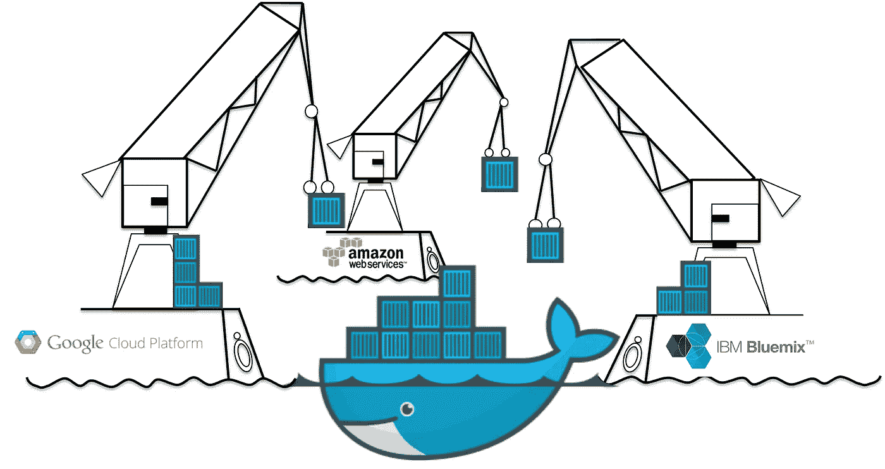
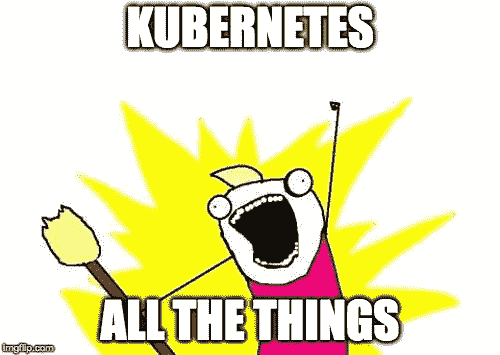
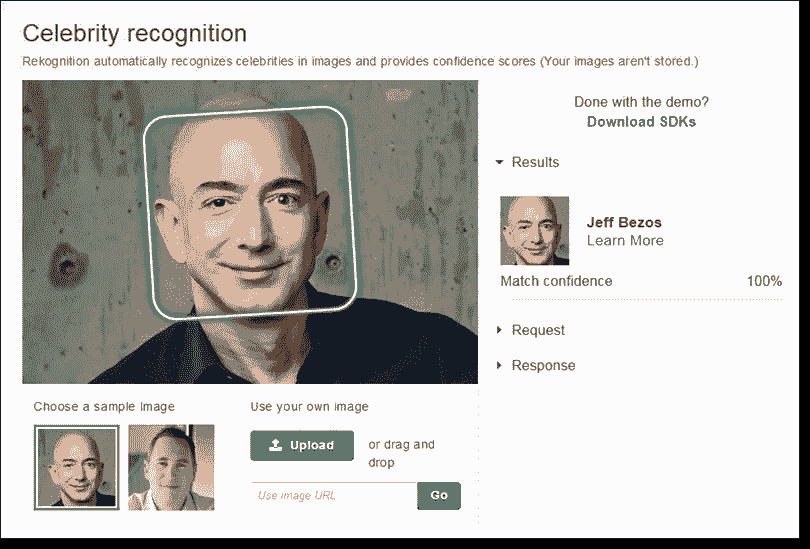

# 云不可知架构是一个神话

> 原文：<https://medium.com/hackernoon/cloud-agnostic-architecture-is-a-myth-53eac80be85d>

> 供应商锁定——通过使用特定于云提供商的服务，被锁定到特定的云提供商

在过去的两年里，我一直在研究云，有一件事非常确定——云不可知论者[架构](https://hackernoon.com/tagged/architecture)是一个[神话](https://hackernoon.com/tagged/myth)，至少在传统意义上是这样。

Overly-generic stock photo to represent vendor lock-in.

在本文中，我将讨论云服务的当前状态，以及真正的云不可知论者不仅是我们无法实现的事情，也是为什么它不一定是您想要实现的事情。

# 将你的申请归档

我们的第一个停靠港是码头。我是 Docker 等容器化技术的忠实拥护者，最近我发表了一些演讲，展示了这些技术如何极大地改善我们构建和部署软件的方式。

我想强调的 Docker 的一个关键优势是，它能够减少从一个云服务提供商迁移到另一个云服务提供商时的摩擦。你可以根据运行时间、环境变量和任何设置脚本来指定你的应用程序需要运行的一切，并且你几乎可以在任何地方启动所述容器。我说“几乎”是因为有一些非常小的例外，比如只适用于 Windows 的图像等等。

这实质上意味着我们需要运行的 Python 应用程序可以被容器化并放入任何托管的容器服务中，比如 ECS。底层的容器平台将管理容器的生命周期，并提供额外的好处，如我们希望的日志和监控。

底层的符合 OCI 标准的容器运行时将处理主机之间的任何差异，并以最少的麻烦运行您的应用程序。

> 当谈到试图避免供应商锁定时，集装箱化是一个难以置信的低挂水果。

# 地形的生长

Terraform 是最新的“闪亮的东西”，我在旅行中很高兴地玩了它，我非常喜欢 CLI 以及它如何让您将基础架构定义为代码。

您可以指定希望使用的提供者以及访问密钥和秘密密钥，当您运行`terraform apply`时，CLI 将自动启动适当的基础架构，供您部署在:

Terraform 101 — a basic script for spinning up a t2.micro

如果您随后需要拆除您的基础设施，您可以轻松地使用`terraform destroy`命令，这是一个听起来非常棒的命令。

> 如果你正在寻找一本关于 Terraform 的好的参考手册，那么我强烈推荐 Yevgeniy 的书:

 [## Terraform:启动并运行:将基础设施写成代码

### Terraform 已经成为 DevOps 世界中定义、启动和管理基础设施代码的关键角色…

amzn.to](https://amzn.to/2t7UW1P) 

现在，这对于在特定的云提供商上运行您的系统所需的基础设施来说非常好，但这意味着我们将不得不为每个不同的云提供商编写多个 Terraform 脚本。

这并非完全不可能，但是我们必须维护这些脚本，以便在需要故障转移到给定的提供者时，我们能够确保它们的正确性。还需要对底层平台有一定程度的了解，以便明确您正在构建的实例类型或这些实例需要的大小。

从应用程序开发人员的角度来看，您可能不一定必须或想要关心您是从什么 AMI 创建 t2.micro 实例的，您可能只关心开发您的应用程序并有一个稳定的地方来运行所述应用程序，以便它可以服务于您的付费客户。

## 服务之间的细微差别

我提到的一个潜在解决方案是在所有云服务提供商之上实现一个抽象层，本质上将应用程序的底层基础架构定义为一系列块。本质上是 Terraform 之上的一个扩展，它将有能力构建与云平台无关的基础设施。

这个 Terraform-esque 抽象层将负责与它选择的任何云平台进行接口，并旋转所述基础设施。这将让你定义一个简单的 web 应用程序，作为 1x“负载平衡器”和 2x“小型服务器”。

对于一些人来说，这似乎是显而易见的解决方案，但是当涉及到实现这个抽象层和处理不同服务公开方式之间的细微差别时，这变得几乎不可能。

试图在应用程序级别处理这一点几乎是不可能的，并且为了覆盖大量的服务，您的代码库将被数百个(如果不是数千个)条件标志弄得千疮百孔。我们能把它抽象成服务代理或 SDK 吗？也许吧，但这只是把我们最初的问题向左转移了。

# 库伯内特斯

因此，Kubernetes 是不可思议的，我在这里讨论了它对企业环境的一些潜在好处:

 [## Kubernetes 能彻底改变企业世界吗？

### 根据贝特里奇的标题定律，对上述标题的回答将是一个响亮的“不”。然而，在…

medium.com](/@elliot_f/can-kubernetes-revolutionize-the-enterprise-world-86f4ec147d1f) 

Kubernetes，结合 Docker 和 Terraform，实际上可能是试图成为不可知论者的一个很好的答案。许多不同的公司和个人也在探索这一点，我们开始看到管理解决方案的出现，如 Triton。

 [## 采用 Triton | Joyent 的多云 Kubernetes

### Triton Multi-Cloud Kubernetes 入门教程。你会明白 Triton Kubernetes-Rancher，和…

www.joyent.com](https://www.joyent.com/blog/triton-kubernetes-multicloud) 

这些联合 kube-clusters (klusters？)可以被视为一个庞大的计算单元，它可以运行和管理您希望运行的任何基于容器的应用程序。

这样做的最大好处是，应用程序开发人员只需要担心他们希望他们的应用程序看起来是什么样子，并抽象出底层的基础设施。

但这并不完美，这些服务仍然非常年轻，尚未成为主流。这些服务很可能还需要一段时间才能变得足够成熟，被更大的企业采用。

# 托管服务的价值

> 供应商锁定—利用云提供商的特定服务为客户提供价值的艺术

我见过人们在谈论供应商锁定时忽视的最大一件事是，利用这些托管服务为自己谋利有巨大的优势。

当考虑使用这些托管服务时，开发团队需要权衡这些服务提供了多少优势，并考虑将他们自己锁定在所述服务中会给他们带来多少劣势。

Building a service like this yourself would take years of work. With managed services, it can be done in a day!

如果来自 AWS、Azure 或 GCP 的服务 X 可以为你提供超越竞争对手的巨大优势，那么因为供应商锁定而避免使用这些服务肯定是没有意义的。如果有的话，通过积极利用这些服务，你可能会发现自己能够更快地迭代新的想法，并推动我们目前所能达到的极限。

如果我们考虑 AWS 的 RDS 之类的产品，如果我们试图在 EC2 实例上托管我们自己的数据库实例并自己管理它，我们最终将花费数百个小时来尝试达到开箱即用的 RDS 产品所提供的相同级别的弹性或性能。

本文对自托管与 RDS 进行了更详细的比较:

 [## MySQL 数据库迁移:EC2 托管与 Amazon RDS

### 数据库即服务(DBaaS)是一种云服务模式，它使用户能够使用数据库，而无需配置物理…

cloud.netapp.com](https://cloud.netapp.com/blog/migrating-mysql-database-ec2-hosted-amazon-rds) 

# 结论

虽然供应商锁定是您在设计和开发您的应用程序时应该考虑的事情，但是只要您完全理解它的限制，我会更加重视使用所述托管服务的优势。请注意，从长远来看，您严重依赖这些服务更有价值，如果您以适当的方式利用这些服务，会给您带来优势。

然而，就目前情况而言，完全不知道云提供商是不可能的。为了提供高于所述提供者的抽象级别，还需要做更多的工作，在这一点上，它只是一路向下的海龟。

希望你喜欢这些漫谈，如果你不同意任何东西或者想补充什么，请在下面的评论区告诉我！

如果你想支持我，请在 twitter 上关注我:@Elliot_f 或者订阅我的 YouTube 频道！

 [## 教学大纲

### 嗨伙计们！欢迎来到我的频道，TutorialEdge！这是我将张贴我所有视频教程的地方…

youtube.com](http://youtube.com/tutorialedge) 

名词（noun 的缩写）b——这篇文章是我的好朋友艾伦·里德(Alan Reid)的同行评审，所以如果你看到任何错误，请@他！