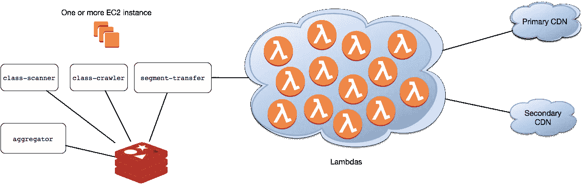
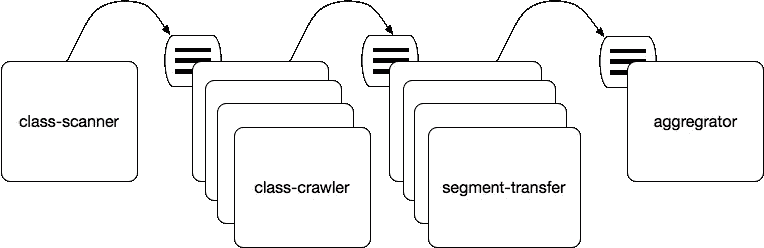
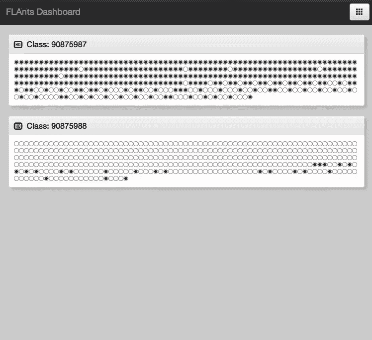

# 基于云的大规模文件传输

> 原文：<https://medium.com/hackernoon/cloud-based-file-transfer-at-scale-63d8e2dacb3a>

使用 NodeJS、Redis、Docker 和 AWS Lambda

最近，我有机会构建一个系统，将大量文件从一个云内容交付网络传输到另一个网络。这篇文章描述了关键组件和整体架构。

问题中的文件内容不亚于我们为 [FlyAnywhere](https://shop.flywheelsports.com/) 创建的整个视频库——我们在[飞轮体育](https://www.flywheelsports.com)创建的直播和视频点播健身服务。

在过去的一年里，我们积累了一个相当大的视频库。将该库从一个 CDN 复制到另一个 CDN 将是一个耗时的操作——但最终会完成——即使转移需要几天时间。然而，比一次性传输更重要的是，理想的解决方案需要在每个新录制的课程后持续传输内容。这就是传输时间等同于新鲜内容可用性的地方。

A Live broadcast at our FlyLive Studio in NYC

我希望我可以说转移操作仅仅是调用 SCP/SFTP 文件转移的问题。但是没有这样的运气。主 CDN 中的文件存储在一个[对象存储容器](https://en.wikipedia.org/wiki/Object_storage)(想想 S3)中，本质上没有对目录结构的直接访问——只有一个带有类似路径的文件名的平面桶。

此外，每个视频都存储为一个 [HLS](https://en.wikipedia.org/wiki/HTTP_Live_Streaming) 流——一种由多个清单文件和大量存储为文件的单独音频和视频片段组成的实时流格式。由于支持[自适应流](https://bitmovin.com/adaptive-streaming/)所需的多通道视频流的数量，一个典型的 30 分钟视频可能由数千个片段组成。

因此，手头的任务需要可靠地传输包含数百万个单独文件片段的整个视频集合。万亿字节的数据，本质上是一个高度可伸缩的文件同步操作。

自然，上面的“可靠传输”短语需要特别注意。由于网络连接中断或超时，文件传输失败。盲目抄袭是不行的。每个文件都需要被正确地跟踪和记录。

## 输入 Lambdas

需要复制的源文件已经在云中，目的地是供 CloudFront 使用的 [AWS](https://hackernoon.com/tagged/aws) S3。两者都是已经在云中的服务器的理想场景。我首先考虑的是使用 Docker Swarm 集群来管理一组微服务。这种方法将依赖多个容器副本来确保跨可用机器 CPU 核心的分布。然后我想，“*为什么不试试 lambdas？*“毕竟，文件传输任务在计算机科学中被称为令人尴尬的并行[问题——假设每个文件都可以单独传输。](https://en.wikipedia.org/wiki/Embarrassingly_parallel)

AWS [Lambda](https://aws.amazon.com/serverless/videos/video-lambda-intro/) 看起来是大规模执行转移的理想解决方案。Lambda 提供可扩展的计算资源，无需服务器配置和维护。进入所谓的无服务器革命。

此后不久，多巴胺急速袭来… *什么？* *我可以让数千台机器同时移动文件吗？帮我报名！*

## 介绍 FLAnts

使用 Lambdas，这个过程的行为就像一群蚂蚁将物品带回蚁群。鉴于这些文件来自我们的 Flywheel Live 制作工作室，我决定命名为 FLAnts (FlyLive Ants)。俗气——我知道！还好我不是做营销的…

FLAnts 由一个命令行工具和三个微服务组成。每一个都是使用[节点](https://hackernoon.com/tagged/nodejs)构建的。第五个模块是 lambda 代码——也是用 Javascript for NodeJS 编写的。微服务在 Docker 集群中运行。

让我们仔细看看底层的过程。首要任务是确定哪些内容需要拷贝。一个名为`class-scanner`的进程从我们的云 MongoDB 中提取类元数据，并对每个类执行基本验证。因为实际上并不是所有存储在数据库中的类都被广播。有些是测试班，有些是中止班——想象一个导演大喊*“停！”*。

对于每个经过验证的类，类扫描器将一个作业推送到 Redis 作业队列中。

第二个过程是`class-crawler`。这个过程得名于类似的[网络爬行](https://en.wikipedia.org/wiki/Web_crawler)，是互联网搜索引擎的基础。class-crawler 从 Redis 队列中弹出一个作业，执行读取每个类的 HLS 清单文件并对其进行爬行以收集各个 HLS 段文件名列表的任务。每个段的元数据用于填充另一个作业队列，该队列标识需要复制的每个文件。每个产生的作业都可以分配给成千上万个 Lambda 实例中的一个。同样值得注意的是，类爬行器不一定是一个单独的进程。在一个大规模多核机器上，我们每个 CPU 内核都有一个。并且每个都自动从作业队列中提取。亚马逊拥有跑车级的 72 核和 128 核机器。这是一个科技的大好时机！

第三个进程称为`segment-transfer`，从 Redis 队列中弹出传输作业，并将它们分派给 lambda 实例。数据段传输过程的作用是充当某种指挥者或交通警察。也像类爬虫一样，段传输过程可以作为所有可用 CPU 核心的多个过程运行——跨多台机器。

我们的第四个也是最后一个过程叫做`aggregator`。它的作用是处理已完成的作业，并根据它们各自的类别将它们组装起来。当一个类的所有段都被处理后，传输操作被认为是成功的。

上图显示了四种进程类型，它们既可以在大型多核机器上运行，也可以跨多个 EC2 实例运行。每个都连接到一个 Redis 实例进行作业排队。`segment-transfer`流程显示为调度 lambdas，后者依次将数据从一个 CDN 复制到另一个 CDN。

采用这种总体方法的原因是，四种流程类型中的任何一种都可能失败并需要重启。在开发阶段尤其如此，这也是*设计软件时考虑到失败的一个很好的例子*。在构建分布式系统时，这是至关重要的。

## 消息队列 FTW

如上所述，所有四个进程都有一个非常重要的共同特征:每个进程都广泛依赖于消息队列。类扫描器将消息排队，类爬行器和段传输将消息出队和排队。并且聚合器使消息出队并生成传输报告。

使用消息队列的一个重要原因是控制进程之间的工作流。每个进程都非常快，最大限度地使用 CPU 并耗尽内存和套接字句柄的情况并不少见。更好的方法是对消息进行排队，让进程尽可能快地消费它们——但不是更快！

另一个显著的好处是，排队允许特定任务的多个实例参与消息处理。

此外，队列和多个流程实例的使用允许基于 NodeJS 的应用程序充分利用多核机器。

队列还有助于分离应用程序。在上图中，每种服务类型都可以在同一台或多台联网的机器上拥有实例；只要排队服务是可访问的。

我选择使用 NodeJS 和 [Hydra](https://www.npmjs.com/package/hydra) 来实现我的流程。Hydra 有内置的消息队列，它位于 Redis 之上。所以实现上面的排队再简单不过了。这里有一个片段转移过程的例子。

我只需要指定哪个服务接收作业(使用`to`字段)并包含一个包含实际作业细节的`bdy` (body)对象。

聚合器服务只需要在准备就绪时将消息出队:

`let message = await this.hydra.getQueuedMessage('aggregator-svcs');`

聚合器负责将包含每个 lambda 实例的文件传输结果的作业消息出队。

我使用了 Hydra 内置的排队特性，但是您不需要使用 Hydra 来做类似的事情。参见此[示例要点](https://gist.github.com/cjus/719d77dd9816115d94083234c293c18b)显示相关 Redis 命令。

## 定量

段传输服务从队列中读取传输作业，并将它们分派给 lambda 实例。另外，请记住，有多个段传输实例(副本)正在运行。

每个段转移服务读取 100 个作业，并将它们组织成一个批处理，而不是尝试大规模的 lambda 启动。这导致在具有八个段传输实例的八核机器上有 800 次 lambda 调用。考虑到默认情况下最多有 1000 个并发 lambda 调用，这样做很好。实际上，由于分批处理作业和启动 lambda 实例的开销，我还没有见过超过 500 个并发调用。在每个内核上运行两倍数量的段传输副本将会改变这种情况。

## 错误处理

有时候，lambda 实例会无法执行传输——我知道这很令人震惊！发生这种情况时，问题可能是由于网络套接字中断或超时造成的。但是，这不是问题，因为整个系统依赖于消息队列，所以只需要对失败的作业重新排队。

每个作业消息包含一个从 3 开始的重试字段。每一次失败的尝试都将计数减一，如果计数达到零，则该作业被标记为完全失败。这从未发生过。我见过最多的是一次重试就成功了。

这一切都非常好。但是，对消息进行重新排队会导致它们被推到作业队列的末尾。因此，最终在运行时发生的情况是，作业直到流程的后期才完成。当我向聚合服务添加一个基于 web 的可视化工具时，我注意到了这种行为。

经典的解决方案是使用基于优先级的队列。优先级队列允许我将优先级更高的作业重新排队，以确保这些作业不必移动到队列的末尾。Redis 使用 zpop 操作来支持这个[,这是我稍后可能会再讨论的内容。另一个潜在的解决方案是为失败的操作维护一个单独的作业队列，并在从主作业队列中拉出之前从该队列中拉出。这是代码复杂度的权衡。](http://charlesnagy.info/it/python/priority-queue-in-redis-aka-zpop)

相反，我只是维护了一个进程内重新排队列表，并将这些作业推到下一个批处理操作中。

## 可视化文件传输

为了更好地了解整个系统的实际行为，我决定构建一个基于 web 的可视化工具。当这些虚拟蚂蚁(我指的是 lambdas)传输文件段时，渲染它们的想法肯定需要进行侧面攻击。

我向聚合器服务添加了一个仪表板端点来提供 ReactJS 单页面应用程序。

一个挑战是，仪表板最终可能会显示数百个视频类的状态。渲染这么多数据会太慢——即使使用虚拟 DOM。

我很快意识到每个文件段不应该是一个 div，而是一个单一的 unicode 文本字符。

前端和后端使用的另一个重要优化是使用[位域](https://en.wikipedia.org/wiki/Bit_field)。由于一个类可以有 5000 个段，所以我简单地创建了一个 5000 位的字段字符串，并通过从后端以十六进制字符串格式发送数据来进一步减小所需的大小。前端将十六进制字符串转换为二进制字符串，然后迭代该字符串以将 0 呈现为◯，将 1 呈现为◉.

此外，一旦一个类视频被完全传输，段状态显示被关闭，以进一步减少页面渲染的影响。NPM [bitset](https://www.npmjs.com/package/bitset) 包在这方面很有帮助！

## 传输速度

使用这种方法传输文件的速度绝对惊人。在我早期的一次测试中，系统在两小时二十分钟内传输了 4tb 的数据——也就是大约每秒 523MB。

这还远没有达到最大潜能。使用更大的多核或多核机器集群以及更高的 lambda 调用并发限制将会产生更高的传输速度。当然这是有成本的，所以不要在家里尝试。

这篇文章描述了一种方法，但这种方法超出了我们最初的预期。诚然，手头的任务几乎是为 lambda 量身定制的——但也展示了微服务和无服务器技术如何结合使用。没有理由你不能两者兼得！

—

*感谢阅读！如果你喜欢你所读的，按住下面的拍手按钮，让其他人也能看到。也可以* [*在 Twitter 上关注我*](https://twitter.com/cjus) *。*