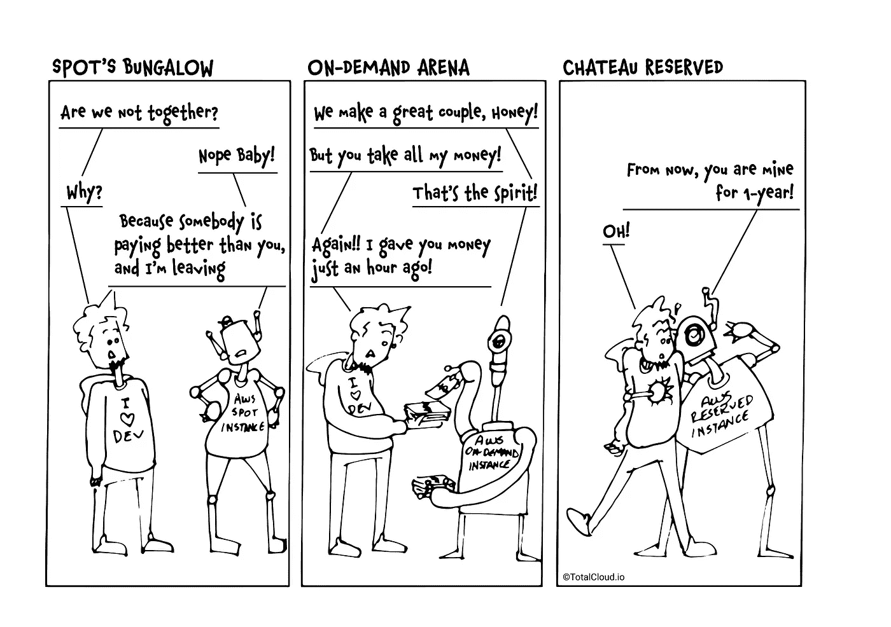

# 现场与按需与保留实例

> 原文：<https://medium.com/hackernoon/cloud-comics-spot-vs-on-demand-vs-reserved-instances-2e7d6716891a>

哪一个适合您—现场、按需或保留实例？您更喜欢哪种 EC2 实例类型？😉

在推特上发表您的想法，或者为我们喊出@TotalCloudio

*原载于 2018 年 3 月 6 日*[*blog . total cloud . io*](https://blog.totalcloud.io/cloud-comics-spot-demand-reserved-instances/)*。*