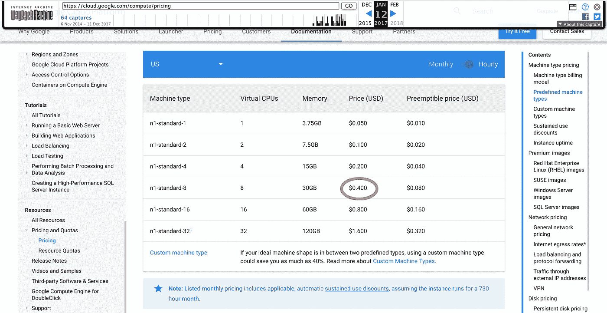
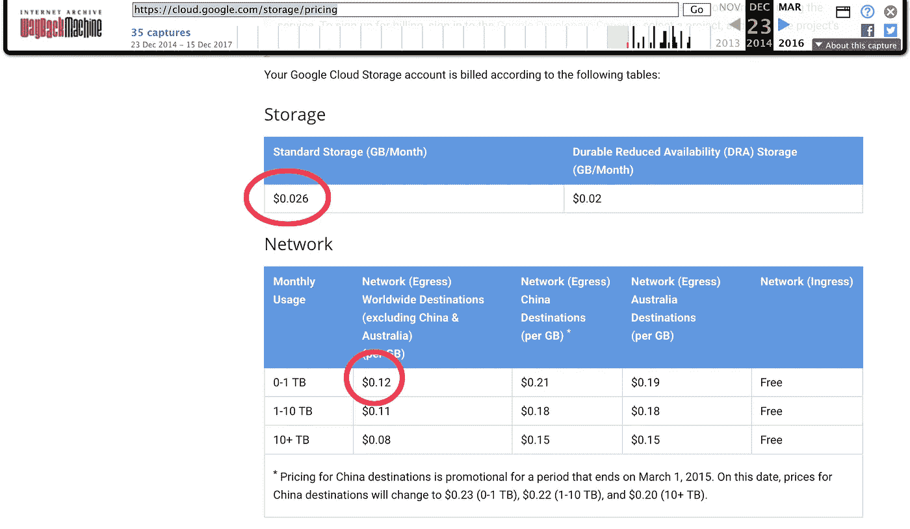

# 云成本实际上并没有大幅下降

> 原文：<https://medium.com/hackernoon/cloud-costs-arent-actually-dropping-dramatically-cd94051b021c>

我注意到硅谷有很多关于云成本“大幅下降”的传言。企业家、风投和媒体写下了这一趋势，声称这使得人工智能和大规模数据处理等领域出现了新一波创业浪潮。许多社论声称，新技术和日益激烈的竞争在过去几年中大幅降低了云成本，催生了新的有价值的公司。

一个[的例子](/@NathanBenaich/investing-in-artificial-intelligence-a-vc-perspective-afaf6adc82ea)来自 [Nathan Benaich](http://nathanbenaich.github.io/) ，点九资本的副总裁:

> 我相信人工智能是我们这个时代最激动人心和最具变革性的机会之一。原因有几个…计算和存储的成本都**大幅下降**，而今天处理器的计算能力却在增长。

Spark Capital 的投资者 John Melas-Kyriazi[附和了这种观点](https://techcrunch.com/2016/07/18/how-startups-can-compete-with-enterprises-in-artificial-intelligence-and-machine-learning/):

> 机器学习(ML)和人工智能(AI)的狭义形式已经正式成为主流。我们在人工智能/人工智能领域看到的创新爆炸源于过去几十年的一系列快速技术进步:更快/更便宜的计算机(根据摩尔定律)，可变成本云计算…

许多人认为摩尔定律是云定价“数量级”提高的原因。其他人甚至创造了他们自己的定理；例如，[贝佐定律](https://gigaom.com/2014/04/19/moores-law-gives-way-to-bezoss-law/)，其中[格雷戈·欧康诺](https://twitter.com/gregoryjoconnor)([AppZero](https://www.appzero.com/)的首席执行官)提出的观点是“在云的历史上，一个单位的计算能力价格大约每三年降低 50%。”

显然，许多聪明人都看好云成本的快速下降以及随后能够驾驭这一浪潮的创新型创业公司的崛起。

# 但是云价格真的在下降吗？

作为一家依赖云存储和处理的初创公司的创始人，我自己也经常这样说。但在经历了一个月昂贵的云成本后，我想通过查看历史成本来验证这一趋势。

由于云产品种类繁多，因此可以有许多不同的方式来衡量成本。然而，对于任何初创公司来说，有两个主要方面很重要:**计算**和**存储**。我进入[互联网档案馆](https://archive.org/)查看这些云服务的价格是否真的“大幅”下降，发现趋势并不像许多人声称的那样明显。

# 2014–2018 年的价格趋势

我研究了谷歌云平台上计算引擎(谷歌的虚拟机，AWS EC2 实例的竞争对手)和云存储(类似于 AWS S3)的定价。我用[互联网档案](https://archive.org/web/)对比了 2014 年的定价。

## 计算

截至 2018 年 1 月 3 日，以下是 GCP 计算引擎的[价格](https://cloud.google.com/compute/pricing):

为了便于比较，我将重点放在了 *n1-standard-8* 上，这是一款标准产品，价格为每小时**0.38 美元**。请注意，从今年开始，这些价格取决于服务器所在的地区——这张截图是默认地区(爱荷华州),通常比其他选项便宜。

我将这些价格与过去两年的价格进行了比较。**2017 年 1 月 12 日**:

以及**2016 年 1 月 23 日**:

同样的 *n1-standard-8* 两年前的定价是**0.40 美元**每小时。这两年 5%的价格下降幅度几乎没有提高一个数量级。如今北弗吉尼亚的虚拟机价格实际上更贵*(0.425 美元)。*

*在 2015 年 3 月，同样的虚拟机成本**:0.504 美元**:*

**

*同样的价格来自 2014 年 11 月，这是我在互联网档案中能找到的最早的快照:*

**

*因此，谷歌计算引擎价格在 2014 年至 2016 年间下降了 20%，在 2016 年至 2018 年间下降了 5%。对于某些地区，谷歌计算引擎的成本在过去两年里根本没有下降。一滴是存在的，但似乎离“戏剧性”还很远。*

# *储存；储备*

*如果计算能力没有下降一个数量级，那么可能有些兴奋来自于存储价格的下降。存储(和相关数据传输)成本的大幅下降将使较小的公司能够对大型数据集进行分析，并将更多数据转移到云中。*

*云存储的成本有两个主要来源:每 GB 存储量，或文件占用的空间，以及网络传输，或本质上是下载文件的成本。像计算能力一样，有一些细微差别会导致价格变化，比如存储文件的物理位置。然而，如果我们看看今天谷歌云存储的标准定价，我们会发现存储的价格大约在每 GB 0.026 美元左右:*

**

*高达 1 TB 的网络传输速率徘徊在每 GB 0.12 美元(T2)左右(T3):*

**

*使用互联网档案，我们可以将今天的价格与 2014 年 12 月的价格进行比较(可获得的最早的快照，来自 3 年前)。*

**

*令人惊讶的是，谷歌云存储的主要成本自互联网档案中最早的快照(3 年前)以来没有任何变化。如果你的创业公司一直指望降低云成本，那么你在过去 3 年里运气不佳。*

# *AWS 呢，或者其他云提供商呢？*

*出于一致性的考虑，我选择在这篇文章中对 Google Cloud 进行分析，因为定价页面更加清晰。AWS 的定价页面更加细致入微，没有清晰地显示价格。但是如果我们浏览 [AWS 新闻博客](https://aws.amazon.com/search?facet_type=blogs&sortResults=modification_date+desc&q=price+reduction)中关于 AWS 实例降价的文章，我们会注意到上一次美国降价是在 2016 年 11 月，这意味着 AWS 在 2017 年根本没有对美国的云服务降价。并且在 2016 年 11 月的降价中，只有北弗吉尼亚机器受到影响。即使在那个特定的地区，降价也与我们在谷歌云上看到的一致——大约 5%。几乎没有许多人期待的数量级下降。*

*对其他顶级云提供商的全面分析超出了本文的范围，但是对美国顶级云提供商的粗略观察显示了类似的趋势(或者缺乏这种趋势)。例如，如果我们查看另一家领先的云提供商 Digital Ocean 的[当前定价计划](https://www.digitalocean.com/pricing/)，我们可以看到他们的 2G 内存、2 个内核、40BG 固态硬盘和 3TB 传输成本的标准计划**为每月 20 美元**。*

**

*现在我们可以将其与四年前的**2014 年 1 月的价格进行比较。***

**

*你可以看到每月支付 20 美元(红色)将会购买与今天完全相同的**云设置。对于数字海洋来说，*云成本在过去四年里根本没有下降*。许多领先的云提供商展示了同样的粘性价格。***

# *含义*

*人工智能的兴起无疑是一个重要趋势，但数据并不支持新公司将因云成本下降而出现的观点。*

*我们已经可以看到押注这一趋势的初创公司陷入困境的证据。上个月，流行的视频分享平台 [Vidme 关闭了](/vidme/goodbye-for-now-120b40becafa)，理由是无法建立一个可持续的业务。*

> *存储和交付视频变得越来越便宜，但仍然非常昂贵…当我们在 2014 年推出时，我们预测基础设施成本将会下降，因为 CDN 和数据存储行业的竞争加剧。虽然边际价格在过去几年中大幅下降，但我们的总成本仍然超过了我们产生有意义收入的能力。*

*云成本可能下降了一点，但还远远不足以让新一波有意义的创业公司押注这一趋势。*

*我们的产品， [Kapwing](https://www.kapwing.com/) ，是一款[在线视频编辑器](https://www.kapwing.com/)。当我们开始时，我们还打赌存储价格会下跌。但是，我们很快意识到，如果我们不控制我们的云成本，我们将很快花费大量资金。即使每天只上传和下载大约 500 个短视频，我们一天的网络传输费用也要花费 50 多美元。有时我们的 S3 钞票会超过 100 美元。12 月份，我们的 AWS 账单超过了 600 美元。对于一家大公司来说，这可能看起来不是很多钱，但对于一家初创企业来说，这是一大笔钱。*

**

*花费了相当大的工程努力来控制这一花费。我们不再允许文件热链接，我们删除了一段时间后的上传，我们在如何上传和下载视频方面变得更加智能。*

*当我们刚开始的时候，我们认为云成本非常低，在我们达到相当大的规模之前，我们不必担心这些成本。相反，它们成了我们从第一天开始就需要担心的事情。*

*承诺的云成本大幅下降还没有到来，而且似乎也不会到来。人工智能初创公司肯定仍会崛起，但它们的成功不会因为成本下降而得到推动。相反，他们的成功将以风投的雄厚资金或与大公司的合作伙伴关系的形式出现，以获得必要的基础设施来创造有意义的技术。这种必要性意味着下一波创业浪潮可能根本不是人工智能公司，而是从一开始就建立在坚实财务基础上的企业。*

**本文原载于* [*Kapwing 博客*](https://www.kapwing.com/blog/cloud-costs-arent-actually-dropping-dramatically/) *。**