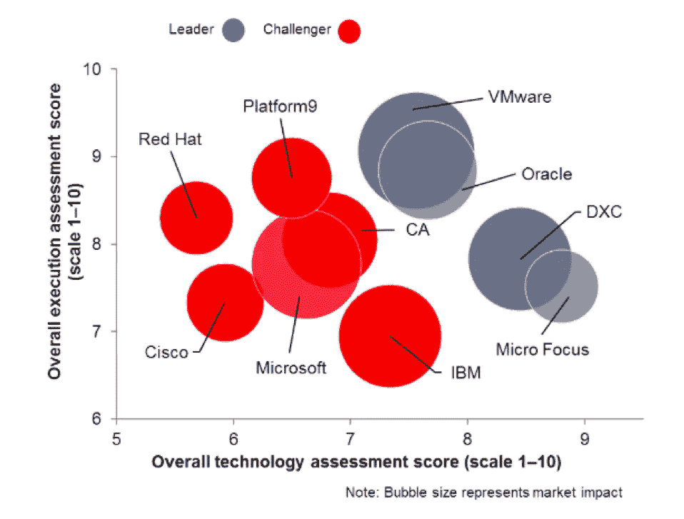

# 云计算管理:好的、坏的和丑陋的——第 1 部分

> 原文：<https://medium.com/hackernoon/cloud-management-the-good-the-bad-and-the-ugly-part-1-4ac574d03950>

在 [Platform9](https://platform9.com/blog/cloud-management-the-good-the-bad-and-the-ugly-part-1/) ，我们每天都与一些领先的企业合作，这些企业来自各行各业，从金融服务、互联网、零售、嵌入式等等。我们经常被问到的一个关键问题是，企业如何过渡到云原生(CN)或数字原生(DN)业务。成为真正的软件驱动的数字化原生组织需要企业发展文化实践和技术能力，以支持三个主要目标:

1.  企业 IT 需要与业务线和负责软件和数字创新的软件交付功能保持一致并对其做出响应。
2.  IT 需要带头培养和推动持续业务创新的文化。
3.  不可避免的 IT 转型需要伴随着 IT 支出的减少。云现代化不能成为一个注定失败的大规模业务转型项目，这会给公司带来不必要的压力，无论是从成本角度，还是从流程和工具角度。

云管理是组织为了简化运营、提高 IT 效率和降低数据中心成本而关注的一个重要方面。

鉴于数字中断给 IT 运营带来的压力，我们经常看到投资了云管理平台(CMP)功能的大型复杂企业难以确定跨业务线或共享服务的最高优先级领域，并且无法真正实现 CMP 跨各种公司计划优化其 IT 流程的承诺。CMP 实施经常成为另一个“莫比迪克”式的无休止的追逐，消耗时间和资源，并在整个组织中造成挫败感，通常没有太多的表现。

在本文中，我想分享我们的观点和对云管理功能基础的一些见解，大型企业需要这些功能来支持其组织的数字化转型，包括传统基础架构以及新的现代应用程序和技术。

# 适用于多云和混合云管理解决方案的 Ovum 决策矩阵

Ovum Research 最近发布了一份[决策矩阵](https://ovum.informa.com/resources/product-content/int003-000062)报告，比较了领先的多云和混合云管理解决方案。该报告概述了管理在多云和混合云环境中的重要性，以及它对技术部署、使用和控制方式的影响。令人振奋的是，不仅 Platform9 与 VMware、Oracle、Red Hat 和 IBM 等重量级公司一起受到了关注，而且我们在挑战者类别中的执行力排名也是最高的，我们在 10 个类别中获得了最高的 10 分，在 20 分中获得了 4 分。

我们感谢 Ovum 对我们执行能力的积极分析，并希望借此机会讨论我们认为的一些关键挑战和围绕云管理的最佳实践。正如您将看到的，我们相信成为该领域的“挑战者”是令人敬畏的——因为混合云和 CPM 近年来名声不佳——这是有充分理由的。Platform9 就是要改变这种情况，并向人们展示有一种方法可以让它变得正确！

# 传统的整体式 IT 是一种数字障碍

在大多数组织中，确定各种业务线项目所需的正确的 IT 能力集的过程如下所示:

1.  业务线领导与产品管理团队就 IT 需求进行合作，以满足新项目的需求——要么支持新的业务计划，要么改进现有产品
2.  IT 团队遵循结构化的流程来确定创建解决方案所需的适当(孤立)技术元素
3.  开发团队遵循敏捷和瀑布开发过程的混合来建立解决方案，然后由运营团队部署和管理该解决方案
4.  来自最终用户的反馈和来自业务所有者的持续更新请求执行缓慢，并反映在产品中，导致客户不满，并可能损失收入或留住用户。

鉴于这一现实，遗留系统和架构如何重新发明自己以成为云原生的？这些如何以更快的速度更新，以使业务受益，并具有更好的质量和可靠性？更重要的是，从云管理的角度来看，这意味着什么？

# 当今企业 IT 的现状

我们接触的几乎每个客户都有复杂多样的基础架构，为企业 IT 必须支持的复杂多样的应用程序组合服务。企业 IT 必须努力支持许多不同类型的应用程序(传统应用程序、大型机、整体式应用程序、云原生应用程序、微服务、无服务器应用程序等)，每种应用程序都需要自己的技术堆栈和基础架构类型，并且以完全不同的方式进行操作和维护。

即使是中等规模的客户通常也在 VMware 上有大量投资，他们可能正在探索 OpenStack、Containers 甚至无服务器的投资。除了内部数据中心之外，大多数公司还使用公共云来处理一些工作负载。因此，客户需要我们帮助解决的关键挑战之一是云管理:私有云和公共云。

# 现有 CMP 解决方案面临的挑战:

我们认为现有 CMP 面临的一些主要挑战是:

1.  高成本— CMP 技术通常是专有的，并收取高额许可费。CMP 的大多数分支都是作为点产品实施的，这需要在专业服务和定制集成方面进行大量和长期的投资，以便有效地实施。这通常打破了云的主要优势之一，即降低成本和加快价值实现，使资源调配和持续管理更加顺畅。
2.  不必要的复杂性——CMP 产品已经发展到提供大量功能，但最终却成为货架产品。从安装、配置、许可和第二天操作的角度来看，这些产品设计过度，过于复杂。
3.  缺乏开发人员的参与——开发人员引领云的采用，因为这是一种更快的构建和发布产品的方式；尤其是与传统 IT 虚拟化场相比。由于对企业 IT 的供应流程和响应能力不满意，开发人员通常会自行转向公共云(“影子 IT”，有人知道吗？)只是为了加快他们的工作，使他们自己能够更快地前进。CMP 产品在迎合作为促进数字化转型的关键受众的开发人员方面表现不佳。这主要是围绕:

*   通用 CMP 的用户界面通常让开发者感到厌烦。开发人员发现，他们通常需要提交“服务请求”单，然后在等待 IT 完成请求时无所事事，而不是通过自动化友好的 API 获得自助式按需体验。
*   治理控制通常没有得到很好的实施，并让开发人员感到沮丧(例如，通过强制实施票证而不是配额来限制容量使用)
*   开发人员正在采用 IaaS 和 PaaS 解决方案，以便更轻松地构建和交付他们的应用程序。CMP 使得 IaaS 和 PaaS 变得多余，然而开发人员认为它们对他们的工作至关重要。

4.缺乏对云原生工作负载和公共云的管理—大多数专有 CMP 主要是为管理 VMware 等虚拟化提供商而定制的。商业 CMP 中需要解决的一个关键挑战是包含对云原生工作负载和公共云管理功能的支持。

在本系列的下一篇文章中，我将从 CMP 的角度分享 Platform9 支持的愿景和关键管理功能，以及这些如何让我们在 Ovum 最近的多云/混合云管理决策矩阵分析中获得赞誉。

[继续阅读本系列的第 2 部分。](https://platform9.com/blog/cloud-management-the-good-the-bad-and-the-ugly-part-2-5-key-capabilities-for-cmps/)