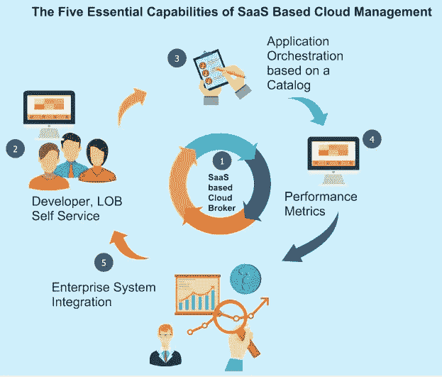

# 云管理:好的、坏的和丑陋的——第 2 部分:CMPs 的 5 个关键功能

> 原文：<https://medium.com/hackernoon/cloud-management-the-good-the-bad-and-the-ugly-part-2-5-key-capabilities-for-cmps-9958c8d42d17>

见本系列第 1 部分[此处](https://platform9.com/blog/cloud-management-the-good-the-bad-and-the-ugly-part-1/)。

[Ovum Decision Matrix](https://ovum.informa.com/resources/product-content/int003-000062) 研究报告讨论了云采用中两大转变的影响:

1.  影子 IT 对企业的影响越来越大。
2.  将工作负载迁移到云的需求。

我们还看到了第三个明显的转变:需要为新的业务领域开发云原生应用程序:诞生在云中并使用全云资源的应用程序。

这些趋势产生了跨混合基础架构提高环境可见性和控制力的需求。正如 Ovum 报告所指出的，这种情况的双重性在于，云原生工作负载需要以类似于私有云上的虚拟机的方式进行管理。

这一关键要求产生了对正在使用的所有环境(无论是私有环境还是公共环境，无论是运行虚拟机、容器、无服务器的基础架构，还是传统的裸机应用程序)进行更好的可见性和控制的需求。

多云和混合云管理市场仍在发展，许多供应商来自虚拟化管理领域。虽然这似乎是一个合理的演变，但挑战在于新的云原生工作负载(那些已经在云中的工作负载)看起来不像虚拟机，或者以与虚拟机相同的方式运行。这两个范例之间的区别需要从开发人员和基础设施团队中抽象出来。成熟的供应商正在努力平衡这个新世界与以虚拟机为中心的基础架构。

那么，这些年来，在与客户合作帮助他们有效管理复杂的混合环境方面，我们学到了哪些重要经验呢？

# 五个关键的云管理平台(CMP)功能

至少，混合 CMP 解决方案需要具备的五项关键能力包括:

1.  真正的混合云代理以 SaaS 的形式交付:使用通用 API 连接到任何底层平台(虚拟机、容器、私有云和公共云)并提取连接的能力。开发人员和基础设施团队都通过一个开放的 API 编写和编排应用程序。因此，即使底层云发生变化，应用程序也不需要改变。支持关键功能(如配置、配置管理和性能分析)的后端流程也是如此。传统 CMP 平台与这一领域的网络发展之间的主要区别在于，下一代 CMP 将提供这种托管服务。
2.  通过 SaaS 无缝开发人员自助服务:这意味着能够提供自助服务门户和 API，使开发人员能够使用云代理为他们的应用程序提供基础设施。同样，这种集成的管理应该作为服务自动交付给 IT 运营部门，而不需要他们进行任何额外的管理开销或定制开发来支持这种大规模的管理。
3.  应用程序目录:调配虚拟机的能力已存在多年。下一代 CMP 需要为用户提供从应用程序目录或映像模板调配完整应用程序堆栈的能力。基于业务和安全策略指定和自动化新实例的放置和供应的能力是必须提供的关键能力。
4.  性能指标:能够提供全球云区域(跨服务器、网络和存储)的可见性和详细指标，以及跨单个虚拟机和容器的使用和性能的粒度指标。这些指标的一个关键用途应该是在本地和公共云资源上提高数据中心的效率和利用率(这显然转化为成本)。
5.  企业集成:利用现有的 ITSM (IT 服务管理)工具、系统管理平台、服务目录和配置管理软件，支持基于 API 的无缝开放集成点。

我们很高兴 Ovum 将我们列为执行 10/10。在本系列的下一篇也是最后一篇文章中，我们将讨论 Platform9 的 CMP 技术，以及我们已经采用并在与全球越来越多的客户合作时不断改进的一些关键设计原则。

继续阅读本系列的第 3 部分。

在[9](https://platform9.com/blog/cloud-management-the-good-the-bad-and-the-ugly-part-2-5-key-capabilities-for-cmps/)平台阅读原文。