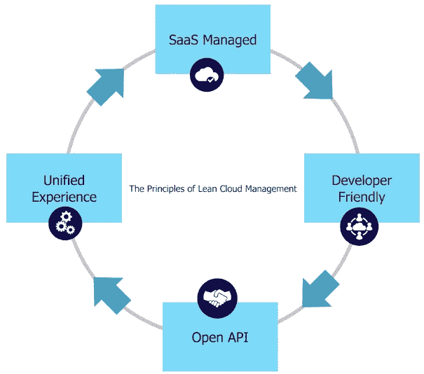

# 云管理:好的、坏的和丑陋的——第 3 部分:正确使用 CMPs！

> 原文：<https://medium.com/hackernoon/cloud-management-the-good-the-bad-and-the-ugly-part-3-getting-cmps-right-7f954abe61c0>

参见本系列[第一部分](https://platform9.com/blog/cloud-management-the-good-the-bad-and-the-ugly-part-1/)和[第二部分](https://platform9.com/blog/cloud-management-the-good-the-bad-and-the-ugly-part-2-5-key-capabilities-for-cmps/)。

云计算管理是首席技术官和首席信息官在未来几年需要投资的关键领域之一。在本系列的前两篇文章中，我们讨论了现有云管理平台的[挑战](https://platform9.com/blog/cloud-management-the-good-the-bad-and-the-ugly-part-1/)和 CMPs 的 [5 关键功能](https://platform9.com/blog/cloud-management-the-good-the-bad-and-the-ugly-part-2-5-key-capabilities-for-cmps/)。在这最后一部分，我想讨论一下 [Platform9](https://platform9.com/blog/cloud-management-the-good-the-bad-and-the-ugly-part-3-getting-cmps-right/) 在这一领域设计我们的行业领先产品时所遵循的四个关键原则，以及我们为什么要提供传统 CMP 的替代方案，不幸的是，传统 CMP 给混合云带来了不好的名声。

# 设计原则#1:云管理应该简单而优雅

我们牢记的首要原则是简化复杂的混合云管理和运营任务，并加快实现价值。这可以分为四个不同的领域:

1.  我们知道云不应该变成企业的另一个“ERP”项目。这种方法使得数字化转型计划[如此频繁地失败](https://platform9.com/blog/what-we-can-learn-from-ge-and-why-digital-transformations-fail/)。在 Platform9，我们的目标是简化云管理，即使是在最复杂的混合环境中。正如 [Ovum 针对多云和混合云的决策矩阵报告](https://ovum.informa.com/resources/product-content/int003-000062)所指出的，云是一个旅程，大多数刚起步的企业都有很多虚拟化，他们正在慢慢迁移到公共云，同时在 OpenStack 上实施开源虚拟化 KVM。无论您选择什么样的基础设施，CMP 都应该易于设置(一天之内),并且只需按一下按钮，就可以帮助您的开发人员和 IT 运营人员将应用程序部署到底层云中，所有这一切都在初始安装后的几个小时内完成。
2.  我们回避不必要的复杂性——它不会给我们的用户增加任何价值，只会延长实施和学习曲线，减缓采用速度，并在您看到结果之前增加您的投资。许多 CMP 捆绑了自动化、计费等功能。客户已经投资了多种成熟的自动化工具和成本优化工具。通过简化云管理的核心基本组件，我们将企业从支付数百万美元的模式转变为建立和维护支持第 2 天运营的云。这意味着客户可以更快地看到即时和长期的业务价值，并且不需要淘汰和替换他们需要支持的核心竞争力外围的附加服务。
3.  为了实现数字化转型，IT 团队正朝着在组织中实现开发运维实践的方向努力。为此，CMP 平台应支持传统应用和流程，同时使组织能够轻松试验和采用新技术，并利用现代架构和交付模式(用 Gartner 的话说，支持[双模 IT](https://www.gartner.com/it-glossary/bimodal/) )。)这一点至关重要，这样(传统)CMP 才不会让组织陷入“中世纪”的 IT，而是让他们能够开发和现代化他们的应用程序和基础架构。这些平台不仅需要支持现有的应用和堆栈，还需要让组织能够开始将整体应用分解为微服务，利用容器、无服务器应用等。
4.  没有哪个组织在所有内部 IT 中都实现了完美的云优化，也不是所有应用都支持云。虽然绿地应用程序将使用 Kubernetes、无服务器和容器，但在一段时间内，您的部分业务仍将在虚拟机甚至裸机上运行。传统应用可能需要重构，但不需要重新搭建平台。CMP 应该支持所有这些类型的应用程序的统一体验:虚拟机、容器、无服务器，以及接下来出现的任何新模式或技术。

# 设计原则#2:云管理应该作为 SaaS 交付

运行 CMP 最困难的是设置、安装、配置和第二天的操作。我们看到企业需要几个月(有时几年！)的全天候专业服务和咨询，以便让 CMP 在即使是相对较小的数据中心和云提供商群中运行。

公共云已经为易用性树立了标杆:

*   开发人员习惯于使用公共云，开始使用需要 5-10 分钟。任何不同都是不可接受和过时的
*   云管理应该“正常工作”——客户只需 5-30 分钟就能启动并运行，而不是几个月甚至几年
*   CMP 应该是完全集成的(包括电池)，可以与任何环境或技术堆栈互操作，并且可以轻松扩展到其他服务、集成、点工具和 API。
*   应使用基于 SaaS 的交付模型来安装、管理和监控 CMP 和基础架构。不再需要手动工作、操作方面的繁重工作或繁重的管理开销。

最后，从商业模式的角度来看，供应商不应该有利益冲突，例如销售大规模的专业服务来支持他们的平台。如果你需要先进的专业知识和长达一年的过程来实施某事，那么它不是 SaaS，它肯定不简单。

# 设计原则#3:构建在开源框架之上

如今，开源(OSS)框架提供了对任何现代开发、IT 运营或开发运维流程都至关重要的核心功能。各种各样的开发人员社区为各种 OSS 项目做出了贡献，不断增强我们使用的工具的附加功能以及新的管理能力，创造了源源不断的创新，使我们——作为一个行业——能够将我们的软件交付提升到一个新的水平。

以 OSS 为基本原则，确保您的解决方案能够:

1.  随着该领域的不断发展，融入最新、最伟大的创新，并从充满活力的开源社区中受益
2.  为未来的新技术做好准备
3.  允许您避免锁定，并可跨任何环境或提供商进行移植和互操作
4.  易于扩展，能够灵活支持新的集成、服务和特定用例
5.  与专有解决方案的高额许可费相比，从开源经济和节约中获益。

根据我们上面的两条指导设计原则，Platform9 构建在开源云标准之上，即作为 SaaS 托管服务交付的 [Kubernetes](https://platform9.com/managed-kubernetes/) 和 [OpenStack](https://platform9.com/managed-openstack/) 。这种关键的耦合使您能够避免锁定并从 OSS 成本节约中受益，而没有负担和管理开销来保持这些在您的多样化基础架构上运行。

此外，为了确保我们为 IT 运营保持简单，我们提供了现成的插件来轻松集成所有公共云供应商和本地技术，如 AWS、Google Cloud、Azure、KVM、VMware 等。这使您可以立即投入运行，无需冗长的定制开发或专业服务来插入到您的各种数据中心或云计算环境中。

最后，我们在核心 OSS 技术缺乏的地方开发了“刚好够用”的治理和合规能力，使组织能够更好地审计和控制企业工作负载。

# 设计原则#4:统一体验

无论底层云或基础设施提供商是谁，CMPs 都应该在四个领域提供统一的体验:

1.  所有类型的基础架构(服务器、虚拟机、容器、存储和网络)的单一视图，涵盖所有虚拟机提供商和私有/公共云、所有云区域以及这些区域中的租户。
2.  站点可靠性工程师(sre)管理安全和身份管理等关键领域的混合基础架构的单一方式
3.  面向开发人员和运营人员的统一开放 API，用于执行生命周期管理以及与单点工具或管理流程的轻松集成
4.  跨所有不同云区域和环境的持续监控

# 正确进行云管理

作为业内第一个也是唯一一个由 SaaS 管理的云管理平台，我们 Platform9 认识到 IT 运营在管理当今的混合/多云环境时面临的挑战，并提供了一种独特的方法来解决传统 CMP 的故障和投资损失。

我们的一个基本信念是，由于传统虚拟机管理技术被扩展或改造为支持公共云和容器，云管理变得不必要的复杂。这是技术行业中不幸的架构选择和技术债务的又一个例子，最终成为开发人员和 IT 运营/sre 的障碍，导致许多云转型或数字化转型计划失败。一个构思糟糕的 CMP 会极大地消耗企业资源，有这么多失败的 CMPs 实施，难怪传统的云管理解决方案会有如此糟糕的声誉。

我们独特的 SaaS 服务目前为全球用户管理超过 2，500 个云区域，包括私有云和公共云。它是唯一开箱即用的混合云平台，可让您在不到一小时的时间内启动并运行！

Platform9 使您能够在任何基础架构上为任何应用提供强大的统一云体验
。我们使企业能够快速采用云技术，并在任何基础架构(内部或公共云中)上一致地管理虚拟机、Kubernetes 和无服务器。[试试我们的免费沙盒](https://platform9.com/sandbox/)，亲自体验一下吧！