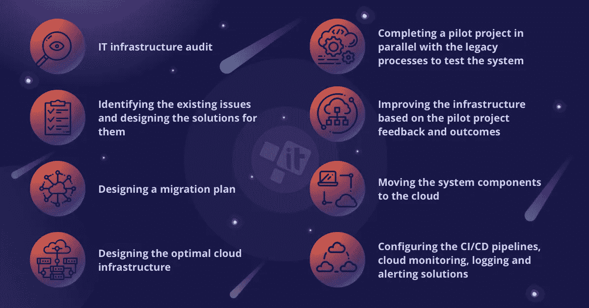

# 云迁移清单:做什么和为什么要做

> 原文：<https://medium.com/hackernoon/cloud-migration-checklist-what-to-do-and-why-to-do-it-3c4de423fae>

每个公司都必须在扩展的某个阶段执行云迁移。我们提供云迁移清单，帮助您做出正确的选择并避免错误。

我们已经讨论了在云过渡期间最常见的[错误，并提到了应对出现的挑战的正确方法。今天，我们将描述云迁移的最佳情况，并探索让一切正常运行所需的步骤:](https://itsvit.com/blog/avoid-cloud-migration-mistakes/)

1.  信息技术基础设施审计
2.  确定存在的问题并为其设计解决方案
3.  设计迁移计划
4.  设计最佳的云基础架构
5.  与遗留流程并行完成试点项目，以测试系统
6.  根据试点项目的反馈和结果改进基础设施
7.  将系统组件移动到云中(产品代码、数据库、媒体内容和脚本等。)
8.  配置 CI/CD 管道、云监控、日志记录和警报解决方案

下面我们将更详细地描述这些步骤。

# 信息技术基础设施审计

随着业务的增长，他们的 IT 基础架构也会随之增长。在完美世界中，增长是按照计划进行的，基础设施是根据支持增长的长期战略构建的。然而，在现实生活中，IT 基础设施通常以某种混乱的方式扩展。

也就是说，向云过渡的第一步是对现有的 it 基础架构、工作流、工具和流程进行彻底的审核。这种审计可以在内部进行，由您的 it 部门进行，或者雇佣一个[专门的 DevOps 团队](https://itsvit.com/our-services/devops-service-provider/)来评估情况。审计包括采访利益相关者，收集所有可用的数据和文档，以形成您的 it 基础架构必须支持的流程和任务的整体情况。

这种审计可能有两种结果。基础设施既可以[提升并转移到云](https://itsvit.com/blog/cloud-native-vs-lift-shift-way-choose/)中，也可以在数据库与其云类似物同步时，使用云原生组件从头开始重建，其余部分由新模块替换。后一种方法时间更长，成本更高，但从长期来看效果最好。然而，大多数客户更愿意选择前一种方式，并尝试将他们的系统迁移到云中。
忽略 IT 基础设施审计可能是整个项目的厄运，对任何企业来说都是极不明智的。唯一的例外可能是移动具有清晰结构的非常小的系统，但是现在这些系统通常从一开始就创建在云中。

# 确定存在的问题并为其设计解决方案

一旦审计完成，某些瓶颈和弱点就会显现出来。将它们带到云中是一种浪费，因此必须设计这些问题的解决方案。大多数这些问题通常由云结构本身解决，比如提供水平可伸缩性和高可用性，但是一些缺陷通常需要在传递之前纠正。这些改进成为全球云迁移计划的一部分。

否则，云迁移将不会提供任何切实的好处，因为所有旧的差异和低效将留在云流程中，并将阻碍您的进一步发展。

# 设计迁移计划

迁移计划是企业希望通过云迁移实现的目标的整体路线图、实现这些目标的方法以及衡量项目进度的里程碑。前期审计越好，可以选择的关键绩效指标就越详细，项目状态就越明显。

没有计划的继续进行对项目来说可能是毁灭性的，因为很明显，完全不正确的行动顺序将导致灾难。

# 设计最佳的云基础架构

有许多云服务提供商，如 [AWS 或 Azure](https://itsvit.com/blog/aws-vs-ms-azure-cloud-provider-choose/) 、GCP 或 DigitalOcean。根据您的业务需求，有些产品可能比其他产品更适合您的系统。此外，现代的 [DevOps 工具](https://itsvit.com/blog/must-have-devops-tools-make-things-right-get-go/)允许构建云无关的基础设施，当数据存储在 GCP 中，但由 AWS 处理，脚本使用 Azure 函数执行。然而，通常不需要如此复杂的结构，选择最佳的云目的地有助于满足项目的所有需求。

然而，盲目选择特定于提供商的功能和产品(如 AWS RDS、Google Bigquery、 [AWS Fargate 或 AWS Aurora](https://itsvit.com/blog/aws-summit-2018-london-highlights-takeaways/) )可能会导致为您实际上并不需要的服务支付过高的费用。因此，深入了解云产品和各种通信服务提供商提供的服务有助于了解适合您情况的最佳模块选择。

# 与遗留流程并行完成试点项目，以测试系统

一旦为您的企业完成了新的云基础设施，就应该通过将一些较小的系统迁移到那里作为试点项目来进行测试。这将允许确定您对工作负载的假设是否正确，系统是否可根据您的需求进行扩展，过渡处理是否充分，等等。

一次完全迁移所有系统会导致重大系统故障和长时间的服务停机，这在当今的业务中是不可接受的。

# 根据试点项目的反馈和结果改进基础设施

一旦试点完成并收集了反馈，就可以根据项目的结果来调整云系统。例如，有时很明显应该使用自动扩展组而不是配置的实例集群，应该使用 bastion 主机来提供对系统的安全管理访问，或者应该使用 Terraform 而不是特定于平台的工具来配置[自动化数据库备份。](https://itsvit.com/blog/automate-mongodb-backups-using-terraform/)

# 将系统组件移动到云中

一旦一切准备就绪，实际的云迁移就可以开始了。产品代码可以保留在 GitHub 中，但是其余的资源(数据库、网站媒体内容、脚本等。)必须搬到云端。这一过渡最重要的部分是事先将域名转移到云服务提供商，以避免迁移后的停机时间。这是因为 CSP 允许将名称服务器记录的 TTL 设置为 3 秒，因此迁移将是无缝的。

遗留数据库必须与云数据库同步。请注意，MySQL 只能与 MySQL 100%同步，因此在云迁移期间交换数据库(到 Redis 或[卡珊德拉](https://itsvit.com/blog/top-5-reasons-use-apache-cassandra-database/))需要编写大量定制代码，通常是不可取的。您的数据库的云副本必须与遗留数据库并行运行以进行同步，然后遗留数据库被关闭，您的数据库从现在开始从云中运行。移动媒体内容和脚本通常更简单，因为它们不像数据库记录那样频繁更新。

# 配置 CI/CD 管道、云监控、日志记录和警报解决方案

一旦您的产品或服务到达云，您就可以获得 DevOps 最佳实践，如持续集成/持续部署(CI/CD)和将基础架构作为代码进行管理(IaC)。这意味着，基于云的企业可以在配置脚本的帮助下管理他们的资源，而不是供应和配置每个单独的服务器，如 [Kubernetes 和 Terraform](https://itsvit.com/blog/use-terraform-kubernetes-manage-worlds/)manifest，它们可以存储在 GitHub 上，可以像任何其他代码一样进行版本控制和调整。这有助于显著减少环境设置时间。

此外，大多数日常 IT 任务都可以使用 Jenkins、Ansible 和其他 CI/CD 工具实现自动化，以便您的 IT 团队能够专注于推动业务发展，而不是做重复的配置和维护工作。[最受欢迎的 CI/CD 管道之一](https://itsvit.com/blog/monorepo-google-way-ci-cd/)涉及为新一批代码提供测试和登台服务器的自动化过程，并且如果代码通过了自动化单元测试，就自动将新产品发布推向生产。这样，每个开发人员都可以交付新代码，而无需等待运营部门提供服务器资源，从而显著缩短新产品功能的上市时间。

可以为监控、记录和警报系统创建类似的 CI/CD 管道。这使得 [AIOps 方法](https://itsvit.com/blog/aiops-next-level-devops-services/)能够监控基础设施，在大多数重复性事件发生之前就将其解决，从而消除了 IT 团队的大量日常工作。这可以使用 Zabbix、Prometheus+Grafana 等工具以及 [DevOps 监控工具包](https://itsvit.com/blog/5-parts-svit-logging-monitoring-toolkit/)的其他组件来完成。

# 关于云迁移清单的结论

如您所见，如果按照一个简单的清单来执行，云迁移是相当可行的。然而，如果由一个以前没有这种经验的团队来执行，有多个水下暗礁会给项目带来严重的危险。

因此，云迁移是全球[可靠的托管服务提供商](https://clutch.co/it-services/msp)提供的最受欢迎的服务之一。这些公司在设计和实施云迁移计划方面有丰富的经验，使他们的客户能够实现既定的业务目标，优化他们的产品或服务性能，为他们的客户提供更多的价值，同时减少他们在 IT 基础设施维护方面的开支。

您现在是否计划进行云迁移？ [IT Svit](https://itsvit.com/contacts/) 随时准备提供帮助！

*原载于 2018 年 10 月 30 日*[*itsvit.com*](https://itsvit.com/blog/cloud-migration-checklist/)*。*