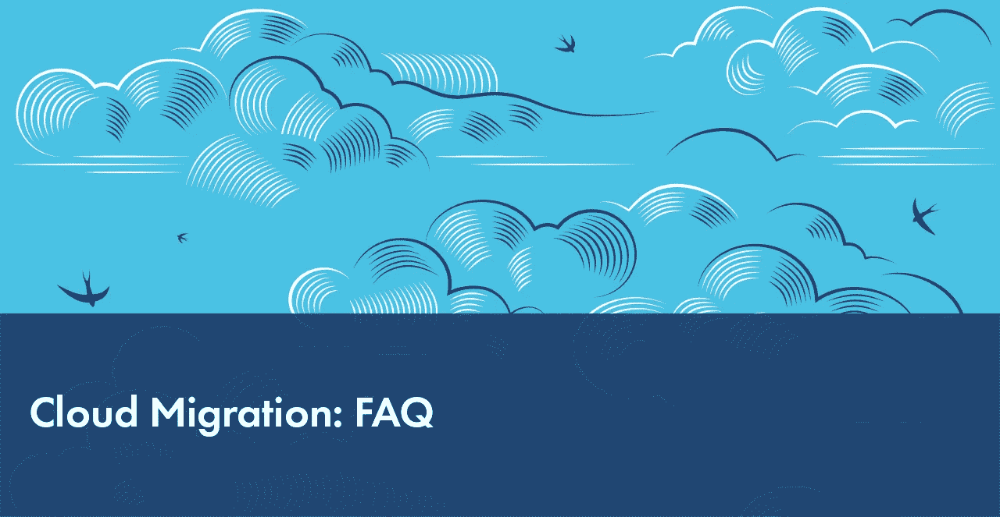

# 云迁移:常见问题

> 原文：<https://medium.com/hackernoon/cloud-migration-faq-d698d3424d49>

云迁移和云运营的问题很棘手。迁移到云的想法引发了许多问题。我们在这里已经解决了其中的一些问题，希望这篇文章能帮助你更好地理解云计算的相关问题。

仅在 5-6 年前，大多数 IT 企业认为云将被广泛使用的想法是不可信的。为什么要把你自己的——或者更糟糕的是，你客户的——敏感数据交给一个独立的公司，这可能被证明是粗心或恶意的？当你有自己的私人的、可靠的数据中心，有精心开发的系统、数据库和物理上可用的服务器，你可以完全控制的时候，为什么要把它上传到网上的某个地方呢？

今天，我们可以有把握地说，思维已经发生了转变:随着大规模数据对象和分布式数据管理的兴起，云已经成为一种大趋势，人们对云技术的兴趣也在持续增长。据 [Forbes](https://www.forbes.com/sites/louiscolumbus/2017/04/29/roundup-of-cloud-computing-forecasts-2017/#14d9994631e8) 报道，自 2009 年以来，云计算支出的增长速度是 IT 支出的 4.5 倍，预计到 2020 年将超过 IT 支出的 6 倍。

然而，云迁移和云操作的问题很棘手。迁移到云的想法引发了许多问题。我们在这里已经解决了其中的一些问题，希望这篇文章能帮助你更好地理解云计算的相关问题。

每种业务情况都是独特的，我们建议与 IT 咨询公司合作，确定并实施最适合您需求的云解决方案。如果您需要针对您的业务需求量身定制的深入见解，我们随时可以提供帮助。

# 1.介绍

## 1.1.迁移到云有什么优势？

*   **运营成本。**无需支付设备、维护和硬件升级费用。不用交电费。不需要为数据中心租用场地。不需要雇人来经营。获得多种选择和低价试验的机会，无需任何资本支出。
*   **弹性和按使用付费。**云的弹性环境模型基于使用情况，这使得按需轻松扩展和增加计算能力以及减少不需要的硬件资源成为可能。
*   **风险缓解和最大可用性。**快速灾难恢复、最大弹性和正常运行时间。
*   **安全。**对于许多人来说，这是一个疑点，但是由于规模经济，大型云提供商可以比大多数公司投入更多的资源来保护他们的应用程序和客户端数据。
*   **大数据和高级分析。**有了云，存储、访问和分析几乎无限量的数据成为可能。对于能够利用大数据的力量来提高业务绩效的公司来说，云是唯一可能的数据模型。(但是，这些公司可能更喜欢私有云模式，而不是公共/共享云模式。)

## 1.2.是面向所有人的，还是有什么公司有更好的内部系统？

我们应该区分三种选择:传统的内部模式、公共云和私有云。传统模式的特点是手动或半自动配置服务器资源，这意味着数据在这种环境中的安全性要低得多。云计算意味着服务器资源的完全自动化供应([宠物与牛的比喻](http://cloudscaling.com/blog/cloud-computing/the-history-of-pets-vs-cattle/))。

通常，当讨论云迁移的优势时，我们指的是公共云，它由第三方云服务提供商拥有和维护。私有云是专为单个组织构建的云。由于工作负载性能、数据集成、隐私和数据安全性方面的优势，一些使用大型数据仓库和 BI 工作负载的组织可能更喜欢公共云解决方案。以 Dropbox *【参见* [*彭博、2018 年 3 月 1 日*](https://www.bloomberg.com/gadfly/articles/2018-03-01/dropbox-s-best-move-was-breaking-up-with-amazon-s-cloud)*】*和沃尔玛*【参见* [*路透社、2018 年 2 月 14 日*](https://www.reuters.com/article/us-walmart-cloud/walmart-goes-to-the-cloud-to-close-gap-with-amazon-idUSKCN1FY0K7) *】、*这些最近从 AWS 迁移过来的人，建立了自己的 DC，并通过这样做节省了数百万。但是你需要那么大。对于大多数没有像沃尔玛那样的大型数据仓库的中小型公司来说，公共云可能是最有效的选择。

对于希望使用云，但由于法规、数据敏感性或数据位置而无法使用公共模型的客户来说，还有另一种选择可能是有益的。最近，微软开发了自己的混合解决方案， [Azure Stack](https://azure.microsoft.com/en-us/overview/azure-stack/) ，为客户提供了一种使用熟悉的云平台的方式，而无需将其敏感数据放入多租户环境中。它不应被视为独立的虚拟化平台:它包括构成云的基本基础架构即服务(IaaS)功能，如虚拟机、存储和虚拟网络，以及一些平台即服务(PaaS)功能，包括容器服务、无服务器计算软件以及 MySQL 和 SQL Server 支持。

## 1.3.我们应该提前做些什么？有什么我们应该注意的典型错误吗？

仅举几个例子:

*   最糟糕的错误可能是**没有足够重视特定的商业情况**。所有技术决策都必须与业务战略保持一致，并在公司内部尽可能广泛地进行沟通。否则，即使是设计非常完善的解决方案也有可能成为“不想要的孩子”而被丢弃，所有的努力和资源都将付之东流。诸如成本、治理、供应商锁定和足迹等问题应该仔细考虑，并与公司的利益相关者进行讨论。
*   **过早的技术选择。**有些技术可以满足他们的需求，但将来可能会变得过于昂贵。这就是为什么所有的技术都应该从长远的角度来选择。我们建议进行短期原型项目(通常为 2-4 周)。原型不应用于学习相关新技术的基础知识，而应将其置于压力条件下，并揭示团队未来将面临的挑战，例如:
*   性能和应力负载测试
*   可扩展性、配置和部署
*   定制和支持
*   定价

例如，一个好的数据库原型应该包括数据库所有者一年中预期的数据量的查询部署和基准测试。

*   **数据管理不善。**缺乏清晰的数据治理会影响加载到云上的数据质量。大量的数据可能会迫使公司忽略这些数据是否仍然相关。云迁移具有真正的转型潜力，提供了应用大数据分析解决方案来获得更多业务洞察力的机会。然而，要做到这一点，必须确保数据质量。
*   缺乏用户参与。尽早让真实用户参与进来很重要，这样才能快速发现你规划中的任何瑕疵，帮助他们适应过渡，驱散不确定性，赢得更多内部拥护者。

# 2.技术问题

## 2.1.我们如何规划迁移？我们应该如何组织整个过程，使其高效、无痛？

以下是我们推荐的典型迁移框架:

*   **调整和管理重点领域:**收集业务需求，确认假设，验证假设，并确定利益相关者、治理和技术。在这一阶段，咨询公司就像医生一样，提出问题并编制症状列表，如当前的数据存储问题、依赖性、计划(新功能、客户群的指数增长等)、法律和合规性问题等。
*   **规划:项目路线图。**我们使用专有的解决方案设计方法来设计和规划复杂的转型项目。这种迭代方法考虑了期望、风险和约束管理，并确保成功完成转换。此流程的可能阶段包括:库存- >期望状态成形- >关注点和假设- >短期 POC->最小可行云- >试点迁移- >迁移的平行跟踪&退役。

一个重要的建议是始终牢记组织内更广泛的开发环境。就像任何其他复杂的转型计划一样，云迁移路线图应该与其他公司范围项目的路线图保持一致，以避免冲突和重复工作，并确保在这些其他路线图中没有任何我们在设计和规划自己的路线图时应该考虑的关键里程碑。

*   规划:投资组合发现。为了简化规划工作并降低后期遗漏依赖项的风险，了解公司拥有哪些资产并确定每次迁移将包括哪些资产至关重要。有一些特殊的专用发现工具(如 Risc Networks 的 CloudScape、ScienceLogic 的 CloudMapper 或 AWS 应用程序发现服务)可以帮助更新应用程序清单。
*   **基础:**设计搭建云平台的核心基础设施。在这个阶段，关注业务战略并确定哪些操作和流程是必不可少的，以及它们如何映射到云提供的功能是至关重要的。概述清晰的云治理模型并定义谁有权访问哪些控制也很重要。
*   **PoC:** 第一个平台消费者的迁移。重要的是从小而简单开始，一部分一部分地迁移系统，并观察过程是如何进行的。
*   **多种设计/迁移/验证途径。**主动实施阶段。数据迁移、应用、基础设施发展和蓝图审查。

## 2.2.我们如何选择合适的迁移策略？我们可以只是“提升和转移”我们的应用程序，还是应该改造整个架构？

有几种迁移策略:

**主机更换**

通过在云中部署应用程序或迁移虚拟机来实现提升和转变式迁移。

*利弊*

*   最简单快捷
*   孤立的迁移范围
*   次优的云利用率
*   不适用于具有特定软件和硬件依赖性的系统

**平台**

改变平台，使其能够在云中运行。

*利弊:*

*   可能是将某些系统迁移到云中的唯一方法
*   重访整个生态系统的机会
*   时间/预算限制
*   技术限制

**重构**

更改您的解决方案的实施和体系结构，以消除依赖性、优化性能并使其更加强健、可扩展和容错。

*   应用程序重构
*   合并应用程序

*利弊*

*   利用云和 SaaS 功能
*   性能优化
*   时间/预算限制

首先，我们总是可以选择最快速和最简单的选项，然后根据需要调整解决方案以适应云。根据我们的经验，大约有三分之一的客户只接受主机转移选项，另外三分之一的客户接受平台转移选项。但是，请记住，云具有巨大的转型潜力，迁移是优化旧架构、消除不必要的依赖和替换系统过时部分的绝佳机会。

有迹象表明需要一些重新架构:“我们对一切工作方式都很满意，但我们有一个小问题……”(云解决方案、MS SQL 服务器等的成本)。

## 2.3.我们的系统非常庞大。我们如何传输数据以避免高网络成本、长传输时间和安全问题？

有几种解决方案。亚马逊雪球就是一个例子。这是一个用于 AWS 的数据存储和传输设备，容量高达 50 Tb，您可以向 AWS 请求(一个或多个并行)。它几乎坚不可摧，自成一体，防篡改。引用亚马逊网站的话，“它足够坚固，可以承受 6G 的震动，而且足够轻，一个人可以携带。它可以抵御各种天气，并可以作为自己的运输容器。”亚马逊雪球是市场上第一个此类解决方案，自 2017 年以来，还推出了 [Azure Data Box](https://azure.microsoft.com/en-us/services/storage/databox/) 和 [Google Transfer Appliance](https://cloud.google.com/transfer-appliance/) 。

## 2.4.我们的服务每秒处理多个交易。我们如何将它转移到云中，并确保不会丢失任何事务？

对于大型、复杂和专业的交易系统(例如银行)，我们从来不只是从旧系统“切换”到新系统。我们总是努力建立一个双写系统，一个副本在云中，另一个备份副本留在本地，以便在出现问题时可以回滚。迁移总是分阶段进行，以避免新系统出现故障的风险。在试点迁移期间，我们可以转移所有交易的 5%,或某一特定类型的交易，或仅属于某一特定客户的交易。只有在彻底的测试之后，当确认所有类型的交易都得到正确处理时，我们才能继续进行迁移的以下阶段。

## 2.5.我们应该转移整个系统，还是将某些部分从云中移除更好？

一种常见的方法是保留混合基础架构，并使用云来增强自己的技术能力，而不是转向 it，接受它作为唯一的新模式，并且永不回头。第三方机密数据或软件是经常被云遗漏的一类数据，出于安全性和合规性原因，许多公司仍然倾向于将此类数据存储在内部。另一种类型是专门的计算密集型操作，例如科学 GPU 计算、渲染等。对于此类操作，通常有一个高度发达的内部基础设施，云可能缺乏足够的计算能力，或者只是过于昂贵。

## 2.6.你能推荐哪些特定的技术？

根据我们的经验，建议的方法首先是**持续集成和交付(CI/CD)** ，其次是**基础设施即代码(IaC)。**这两项实践涉及基础设施、开发运维以及发布管理的大规模自动化。

特别是，我们建议进行以下实施:

*   **IaC**:hashi corp 的 Terraform，AWS CloudFormation，Ansible，Puppet，Chef
*   **CI/CD** : Jenkins，Team Foundation Server，TeamCity，Harness
*   **容器化** : Docker，Kubernetes(可能在所有三个主要的云服务 Kubernetes 中作为服务使用)。

## 2.7.我们应该使用任何特定于云的 SaaS 或 PaaS 组件来替换部分遗留系统吗？

这取决于具体的商业案例。

**是的:因为这些组件使得削减许可证、操作、安全更新和补丁等众多成本**成为可能。

**否** : **如果您以非常特殊的方式使用系统**，需要大量定制和增强功能，或者一些非常特殊的性能/SLA，那么标准的 SaaS 和 PaaS 产品将不适合您。

后者的一个例子是在 Amazon EC2 实例上托管关系数据库或将其内容迁移到 Amazon RDS 实例之间进行选择。Amazon RDS 比 Amazon EC2 中的数据库更容易设置、管理和维护，并且可以让您专注于其他任务，而不是日常的数据库管理。如果您只想运行常规数据库，这是一个简单的现成解决方案。或者，在 Amazon EC2 中运行数据库可以给你更多的控制、灵活性和选择，并且可以设置特定的性能或定制的配置。

## 2.8.我们应该“购买”而不是“构建”(即，用市场上的服务器替换传统组件或整个解决方案)吗？

答案与关于 SaaS 或 PaaS 组件的问题相同。如果你的需求不是太具体，购买是合理的，也是划算的。如果您需要完全定制的解决方案，建议构建。

我们为一家跨国旅游公司的客户做了解决方案设计，该客户希望将几个专有应用程序合并为一个，并需要为这个新系统选择一个平台。他们对 UX 有非常具体的要求，还需要与其他系统集成。

我们必须决定是自己建造它，这需要数百万的投资和数月的开发，还是购买和改造来自 MS Dynamics 365 的现成组件。

起初，第二种选择似乎更便宜。然而，最终我们发现:

1.  MS Dynamics 产品缺少大部分所需的功能，因此我们必须对它们进行定制，使它们能够与我们的其他系统一起工作，这仍然比从头开始构建要花费更多的成本；
2.  我们添加的任何新功能都将成为微软的知识产权。

这是导致一些公司开发自己的解决方案而不是扩展第三方产品的两个主要障碍。

# 3.金融

## 3.1.我们如何衡量财务收益？(还有，‘便宜不便宜？’)

为了确定云对您来说是否更便宜，您应该考虑几个因素。

1.  **成本:**来自云提供商的月度(或年度)**发票**(根据使用情况可能会相当高)。云不便宜。
2.  **节约:我们当前的 IT 开支**。硬件成本和维护成本。软件许可证。租用数据中心空间。劳动力成本(不仅仅是服务器管理员，还有信息安全、审计、物理安全和建筑维护等。)将系统永久迁移到云中后，大部分都不再需要。
3.  **成本:我们新的 IT 开支。**有些费用可能没有了，但是会有新的费用产生。云涉及一门新的学科和不同的开发运维实践。你需要雇佣新员工，并培训现有员工掌握新的技能。您需要花费他们的时间来优化云中的 CI/CD 并对其进行管理。
4.  **储蓄:弹性。**如果您需要 1000 台虚拟机来进行感恩节销售，您可以通过云轻松实现。
5.  **成本:**如果您迁移到云提升和转移模式，没有任何优化，那么中期**运营成本**会更高。
6.  **节省:**然而，从长远来看，即使没有任何优化，云也能让您降低成本——因为**缺少硬件更换和维护**。(如果是您的服务器出现硬件故障，您可以购买另一台服务器或与供应商交易，更换磁盘并清理刀片式服务器上的灰尘。对于云，您会提前 30 天收到一封电子邮件，大约 10 分钟后，您会将有问题的虚拟机替换为新版本。)(还有许多优化选项！)

## 3.2.有哪些可能的成本优化方案？

仅举几个例子:

*   **批发折扣:**相对而言，消费越多，支付越少。每增加一兆字节，你的花费就会减少。
*   每个存储都有降低成本的 **SaaS 和 PaaS 解决方案**。您可以使用 SaaS，为相同的服务支付更少的费用，并且不需要支持和管理服务器实例。
*   **预订实例**与按需定价相比，如果您承诺提前 1-3 年使用它们，尤其是如果您提前支付(全部或部分)，将提供显著的折扣(高达 75%)。
*   **Spot instances** 是按需实例的低价版本。问题是，当现货实例价格高于投标价格时，它们可能会被提供商关闭。现货价格根据产能的供给和需求而波动。然而，与按需相比，使用 spot 实例可以节省高达 90%的成本，并且还可以投资开发一个容错系统，该系统能够在少数实例失败的情况下存活(例如，批处理作业或用于大数据处理的大型分析作业)。这将改善您的架构，并且是降低运营成本的绝佳选择。
*   使用**无服务器方法**，您只需为所提供的计算服务的实际数量付费(比如，每百万次请求 0.20 美元)——您不再需要为虚拟机付费。无服务器是下一代云基础设施，每天都有越来越多的无服务器应用。

## 3.3.云的隐性成本是什么，我们如何避免它们？

意外成本的一个重要来源是缺乏数据治理，技术自由度太大。有时，人们只是忘记关闭他们并不真正需要的虚拟机。如果没有人监督资源分配，成本可能会开始不受控制地增长。强烈建议至少提前 12-18 个月做好计划。

在一个案例中，一个客户使用云虚拟机在 CI 上运行构建。他们从 5 台服务器开始，成本非常适中，但几个月后，这一数字增长到 80 台，云成本上升到每月 20，000 美元。该系统是以这样一种方式设计的，即不可能简单地减少机器的数量。我们通过重新设计系统并将 CI 处理转移到 spot 实例来解决这个问题。

再比如:红移。Redshift 是一个令人惊叹的数据库，速度非常快，扩展性非常好，但也非常昂贵。你需要有一个非常好的理由来使用它。您可以随时通过添加更多服务器来扩展它。您的群集每月可以增长到数千美元，如果您不小心，该群集将成为您的业务所依赖的系统的重要组成部分。没有经过深思熟虑的长期规划，投资这种技术是非常危险的，因为它会让你血本无归。

软件许可是另一个话题。企业系统，如数据库服务器，有时是按 CPU 内核许可的。服务器的 CPU 越多，许可费用就越高。如果您的云解决方案非常具有可扩展性，并且您在云中有很多 CPU 核心，那么许可证可能会变得非常昂贵。

# 4.安全性和合规性

## 4.1.这又是一个老问题:我们为什么要相信第三方——公共云提供商——拥有任何敏感数据？

成熟的云提供商在安全性和合规性方面投入巨大。在大多数公司的内部系统中，要达到他们的水平所需的努力甚至可能过于昂贵。查看安全方面的主要提供商页面[微软 Azure](https://www.microsoft.com/en-us/trustcenter/security) 、 [AWS](https://aws.amazon.com/ru/security/) 和[谷歌](https://cloud.google.com/security/)。

## 4.2.我们如何选择云提供商？

必须仔细检查潜在的云服务提供商，以确保其合格、可靠、长期运营财务稳定，并在市场上有良好的声誉。在行业最佳实践和标准中，有像 [ISO 27001](https://www.iso.org/isoiec-27001-information-security.html) 或[网络要素计划](https://www.gov.uk/government/publications/cyber-essentials-scheme-overview)这样的认证。另请查看[微软关于提供商选择的简短指南](https://azure.microsoft.com/en-us/overview/choosing-a-cloud-service-provider/)。

## 4.3.如何保证云和 DevOps 的安全性？

从安全性的角度来看，云与任何其他服务没有太大的不同:您必须为您的数据、身份验证和访问控制的安全管理实现最佳实践。然而，云解决方案为您提供了更好地支持云环境的工具。

1.  **用户权限。**您必须为您的云用户、运营商和开发者管理权限。这被称为身份和访问管理(IAM)。最重要的最佳实践是，您应该在需要的基础上限制用户对资源和数据的访问，努力拥有最少的权限集。
2.  **网络基础设施安全**包括管理网络拓扑、防火墙规则、流量安全策略和与互联网的接触点，以应对“静态”和“传输中”的安全问题。
3.  **数据安全**包括对数据存储(包括文件和数据库)的访问控制，以及对数据的加密，即使在数据泄露的情况下也能减轻损害。
4.  **安全软件开发。**为云开发的软件应该使用行业公认的安全最佳实践。实践安全第一的编程、审计代码变更、代码审查、安全审计等。
5.  **秘密管理。**不要将您的安全凭证泄露给代码存储库，而是将凭证(如数据库服务器密码)保存在您的云解决方案中集成的秘密管理库中。这使您可以轻松监控对密码的访问、轮换凭据以及撤销不再需要的访问。
6.  **人为因素。**归根结底，最大的威胁既不是安全漏洞，也不是安全漏洞:而是人。您的用户可能不小心使用他们的密码或密钥。教育他们，定期提醒他们数据安全的重要性，并且不要忘记设置密码轮换策略。

*由* [*尤里【顾斌】*](https://blog.dataart.com/author/yuri-gubin/) *，方案顾问&云专家* [*数据艺术*](https://www.dataart.com/)

*原载于 2018 年 10 月 01 日*[*blog.dataart.com*](https://blog.dataart.com/cloud-migration-faq/)*。*