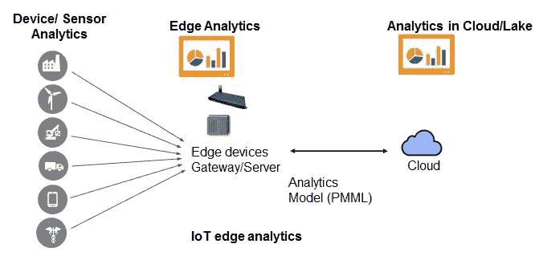
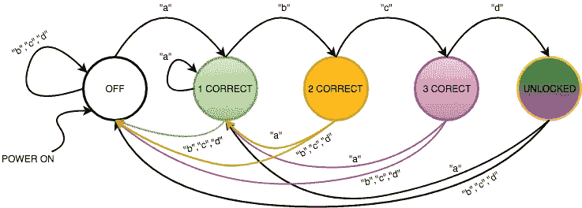
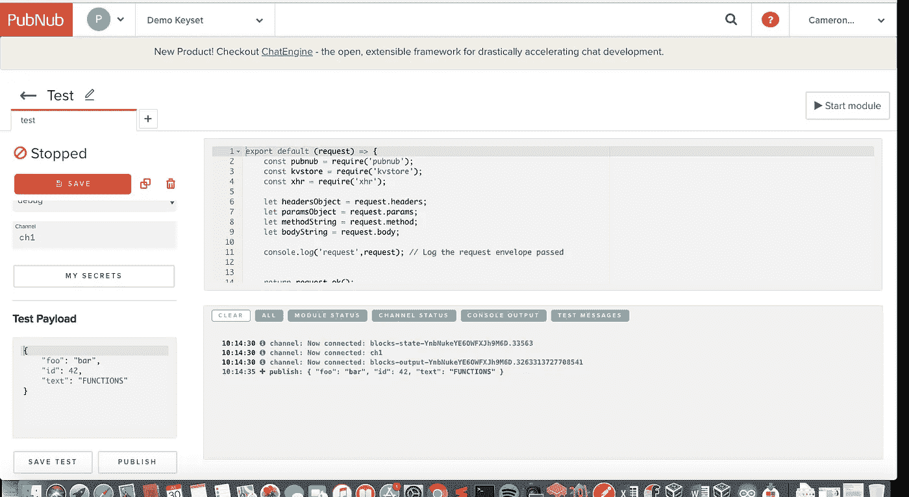
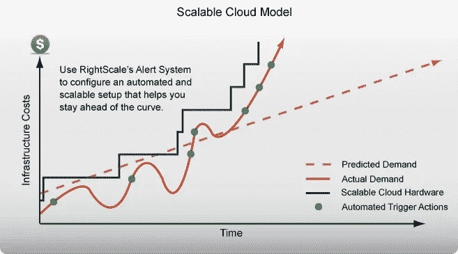

# 云状态机:物联网和边缘计算的未来

> 原文：<https://medium.com/hackernoon/cloud-state-machines-the-future-of-iot-and-edge-computing-f1761c55a803>

虽然物联网和云计算的新兴范例允许看似完美的技术实现，但我们不能忘记我们的不良做法的流行。即使是现在的 2018 年，也有数百万美元浪费在低效的部署和开发设计上。

在物联网嵌入式设备领域，这种浪费部分归因于对[设备-边缘-云](https://www.pubnub.com/blog/moving-the-cloud-to-the-edge-computing/)模型的教条式默认。这种方法涉及物联网设备网络向本地边缘计算机发送大量数据。然后，边缘要么处理该数据以将其推送到云存储库，要么首先将数据推送到云进行处理。



该方法旨在更好地促进网络上的数据流量；然而，这不是一个一刀切的物联网框架，因为它有时会对项目的成本、开发和部署造成严重损害。

举例来说，考虑一个农业物联网农场，该农场旨在安装收集土壤湿度数据的传感器，并相应地调整其洒水系统。如果服务器场采用设备-边缘-云模型方法，可能会出现几个成本高昂且耗时的问题:

*   边缘计算机增加了整体计算存储网络架构的复杂性，并可能导致严重的数据延迟问题。如果网络太大，洒水器会开得太久，淹没庄稼
*   边缘设备具有大量的[刷新周期](https://whatis.techtarget.com/definition/server-refresh-cycle)，这导致了“架构设计”锁定。这是设计整体架构时的一个重要方面，因为它限制了环境可以应对的物理变化量，如季节和自然灾害。
*   如果农场决定扩展其网络，农民要么必须支付大量的前端成本来安装额外的边缘计算机，要么投资更强的物联网设备来处理更大的工作负载。不管怎样，**的可扩展性**是一场噩梦。

虽然**边缘计算**在物联网中肯定有它的位置，但这个框架已经被多余地过度使用了。相反，工程师和开发人员必须学会以不同的方式思考如何构建他们的网络架构。

随着 2018 年更强大的云计算的到来，**基于云的状态机**为物联网网络设计提供了一个极其通用和高效的解决方案。对于那些还不知道云中派生状态机的内部机制的人来说，[阅读本文](https://www.pubnub.com/blog/cloud-server-state-machine-pubnub-functions/)是很有用的，因为它详细解释了什么是云机器以及如何从头开始构建云机器。

这篇文章将作为后者的姊妹篇，因为它不是回答**如何**使用云机器，而是重点解释**为什么**。特别是，这篇文章将解决物联网的三个教条:**硬件**、**开发/部署**和**商业模式**。

本文还将引用 PubNub 函数作为云机器范例。Function 触发 JavaScript 代码块以及通过其发布-订阅框架发送的任何消息的能力使其成为云-机器架构的完美候选。 [**在这里找到更多关于 PubNub 函数的信息！**](https://www.pubnub.com/products/functions/)

# 教条 1:硬件性能

在 PubNub 函数中包含一个状态机意味着用户可以将他们所有的数据和计算外包给云。因此，至少，物联网设备可以通过 **REST API** 或“原生 SDK”单独发布和订阅数据，因此所有工作都可以在云中进行。

客户端代码的极简发布-订阅框架为物联网设备的硬件提供了许多有利的优势:

*   可以负担得起使用更便宜和更笨的设备
*   降低对内存空间和处理能力的需求
*   即使是外包给云的一点点逻辑，如果网络足够大，也能省下一大笔钱。
*   更长的工作周期
*   更快的执行时间

这里有一个如何实现这样一个框架的例子。

# 教条 2:软件开发和部署过程

当部署向边缘服务器报告的设备网络时，调试过程可能与开发本身一样长，如果不是更长的话。如果问题不明显，甚至诊断问题也可能是极其乏味的；然而，当一个网络在一个状态机框架下工作时，这个问题更容易确定。

例如，状态机允许代码非常易读，因为代码可以被分解成非常小且易于管理的块，其他用户可以快速运行。如果物联网设备或网络运行不正常，开发人员可以从物理上确定哪个状态不正常，并快速修复与该状态相关的有问题的代码。

《出埃及记》具有空白状态和 4 个输入的状态机



```
if(state == 0 || !state){
     if(input == a){
     //do something
     }else if(input == b){
     //do something
     }else if(input == c){
     //do something
     }else if(input ==d){
     //do something}
} 
else if (state == 1){//same structure}
else if (state == 2){//same structure}
else if (state == 3){//same structure}
```

此外，可以从任何位置远程访问[云边缘](https://dyn.com/blog/what-is-the-cloud-edge/)，而不是现场边缘。有了**的 PubNub 功能**，这种优势在尝试远程更新问题时变得更加明显。

通过该 UI，用户能够使用控制台调试器虚拟化每个物联网设备的终端屏幕。由于所有的设备需要的是一个互联网连接，用户可以从世界任何地方为任何网络设备编写逻辑程序！



功能模块还附带了一系列 API，可以轻松地导入到云代码中，而不需要设备需要更多的硬件。这意味着，即使是最小的物联网设备现在也可以与任何 API 进行交互，无论它有多大。

<if you="" interested="" in="" the="" wide="" variety="" of="" api="" pubnub="" has="" to="" offer="" check="" out="" class="ae jp" href="https://www.pubnub.com/docs/blocks-catalog" rel="noopener ugc nofollow" target="_blank">街区目录 ></if>

# 教条 3:商业模式和策略

在业务方面，云状态机与传统的基于云的网络具有许多相同的优势。

云系统的最大好处包括项目的**可伸缩性**。随着项目业务的扩展，向网络中添加更多设备对网络基础设施的影响很小，甚至没有影响。设备只需预编程即可发布和订阅网络，只需从服务器获得一个访问令牌。

然后，业务的服务器端可以遵循**随增长付费**的商业模式，客户可以根据动态增长的网络调整支付。这与边缘模式相反，在边缘模式下，客户需要为可能永远不会使用的额外服务器支付前期成本。



此外，企业可以将自己制造成一个**平台即服务(PaaS)**；该公司可以提供他们的云服务器作为其他设备网络使用的平台。例如，如果一家公司要构建一个针对特定物联网智能农场优化的强大 PubNub 功能，其他公司可以付费使用该功能来部署自己的物联网智能农场。

# 自己试试吧！

如果这篇文章已经把你吸引到了云机器的世界，那就来自己造一个看看它的威力吧！

在这里注册免费的 API 密匙。

*最初发表于*[T5【www.pubnub.com】](https://www.pubnub.com/blog-cloud-state-machines-the-future-of-IoT/)*。*