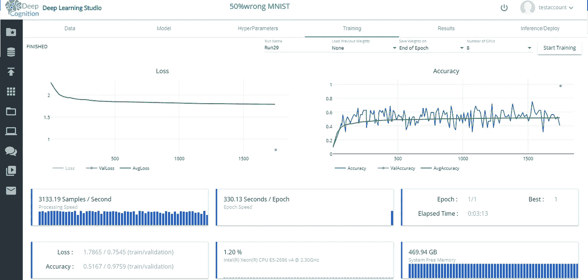

# 标签嘈杂的 CNN！|研究论文|深度学习工作室|

> 原文：<https://medium.com/hackernoon/cnns-with-noisy-labels-using-deepcognition-research-paper-1bf4094e3bd9>

嗯！我在看这篇研究论文 h[ttps://arxiv . org/pdf/1703.08774 . pdf](https://arxiv.org/pdf/1703.08774.pdf)有个意想不到的事情！我想到自己测试一下，看到结果真的很震惊。

[https://arxiv.org/pdf/1703.08774.pdf](https://arxiv.org/pdf/1703.08774.pdf) Research paper

本文《谁说了什么:建模个体贴标机改进分类》由 Melody . Guan、Varun Gulshan、Andrew M. Dai 和“ML 教父”Geoffrey E. Hinton 提交。

Even if teacher is wrong, you can still top the exam! 😛

这篇论文揭示了一些结果，除非得到证实，否则并非每个人都愿意接受。其中一些是:

*   用 50%的错误标签训练 MNIST，仍然获得 97%的准确率。
*   更多的标签器并不意味着对数据的标签更准确。

Reliability of 3 doctors is highest compared to 6 doctors!

在本文中，我们将证明在 50%噪声标签上训练 MNIST 确实给出 97%以上的准确率。我们将使用 Deepcognition.ai 的深度学习工作室，让这个过程快一点。

首先，让我向你展示我们的 MNIST 深度学习模型的架构。我们将使用相同的模型架构，第一次用真实标签训练它，第二次用有噪声的标签来比较它们的准确性。

> **模型建筑**

model architecture

如果你是 Deepcognition 的新手，一定要看看我的文章，获得使用 Deep Learning Studio 的基本直觉。

 [## 鸢尾属分类|DeepCognition| Azure ML studio

### 界:植物界分支:被子植物目:天冬目:鸢尾科亚科:环烯醚萜族:环烯醚萜属:鸢尾

towardsdatascience.com](https://towardsdatascience.com/iris-genus-classification-deepcognition-azure-ml-studio-4b930f54435a) 

让我们开始吧！

> **MNIST 真实标签分类**

> **数据**

真实数据在深度学习工作室公开。只需从数据集选择 mnist-public，如下所示。

You can see that all the labels are correct

> **训练结果**

当使用**正确标签**进行训练时，我们的模型在验证集中达到了**准确率**为*98.01%。*

**

*training results with true labels*

> ***让我们用嘈杂的标签做实验***

> ***数据***

*现在，我们需要使用有 50%错误标签的数据。可以从 [**这里**](https://github.com/Manik9/Noisy-CNNs) 下载。下载数据后，将其上传到您的 deepcognition 的帐户，并从数据选项卡中选择它。上传数据可能需要大约 28 分钟。冷静点。*

**

*You can see that labels are wrong*

> *注意:我错误的分类了每个类中 50%的图片。但是等等！。应该只对训练数据这样做，所以我这样做了。测试数据必须有正确的标签。我分了 80%-20%。因此当您选择该数据集时，在**数据**选项卡的训练-验证-测试集中仅选择 80%-20%-0%或 80%-0%-20%。不要打乱数据，因为我们会丢失正确的训练数据。*
> 
> *不要忘记选择图像的‘归一化’，否则我们的损失函数不会收敛(即使所有标签都是正确的)。*
> 
> ***训练***

*经过训练，我们的模型达到了 **51.67%的训练准确率**，而 **97.59%的验证准确率！***

*所以是的，我最终确认，即使有 50%的错误标签，我们也可能有很高的准确率。*

**

*Training results with 50% noisy labels*

*这太棒了！我坚持每个人都要自己复制这些结果！*

***感谢阅读！***

***快乐深度学习！***