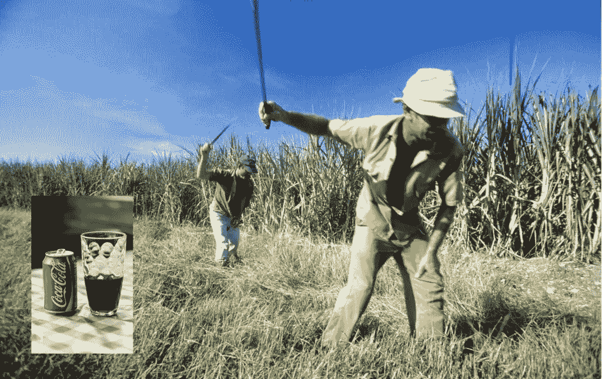

# 可口可乐将利用区块链来防止其供应链中的劳工权利滥用

> 原文：<https://medium.com/hackernoon/coca-cola-will-use-blockchain-to-prevent-labor-rights-abuse-in-its-supply-chain-ac31e6277ee7>

如果当你听到“区块链技术”这个词时，你首先想到的是比特币，那么很明显，你一直在沉睡这个领域的进展。

一个简单而有效地应用区块链技术的好例子是为工人创建安全的注册表，这有助于防止侵犯劳工权利和强迫劳动。美国国务院上个月宣布，他们正与可口可乐和其他两家公司合作启动一个项目，该项目将利用区块链为工人创建一个安全的注册表，以在全球范围内打击强迫劳动。

# 打击劳工权利滥用的透明度和问责制

尽管区块链仍因其在以太坊(Ethereum)或比特币(Bitcoin)等加密货币中的应用而闻名，但总账技术还有其他应用，可以用于超越经济和金融这一狭窄领域的社会和人文目的。例如，可口可乐注册代表了国家当局与区块链项目的首次积极合作，该项目具有法律、金融、经济(和经济)以及社会影响。

根据非营利组织[区块链信任加速器](https://trustaccelerator.org/)的说法，目标是利用账本技术来保证透明度和问责制。新技术的使用应该以安全的方式验证像可口可乐这样的大公司的工人的合同。 [Bitfury](http://bitfury.com/) 和 Emercoin 的作用是开发和部署实施项目所需的区块链。

美国国务院还在劳动法和工人保护领域发挥咨询作用。此外，副助理国务卿斯科特·巴斯比(Scott Busby)在一封公开信中指出，区块链技术不能强迫任何人改变现有的合同。尽管如此，这种技术方法将导致充分的举证责任，以便带来工作条件的长期变化。

根据国际劳工组织的数据，全球约有 2500 万人从事强迫劳动。这些人中大约有 47%生活在工作条件特别恶劣的亚洲地区。近年来，由于对甘蔗种植园工人的工作条件缺乏控制，像可口可乐这样的饮料生产商的形象受到了严重损害。为了迅速改善工作条件，可口可乐公司承诺与美国国务院合作消除这一问题。

> 我们在[行为交易所](https://behaviour.exchange/?utm_source=medium&utm_medium=article&utm_campaign=awareness&utm_content=Coca-Cola%20will%20use%20blockchain%20to%20prevent%20labor%20rights%20abuse%20in%20its%20supply%C2%A0chain)利用区块链重新发明在线营销。