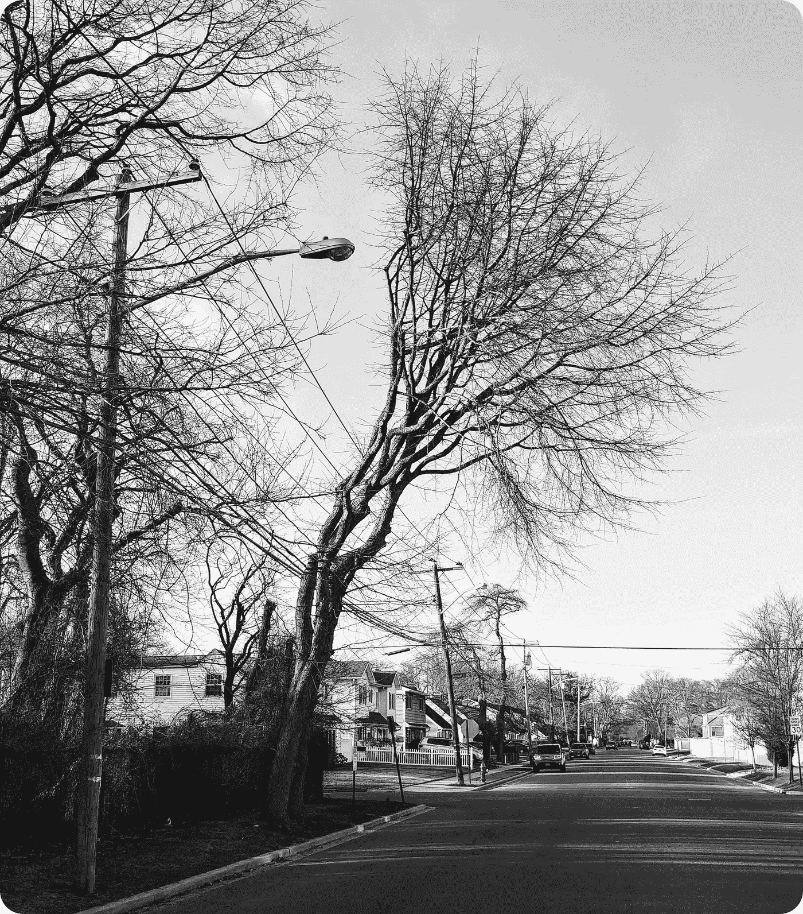
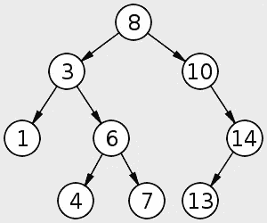
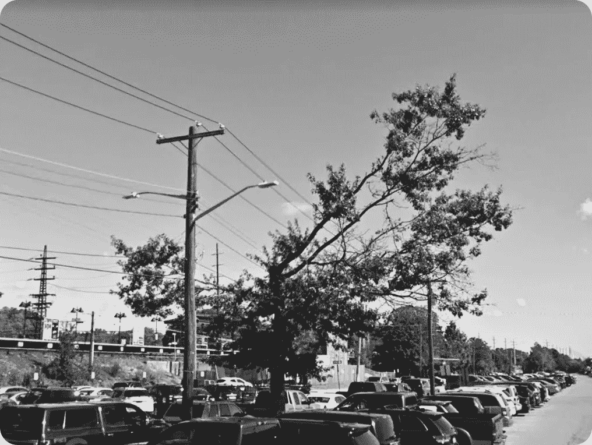
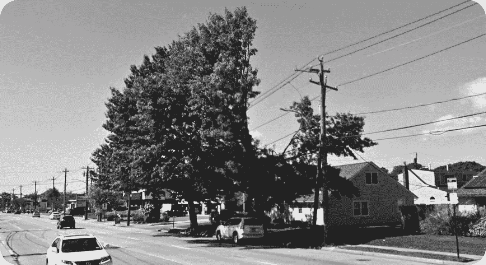

# 尾声:从我们周围的结构中学习

> 原文：<https://medium.com/hackernoon/coda-learning-from-structures-around-us-25052243e1a7>

## 从我们的环境看软件工程

A tree in the neighborhood.

我家附近的树似乎长得不自然。他们看起来像病态扭曲的生物。它们丑陋的原因与它们靠近电线有关。它们的接近在美国东北部很常见，那里的树木存在于道路用地上，并且存在极端的天气模式。

公用电线有被树枝折断的危险，因为它们很容易被挂在电线杆上。结果是能源公司必须按照精确的距离规格修剪树木。修剪降低了树枝接触这些电线的风险，并允许进行维修。当天气不好时，修剪可以保护线。然而，结果是难看的不平衡的树。

# 树木科学

在计算机科学中，我们使用隐喻。科学是抽象的，[建造是虚拟的](/hackernoon/software-is-unlike-construction-c0284ee4b723)。大多数发展，如果我们称之为发展的话，是看不见也摸不着的。不管怎样，我们需要交流基于我们世界的所见所闻。我们必须描述什么是有效的。我们必须讨论最大值和最小值，时间和空间。

A binary search tree.

搜索数据是我们科学的基础。为此，我们用结构来组织数据。树是一种抽象数据类型。它看起来像一棵活树，但倒过来了，因为根在顶部。我们使用树来组织数据，以便可以有效地对其进行排序和搜索。树会像真正的树一样有类型和味道。

一棵*不平衡的树*比喻描述一个不需要的结构。该结构对于搜索它包含的数据不是最佳的。不平衡的树被天真地种植和修剪。由于它们不受限制的高度，它们开始减慢我们的速度。它们的一边变得太高了。

# 如何平衡一棵不平衡的树

为了保护用户免受服务中断的影响，电力部门左右逢源。他们在风险较大的地方进行削减。结果是不健康的树很难看。他们认为这棵树在履行它的职责，但事实上，它在努力生存。

Courtesy: Google

随着病树的生长，有一些方法可以通过编程来挽救病树。根据树的不同，我们可以横向、向左旋转、向右旋转或双旋转。我们试图平衡这棵树，使它健康。它的结构变得比现在的形状更紧凑、更漂亮、更优雅。

如果不平衡的树前面有足够的空间，就有办法在根部解决它们的枯萎病。我们砍掉并重新开始。我们在下一轮中聪明地种植新树。

# 学习的线索就在我们身边，等着我们去利用

为了给公用事业管线让路而砍伐树木引发了冲突。对这一观察的抽象表明社区和技术在争论。如果其中一种生长不当，就很难补救，因为两者是相互支持的。

Courtesy: Google

[计算机科学](https://dev.to/solidi/what-is-a-software-engineer-anyway-3fb2)的美妙之处在于*我们可以根据我们的物理观察发明和培育结构。一种古老的树木修剪技术，如*打顶*或更现代的技术，如*落叉*可能适用于计算机科学。架设或铺设的公用事业管线也可能有它们的类似物。他们是如何一起工作的可能会引起研究人员的兴趣。*

信息是*看看外面，学习和应用我们观察到的东西。*询问是否有机会将一个结构或系统转化为美观和高效的杠杆。如果我们接受这个问题，就有机会获得结构发明的机会。