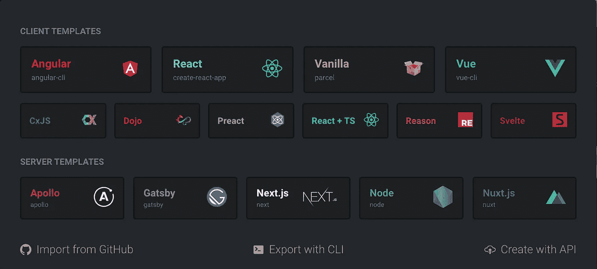
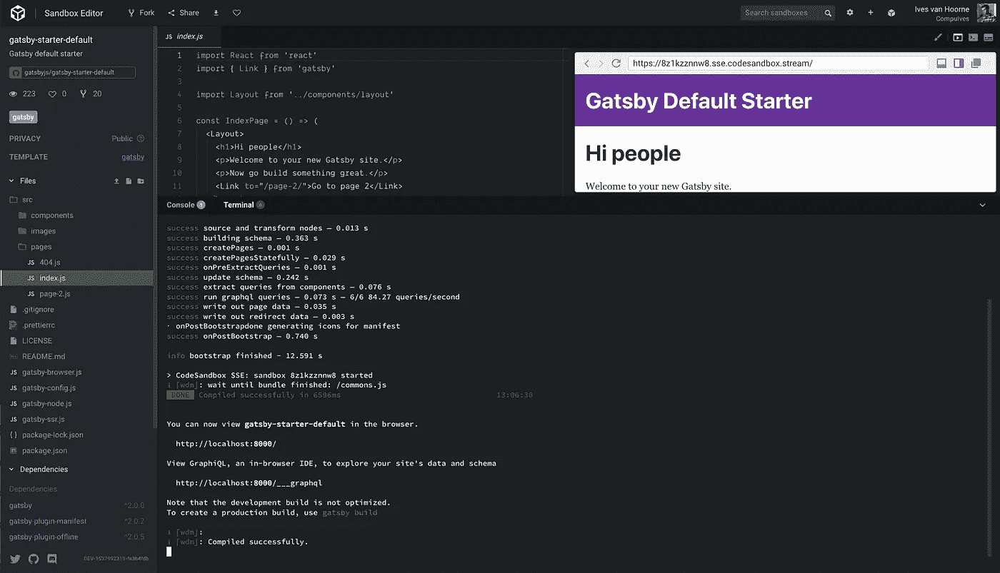
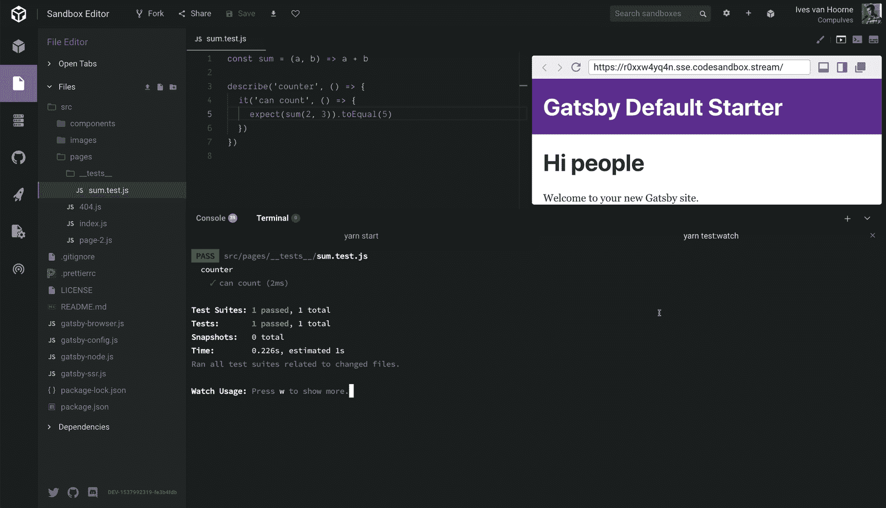
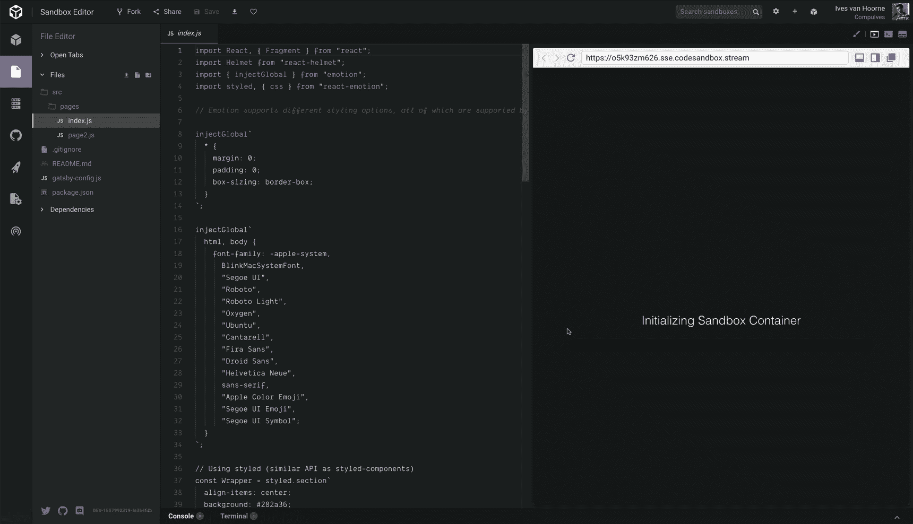

# 宣布 CodeSandbox 容器

> 原文：<https://medium.com/hackernoon/codesandbox-containers-5864a8f26715>

CodeSandbox 通常用于创建新网站或快速编辑现有网站。到目前为止，这仅适用于遵循默认模板布局的项目，如果您想要更改 webpack 配置之类的内容，您必须在本地继续。嗯，不再是了！

今天我们很高兴宣布 **CodeSandbox 容器**。我们在服务器上执行你的代码，这允许你在本地工作的任何 JavaScript 项目上工作。

想尝试新的 GraphQL API 服务器吗？那是可能的！想在你的盖茨比博客上快速添加新文章吗？你可以从 CodeSandbox 的 GitHub 集成中完成。

随着这次更新，我们想宣布在这个系统上运行的新模板。每个人现在都可以在 CodeSandbox 中使用 **Next.js、Gatsby、Nuxt.js、Apollo Server、Node 和 ReasonML** ！我们为这些模板提供一流的支持，但你仍然可以在 CodeSandbox 上运行任何你想运行的东西。您可以在这里创建一个[新项目。](https://codesandbox.io/s)

# 运行任何项目

到目前为止，我们已经在浏览器中执行了所有代码。这有很多优点:它很快，可以离线工作，而且我们的服务器几乎没有负载。还有一个相反的情况:你将无法直接运行 node。

使用 CodeSandbox 容器，我们在服务器上执行您的代码，这允许您运行任何项目，而无需检查我们是否支持它。我将介绍专门添加到 CodeSandbox 容器的所有主要特性。

## 看看在开发服务器上会发生什么

我们为工具栏引入了一个名为“终端”的新视图。这个视图将显示沙盒启动时`yarn start`的输出。

## 运行任何 NPM 脚本

我们还在边栏中引入了一个新的面板，称为“服务器控制面板”。该面板让您有机会在终端中运行`package.json`中指定的任何脚本。有了它，你可以快速地 lint 或运行测试或任何其他脚本。

Running jest:watch to test the sandbox

这不仅适用于 npm 脚本。你也可以打开一个 bash shell 来探索沙盒！请注意，我们确实监控沙箱，如果我们注意到任何有害的行为，我们可以阻止您的帐户。

Running some bash commands

# 模板丰富！

我们希望你和我们一样对这次更新感到兴奋。最好的事情是，你可以使用这些新模板我们现有的所有功能！例如，您可以**在 Gatsby 模板上与其他人进行实时协作**或**使用我们的 GitHub 集成为您的 Next.js 网站快速创建新帖子**。

去这里看看我们完全支持哪些模板:[https://codesandbox.io/s](https://codesandbox.io/s)。

## 原因

我们添加的一个模板是 ReasonML！我们不在服务器上执行 ReasonML，而是在浏览器中执行。我们仍在测试 Reason，可能需要您的帮助，所以如果您发现任何问题，请不要犹豫，给我们发送问题！

# 贝塔和谢了

只有当我们有其他人使用 CodeSandbox 容器时，我们才能完全测试它。所以我们目前给出的警告是 **CodeSandbox 容器处于测试阶段。**请不要将它用于任何包含您不想公开的文件的项目。服务也有可能因为我们还没有预见到的事情而关闭，在这种情况下，你会看到一个很好的警告消息。如果你注意到这种情况，并想知道发生了什么，你可以在这里找到我们。

我们将在接下来的几个月里致力于消除我们能找到的每一个 bug，当我们认为 CodeSandbox 容器足够稳定，可以消除测试警告时，我们将会宣布这一点。在不久的将来，我们还将致力于更多关于容器的文档，这样在客户端和服务器沙箱之间的差异上就不会有任何混淆。

还没有办法将终端的更改同步回沙箱本身。这是我们的首要任务，我们会尽快完成！

我们目前对免费账户有 5 个服务器沙盒的限制，我们对[顾客](https://codesandbox.io/patron)账户有 15 个服务器沙盒的限制。这些限制可能会改变。

## 谢谢

我们从二月份开始就一直致力于这项功能，现在我们非常高兴能与大家分享这项功能。

有些人值得为此付出巨大的感谢。

Thanks to Bogdan and Gatsby!

我们要感谢 [**波格丹一世·卢卡**](https://twitter.com/lucabogdan) 为 CodeSandbox 容器构建了整个*基础设施，这是一项令人难以置信的事业，他成功了。*

*我们也要感谢 [**盖茨比**](https://www.gatsbyjs.org/) 激励我们开始这个项目，感谢他既是我们的顾问又是这个项目的资助者。凯尔·马修斯和萨姆·巴格瓦特非常支持我们，帮助我们考虑所有事情，同时也解除了我们其他的担忧。*

*我想以我们新的集装箱装载屏幕来结束。😃*

**