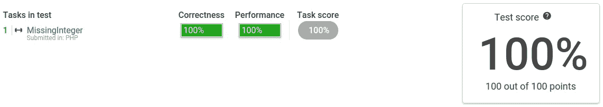

# 条件演示测试解决方案

> 原文：<https://medium.com/hackernoon/codility-demo-test-solution-3b01edb7b3c4>

最近我遇到了一个[codi ity 演示任务](https://app.codility.com/demo/take-sample-test/)。我觉得在这里发帖很有意思。

起初，我想用一个[贪婪算法](https://en.wikipedia.org/wiki/Greedy_algorithm)，追踪最小正整数*至今*。取以下数组:[1，3，6，4，1，2]。我们来迭代一下。第一个数字是 1。所以目前不在这个数组中的最小整数是 2。然后就是 3。所以目前不在这个数组中的最小整数仍然是 2。一切都很好，直到我最终在这个数组的末尾遇到了 2。那么，我该如何用这种方法得出答案——5——呢？嗯，恐怕在这里根本行不通。所以很明显，我需要记住所有遇到的数字。

发现它们的最好方法是什么？首先想到的方法是建立一个模式数组，有点像筛子，它包含给定区间内的所有正整数。如果它的键与值一致，那就非常方便了。因此，对于我在输入数组中遇到的每个整数，我在模式数组中找到一个对应的键，并将其值标记为，比如说，null:

```
$pattern = *range*(0, 100000);

**foreach** ($a **as** $value) {
    $pattern[$value] = **null**;
}
```

之后，我需要做的就是迭代它，找到第一个非空值的键。但在此之前，我想确保我不会得到 0 作为答案，因为它不是一个正整数。所以我取消了模式数组中的第一个元素。还有一个边缘案例。如果我得到给定区间[1，100000]内的所有整数会怎么样？答案应该是 100001。所以我创建了一个模式数组，它的上确界等于 100001:

```
**function** solution(**array** $a) {
    $pattern = *range*(0, 100001);

    **foreach** ($a **as** $value) {
        $pattern[$value] = **null**;
    }

    **unset**($pattern[0]);

    **for** ($i = 1; $i <= *count*($pattern); $i++) {
        **if** (!*is_null*($pattern[$i])) {
            **return** $i;
        }
    }
}
```



瞧啊。