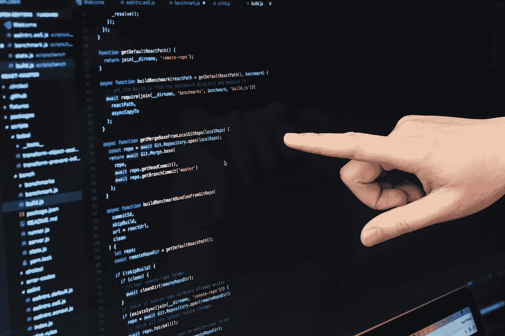
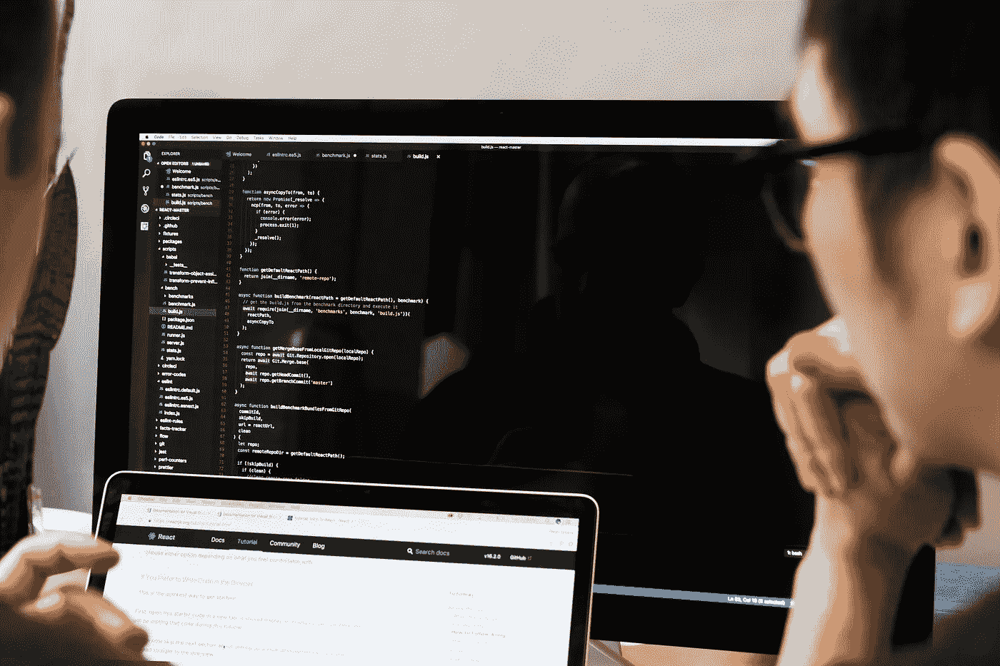
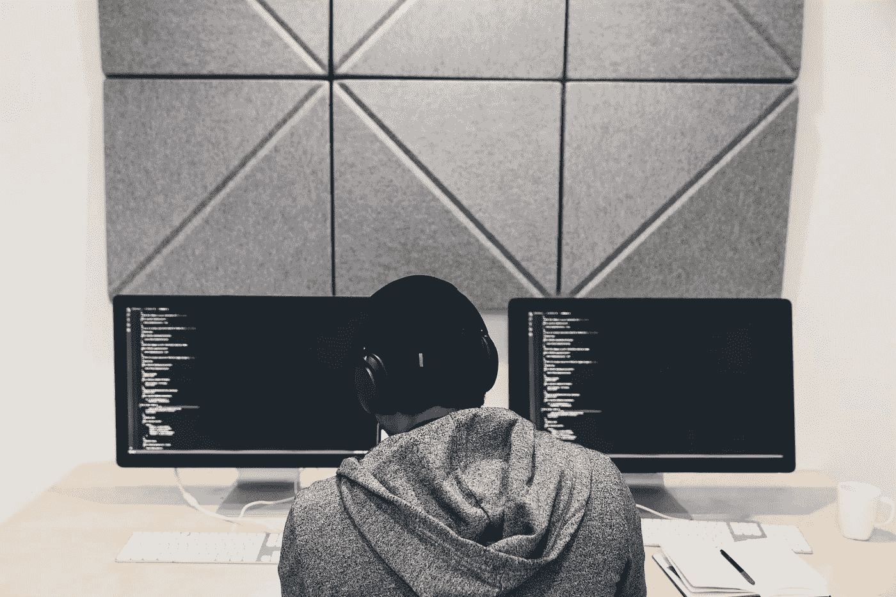

# 突发和黑客中午免费编码图像

> 原文：<https://medium.com/hackernoon/coding-images-cc6e6d68661e>

# 为了帮助世界各地的现代设计师、博主、营销人员和企业家， [Burst](http://burst.shopify.com) 与[黑客 Noon](http://hackernoon.com) 合作，创建关注新兴技术的库存照片集。

B urst & Hacker Noon 最新的免费图片集，重点是编码。在这里，你会发现软件程序员在他们的电脑上的免版税图像，写有代码的笔记本电脑屏幕的特写，在办公桌前工作的 web 开发人员。[点击此处查看收藏，并为您的下一个项目下载我们的高分辨率图片](https://burst.shopify.com/coding)！

从下面的集合中查看我们的编码(HTML，CSS，PHP，Javascript)图片。[访问 Burst 免费浏览下载全集](https://burst.shopify.com/coding)。

> 在黑客正午博客上阅读关于 [Ruby on Rails](https://hackernoon.com/tagged/ruby-on-rails) & [全栈](https://hackernoon.com/tagged/full-stack) [Javascript 代码](https://hackernoon.com/javascript/home)|[下载高分辨率](https://burst.shopify.com/photos/reading-about-code-on-hackernoon)

> 两人学习代码| [下载高分辨率](https://burst.shopify.com/photos/two-people-learning-to-code)

> 手指指向 Javascript 代码| [下载高分辨率](https://burst.shopify.com/photos/finger-pointing-at-javascript-code)

> 开发者审核代码| [下载高分辨率](https://burst.shopify.com/photos/developer-reviewing-javascript)

> 程序员专注于代码| [下载高分辨率](https://burst.shopify.com/photos/programmer-focused-on-code)

> 女人的双手编码| [下载高分辨率](https://burst.shopify.com/photos/womans-hands-working-on-laptop)

> 软件开发人员用 PHP 编码| [下载高分辨率](https://burst.shopify.com/photos/software-developer-on-php-code)

> 两个女人在笔记本电脑上编码| [下载全分辨率](https://burst.shopify.com/photos/two-women-on-laptop)

## 什么是爆裂？

[Burst 是一个免费的图片分享网站](https://burst.shopify.com/)，由 Shopify 提供支持。我们的图书馆包含 [1000 张高质量和免版税的图片，可供免费下载](https://burst.shopify.com/)。Burst 旨在帮助设计师、开发人员、博客作者和企业家创建令人惊叹的网站、营销活动和项目。

## 黑客正午是什么？

[黑客中午](https://hackernoon.com)是黑客如何开始他们的下午。这份在线出版物有 5，000 多名投稿作者，180，000 多名每日访客，& 8，000，000 多月浏览量。他们发表跨越各种各样技术的高质量故事:[人工智能](https://hackernoon.com/artificial-intelligence/home)，[区块链](https://hackernoon.com/blockchain/home)，[比特币](https://hackernoon.com/bitcoin/home)， [javascript](https://hackernoon.com/javascript/home) ，[编程](https://hackernoon.com/tagged/programming)，[软件开发](https://hackernoon.com/tagged/software-development)，[自动驾驶汽车](https://hackernoon.com/tagged/self-driving-cars)，[风险投资](https://hackernoon.com/venture-capital/home)和[更多](http://hackernoon.com/latest)。

## 我如何下载照片？

要下载照片，请右键单击以上任何图像，然后选择“保存图像”。对于照片的高分辨率版本，单击链接，您将被定向到我们的下载页面。

## 我可以用这些照片做什么？

你可以将这些图片用于任何事情——你的博客或在线商店上的英雄形象、学校项目的背景、社交媒体活动的照片、客户工作等等。可能性是无限的！

## 我能编辑照片吗？

是的。你可以随意编辑这些照片，比如添加文字或滤镜。欢迎您添加您的徽标或品牌，并制作您自己的照片。

## 我需要信任网站或摄影师吗？

由于我们的免版税许可证，没有必要归功于突发或摄影师。但是，我们鼓励您尽可能以原始照片页面链接的形式提供署名(例如“Nicole De Khors 的照片”)。

## 我可以将这些照片用于商业目的吗？

是啊！事实上，我们非常鼓励这种做法，因为我们的许多产品系列都是以企业家为设计理念的。你可以在你的网上商店、产品包装或任何你喜欢的地方使用这些免费照片。你甚至可以用这些照片来制作 t 恤、杯子或其他产品。

> Burst 为您的下一个项目准备了数千张高分辨率、免版税的图像。
> 
> [浏览照片](https://burst.shopify.com/free-images)