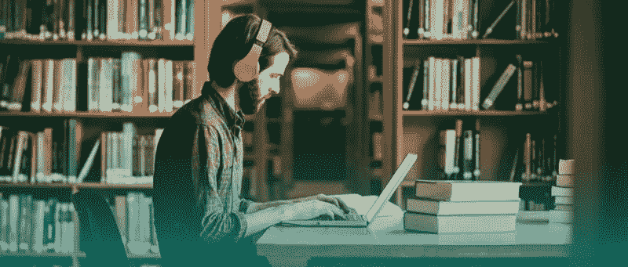
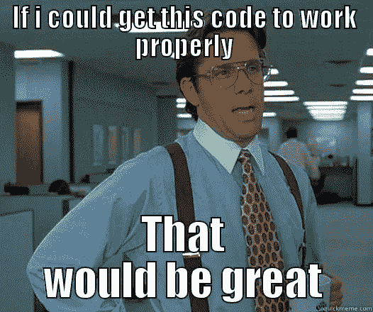
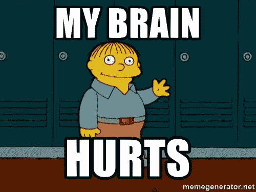
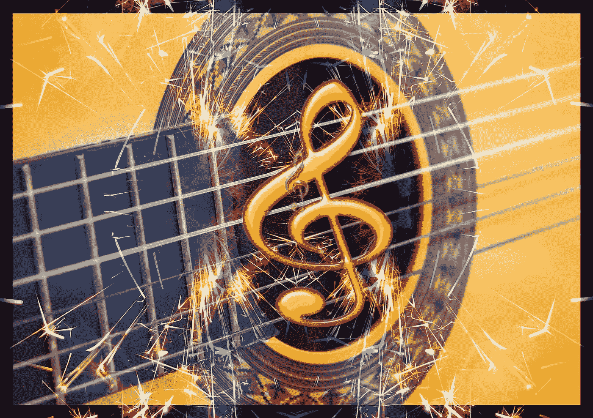
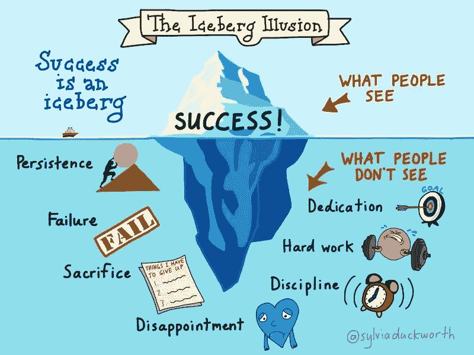

# 为什么编码对许多人来说是一个困难…

> 原文：<https://medium.com/hackernoon/coding-the-word-that-is-being-thrown-around-by-almost-every-tech-geek-from-student-to-developer-e91f512831a4>

从学生到开发人员，几乎每一个技术极客都在谈论编码这个词，它无疑是前进的方向。从小我就对“编码”这个词着迷，从此与这个词结下了不解之缘。看看 code.org 的[和 T4](http://code.org)关于“编码不难”的视频，这会让你深入了解像马克·扎克伯格、比尔·盖茨等著名的科技人是如何。开始了他们的职业生涯。许多人害怕编码，因此我想分享我的观点和经验！

我仍然记得我在五年级的时候，我们第一次开始用 QBASIC 语言编写代码，这是孩子们可以理解的基本编程语言。运行任何语言的“Hello World”程序的狂喜是无与伦比的，我的情况也不例外。我记得我在实验室大声喊我的老师，她认为我做了一些严重的软件故障，因此我可能吓坏了！我当时就知道，这将是我想要追随的激情。但是我没有意识到我将在这段旅程中面临的艰辛！

我学到的下一件重要的事情是 **HTML** 和 **DHTML** (我确实意识到这些不是编程语言，所以请不要反对):p .每一行都有那些<角>括号，语法看起来很简单，同时也很奇怪。这仍然不是那么令人生畏，因为我得到了它的窍门。

然后进入了 **Java** 我的生活。那个时候流行的行话，每个人都在谈论它。我阅读了各种关于 Java 的博客和网站，我所发现的只是更多的技术复杂性。这让我对 Java 失去了兴趣。那些帖子让我很沮丧。因为这是我学校课程中的必修课，我不得不这么做。然而，随着时间的推移，我开始爱上了 Java！是的，你没看错！随着我不断实践越来越多的程序，并开始理解这些程序运行背后的逻辑，我感到越来越自信。我真正的测试是在我们必须为我的委员会考试提交项目时完成的。在这个时候，我开始面对真正的挑战。实际上我应该自己做一个项目？什么？你在开玩笑吗？我的情况是这样的:

I guess every developer goes through this stage right?

但我一点也不知道，这将是我编码热情的燃料！随着我开始探索教学大纲之外的东西，我学到了更多。有几次，我无助地浏览网站，因为我无法用结构化的方式表达我所面临的困难。我设法打破了学校教学大纲的束缚，将我的视野扩展到 Java 为我提供的新事物上！我最终开发了一个银行应用程序(听起来可能有点傻，但我那时已经开始探索了)，全体教员都印象深刻！我在计算机科学上得了 100 分，这将永远伴随着我。这是启动“编码激情”之车所需的点火装置。

学习如何编码让我意识到我以前没有怎么用我的大脑，现在我实际上在用我的大脑，这很痛。这就像你第一次去健身房，你的肌肉真的很痛。但最终，如果你经常去健身房，你会找到窍门的。[编码](https://hackernoon.com/tagged/coding)是大脑的健身房！不断接触编程概念，以及一般的编码，有助于缓解“疼痛”并建立“大脑肌肉”。这种经历会让你习惯这种新的、难以置信的思维方式，并且变得“不那么困难”。

And my eyes too?

快进到我计算机工程的第一年。像每所大学一样，我们也是从 c 语言编程开始的。我对教学大纲不感兴趣，因此开始探索新的领域，并继续探索 Java。看到世界上的编程语言如此之多，以及每个人都如此热情地忙于开发它们，我既着迷又吃惊。我继续学习 Git、互斥、文件处理等概念。并开始探索新的语言，如 **Python、Julia** 和 **Rust** 。

我先从 Python 开始。它帮助我将编码可视化并与英语含义联系起来，以便在现实生活中理解它，这要感谢像 Python 的语法这样简单的句子！

今天的一代是关于维护开源编程语言的，开源技术的发展有了很大的进步。我觉得这绝对是我的武器库中应该有的东西！当我开始探索铁锈时，我大吃一惊。了解 GitHub 上的文档和代码？这是我以前从未做过的事情！我在这件事上尝试了很多，但暂时还是算了吧。但这并不意味着我不会回来拿！

咨询了一些厉害的学长后，我才知道 CS 不等于编码。在计算机科学领域有一个广阔的宇宙！不仅需要懂编程语言，还需要知道如何使用各种工具和框架来轻松开发！

于是，我开始学习机器学习和深度学习，工业革命 4.0 的流行语！不过，还是把这个关于我大二计算机工程至今为止在机器学习和深度学习方面的历程的讨论留在另一篇帖子里吧！现在让我们试着分析我们在编码中面临的问题以及如何克服它们:

# 1.我被语法吓倒了。

对于新手来说，是的，刚开始被吓倒是绝对正常的！毕竟，这就是你的开始！

只有通过练习，你才能适应任何事情。没有什么是容易的，你需要为之努力。只有通过努力和实践，你才能克服**的技术恐惧症。是的，这是一个真实的事情，甚至当我第一次听说技术恐惧症时也很惊讶。**

# **2.永不放弃的态度。**

****

**The 16 time world champion!**

**虽然*约翰·塞纳*是一个如此受欢迎的模因人物，但他的话绝对不是。你应该在编码中“永不放弃”,并且不断地敲打你的指关节和逻辑以产生结果！**

**帕特里克·麦肯齐的这句话是我最喜欢的一句:**

> **你认识的每一个伟大的开发人员都是通过解决他们没有资格解决的问题，直到他们真正去做了。“- ***麦肯齐*****

**如果你完全放弃，你将永远学不会如何编码，我说的对吗？**

**一旦你明白了这一点，你就会看到你在学习过程中将会经历什么，因为这有点丑陋，但最终也非常令人满意。**

# **3.像爱好一样对待编码。**

****

**Musicians can be great developers? Wow.**

**你在闲暇时间做你喜欢做的事情，不是吗？各种研究发现，接近你还不喜欢或还不理解的事物，如果以不同的方式接近，往往会让你喜欢它并很好地理解它。最有效的方法之一就是把它当成一种爱好！你通常在闲暇时间做什么？放音乐？跳舞？在桃乐茜·伊夫的这篇文章中，她描述了编码就像音乐一样。把编码和爱好联系起来，绝对值得一读！**

# **4.我被卡住了，我该如何走出这个漩涡？**

**嘿伙计冷静点。没有必要惊慌失措。看看你周围。和和你一样刚入行的同行聊聊。也许他们已经解决了你没有解决的问题，反之亦然！不要羞于向你的长辈伸出手，问哪怕是最愚蠢的问题，因为他们和你一样经历过相同的阶段，他们不会评判你！此外，还有大量的在线资源，如 Reddit、T2、StackOverflow、T4、GitHub 和许多其他资源，可以帮助你解决你遇到的几乎任何问题。你必须足够幸运，才能产生一个这个庞大的互联网社区还没有解决的新问题！**

**永远记住冰山错觉！**

****

**The reality of life.**

**好吧，祝贺你能坚持到现在！这是我的第一篇文章。如果你能与我和我的经历联系起来，请传播这篇文章来帮助一个新人进入这个令人兴奋的编码世界，如果你愿意的话，我一定会很感激你的掌声！不要忘记分享你的社交账号！😉**

**别忘了查看我的[博客网站](https://arghyadeep1899.wixsite.com/home)了解更多内容！**