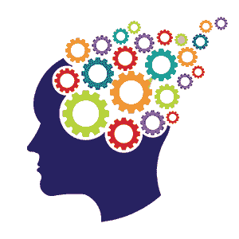
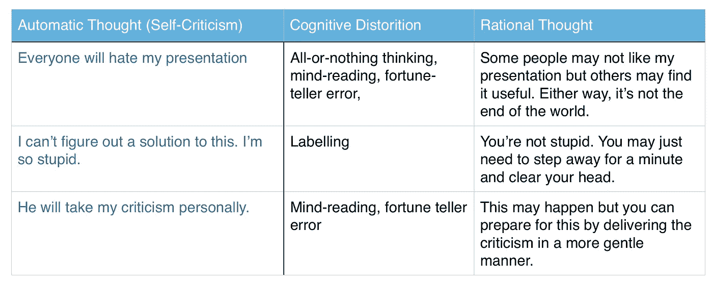

# 面向开发者的认知行为疗法(CBT)

> 原文：<https://medium.com/hackernoon/cognitive-behavioural-therapy-cbt-for-developers-f170826cac5c>

前几天，我参加了一个非常有趣的聚会，名为“面向技术领导者的认知行为疗法”。这个讲座由 Jamie Strachan 主持，他做了 15 年的开发人员，现在在 Info-Tech Research Group 管理一个开发团队。在与自己的抑郁症斗争的过程中，他被介绍给了大卫·D·伯恩斯的[书](https://hackernoon.com/tagged/book)《感觉良好》，在那里他发现了 CBT。

虽然我自己不是技术专家，但我对这个话题很感兴趣。我有神经科学背景，在各种心理学课上花了无数时间，我想知道 Jamie 是如何使用 CBT 来帮助他的开发伙伴提高日常效率的。

CBT 是我们的思想决定了我们的情绪。因此，改变我们的思维方式，将会改变我们对一次经历的感受。CBT 通常用于治疗抑郁症和其他精神疾病，但 Jamie 概述了 CBT 如何用于克服常见的挑战，如拖延症、完美主义或处理批评。

现在，在我们进入 CBT 如何帮助克服这些挑战之前，我们需要了解我们的大脑如何欺骗我们得出消极的结论。这些“技巧”或认知扭曲是不准确的想法，强化了消极的思维模式或情绪。这本质上是一种错误的思维方式，它让我们相信一些事实，而事实并非如此。有许多认知扭曲，但杰米指出了其中的一些:

1.  情感推理——我们相信我们的感觉必然是真实的。我们相信这些不健康的情绪反映了事情的真实情况。

T4:因为我感到不知所措，所以我一定是面对了什么压倒一切的事情。

2.全有或全无思维——如果我们在某个领域表现不佳，我们会认为自己是个彻底的失败者。

我不能很快地学会这种语言，因此作为一名开发人员我很失败。

3.“应该”陈述——我们有一套关于我们应该如何表现的严格规则。我们认为这些话在针对我们自己的时候是激励人心的，然而它们经常会留下内疚、沮丧和失败的感觉。

我真的应该锻炼了。

5.妄下结论(读心术，算命师的错误)——即使没有确凿的事实令人信服地支持我们的结论，我们也会得出否定的结论。

a.读心术——你武断地断定某人对你有负面反应。

她今天早上没有跟我打招呼。她一定不喜欢我。

*b.)* 算命先生的错误。—你预期事情会出错，并且你确信你的预测是既定的事实。

我的年终总结肯定会很糟糕。

4.灾难化/放大或最小化——我们预计最糟糕的情况会发生在一个本来不是大问题的小事件上。

T2:我犯了一个错误，现在整个项目都毁了，我会被解雇。

5.)标签——我们将一两个品质归纳为负面的整体判断。

T4:我甚至不能帮他找到解决办法。我是个白痴。

杰米接着解释了这些认知扭曲是如何与我们在工作场所和个人生活中面临的一些日常挑战交织在一起的。

# 至善论

完美主义被描述为对自己和/或他人设定极高且通常不合理的期望。通常，你的自我价值是基于你努力达到这些标准的能力。完美主义涉及“要么全有要么全无”的思维；如果一个东西不“完美”或者达不到某个标准，那它就是没用的。

杰米一提到这个，我立刻想到了我自己生活中的一个例子。当我开始构思我的个人网站时，我查阅了许多别人做过的例子。我会最终选定一个想法，并开始为之努力，但随后我会看到别人做得更好的东西，并放弃我的想法。这种情况发生了无数次，因为我觉得我的工作并不“完美”，没有达到我为自己设定的标准。即使在我建立了网站之后，我仍然会沉迷于我可以包含的各种变化或改进。

当然，想要改进你的工作是一件好事，但当它妨碍了其他更重要的任务时就不是了。就我而言，我有其他编程语言要学，提高我的编码技能比建立一个看起来很酷的作品集网站重要得多。

# P 旋转

考虑下面的场景。一个项目的最后期限快到了，而你几乎还没有开始工作。你对此感到焦虑，所以你发现自己在浏览 Pinterest，看电视，甚至打扫房间，所有这些都是为了逃避任务，并暂时从焦虑中找到一些缓解。一旦最后期限到来，你会因为浪费了这么多时间而感到极度内疚和羞愧。你又一次求助于电视来关闭那些消极的感觉，现在你陷入了一个恶性的自我挫败的循环中。

我相信每个人在人生的某个阶段都会经历这种事情。我们的大脑很擅长误导我们。在这种情况下，我们使用情感推理。我们感到焦虑和不知所措，所以我们必须面对一个令人生畏的任务。

# 我正在处理批评

在任何工作场所，你的工作都会在某个时候面临别人的审视和批评。希望这将是建设性的批评，并导致项目的整体改善。能够接受他人的批评而不感到愤怒、沮丧或内疚是很重要的。

老实说，我不是那种善于应对批评的人。对我来说，接受批评会让我直接说出“应该”的话。“我早该知道的。”"我应该发现那个错误的。"“我本该更加努力的。”这些说法经常会导致内疚和挫败感。

那么我们如何改变这种思维方式呢？杰米说的第一件事是你需要测试你的感觉。感情也不一定会积极。然而，应该是有益的，合理的，理性的(基于现实)。这有助于您识别问题。接下来，用三栏法(见下文)把这些想法从你的头脑中清除出去。最后，不要害怕寻求帮助。

当然，这个话题比我希望在这篇文章中涵盖的要广泛得多，但是我希望它能激起你的兴趣。请查看杰米在 https://vimeo.com/253833709 的完整演讲