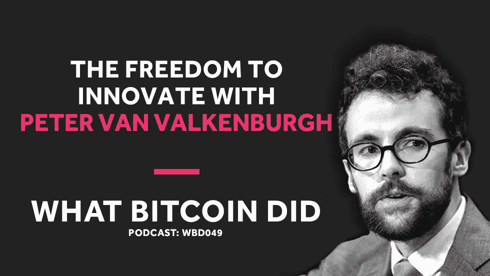

# 硬币中心的彼得·范·瓦尔肯伯格谈保护区块链公众的创新自由

> 原文：<https://medium.com/hackernoon/coin-centers-peter-van-valkenburg-on-preserving-the-freedom-to-innovate-with-public-blockchains-17b3a3bcd236>

## 音频采访转录— WBD049

***注:*** *以下是我采访钱币中心研究总监彼得·范·瓦尔肯伯格的笔录。我从翻译中使用 Rev.com，他们删除了嗯，错误和半句。我已经检查了转录，但如果您发现任何错误，请随时发送* [*邮件给我*](http://hello@whatbitcoindid.com) *。可以* [*在这里*](https://www.whatbitcoindid.com/podcast/coin-centers-peter-van-valkenburg-on-preserving-the-freedom-to-innovate-with-public-blockchains) *听原声录音。*

*你可以在这里订阅播客* [*听所有剧集*](https://www.whatbitcoindid.com/podcast/) *。*

在这一集里，我采访了硬币中心的研究主任彼得·范·瓦尔肯伯格。我们讨论了州与联邦立法、货币传输法规以及硬币中心如何利用公共区块链来保护创新自由。

联系比特币做了什么:
听:[**iTunes**](https://itunes.apple.com/gb/podcast/what-bitcoin-did-podcast-bitcoin-crypto-trading-strategy/id1317356120?mt=2)|[**Spotify**](https://open.spotify.com/show/0mWUJuONiilW5JSBBFZ0s7?si=5qcbjpjYSRyKpi8wycEZUw)|[**Stitcher**](https://www.stitcher.com/podcast/what-bitcoin-did)|[**SoundCloud**|](https://soundcloud.com/what-bitcoin-did)[**YouTube**](https://www.youtube.com/whatbitcoindid)|[**TuneIn**](https://tunein.com/radio/What-Bitcoin-Did-p1079869/)关注: [**网站**](https://www.whatbitcoindid.com/)

# **采访记录**

**面试日期:2018 年 11 月 20 日星期二**

> **“一个可以让数百万美元跨境流动的系统货币将会有一些令人不快的用途，它也会让世界变得更自由、更美好，并成为人类尊严的支柱。”**
> 
> **彼得·范·瓦尔肯伯格**

**彼得·麦科马克 **:** 谢谢你邀请我来这里。你好吗**

**[**彼得范瓦尔肯伯格**](https://twitter.com/valkenburgh) **:** 我很棒。谢谢彼得。谢谢你邀请我参加你的节目。**

**[**彼得·麦科马克**](https://twitter.com/PeterMcCormack) **:** 耶，很好。很高兴终于见到你了，特别是在看了你和 Nouriel 的参议院证词后，我会问你关于这个的问题。但是我今天想了解一下硬币中心，所以如果你能先告诉我，你的背景，你是如何成为硬币中心的一员的，以及为什么它对你如此重要，那会很好。**

**[**彼得·范·瓦尔肯伯格**](https://twitter.com/valkenburgh) **:** 当然，做这份工作最重要的两件事是法律和技术，因为硬币中心是一个专注于加密货币政策的非营利性倡导组织，所以从技术角度来看我的背景，我失去了三四年的时间，在那里我试图成为纽约市的一名演员。我的大多数朋友都是通过当服务员和照看酒吧来支付账单的，我也只是做了一点点，但后来我发现我可以自学网页设计，为他们建立所有的网站并收取费用。这就是我当演员时支付账单的方式，它让我进入了前端网络编码，也让我更深入地了解了我一直热爱的互联网。**

**[**彼得·范·瓦尔肯伯格**](https://twitter.com/valkenburgh) **:** 在认定这不是一条富有成效的人生道路后，你实际上只是想让人们接受你的简历，你一直在进行面试。几乎每一项你都会做得很糟糕，或者被拒绝。我决定，“好吧，我应该去拿个真正的学位。”所以我去了北弗吉尼亚，我在那里长大。当时这是在纽约。但我搬回了北弗吉尼亚，去了乔治梅森大学，拿到了经济学学位。这也是我与包括杰里·布里托在内的一群人建立联系的地方，杰里·布里托是我们的执行董事。他在梅尔卡特斯中心，也在那里教法律课。**

**[**彼得·范·瓦尔肯伯格**](https://twitter.com/valkenburgh) **:** 然后我去了法学院，回到 NYU 大学，专注于互联网政策。这是我感兴趣的，因为我自学的技术背景和我对数字版权政策的强烈感受，以及我们不应该对那些在 YouTube 上分享 5 秒钟歌曲的人进行恶意中伤，并以法定赔偿等方式抨击他们。上世纪 90 年代末和 21 世纪初，我们有很多法律诉讼，大约是在斯诺登事件前后，所以我开始研究数字隐私法。所以我在法学院就专注于那些话题。**

**彼得·范·瓦尔肯伯格 **:** 我非常确定我不想在大律师事务所工作，因为即使你从事互联网法律工作，你也要为大版权所有者和类似的事情辩护。并不是说这有什么错。我们需要人来做这项工作。所以我想我应该去 DC 做宣传工作。我很幸运地获得了谷歌的奖学金。他们每年夏天都会举办一个很棒的活动，叫做谷歌政策联谊会。他们付钱让你在 DC 和其他地方与不同的公民自由组织合作。所以我这么做了。在一个叫做“技术自由”的很酷的智囊团找到了一份工作，这个智囊团专注于版权和电信法。然后，杰瑞，我说过我以前在乔治梅森认识他，他找到我说，“嘿，彼得，你想成为一个加密货币智囊团的研究主任吗？”实际上他说，“比特币智囊团。”当然是在那个时候因为当时发生的大部分事情。这是在 2013 年和 2014 年。我看着他，笑着说，“这太疯狂了。你这是在干嘛？”我说，“当然，我在哪里注册？这是有史以来最好的机会。”**

**[**彼得·范·瓦尔肯伯格**](https://twitter.com/valkenburgh) **:** 我之所以觉得这是一个正确的选择，显然我从来都不是那种规避风险的人，至少对那些通常非常规避风险的律师来说是这样。但是，我也认为互联网政策在很多方面都停滞不前了。网络中立是一个新的东西，关于它的大辩论，虽然这是一个困难的问题，一个真正的问题，我实际上没有一个强有力的观点，因为我有时不信任 FCC，但也不信任大型企业电信。我不知道如何找到一个好的前进方向，所以我从来不喜欢在这个问题上工作。**

**[**彼得·范·瓦尔肯伯格**](https://twitter.com/valkenburgh) **:** 但是版权和隐私法，这是在石头被揭露之后。《美国自由法案》正在推进，我们试图修正这些类似政府调查的政策，但进展非常缓慢和艰难，需要处理几十年来关于第四修正案的先例以及类似的事情，这些都是固定不变的。版权是合理的…它达成了一种合理的妥协，所以数字千年版权法案做了一些不好的事情，使允许你违反 TRM 的非法交易和材料，反规避预防，但这是一个妥协的法案。你也有安全港，通知和关闭安全港，这是允许博客有用户评论的事情。而用户的评论，如果侵犯了版权，也不会给博客维护者带来麻烦。**

**[**彼得·范·瓦尔肯伯格**](https://twitter.com/valkenburgh) **:** 类似，也有 YouTube。YouTube 不会有麻烦，只要他们把东西拿下来，即使他们的用户上传了侵犯版权的数据。我可能给了你太多的细节，但我认为这些法律问题在 2013 年处于停滞状态。2014 年，当我想在 DC 做一些关于互联网政策的事情时，比特币是一个完全的绿色领域或蓝色天空或开放的问题，尚未确定。不幸的是，当我在法学院的时候，我想，“哦，好吧，我就做互联网政策。”所以我上了很多版权课和隐私法课。我像躲避瘟疫一样避开金融课。也许这只是…我在纽约，我不想太沉迷于商业开发人员之类的事情。**

**[**彼得·范·瓦尔肯伯格**](https://twitter.com/valkenburgh) **:** 但是，这有点试错了，当我们在 204 年启动硬币中心时，我们立即在 bit 许可程序中向纽约州金融服务局提交了一份意见。那时候已经开始了。我认为我们帮助带来了一些有意义的改进，但我们仍然对它的出现非常不满意。我们开始研究资金传输许可。然后，我们逐渐意识到我们需要真正关注反洗钱和证券法。所以我在实践中学习，关于那些法律领域。我认为我们已经提出了非常好的政策，只要我们仍然能够执行这些法律，但尽可能多地开拓创新的自由，接受这些法律无论如何都将适用，并弄清楚它们如何适用于这些新奇的新事物，以前没有好的答案，因为这确实是新事物。**

**[**Peter McCormack**](https://twitter.com/PeterMcCormack)**:**好的，您认为密码行业目前的监管状况和监管机构的监督情况与互联网早期相比，是否非常相似？**

**[**彼得·范·瓦尔肯伯格**](https://twitter.com/valkenburgh) **:** 既相似又不同。相似之处是颠覆。创新者的困境。你看到的是那些不认为这是一种威胁的传统行业从业者。他们认为这是愚蠢的或与他们的商业模式无关的，或者是一些独立的东西，我认为他们正在变得惊讶，而且他们会越来越惊讶。从政策角度来看，也有类似的难题。就像那个版权问题，如果你运行 YouTube 和一个用户…你有数百万用户。例如，上传一个有版权的音乐视频。在以前的法律制度下，在数字千年版权法案之前，你可能会因为你的用户的行为而对侵犯该人的版权所造成的所有损失承担全部责任。**

**彼得·范·瓦尔肯伯格 **:** 你有数百万用户，所以……我不知道，一次违规可能要赔偿 200 万美元。乘以你的数百万用户，你不能在那个世界运行 YouTube。这种责任制度，在用户产生内容平台(如 YouTube 和脸书等)之前的世界里是合理的，但在互联网的新世界里就没有意义了，在这个新世界里，人们希望建立的网站只是会议场所，用户将提供内容。如果你相信版权，用户应该对侵犯版权负责，这是一个更大的话题。但是，这个开放平台应该为其用户的所有行为负责吗？希望不是，因为如果是，就不存在了。**

**[**彼得·范·瓦尔肯伯格**](https://twitter.com/valkenburgh) **:** 所以我们不得不在如何为中介创造责任的问题上达成妥协，这就是《数字千年版权法》，它说……通知并删除安全港说，“如果你看到有人侵犯你的版权，向中介提出索赔。他们会有一段时间来回应，然后如果他们觉得你的主张是合理的，就把它拿下来。如果你遵循这些程序，你，这个中介，你不需要为你因侵犯版权而招致的所有损失负责。”这使得运营这些网站成为可能，既有大型网站，如脸书和 YouTube，也有博客。**

**[**彼得·范·瓦尔肯伯格**](https://twitter.com/valkenburgh)T4:拿着这个，看看比特币。比特币之所以有效，是因为它是一个对等网络，在这个网络中，全世界的人都运行完整的节点，他们运行挖掘节点，并在对等网络上中继交易消息，如果他们正在挖掘，他们会执行工作证明，创建新的块，验证交易，并创建所有比特币交易的规范分类账。那些人正在这么做。他们这样做，是因为他们是自利的，尤其是矿工，不是真正的全节点，只是没有挖掘全节点操作符。但他们这样做，是为了创造一种公共利益。一个开放的平台，就像脸书或谷歌一样，或者在许多方面是一个开放的内容平台。区块链的比特币更加开放……因为它不属于一家公司，也不是区块链的数据平台。这通常只是比特币交易。但这没什么好嘲笑的，因为这就像是潜在的数字黄金，是一种不依赖任何人就能跨境转移资金的方式，这令人惊讶。**

**[**彼得·范·瓦尔肯伯格**](https://twitter.com/valkenburgh) **:** 一个可以粉碎这一点的责任制度，就像有版权的责任制度可以粉碎脸书和谷歌一样。这是什么？嗯，这是金钱传播许可法。例如，在美国，我们有州法规。所以每个州，除了蒙大拿州，奇怪的是…大天空。除蒙大拿州外，每个城市都有货币传输许可法，规定“如果您是货币传输者，除非您先来我们这里并获得许可，否则您不能对我们州的客户进行货币传输。”现在，他们对金钱传播者的定义非常广泛，在几个州都有，每个州都不一样，因为这是州法律，不是联邦法律。**

**[**彼得·范·瓦尔肯伯格**](https://twitter.com/valkenburgh) **:** 然后在几个州，一个矿工或某人运行一个完整的节点，如果你开始谈论多 sig 钱包，并持有三分之一的钥匙或类似的东西，上帝会帮助你。如果你在做这些事情，你可能是一个汇款人，这很愚蠢，因为汇款监管的目的是解决那些让你赔钱的可疑公司的问题。而一个矿工，尤其是刚刚跑满 node 的人，不可能丢了你的比特币。这才是重点。他们是点对点网络的一部分，在这里你信任整个系统和共识机制。你不相信任何一方。因此，向这些人发放许可证，除了让他们无法从事这种活动，因此至少在美国无法建立比特币点对点网络的一部分……除非你愿意违反法律，否则也不会解决这些法律应该解决的那种伤害。**

**[**彼得·范·瓦尔肯伯格**](https://twitter.com/valkenburgh) **:** 所以只是不适合。这有点像在互联网环境中，没有人希望有这种责任制度，这将使 YouTube 无法运行。州政府中没有人希望有一个责任制度，让人们无法运行比特币节点，但现有的法律，如果以错误的方式解释，会粉碎这件事。这就是为什么我们在硬币中心的第一个努力是与统一法律委员会合作，该机构为各州制定示范法，然后通过立法，并与各州合作，制定…要么对现有的货币传输许可法做出更好的解释，以明确说明如果您不能交易，您不需要为运行完整的节点或持有多 sig 中的密钥负责。或者，如果不重新解释州法律，创造新的州法律，统一法律委员会创造这个示范法案，各州现在正在考虑通过成为法律，将创造同样的结果。**

**[**彼得·麦科马克**](https://twitter.com/PeterMcCormack) **:** 那么，到底谁是汇款人还不清楚吗？**

**[**彼得·范·瓦尔肯伯格**](https://twitter.com/valkenburgh):嗯嗯(肯定)。不，不是的。不完全是。**

**[**彼得·麦科马克**](https://twitter.com/PeterMcCormack) **:** 但是，比如说，追求矿工就没什么意义，但是看看变形就可能有意义了？**

**[**彼得·范·瓦尔肯伯格**](https://twitter.com/valkenburgh) **:** 好了，一堆东西在那里。追究矿工是没有意义的，我们还没有看到国家追究矿工，但我认为这还不够好。我们这个国家有法治，不应该有一把剑悬在你的头上，即使它永远不会掉下来，它也不应该在那里。所以，你可以把这些法律解释成包括采矿这样的事情，这是一个真正的问题，尽管我们还没有看到各州试图这样做。现在，像 Shapeshift 这样的公司，或者像比特币基地这样的公司，或者像 Circle 这样的公司，我们认为，在硬币中心，问题的核心通常应该是，如果你持有消费者资金的托管权，那么你就处于被信任的地位。你可能会被黑客攻击，你可能会有糟糕的内部控制，你可能会有腐败的人为你工作，或者你的系统可能会大规模崩溃，你会损失人们的钱。这就是州货币过渡许可制度要解决的问题，因为西联汇款会让你血本无归。**

**[**彼得·范·瓦尔肯伯格**](https://twitter.com/valkenburgh) **:** 因此，如果你正在做的事情让你处于被信任的地位，那么就应该像对待任何其他处于被信任地位的金融机构一样对待你。现在，你可能会问我，“好吧，彼得，这些公司应该得到汇款许可证吗？”不过，那是另一个话题了。我认为，正如一个合理的政策组织一样，我们首先要倡导的是与现有金融机构平起平坐。因此，在一些州，他们将向这些处于信任地位的组织发放许可证，那么加密货币公司也应该这样做。但是，我们应该考虑的第二件事，除了奇偶校验之外，是我们能做得更好吗？不仅对加密货币公司更好，而且更好。**

**[**彼得·范·瓦尔肯伯格**](https://twitter.com/valkenburgh)**:**PayPal 和 Venmo 要在 53 个州拿到牌照，这很傻，因为他们的客户遍布全球。他们应该最多只是一个美国监管者，因为他们在世界各地都有监管者，在其他国家也是如此。因此，接下来的对话是，“好吧，我们能不能摆脱这个过程，在这个过程中，你必须一个州一个州地解释你的业务……”如果是比特币业务，这尤其困难，因为你遇到了一个不知道比特币是什么的州监管机构，你必须解释这一点，以及为什么你与西联汇款不同，西联汇款是他们监管的正常公司。**

**彼得·范·瓦尔肯伯格(Peter Van Valkenburgh)**:**所以你必须走遍 53 个州，在所有你希望有顾客的地方解释你的业务，获得许可。你被 53 个不同的权威机构检查，你欢迎他们进入你的业务，检查你的账目。他们中的一些人现在在联合考试中合作，但这只是总数的一小部分。那我们在那里能有什么更好的呢？嗯，我们可以有一个联邦资金传输监管机构。可能会在财政部内部，或者如果它专注于加密货币，也担心市场操纵，它可能会在 CFTC 或类似的地方。我们已经写了关于我们如何需要一个联邦替代货币传输许可制度的报告。因为它实在太复杂了。**

**[**彼得·麦科马克**](https://twitter.com/PeterMcCormack) **:** 一件事是如何从由州监管提升到由联邦监管的？你如何从一个提升到另一个？**

**[**彼得·范·瓦尔肯伯格**](https://twitter.com/valkenburgh) **:** 你生活在一个理性的国家是情有可原的，这个国家的体制要简单得多。**

**彼得·麦科马克 **:** 好吧，虽然你这么说，但我们目前与英国退出欧盟的关系有问题，我们正试图-**

**[**彼得·范·瓦尔肯伯格**](https://twitter.com/valkenburgh) **:** 好吧，你曾经是个理性的国家。**

**[**彼得·麦科马克**](https://twitter.com/PeterMcCormack) **:** 我们正试图让我们国家的一部分，也就是现在的北爱尔兰，不希望与关税同盟有一个严格的边界，但却试图拥有与英国相同的规则。所以我们开始发明问题。**

**彼得·范·瓦尔肯伯格 **:** 你开始发明问题了。**

**[**彼得·麦科马克**](https://twitter.com/PeterMcCormack) **:** 但是，是的，事情是如何从由州监管提升到由联邦监管的……天哪，我不能……这是绕口令。**

**彼得·范·瓦尔肯伯格 **:** 这是国会的一项法案。宪法，这个国家的最高法律，有一个至高无上的条款，说它是政府运作的一个命令，最低级别是郡法律。然后，如果州通过了一项超越郡法的法律，如果它先发制人，那么郡法就是无效的。术语是先发制人。然后，如果联邦政府通过一项法律，以某种方式冲突或明确推翻州法律，那么联邦法律优先于州法律。还有一些限制，比如国会不应该做非常地方性的事情。他们应该监管国家事务，比如州际贸易。如果他们超出了他们的范围，做一些非常地方性的事情，你可以挑战说这不是国会允许的权力。但如果是州际贸易，这肯定是国会的许可权力。我想不出有多少东西比比特币或货币传输更像州际贸易，包括 PayPal 和 Venmo。实际上是跨越州界的钱。**

**[**彼得·范·瓦尔肯伯格**](https://twitter.com/valkenburgh) **:** 所以肯定会有权威。问题是…你知道，我让它听起来很简单。哦，你可以让联邦政府先发制人，但是你需要国会的法案来做这件事。尽管国会有其优点和缺点，但目前它做得不多，因为有太多的党派僵局，州优先也往往是一个热点问题，在政治上，因为许多人是从他们的州当选为代表的，他们必须与当地的政治家搞好关系。如果你在某种程度上践踏了你自己的地方政客，在你的家乡可能会很难，所以这些事情很快就会变得困难。我们可以谈论一个系统会有多好，我想很多人都同意它完全有道理，但是让这个法律通过是非常困难的。不过，我们正在努力。**

**[**彼得·麦科马克**](https://twitter.com/PeterMcCormack) **:** 比特币在哪里还有其他复杂的问题吗？举例来说，如果我在纽约，我把比特币发给你，而你在华盛顿，但严格来说，即使是在纽约或华盛顿，它也分布在世界各地的计算机上，那么我真的把它发给了世界各地的 20，000 个节点吗？这是增加了复杂性还是被忽略了？**

**[**Peter Van Valkenburgh**](https://twitter.com/valkenburgh)**:**当你向监管机构解释这些事情时，肯定会有一定程度的复杂性，因为我认为他们的第一个问题往往是，“好吧，它现在在运输途中的什么地方？”**

**[**彼得·范·瓦尔肯伯格**](https://twitter.com/valkenburgh) **:** 那时，如果我想让他们真正了解比特币，我会说，“好吧，等等。我们得回去。首先，没有比特币。就是没有。他们不存在。它们是一个账本里的账本条目，这个账本被全国和全世界大约一万台电脑共享。所以它们不存在于任何物理位置。分类账实际上存在于每个物理位置。所以地理在这里没有意义，也不会帮助你搞清楚这里的政策。你要关注的是对你所在州的人的伤害，以及造成这些伤害的人。所以你要考虑向你所在州的客户销售服务的人的地理位置，这可能是像比特币基地这样的公司，可能是 Zap 或其他什么公司，然后是你所在州的人。不要开始考虑更大的地理问题，因为你不会取得任何有用的政策成果，也不会保护消费者，你只会让创新变得困难，因为没人知道你在说什么。”**

**[**彼得·范·瓦尔肯伯格**](https://twitter.com/valkenburgh) **:** 它出现了，实际上更确切地说，这是一个有点意思的联邦货币服务业务的定义。我知道你说过你想让这个播客更入门级，所以我喜欢…**

**彼得·麦科马克 **:** 我们就这样吧。**

**彼得·范·瓦尔肯伯格 **:** 好吧，这是州货币传输许可，这是为了保护消费者。如果你为他们持有比特币，你必须在你有客户的所有州获得许可。复杂。然后，联邦货币服务业务监管的目的是反洗钱，所以不是偿付能力和确保你不损失人们的钱，而是确保你了解你的客户，你在提防人们通过你的服务洗钱。**

**[**彼得·范·瓦尔肯伯格**](https://twitter.com/valkenburgh)T4:所以，联邦反洗钱政策对货币服务业务的定义，与各州对货币传输的定义略有不同，同样，因为这些是不同的监管机构，他们在不同的时间制定了自己的法律。它说，“货币传输，这是货币服务业务的一个子类，将接受和传输货币，或货币替代品……”因此，比特币可能是对的？**

**[**彼得·麦科马克**](https://twitter.com/PeterMcCormack) **:** 嗯(肯定)。**

**[**彼得·范·瓦尔肯伯格**](https://twitter.com/valkenburgh) **:** 你怎么能认为不是呢？“……从一个人到另一个人，或者从一个地方到另一个地方。”当然，这比比特币早。这是 70 年代的旧银行保密规定，以及 80 年代和 90 年代的实施条例。其目的是，如果您有一个拥有美国银行账户的美国人，他把自己的钱转到了瑞士银行账户，从一个地方转到了另一个地方，但是同一个人转到了另一个人，该怎么办？这就是目的。但在加密货币和比特币的背景下，这让事情变得相当混乱或有趣，因为我们知道人们何时将比特币从一个人发送到另一个人……至少我们可以很容易地知道，但当一个人将比特币从一个地方发送到另一个地方时，这意味着什么？我认为唯一合理的解释是，当你把它从一个持有你的比特币的机构发送到另一个持有你的比特币的机构时。不一定是其他任何东西，因为没有其他解释真正有意义。**

**[**彼得·范·瓦尔肯伯格**](https://twitter.com/valkenburgh) **:** 但有趣的是，在 ICOs 的背景下，这个问题出现了。我正在更深入地探索这个疯狂的领域。但有一个悬而未决的问题，即 ICO 本身是否是一项货币服务业务。你不会这么想的。我认为一个合理的解释是它们不是。不管你对 ico 怎么说，我认为很多都是欺诈之类的，但说到底，真正的是有人制造了什么东西，并把它卖给了人们。从货币传导的角度来看，他们不是中介。他们不是从爱丽丝那里拿走东西给鲍勃。他们是爱丽丝，她发明了 X 币，并把它卖给了鲍勃，鲍勃可能不应该买它，但你知道，无论如何。鲍勃想买它。**

**[**彼得·范·瓦尔肯伯格**](https://twitter.com/valkenburgh) **:** 他们是汇款人吗？他们接受钱并把钱从一个人转给另一个人吗？不。他们只是向另一个人出售一些东西，但我认为 FinCEN(反洗钱的监管机构)的人和律师从货币服务业务的角度来看 ICO 问题，他们会说，“不，他们在一个地方接受 Bob 的钱，即他们在 ICO 销售中接受的比特币或乙醚，甚至可能是美元，然后他们将钱转移到另一个地方，这是他们在推出他们的硬币时创建的新区块链。”**

**[**彼得·范·瓦尔肯伯格**](https://twitter.com/valkenburgh) **:** 这很奇怪，但这是一个地方到另一个地方的情况，所以这就是为什么你可以把 ICO 推广者挤入货币服务行业。顺便说一下，这与证券法完全不同，如果他们真的提供投资合同，他们也可能违反证券法。在这一点上，美国证券交易委员会将是点上的反洗钱机构，以及点上的投资者保护机构，而不是 FinCEN。所以它变得真的…不要做 ICOs。那是外卖。**

**[**Peter McCormack**](https://twitter.com/PeterMcCormack)**:**因此，一个有趣的问题是，ico 是否让你的工作变得非常复杂，是否让你分心？此外，你如何确定工作的优先顺序？**

**彼得·范·瓦尔肯伯格 **:** 这是个很棒的问题。在过去的两三年里，你确实抓住了我们的内部对话。它们不会分散注意力，因为它们是真正监管的真正对象，这也可能会影响到我们最关心的事情，即保留创新的自由，使用开放的区块链技术。预售代币，你有…我不知道，某种谷歌电子表格，记录你建立网络后欠谁代币，谁付给你比特币，这不是开放的区块链技术，但如果你是正版的，你最终用你筹集的钱建立的东西可能是。**

**[**彼得·范·瓦尔肯伯格**](https://twitter.com/valkenburgh) **:** 如果我们考虑所有文件存储网络的规格。Storj，Sia，Filecoin，如果这些东西能用，那就太棒了。分散存储，这仍然是互联网架构中的瓶颈。你知道，亚马逊现在运营着世界上几乎所有的网站，这有点令人担忧。那就太好了。这是我们希望看到开放的区块链技术所做的事情。我们不仅仅是为了比特币。我认为比特币非常重要，因为它是第一个开放的区块链网络，它做了一些真实的事情。它允许人们汇款、付款，并潜在地储存价值。但是我们也希望看到开放的区块链网络用于这些其他的事情。所以对我来说，很多 ICO 热潮背后的想法是令人信服的。我认为这种预融资方面不在硬币中心的工作范围之内，因为我们从未打算改革资本形成。这不是硬币中心的任务。硬币中心的使命是保持创新的自由，使用开放的区块链技术，而不是彻底改变公司如何筹集资金来建造东西。**

**彼得·范·瓦尔肯伯格(Peter Van Valkenburgh)**:**在这种程度上，这有点让人分心。然而，这是联系在一起的，证券的定义，至少在美国，是一个灵活的标准，因为法令，33 法案，在证券的定义中有一个未定义的术语，叫做投资合同。所以你会想，“好吧，什么是投资合同？这听起来像很多事情。”法院建立了一个标准来决定什么时候是投资合同，它被称为豪伊测试。它来自于 1940 年代末，1950 年代初的一个案例，是关于橘子园的，我们不会谈论它。**

**[**彼得·范·瓦尔肯伯格**](https://twitter.com/valkenburgh) **:** 但是这个测试说，“好吧，当在一个普通企业中有一笔资金投资，期望获得利润，依赖于第三方推动者的努力时，这就是一个投资合同。”所以可以肯定的是，那句话，我认为你可以证明，它适用于很多这些前期融资活动。“给我你的钱。我要造未来硬币。它会比比特币更好，然后我会给你未来币。”金钱的投资，利润的期望，依靠这个人的努力，他是有前途的未来硬币。**

**[**彼得·范·瓦尔肯伯格**](https://twitter.com/valkenburgh) **:** 蛮清楚切格那里的情况。但是比特币呢？人们将他们的钱投资于比特币。我们姑且不提他们从谁那里或者如何购买，通常是期望利润。这是真的，这是一种不幸的现实，这些系统都必须开始。如果你是从零开始创造金钱，那么会有赚钱的机会。很多人都想变得富有。他们会看到他们的朋友变得富有，他们会得到 FOMO，他们会做出错误的决定。除了利润，依赖于第三方推动者的努力，我不知道，我的意思是我不认为比特币符合这个测试，主要是因为没有明显的第三方推动者，比特币用户真正依赖的人。不是指你依靠史蒂夫·乔布斯来赚钱……或者你确实依靠史蒂夫·乔布斯或蒂姆·库克来赚钱。**

**[**彼得·范·瓦尔肯伯格**](https://twitter.com/valkenburgh) **:** 当然，有些人在比特币生态系统中发挥作用，创造价值，并导致价格上涨，或者他们未能创造价值，价格下跌，但他们都不像普通证券或普通投资的那种公司管理结构那样重要。**

**[**彼得·麦科马克**](https://twitter.com/PeterMcCormack) **:** 我认为不同之处在于，大多数 ico 看起来像一家公司，或者是一家公司。**

**[**彼得范瓦尔肯伯格**](https://twitter.com/valkenburgh) **:** 没错。尤其是在预融资阶段，因为在那个时候，在预融资阶段，没有开源软件，或者有一点，但不完整，还没有按照它真正打算的方式工作。因此，可能有一个很好的中心库，但它并没有发挥作用。一般来说，没有区块链在竞选。所以没有对等网络，没有人参与，没有人参与或挖掘或做任何他们在开放共识协议上应该做的事情。所以，你没有所有的人在那里，谁是或可能是一个利益相关者或矿工，或无论什么，来驱动分散的基础设施。你只是有一个承诺最终会实现的人。而且你不一定有一个广泛的基础来开发软件。你可能只有一两个。甚至可能是专有的，或者它可能只是一个白皮书，甚至还没有开发。在这种情况下，是的，你已经明显依赖于第三方推动者。**

**[**彼得·范·瓦尔肯伯格**](https://twitter.com/valkenburgh) **:** 但是就像我说的，用比特币，还是有点棘手。Bit pay 曾经赞助过…上帝保佑他们那很棒，但是比特币碗，比特币赞助的大学橄榄球赛。这是让更多人了解比特币、喜欢比特币、看到比特币系统的真正价值的一种方式，是的，最终会让价格上涨。那么人们依赖它们吗？不会。就像你不会依赖黄金行业的某个特定部门一样。比如为牙齿制作黄金填充物的牙医，或者在工业应用中使用黄金的科学用途，或者实际上正在挖掘地球的矿工。就像你不能依赖其中任何一个来决定黄金价格一样。哦，还有彼得·希夫也倚仗黄金的价格，因为他出售闪闪发光的石头。**

**[**彼得·范·瓦尔肯伯格**](https://twitter.com/valkenburgh) **:** 那么他们当中有没有人是黄金的推广者，作为一种担保？不。那是胡说。每个人都知道这是胡说八道，但底线是比特币，奇迹般地是相似的。世界上有很多人在用比特币做不同的事情，他们所有的累积行为确实会影响价格，但没有人会完全依赖任何人。这是一种冗长的说法，说它真的是去中心化的。因此，对我们硬币中心来说，真正有意义的事情之一就是走在这些法律问题的前列。**

**[**彼得·范·瓦尔肯伯格**](https://twitter.com/valkenburgh) **:** 早在 2015 年，我们就在写证券法。大部分时间是在 ICO 热潮之前。以太，我想是有它的预售或即将有它的预售，我们开始说，“看，人们会问问题。人们会说，比特币符合这个测试吗？以太坊适合这个测试吗？有什么符合这个测试吗？”我们开始写它。说，“看，你要找两样东西。网络是否正常工作？因为那样的话，创造者可能会离开，一切都会好的。它是分散的吗，因为那样的话创作者就真的真的无关紧要了。”这就是我们开发的，我认为它对这一领域的政策制定者非常有价值，希望对一些想做 ICO 但可能没有做的人也很有价值，因为他们读了一点我们的材料，这将是很好的，如果…如果是这样的话，不会产生巨大的影响，因为上帝知道我们已经有了一个巨大的 ICO 繁荣。**

**彼得·麦科马克 **:** 但这对你们来说是一个奇怪的位置，因为比特币有这么多好处，你们可以做这么多工作来推广它，倡导它，支持监管者。但是因为你支持开放的区块链，你也因此支持以太坊，我想我们可能…几乎每个人现在都意识到整个 ICO 热潮可能是净坏事。它可能会受到监管，也许明年我们将开始看到受监管的 ico，它们有一些好处，非常好。但我觉得这可能会占用你一些时间和精力，而你本可以为比特币做些有益的工作。**

**[**彼得·范·瓦尔肯伯格**](https://twitter.com/valkenburgh) **:** 硬币中心是相当激进的硬币不可知论者。我个人还是对比特币最感兴趣，因为它比较保守。不过，我喜欢以太坊，因为我喜欢在这个平台上出现的活力。是的，这种活力的一部分是人们在出售他们的 ERC 20 代币。这将产生监管后果，并对所有事情产生声誉后果。但你不能只是被对负面声誉后果的恐惧所驱使，因为如果你是，你也会远离比特币。一个可以跨境转移数百万美元的系统将会有一些非常不受欢迎的用途。我认为它还会让世界变得更自由、更美好，成为人类尊严和繁荣的支柱，但它也会有一些令人不快的使用案例。**

**[**彼得·范·瓦尔肯伯格**](https://twitter.com/valkenburgh) **:** 我不会自作聪明地在这个时候称之为“将会是比特币”。我们应该 100%专注于比特币。”此外，政策运作的方式，除非你真的肆无忌惮，你的听众会相信我的话，我不是真的肆无忌惮。但是，除非你真的是肆无忌惮的游说者，否则你通常会试图制定一套适用于所有事物的通用规则。所以我们不会去国会山说，“我们需要 2019 年的比特币促进法案。”与其他加密货币相比，比特币加密货币将以某种方式获得优惠监管待遇。**

**[**彼得·范·瓦尔肯伯格**](https://twitter.com/valkenburgh) **:** 我们将主张允许比特币繁荣发展的中立立法，如果有人创造了一种新的比特币，也许他们不会预售它。也许他们只是做了 Satoshi 做的事情，我认为这实际上是正确的事情，他们只是做工作，没有报酬，发布软件，发布开放共识协议，如果人们想要它，并且它是有用的，它就会运行。而且可能不是比特币，也可能是新东西。**

**[**彼得·麦科马克**](https://twitter.com/PeterMcCormack) **:** 有点像格林的所作所为。你跟踪格林了吗？**

**[**彼得范瓦尔肯伯格**](https://twitter.com/valkenburgh):没错。Grin 就是这样做的。因此，我们的工作和证券法仍然是相关的，因为如果比特币即使没有预售也可能是一种证券，根据豪伊测试的宽松解释，那么所有其他东西也可能是。尤其是新的，坦率地说，因为人们正以更加怀疑的眼光看待它们，因为它们是新的。**

**[**彼得·范·瓦尔肯伯格**](https://twitter.com/valkenburgh) **:** 我经常听到的对证券法的愚蠢解读是，“嗯，比特币在雷达下溜走了，因为它太早了。”还有，“以太坊在雷达下溜走了，因为太早了。”这些说法有些道理，比如，是的，当时人们没有注意到，但这些事情的法定时效很长。我们应该想要好的规则，硬币中心提倡的一个好规则是，如果你建立了一个真正去中心化和功能化的东西，那么今天的东西，一旦它去中心化和功能化，就不是安全的了。**

**[**彼得·范·瓦尔肯伯格**](https://twitter.com/valkenburgh) **:** 这是一件很难沟通的事情。你可能已经筹集了资金，以建立今天分散和可操作的东西，也许你筹集资金的方式是不恰当的。也许那实际上是未注册的证券保险。但是，这是一个独立的调查，从你最终建立，应该是一个独立的调查。正如我所说的，我们不会去为那些不正当筹集资金的人辩护，但我们会去捍卫人们建造的东西，无论他们是否正当地筹集了资金，如果他们变得适当地分散和发挥作用，因为他们会成为这个架构的一部分，这个架构可以让世界变得更好。我还不愿意打赌哪个项目会成为这个架构的基础。我认为很有可能是比特币，但我不会根据这个或那个来对我的政策处方进行对冲。**

**[**Peter McCormack**](https://twitter.com/PeterMcCormack)**:**我想你可能需要在这方面保持公正，允许加密中的货币竞争。**

**[**彼得范瓦尔肯伯格**](https://twitter.com/valkenburgh):你不需要。如果你相信市场和自由，你应该相信。**

**[**Peter McCormack**](https://twitter.com/PeterMcCormack)**:**我们来谈谈法规以及与监管机构的合作。你主要与哪些机构合作，这种关系是如何运作的？你向他们伸出手了吗，他们向你伸出手了吗？难道只是某种共生关系？这实际上是如何工作的？**

**彼得·范·瓦尔肯伯格 **:** 我想共生是相当准确的。当我们第一次开始时，我们是新的，但已经有很多对这项工作的需求。比特币基金会举步维艰，做的越来越少，所以出现了一点真空，我们能让谁来解释这一点呢？因此，如果你是一名国会议员，而你所在选区的某人告诉了你比特币，也许是出于不好的原因，也许是因为他们被勒索或类似的原因，他们要求用比特币支付，你想要答案。你要给谁打电话。这不是捉鬼敢死队。应该是比特币基地或 Xapo，除非问题是专门针对保管加密货币交易所的。但如果你只是想了解比特币，你应该了解它，我们认为这是一个专注于技术的非营利组织。这就是硬币中心最初打算做的。我们的大部分工作只是教育。**

**彼得·范·瓦尔肯伯格(Peter Van Valkenburgh)**:**在那些教育简报中也是如此，无论是与国会议员的工作人员一对一，还是一对多，也许是在一个机构。但你建立联系，他们来找你，我认为在我们的情况下，作为一个诚实的信息经纪人，这将有助于他们更好地完成工作，但也不会让他们太容易。这些都是难题，我们如何在促进创新的同时保护投资者？我们如何在促进金融隐私的同时，仍保持一定程度的反洗钱控制？**

**[**彼得·范·瓦尔肯伯格**](https://twitter.com/valkenburgh) **:** 因此，我认为我们成为了 DC 以及许多州政府寻求帮助的对象，这些州政府正在努力解决资金转移问题，因为我们掌握了充足的信息。我们也总是能够将人们与实际建造这些东西的业内人士联系起来。无论他们是核心开发者，还是像比特币基地或其他公司那样的人。**

**[**彼得·范·瓦尔肯伯格**](https://twitter.com/valkenburgh) **:** 你也问了，更具体地说，我的意思是它采用了哪个机构的问题？真的是他们所有人都在接触比特币，令人担忧的是，你有一个更理性的系统，你来自很多机构。所以在英国，你有 FCA，它对金融机构进行大部分的监管。在美国，这里，你有证券交易委员会保护投资者的目的，那里的东西是证券，所以有一个困难的问题是，这些东西中的任何一个，或者所有这些东西都是证券。你有 CFTC，监管衍生品交易，衍生品下面的东西是商品。大部分东西都是商品，包括比特币。**

**[**Peter Van Valkenburgh**](https://twitter.com/valkenburgh)**:**你们有 FinSEN，这是财政部的一个司或局，这意味着他们在财政部内有独立的预算，专注于金融监督和反洗钱。这就是我之前提到的货币服务。你有 CFPB，这是一个较新的消费者保护联邦监管机构，看起来像不公平和欺骗性的行为和做法的贷款人和金融机构。你有三个银行监管机构，OCC，这在这里并不完全相关，因为银行不持有比特币，但如果他们提供金融科技许可证，这将是一种成为持牌金融机构的方式，可能会像经营比特币交易所一样，或者不是传统的银行活动，但足够接近。这是他们打算提供的金融科技章程，基本上是提供给公司，所以我们与 OCC 合作。**

**[**彼得·范·瓦尔肯伯格**](https://twitter.com/valkenburgh) **:** 另外两个银行监管机构是美联储和 FDIC。美联储有点…好吧，你不需要对所有银行法进行全面分析。然后你还有所有的州监管机构。所以你有州货币传输监管者，他们往往是任何一个州的金融机构部门。所以他们也监管州特许银行，他们也做 CFPB 做的不公平和欺骗性的行为和做法。这只是美国。**

**[**彼得·范·瓦尔肯伯格**](https://twitter.com/valkenburgh) **:** 硬币中心的长期愿景是致力于制定良好的全球政策，但正如你所看到的，仅在美国，我们就有一大堆字母要做。我们和所有这些机构都合作过。**

**彼得·麦科马克:但是美国机构确实感觉像，他们有全球性的影响力。如果他们对某个加密公司或公司在国际上做的事情不满意-**

**[**彼得范瓦尔肯伯格**](https://twitter.com/valkenburgh) **:** 没错。**

**彼得·麦科马克:……他们可以接触到他们。所以总感觉像是先遵守美国的规定，然后世界其他地方可能也会跟着遵守。**

**[**彼得范瓦尔肯伯格**](https://twitter.com/valkenburgh) **:** 没错。是啊。美国监管机构的域外影响力是真实存在的。所以，如果你认为你正在建造的东西在美国是非法的，你的活动在美国也是非法的，没关系，我就放在这里。你最好确定他们没有和美国引渡，美国是世界上很少的几个国家。**

**[**彼得·范·瓦尔肯伯格**](https://twitter.com/valkenburgh) **:** 是的，美国的政策往往最终会在全球范围内得到反映。比如我们的反洗钱政策。芬森是全球最早站出来说:“看，如果你接受和传输货币或货币替代品，包括虚拟货币，包括比特币，你需要做可疑活动报告，并了解你的客户和所有这些。”我们现在才看到欧洲赶上来。我不提供这些政策是否是好政策的意见，但它们最终肯定会在海外得到回应和重复。**

**[**彼得·麦科马克**](https://twitter.com/PeterMcCormack) **:** 我发现一件非常有趣的事情是，很容易理解为什么监管机构可能会害怕加密和比特币，因为当像 Nouriel 这样的人说它被恐怖分子和犯罪分子使用时，很容易通过某些加密货币匿名转移价值。然而，与此同时，我对一些监管机构的开放和前瞻性思维以及研究程度感到惊讶。很明显你参加了参议院听证会。有一个人特别突出，汤姆森，托马森？其中一个…我会把它挖出来放在节目笔记里，看起来真的知道他们在谈论什么。显然，我们也有海丝特·皮尔斯，克里斯托弗·吉安卡洛。实际上，它比我预期的要开放得多，也更支持比特币和加密。你找到一样的了吗？这是因为你们吗？**

**彼得·范·瓦尔肯伯格 **:** 我的意思是…**

**[**彼得·麦科马克**](https://twitter.com/PeterMcCormack) **:** 功劳归你。**

**[**彼得·范·瓦尔肯伯格**](https://twitter.com/valkenburgh) **:** 这个世界是复杂的，当我刚开始工作时，我和杰里在谈论什么是胜利？我认为你最大的希望就是把对话稍微推向一个方向。你永远也不能把这么广泛的事情归功于自己，就像很多人觉得没关系一样。我认为很多来自于我们，其他人，和那些聪明的人，把这些东西和互联网相比较。我知道努里埃尔·鲁比尼对此尤其怀疑。他说这不像互联网，但我不同意。我不得不表示反对，因为我想不出还有哪项技术能像这项技术一样对实验开放。除了比特币和加密货币之外，你可以像互联网一样，在没有许可的情况下，在其上进行构建。你会看到事物的爆炸式发展，对我来说，所有的迹象都让我相信这是技术架构的一个基本部分，它将彻底改变生活。它可能不是比特币，可能是类似比特币的东西，但它将从根本上改变事情，如果我们利用这一点，并将那些创新者带到美国，这对美国是好事。**

**[**彼得·范·瓦尔肯伯格**](https://twitter.com/valkenburgh) **:** 所以这个信息，我觉得特别能引起国会的共鸣，因为国会确实了解互联网。他们看到了所发生的事情，他们看到了那些在互联网方面帮助制定良好政策的成员是如何能够把它作为一个奖杯举起来的。就像我把工作带到美国的时候，每个人都担心工作会流向海外。我是硅谷伟大的一部分。我是使美国成为万维网和互联网的源泉的一部分。无意冒犯蒂姆.伯恩斯-李。**

**[**彼得·范·瓦尔肯伯格**](https://twitter.com/valkenburgh) **:** 如果你可以用比特币来证明这一点，那么你已经成功了一半，因为你还可以解决立法者和监管者的许多担忧。他们说，“我们看到这被用于勒索软件。我们看到这被用于在线药品市场。”答案当然是肯定的。罪犯总是使用好的技术。事实上，他们通常在普通人之前使用它们，因为他们真的处于边缘，他们没有法律的好处来帮助他们，所以他们需要不会失败的更好的工具。**

**彼得·范·瓦尔肯伯格(Peter Van Valkenburgh)**:**在……我和苔丝与一位国会议员交谈时，我觉得这是一个有趣的时刻。他是一个南方民主党人，关于纳斯卡，关于在纳斯卡的早期，所有的技术，像库存汽车和加大马力的汽车和所有的驾驶技术，都是由试图逃脱警察的私酒贩子赚来的。他们最终会更好地利用自己的聪明才智，但新技术总是对罪犯有吸引力，尤其是任何人都可以利用的开放技术。所以互联网早期，大多是色情和骗局。这是真的。不幸的是，在加密的早期，这也是事实，但这并不意味着这些东西在任何方面都是永久的坏东西。所以我认为这个信息很容易理解，这是美国精神的一部分，事情被允许，直到它们被禁止，我们在一定程度上喜欢混乱的创新，因为最终它会让我们在全球范围内拥有优势。**

**彼得·范·瓦尔肯伯格 **:** 我认为美国人经常认为自己是新思想的源泉。我们没有完善它们，当然我们也没有一个完美清洁有序的文化，可能是因为这些混乱的新思想，但我们至少创造了混乱的新思想。我认为这引起了立法者的共鸣。对于监管者，你说你有一批消息非常灵通的人，他们不一定反对。这是因为监管者往往很敏锐。当一些事情在他们的掌控之中时，他们会学得很快。你提到的那个人，克里斯托弗·约翰·卡罗，CFTC 的主席，证券交易委员会的委员。他们非常了解这些东西。他们知道这项技术的重要性，不仅仅是他们机构的个人观点，他们也知道，我认为他们的机构应该如何处理这项技术带来的政策问题。**

**彼得·麦科马克:就个人而言，你知道从在纽约创建网站到坐在参议院作证，为加密和比特币辩护是一段很长的旅程……你知道每个人的冠军。只是有几个问题。首先，你为作证做了多少准备，你有多紧张，你有没有那种“哇”的感觉一瞬间，就像，“看我在哪里。”？**

**[**彼得·范·瓦尔肯伯格**](https://twitter.com/valkenburgh) **:** 我觉得最大的，“哇。”一年前，当我第一次在众议院作证时，我看了看我在哪里。我真的不记得了，是豪斯金融服务公司，还是豪斯数码消费品公司，还是…？我想是众议院金融服务局，这是我第一次出庭作证。所以那是我第一次在国会的任何一个议院前作证，那是既可怕又酷的。**

**[**彼得·范·瓦尔肯伯格**](https://twitter.com/valkenburgh) **:** 我的演员背景，我认为是有帮助的，因为我习惯了观众，我习惯了在灯光前说话之类的事情。所以我可能没那么紧张，但我很紧张，因为作为一个演员，你可以逃脱的一件事是，至少你没有写材料。你可以把事情归咎于剧作家。就像，“哦，你不喜欢这出戏？嗯，是的，原始素材不太好，或者导演不太好。”但是当你实际上…你是一个目击者。你既展示了这个东西，也创造了这个东西，如果你愿意的话，这有点更容易受到伤害，因为这是你的想法和你的展示。**

**[**彼得·范·瓦尔肯伯格**](https://twitter.com/valkenburgh) **:** 为参议院银行作证做了多少准备？很多，过去的这个夏天因为很多原因而很忙。幸运的是，我们已经在书面证词的开头提到了这一点，这很长，这是我们开放事务论文的改编版本，因为它们看起来就像是关于为什么这些技术很重要的好信息，这是一篇我前一年真正引以为豪的论文，我们在那里写道，“这就是开放网络的好处。你需要开放的共识机制驱动的网络和以太坊来做至少这三件事。”它是电子现金，身份和改进的互联网基础设施。**

**[**Peter McCormack**](https://twitter.com/PeterMcCormack)**:**我也重新看了昨天和今天的证词，我特别注意到你多次强调这一点，特别是在你的-**

**[**彼得·范·瓦尔肯伯格**](https://twitter.com/valkenburgh) **:** 大众。我们更名了。我们继续向公众开放-**

**[**彼得·麦科马克**](https://twitter.com/PeterMcCormack):对不起，大众。就这样。我把它写在这里了，但是你特别说了，公开。我不知道这是否是你试图传达给每个人的信息，或者也是为了回应 Nouriel 关于允许区块链的观点。你是不是想把它推到一边，因为它与谈话并不相关？**

**[**彼得范瓦尔肯伯格**](https://twitter.com/valkenburgh) **:** 哦有意思。有几件事。Nouriel 和我在许可区块链的事情上达成一致。我不像他那样深深怀疑区块链的自由。我只是对它们不感兴趣，因为我确实认为它们对政策和一般的技术前景没有什么影响，因为它们有点像是为金融机构或任何人提供的更好的数据库产品。但是，我们为什么强调公开呢？所以我们从开放转为公开。这不像是一个大诡计或任何事情，只是因为我们认为更容易传达我们想要传达的信息，即这是一个中立的平台，人们可以在此基础上建立东西。这是一个基础设施，像一条道路或高架桥，或像公共设施。这可能成为许多人类经历的核心，无论是转移资金还是转移认证身份凭证，或者做天知道人们还会做什么的事情。看看人们在以太坊顶上建造什么就知道了。很多都很奇怪，但不管怎样。**

**[**彼得·范·瓦尔肯伯格**](https://twitter.com/valkenburgh) **:** 因此，如果它是核心基础设施，它应该是公共基础设施。这不应该是脸书制造的东西，而且看到每一个角落。你知道，我不是针对脸书，我为他们感到难过。他们最近受到了很多关注。更不用说在参议院和众议院了。但我认为，如果你真的在考虑如何建立互联网上人类互动的技术架构，它不应该建立在这些大规模的企业中介之上，能够在他们的平台上看到发生的一切，并可能审查发生的任何事情，因为这对自由和人类尊严有着真实而可怕的后果。例如，它将是极权主义政权的伟大工具。**

**[**彼得·范·瓦尔肯伯格**](https://twitter.com/valkenburgh) **:** 我在参议院银行证词中稍微提到了这一点，因为 Nouriel 喜欢谈论 Fintech 的真正创新不是区块链，而是消费者支付应用。有 app，有微信，有 We Pay，还有阿里 Pay。我相信这是有一定道理的，因为现在可能有人觉得交易更容易了，因为 mainland China 有这些系统。似乎也令人担忧的是，今天在中国几乎每一笔支付都是通过我们支付，因为它不是私人的。很明显，政府已经说过，“我们可以看到任何我们想要的交易。”当然，他们也可以随心所欲地检测账本，因为它不是区块链。甚至都不是权限区块链。只是一个封闭的 app。因此，如果你在全国的所有支付都通过一个庞大的数据库，政府可以看到其中的任何内容，并可能将人们从数据库中删除，如果他们想系统地从金融系统中禁用他们，那将是一个巨大的负债。**

**[**Peter Van Valkenburgh**](https://twitter.com/valkenburgh)**:**这就是公共基础设施信息对我们如此重要的原因。挺正品的。当我在证词中说，“看，我们有公共通信基础设施，互联网。”这是一件令人惊奇的事情，我认为非常好。这是过去 30 年中发生的最好的事情之一，也是许多令人担忧的事情之一。如果我们有类似的公共基础设施用于支付和其他信任必要的交互，如身份等，那将是一件好事。**

**[**彼得·麦科马克**](https://twitter.com/PeterMcCormack) **:** 对，好的。我还发现 SEC 正在做的工作非常有趣，因为他们似乎一开始就采取了一种不干涉的方法，几乎是为了看看会发生什么，然后做出反应，他们现在正在对 Paragon 和 Ether Delta 做出反应，但我想知道，这是因为他们想看看它会如何发展，还是因为他们花了一些时间来说，让他们的鸭子排成一行，并意识到他们在处理什么？**

**彼得·范·瓦尔肯伯格 **:** 我认为这实际上是他们谨慎行事的一个非常好的理由。这些法律问题并不容易。同样，我认为我们的框架和我们分析哪些项目是证券，哪些项目不是证券的方式是好的，但这绝不是解释法律的唯一可能方式。弄清楚你决定如何解释这条法律将会产生深远的影响。因此，如果你是一个谨慎的监管者，当你面对一个真正新的法律问题，以及世界在技术上如何变化的问题时，你不会站出来开炮。你拿出一份报告。这就是证交会所做的。他们做的第一件事是提供一份道指报告。报告说了很多事情。它说，“我们认为道琼斯指数可能是一种证券。原因如下。基于我们对道指的了解以及我们现在的感受，我们不会采取强制行动，让人们注意到这一点。”**

**彼得·范·瓦尔肯伯格(Peter Van Valkenburgh)**:**我想是的，我想他们想看看生态系统对此是如何反应的。然后我们看到，我认为他们早期执法行动的合理进展只是赤裸裸的骗局。这就像一个房地产支持的硬币，钻石支持的硬币，类似的东西。然后还有“效用”的预售象征着你真的只是依靠推动者在未来建造这个东西，就像 Munchee 一样。然后，最终他们来到交易所，像以太三角洲。**

**[**Peter Van Valkenburgh**](https://twitter.com/valkenburgh)**:**我唯一感兴趣的是…我还不知道这意味着什么，因为这还是一个相当新的概念，对我来说有趣的是，他们在追求任何集中交易之前先追求分散交易。如果这是一个分散的交易所，而不是一个集中的交易所，这无疑会使法律和事实问题复杂化。我对此还没有什么看法，这很有趣。**

**[**彼得·麦科马克**](https://twitter.com/PeterMcCormack) **:** 刚刚回到你和努里尔的参议院证词，因为它引起了不小的骚动，我想我们可以说。许多高射炮弹对诺里埃尔不利。我自己曾经尝试过的一件事，就是试着和批评者说话，试着看看不同的意见。我遇到的一个难题是，每当有人有不同的观点时，他们通常会因为知识不够丰富而被否决。那么，你认为谁会是一个好的辩论对手呢？**

**[**彼得范瓦尔肯伯格**](https://twitter.com/valkenburgh) **:** 有意思。我的意思是格式也很奇怪。我认为参议院银行委员会想要一场辩论，但我们彼此不对话，是国会议员在和我们对话。这不应该是一场辩论，应该是怀疑的观点，更乐观的观点。**

**[**彼得·麦科马克**](https://twitter.com/PeterMcCormack) **:** 因为一个更好的阐明诽谤者。**

**[**彼得·范·瓦尔肯伯格**](https://twitter.com/valkenburgh) **:** 也许谁也不会在书面证词里放狗屁。字面意思，狗屎。谁会…你知道安吉拉·沃尔什说过很多我认为具有挑衅性的话。我发现自己有时强烈反对，但她非常真诚，非常聪明。她的批评总是集中在，让我们把这些词解释成，去中心化。让我们把信任这类词拆开，认真思考一下体制内的激励机制是什么？你依靠谁？信息是如何在系统中传播的？就像，人们说，“这是开源软件。”但是，好吧，人们真的依赖起床知识库吗？人会依赖其他东西吗？**

**[**Peter Van Valkenburgh**](https://twitter.com/valkenburgh)**:**说到底，我对她关心的很多事情一般不太关心，所以我们很有趣……她在乔治城 DC 金融科技周，我也是，我们陷入了……我不应该这样做，我就像观众中的第五个小组成员，喜欢大喊大叫。我举手了，但我不应该那样做。但是我们进行了一次卓有成效的谈话，我很想和她多谈谈。还有一些人持合理的怀疑态度，或者明确表示关注，并提出正确的问题。**

**[**彼得·范·瓦尔肯伯格**](https://twitter.com/valkenburgh) **:** 乔治城大学的教授克里斯托弗·布罗姆提出了一个非常有趣的问题:“对于 ico 来说，一个好的信息披露制度应该是什么样的？”因为他很关心，尤其是 ICOs，我不怪他。这个领域有太多的欺诈行为。他说，“好吧，当人们在 ICO 中推广一个项目并筹集资金时，我们希望人们披露什么。不仅仅是审计过的财务报表，就像你发行证券一样。我们还想更多地了解你的团队，他们的技术背景是什么，你在努力打造什么？因为它将比默认证券更破产，因为它是这种开放的区块链令牌，潜在地。”**

**[**彼得·范·瓦尔肯伯格**](https://twitter.com/valkenburgh) **:** 这两者都是，我想都是些持怀疑态度的人，他们有很多有价值的东西要说。**

**[**彼得·麦科马克**](https://twitter.com/PeterMcCormack) **:** 然后回到规定。货币是什么，差不多是什么状态？我知道这听起来像是一个非常宽泛的问题，尽可能多或少地回答。但是，你觉得你哪里有好的清晰度？你觉得哪里需要进一步澄清，你现在向监管机构推动的关键问题是什么？**

**[**彼得·范·瓦尔肯伯格**](https://twitter.com/valkenburgh) **:** 你知道，我和尼拉杰之前在聊天。我认为，人们不喜欢我们这样做，但我认为，我们与美国证券交易委员会有很好的清晰度。我再次认为，SEC 采取了一种非常理性、谨慎和合理的方法来划分他们在这一领域的管辖权。他们没有声称整个领域，对我来说，这是非理性的，因为有些东西不是证券，比如比特币，但他们没有这样做。他们在演讲中提出了很多指导，现在在更正式的文件中，概述了他们关于如何区分杂草和谷壳的观点，关于证券和非证券的代币。**

**[**彼得·范·瓦尔肯伯格**](https://twitter.com/valkenburgh) **:** 归结起来……如果你看看去年夏天辛曼导演的演讲，到我认为完全正确的问题。它是分散的吗？它有功能吗？这个问题很容易回答吗？不，但是有些事情不能简化成简单的问题，如果你尝试，你会毁了法律。你只会毁了它。世界不是二元的。世界是灰色的，我们将不得不做出选择，我们需要考虑细微差别的框架，以便最终做出决定。所以我认为美国在开放区块链系统的证券监管方面的政策是世界上最好的。**

**[**彼得范瓦尔肯伯格**](https://twitter.com/valkenburgh) **:** 还有什么？反洗钱政策很早就在监管交换方面有所发展。他们是货币服务企业。他们必须提交可疑活动报告之类的东西。在分散化交易所以及它们是否是货币服务企业方面，存在一些模糊之处，因此需要了解其客户并提交可疑活动报告。这是一个模糊而棘手的领域。**

**彼得·麦科马克 **:** 你现在在做什么？你正在推动的关键事情是什么？**

**[**彼得·范·瓦尔肯伯格**](https://twitter.com/valkenburgh) **:** 我们正在研究分散化交易所和反洗钱监管的问题，因为在我看来，它们不是货币服务企业。因此，这个定义再次被接受，并从一个人向另一个人或从一个地方向另一个地方传递货币或货币替代品。如果你是一个结构合理的 dex，你永远不会接受或传递任何东西。你的用户正在通过你组织的信息进行点对点的交流，但这就像运行克雷格列表一样。这不像经营银行。对我来说…顺便说一下，这只是在反洗钱的背景下。美国证券交易委员会也在关注 dexes，因为他们监管证券交易所，他们实际上对什么是证券交易所有更广泛的定义。**

**[**彼得·范·瓦尔肯伯格**](https://twitter.com/valkenburgh) **:** 但是仅仅在反洗钱方面，这是一个我认为非常有趣的问题。总的来说，保护隐私的加密货币的出现。你之前提到了格林。当然还有 Monero，还有 ZCash，顺便说一下，我是 ZCash 基金会的无偿成员。这些都是新工具，我认为它们很重要。我们在讨论比特币是不是真命天子。我认为比特币最大的弱点是缺乏隐私。没有人会使用全球经济体系，在这个体系中，每次你拿到工资，你隔壁小隔间的人都会抬起头来说，“嘿，加薪不错，我在区块链上看到的。”我们不能这样。**

**[**Peter Van Valkenburgh**](https://twitter.com/valkenburgh)**:**我不是对比特币不公平，而是对比特币不公平，因为即使是比特币的核心开发者和社区也认识到，从长远来看，我们需要找到改善比特币隐私的方法。机密交易之类的。所以这一切都来了。**

**[**彼得·麦科马克**](https://twitter.com/PeterMcCormack) **:** 一些比特币人士会说这也是它最大的优势。像 Saifedean Ammous 这样的人会说，它的开放性是它最大的优势，因为例如，如果你用比特币进行银行业务，或者金融机构正在使用比特币，你可以看到他们的账本。**

**[**彼得·范·瓦尔肯伯格**](https://twitter.com/valkenburgh) **:** 当然，但隐私并不意味着你失去了对诚信的验证。事实上，目标是两者兼得。这就是为什么我同意成为 ZCash 基金会的无偿董事。这是我在硬币中心之外唯一担任的顾问或其他职位，因为该基金会的建立只是为了分散 ZCash 的发展，从我对 ZCash 的了解来看，我喜欢它。主要是因为 Zooko 和其他人会谈到选择性披露功能，以及能够有一个证明的可能性，就像一个真正强大的数学证明，证明某些事情没有发生。没有伪造，有偿付能力，所以你可以证明你有这么多现金之类的东西，而不会泄露所有额外的信息，因此是零知识证明。**

**[**彼得·范·瓦尔肯伯格**](https://twitter.com/valkenburgh) **:** 这种技术不只是在 ZCash，它遍布各地，Monero 有另一种方法，使用钻机签名和其他方案。还有 Grin，我需要读更多关于 Grin 的书。太迷人了。我还不明白。但这个想法是，你总是能够证明某些关于经济的事实。只有这么多单位在流通。你，作为一个个体，可以在你想的时候证明某些关于你自己的事实。好的，我想成为一个接受捐赠的非营利组织，所以我将通过共享一个视图键或类似的东西，公开我收到钱的所有交易。或者，如果你是，我不知道，在一家成人书店，你应该可以进行一项默认情况下不公开的交易。**

**[**彼得·麦科马克**](https://twitter.com/PeterMcCormack) **:** 但是政府监管者真的，真的了解隐私币吗？**

**[**彼得·范·瓦尔肯伯格**](https://twitter.com/valkenburgh) **:** 他们理解现金，而这正是他们理解现金的真正价值所在。在过去的两三个世纪里，受监管的金融机构使用完全匿名的不记名工具在世界各地转移资金。17 世纪是纸币真正开始流通的时候。**

**[**彼得·麦科马克**](https://twitter.com/PeterMcCormack) **:** 因为我认为像莫内罗这样的公司对监管者来说会非常可怕。**

**[**彼得·范·瓦尔肯伯格**](https://twitter.com/valkenburgh) **:** 没错，你可能会想，但是现金……好吧，所以它是现金，而且是数字的，所以可能更可怕。但当我们与很多人交谈时，诚实地说，在执法和反恐等方面，他们认为这只是另一个载体。有这么多向量。有很多方法可以转移资金来资助你那可怕的事情。到目前为止，最大的问题仍然是受监管的金融体系，以及大型银行的空壳公司和空壳账户。预付卡是另一回事，装满现金的托盘又是另一回事。所以这是新的，是的。真的是根本性的改变吗？还没有。会吗？也许吧，但也可能只是另一个向量，我们拭目以待。**

**[**彼得·范·瓦尔肯伯格**](https://twitter.com/valkenburgh) **:** 还是那句话，你不会想把婴儿和洗澡水一起倒掉吧。如果我们不想走向完全透明的金融体系，就像中国正在走向的那样，因为从人权的角度来看，那会有难以置信的危险后果，有人可能会……某天早上他们醒来，因为他们说了一些反对史菊萍的话，他们就不能再进行交易了。他们的卡都不能用，他们甚至不能…我不知道。物联网，互联的未来，他们甚至不能打开他们的汽车。谁知道呢？所以我们需要比这更不透明的系统，比比特币更不透明，但仍然具有完整性，对我来说，唯一像这样的系统是 Monero 和 ZCash 这样的系统，也许当它推出时，我们会看到 Grin。**

**[**Peter McCormack**](https://twitter.com/PeterMcCormack)**:**因此，硬币中心的工作不仅仅是捍卫技术和创新，它还捍卫自由，倡导权力下放带来的积极影响。**

**[**彼得·范·瓦尔肯伯格**](https://twitter.com/valkenburgh) **:** 我想没错。是的，我的意思是这就是为什么我们开始对这个东西充满热情。**

**[**彼得·麦科马克**](https://twitter.com/PeterMcCormack) **:** 有足够多的人意识到你在做什么吗？**

**[**彼得·范·瓦尔肯伯格**](https://twitter.com/valkenburgh) **:** 调整者都是，哪个好。我们收到许多询问，几乎超过我们现在能处理的。社区，我们得到了社区的大力支持，特别是最近来自该领域的某些公司和类似的机构。在过去的一年里，北海巨妖非常慷慨地进行了捐赠，而且他们也和其他人进行了捐赠。**

**[**彼得·麦科马克**](https://twitter.com/PeterMcCormack) **:** 杰西·鲍威尔是我最后一次面试。很棒的人。**

**[**彼得·范·瓦尔肯伯格**](https://twitter.com/valkenburgh) **:** 他太棒了，他也说了我们很多好话。**

**彼得·麦科马克 **:** 他也是我最大的赞助人。**

**[**彼得范瓦尔肯伯格**](https://twitter.com/valkenburgh) **:** 哦真的吗？**

**[**彼得·麦科马克**](https://twitter.com/PeterMcCormack) **:** 对，我们就是这样联系的。**

**[**彼得·范·瓦尔肯伯格**](https://twitter.com/valkenburgh) **:** 我觉得他真的对创造公益很感兴趣，对这些网络来说，这很棒。那太好了。硬币的阴暗面，不是北海巨妖的捐赠，只是社会的阴暗面，当你是一个与政府政策打交道的人时，我想很多人会认为你有点像棕色外套，法西斯主义者之类的。所以我们也受到了很多憎恨。**

**[**彼得·麦科马克**](https://twitter.com/PeterMcCormack) **:** 我看过那个。**

**[**彼得·范·瓦尔肯伯格**](https://twitter.com/valkenburgh) **:** 我们得到很多冷漠。人们说，“如果你不发布代码，你就没有在帮助比特币。”我认为这很幼稚。从根本上来说，代码是最重要的部分，但这个世界不仅仅是硬件，还有很多软件和艰难的决定。我认为这是不可避免的，这项技术。我认为这很大程度上是一个时间范围的问题。政府，尤其是极权政府，比如中国政府，可以做很多来阻止这种事情。我认为，他们最终不会成功，因为我对此持乐观态度，但他们可能会推迟，并在中期内造成可怕的痛苦和折磨。因此，即使你是某种秘密的无政府主义者，你认为这种事情是不可避免的，我认为你仍然应该感谢硬币中心所做的工作，试图在未来的几十年里维持和平。**

**[**彼得·麦科马克**](https://twitter.com/PeterMcCormack) **:** 还有人们怎样才能帮助硬币中心，你想从人们那里得到什么？**

**彼得·范·瓦尔肯伯格 **:** 我们是一个依靠支持者捐款的非营利组织。我们在谈论杰西·鲍威尔的慷慨捐赠。我们也有一半的捐款来自个人。有些是小额美元或小额比特币，有些则更大。这就是我们生存的方式。我们是 501C4。你给我们的捐款是不能免税的，但是我们不纳税，我们依靠这些捐款。**

**[**彼得·麦科马克**](https://twitter.com/PeterMcCormack) **:** 顺便说一下，这是一次很棒的面试。我们已经讨论了一些非常有趣的事情，我想我会回来，在某个时候与您一起真正进入一些其他领域，但最后，您如何看待未来几年的发展？对你、对硬币中心、对更广泛的加密货币社区和法规来说，什么是真正重要的，什么是真正重要的？**

**[**彼得·范·瓦尔肯伯格**](https://twitter.com/valkenburgh) **:** 我认为最重要的是我们之前进入的财务隐私问题，因为这很难。很容易…我有时甚至怀疑自己。在消费者保护方面，当一家公司因为缺乏监管而倒闭时，最坏的情况是什么？一群人失去了他们的钱。当反洗钱法规失效，或者更具体地说，反恐怖主义法规失效时，后果不是…我的意思是，当人们损失金钱时，这是可怕的，但在许多方面，这是高斯或线性分布。有人用这些东西来资助恐怖主义或类似的事情，这种黑天鹅事件让我感到害怕。**

**彼得·范·瓦尔肯伯格 **:** 现在，也就是说，我不认为有任何能力将这些技术放回盒子里。我认为，在网络上，他们将为世界带来许多好处，这些好处将超过任何坏处，但如何在保护人类尊严和隐私以及允许人们私下交易的同时，允许执法部门获得他们所需的信息，以阻止令人发指的行为，这是一个非常困难的政策问题，人们无论如何都会感到非常激动。你很少会发现有人坐在中间说，“好吧，让我们试着找到一个合理的中间立场。”所以要做好这件事…我现在正在写一篇关于保护加密货币隐私的长篇论文。Jerry，我们的执行董事正在写一篇关于为什么隐私是一项基本利益的论文。**

**[**彼得·范·瓦尔肯伯格**](https://twitter.com/valkenburgh) **:** 正确回答这些问题，正确传达相关信息，并帮助人们理解这里有一个很好的前进方向，不涉及禁止隐私保护加密货币，但也可能不是一个一切都不受监管的未来。找到中间道路是如此困难。哪里都很难，但是那里真的很难。**

**[**彼得·麦科马克**](https://twitter.com/PeterMcCormack) **:** 好的，人们怎样才能跟上时代的步伐，你想听谁的消息，他们能在哪里跟踪你？**

**[**彼得范瓦尔肯伯格**](https://twitter.com/valkenburgh):确定。我们喜欢听取社区的意见。我们的网站是 Coincenter.org。你可以在那里联系我们。你可以在那里看到我们所有的工作，你可以看到我们如何尽可能多地利用社区。我们在这一领域的大多数简单英语解释者都是由实际构建他们所解释的技术的人编写的，或者可能是一名年轻的律师，他在特定的法律问题领域执业。因此，如果你正在建立一些新的东西，或者你是一名律师，正在从事…你认为你有一种看待法律问题的新颖方式，我们总是很高兴见到你，与你交谈，也许出版一份背景介绍或类似的东西。**

**彼得·麦科马克 **:** 太好了，非常感谢你的时间，彼得。**

**[**彼得范瓦尔肯伯格**](https://twitter.com/valkenburgh) **:** 感谢彼得。**

**联系比特币做了什么:
听:[**iTunes**](https://itunes.apple.com/gb/podcast/what-bitcoin-did-podcast-bitcoin-crypto-trading-strategy/id1317356120?mt=2)|[|**Spotify**](https://open.spotify.com/show/0mWUJuONiilW5JSBBFZ0s7?si=5qcbjpjYSRyKpi8wycEZUw)|[|**Stitcher**|](https://www.stitcher.com/podcast/what-bitcoin-did)|[|**SoundCloud**](https://soundcloud.com/what-bitcoin-did)|[|**YouTube**](https://www.youtube.com/whatbitcoindid)|[|**tune in**](https://tunein.com/radio/What-Bitcoin-Did-p1079869/)跟随:【T34**