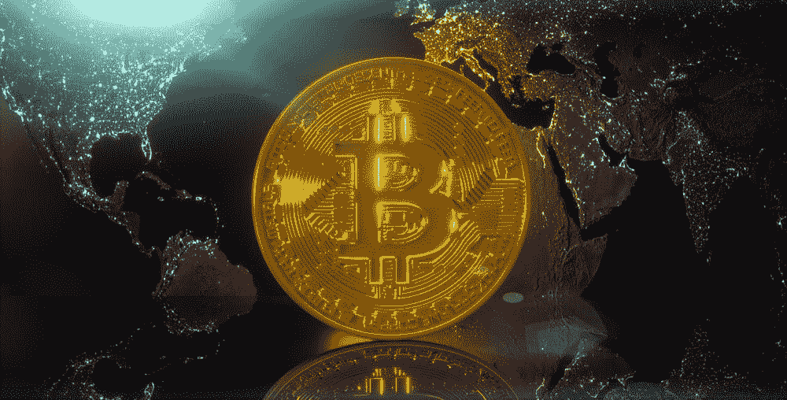

# 比特币基地反击监管者。证交会没有忘记讽刺。

> 原文：<https://medium.com/hackernoon/coinbase-strikes-back-against-regulators-irony-not-lost-on-the-sec-d447d1b97f62>

比特币基地钱包和加密货币交易所的首席法律和风险官迈克·莱姆普雷斯向资本市场国会小组委员会抱怨说，由于不确定性，监管将扼杀创新。据我所知，比特币基地拥有 GDAX 所谓的“交易所”，在没有任何监管的情况下交易加密货币。

这里的策略似乎是吓唬立法者，他们会打电话给 SEC，恳求他们忽略 GDAX，GDAX 不是经纪交易商，在没有在 SEC 注册的情况下交易证券。伟大的计划，如果它的工作。但是如果失败了呢？

几周前，超级巨星杰里米·阿莱尔(Jeremy Allaire)领导的初创公司 Circle 以 4 亿美元的天价收购了 Poloniex。这给整个行业带来了冲击波，让其它“交易所”开始对天价估值垂涎三尺。正如我在我的帖子[如何从 SEC 获得免费通行证](https://hackernoon.com/how-to-get-a-free-pass-from-the-sec-991273460df6)中所写的，合并文件被泄露，这说明 Circle 获得了 SEC 的赦免。如果这是真的，那就太令人震惊了，但我对这种捏造的说法表示怀疑。

但是让我们回到迈克和他的比特币基地大公司。他和区块链市场的大多数首席执行官一样，声称规则不明确。证券交易委员会不应该对违规者采取强制措施，因为那样的话，我们的美国智囊团将会蒸发，逃到外国去。这不是真的。

我们的国家之所以成功，是因为我们的创新文化和民主。利用这种威胁来逃避违反规则的后果并不是我们文化的一部分。只有每个人都遵守同样的规则，我们才能取得进步。

如果对这些规则有任何疑问，那就打电话给证券交易委员会的人，问他们问题。如果那些违反规则的人赢了，那么它将阻止其他人试图以正确的方式做事，这就创造了一个不公平的竞争环境。同样，这不是我们创业文化的一部分。

美国证券交易委员会(SEC)应该明确表示，违反证券规则的人应该承担后果，投资于合规文化的人应该从清除骗子中受益，我相信他们也是这样做的。