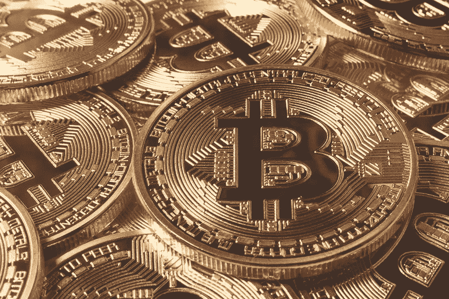

# 比特币基地价值 80 亿美元，Ripple 的 XRapid 投入商业生产

> 原文：<https://medium.com/hackernoon/coinbase-valued-at-8-billion-and-ripples-xrapid-goes-into-commercial-production-93726ae47535>

## 市场状况—2018 年 10 月 7 日

****:$ 6562.60(-0.41%)** [**ETH**](https://berminal.com/coins/Ethereum-ETH)**:$ 223.33(-0.67%)** [**【XRP**](https://berminal.com/coins/XRP-XRP)**:$ 0.475(-3.68%)****

**加密货币市场本周表现非常缓慢，比特币仍在 6400 美元至 6600 美元之间波动。大多数加密货币每天的波动不到 1%。以太坊仍稳定在 223 美元，本周仅下跌 1 美元。然而，XRP 公布了重大损失后，它未能满足其膨胀事件的宣传。XRP 从 0.6 美元跌至 0.47 美元，市值缩水超过 21%。**

**其他新闻方面，以太坊企业联盟(EEA)宣布[与 Hyperledger](https://ambcrypto.com/enterprise-ethereum-alliance-eea-partners-with-hyperledger-both-make-joint-announcement/)合作，以加速区块链的采用，加密货币交易所 [Poloniex 由于监管原因将不再向美国客户提供保证金交易服务](https://berminal.com/news/90619/Poloniex-To-Disable-Margin-Trading-For-US-Customers)。**

**老虎环球对冲基金正计划投资美国的加密货币交易所比特币基地。Tiger Global 最近向支付服务提供商 Stripe 投资了 2.45 亿美元，计划向价值 80 亿美元的交易所投资 5 亿美元。尽管比特币基地没有对该提议发表评论，但这笔资金将用于收购股东。该交易所由多家机构支持，包括 Battery Ventures、Draper Associates、Spark Capital 和 Ribbit Capital。Tiger Global 是 Flipkart、Ola 和 Spotify 等其他大公司的投资者。([阅读更多](https://berminal.com/news/89815/Tiger-Capital-Plans-to-Invest-500-Million-in-Crypto-Exchange-Coinbase))**

**Ripple 在 Twitter 上宣布其 xRapid 产品即将投入商业生产。根据这家区块链初创公司的一条推文，三家公司 Mercury FX、Cuallix 和 Catalyst Corporate Federal Credit Union 将成为 RippleNet 平台上使用 XRP 加密货币“进行按需跨境支付”的首批 Ripple 客户。Ripple 高管在最近几周提到了这一发展，该公司在膨胀会议上宣布了这一消息。([阅读更多](https://berminal.com/news/88828/Ripple-Sends-xRapid-into-Commercial-Production-3-Firms-to-Use-with-XRP))**

****3) SIA 决定通过颁布软件更新来阻止大型矿业公司，该软件更新将阻止某些类型的采矿硬件在该平台上采矿。Nebulous 的 David Vorick 最近宣布，Nebulous 制造的硬件将成为开采 SIA 的主要方法。根据沃里克的说法，硬分叉“比完全抵制 ASIC 要好”，但他补充说，“我们不认为加密货币需要拥抱寄生或滥用 ASIC 垄断。”Vorick 还提到，在 Reddit 帖子中进行了投票，分叉的决定获得了近 100%的同意。([阅读更多](https://www.coindesk.com/kill-switch-engaged-sia-blockchain-to-block-bitmain-and-other-big-miners/))****

**[***订阅百慕达简讯***](https://visitor.r20.constantcontact.com/d.jsp?llr=myyhdl6ab&p=oi&m=1131022639884&sit=9ar6aztmb&f=776989ec-8460-43a4-b86a-bcf8f2f1bca7)**

**[***免费下载百慕大 App***](https://berminal.app.link/medium-post)**

****

***[***百慕大官方电报***](https://t.me/berminal)***

***[***百慕大推特***](https://twitter.com/berminalapp)***

******