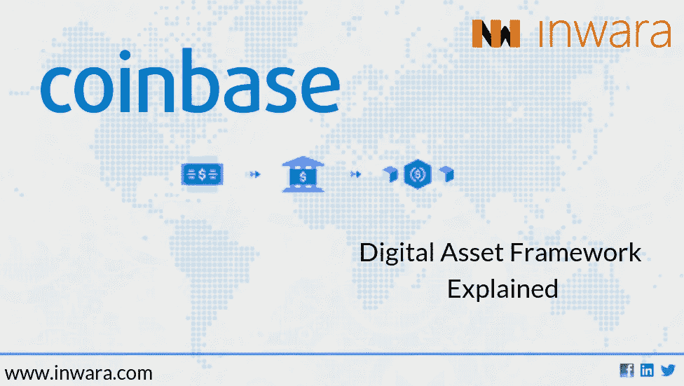
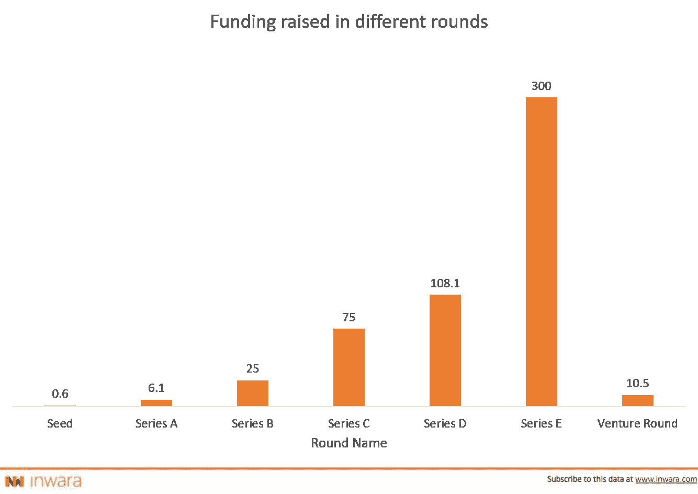
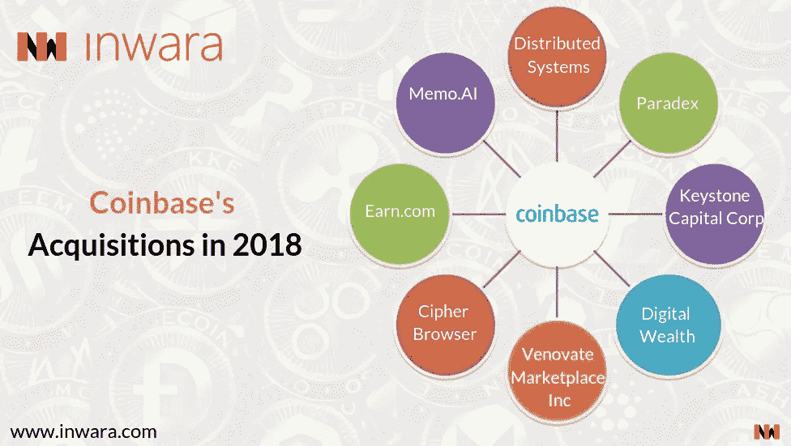
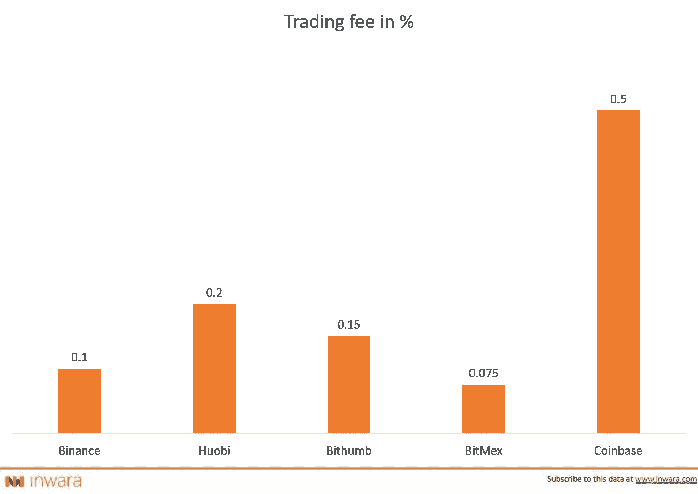
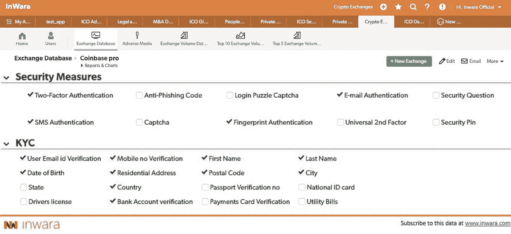

# 比特币基地扩大了它的“基数”,现在估值超过 80 亿美元

> 原文：<https://medium.com/hackernoon/coinbase-widens-its-base-now-crosses-the-valuation-of-8-billion-complete-analysis-of-exchange-87f32f066739>

## 比特币基地的独角兽之旅

[*免责声明*](https://www.inwara.com/disclaimer) *:文章来源于* [*InWara*](http://www.inwara.com/?utm_source=exchangehacker&utm_medium=exchangehacker&utm_campaign=exchangehacker) *。这不是财务建议。*

[比特币基地](https://www.coinbase.com/)最近已经成为这个行业的明星，吸引了加密领域的顶级投资者。它已经成为一个缩影，说明一个拥有清晰愿景的初创公司如何在一个不确定的行业中发展到新的高度。比特币基地是首批获得美国监管机构批准的加密交易所之一。

> 从那以后，比特币基地的规模一直在扩大！

它开始时只有比特币，后来在其投资组合中增加了以太币、莱特币和 T21。在今天的日期，比特币基地有 5 个硬币上市，并提供 9 个钱包给其客户群。比特币基地最近的公关表明，他们正在考虑增加 30 种新硬币的前景，这被吹捧为数字货币景观的积极迹象。

## 逆潮流而动的比特币基地

而 BTC 从 2017 年 12 月到 2018 年 12 月损失了近 80%的总市值；比特币基地加密货币交易所的价值朝着相反的方向飙升。

> 没有什么是错误！没有胜利和失败。只有品牌！

## 顶级风投和机构投资者的强力支持

Source: [InWara’s Private Funding database](https://www.inwara.com/?option=com_product&view=products&layout=productdetails&idn=1/?utm_source=cbpvtfundinghacker&utm_medium=cbpvtfundinghacker&utm_campaign=cbpvtfundinghacker)

比特币基地越来越受欢迎，最近由 Y Combinator、T2、安德森·霍洛维茨、T4、老虎全球管理、威灵顿管理、多链资本牵头的 E 轮融资中，比特币基地的估值达到 80 亿美元。对于一个刚刚 6 岁的创业公司来说，这是难能可贵的。有了这个比特币基地就进入了与 [LedgerX](https://ledgerx.com/) 、 [Ripple](https://ripple.com/) 、[双子座](https://gemini.com/)和[恒星](https://www.stellar.org/)的大联盟。

比特币基地是少数几家在熊市中盈利的公司之一。

## 比特币基地的战略性收购使其成为加密领域的巨头

Source: InWara’s MnA database

比特币基地以 1 亿美元收购 Earn.com 仍然是 2018 年的重磅并购交易。总部位于美国的 Earn.com 使用区块链作为其付费电子邮件服务，已经从投资者那里筹集了超过 1.2 亿美元。该交易于 2018 年 4 月 16 日宣布。

## 成功归功于著名的风投支持和经验丰富的管理层

首席执行官兼联合创始人 [Brian Armstrong](https://www.linkedin.com/in/barmstrong/) 在软件和技术领域拥有 11 年的丰富经验。联合创始人 [Fred Ehrsam](https://www.linkedin.com/in/fredehrsam/) 在交易、软件技术领域拥有 10 年经验，曾是[高盛](http://www.goldmansachs.com/)的交易员。

# 关于比特币基地交流平台

比特币基地交易所是密码领域最受欢迎的交易所之一。它已在超过 35 个国家上市，并于 2018 年 12 月 21 日新增了 6 个国家。

比特币基地设计了一个非常简单和用户友好的界面，为进入该领域的新手提供了一种简单的购买/销售/投资加密货币的方式。

## 优点:

> 比特币基地是美国最大的接受法定货币进行加密交易的交易所！

比特币基地允许以多种方式进行加密货币交易，即可以使用银行交易或信用卡/借记卡，也可以用加密货币交换其他数字资产。然而，完成交易的时间表因方法而异。

> 这是一个非常通用的交换。比特币基地不仅作为一个交易所，而且它可以双重作为加密货币钱包！

比特币基地的任何交易者都可以持有多个钱包，如比特币钱包、以太钱包、莱特币钱包和美元钱包或任何国家的等值货币钱包。

> 交易员提醒！

简单来说，每当你选择观察的任何加密货币触及你想进行交易的特定价格点时，比特币基地都会通知交易员。

## 骗局

> 比特币基地极其简单和用户友好的设计既是优点也是缺点。

比特币基地真正简单直观的设计来自于比特币基地对他们提供的便利和轻松收取的额外费用。

对于通过银行转账进行的交易(针对美国的银行账户)，比特币基地收取接近 1.5%的费用，对于通过信用卡进行的交易，他们收取高达 4%的费用。比特币基地收取的基本交易费和佣金为 0.5%，也相对较高。

Source: [InWara’s Crypto Exchange database](https://www.inwara.com/products?utm_source=coincryptohacker&utm_medium=coincryptohacker&utm_campaign=coincryptohacker)

由于密码在全球范围内交易，美国以外的人大多数时候使用信用卡/借记卡进行交易，他们受到指控。这些费用适用于您购买和出售加密货币的两种情况，无论交易的加密货币金额是多少。

这对机构投资者和风投来说是一个很大的问题，他们大量买卖密码，如果在比特币基地交易所进行，将会收取很高的费用。鉴于加密市场的波动性，有时投资者会想要转移他们的数字资产或套现，那么你将为每一个行动付出代价。

比特币基地 cookies 可能会跟踪其用户如何花费比特币的活动，这在一定程度上侵犯了隐私。

# 比特币基地交易所的安全特征

首先，比特币基地提供双因素身份认证，这是任何拥有许多交易者数字资产的地方都必须具备的一项功能。

第二，比特币基地有 BTC 金库，这是一个额外的安全层，用户必须通过才能访问比特币，它还支持谷歌认证应用程序，使其成为一个多层协议。

Snapshot from [InWara’s Crypto Exchange database](https://www.inwara.com/products?utm_source=coincryptohacker&utm_medium=coincryptohacker&utm_campaign=coincryptohacker)

最后，比特币基地是 [FDIC](https://www.fdic.gov/) 投保价值高达 50 万美元，但这里的问题是，它只涵盖美元钱包中的资金，而不承保任何加密货币钱包中的资金。

## 总结一下

比特币基地意识到，加密空间仍然是全新的，这既令人兴奋，同时也令人害怕。为了实现为世界创造一个开放的金融系统的愿景，比特币基地的目标是在他们的连接点抓住试图进入加密空间的新手，这就是为什么比特币基地正在通过其网站上的新工具[比特币基地学习](https://coinbase.com/learn)帮助新来者了解加密世界。

这个工具将展示数字货币世界的来龙去脉。比特币基地的目标是在战略上将自己定位在一个被认为是努力创造新事物和塑造这个行业的位置上。

