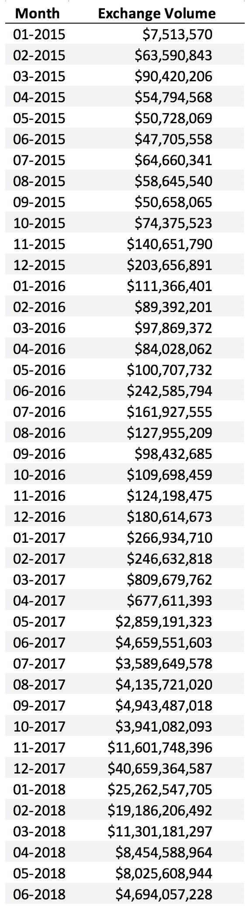

# 比特币基地的交易所在 2017 年赚了 10 亿美元 1B。它可能需要降低成本才能成功。

> 原文：<https://medium.com/hackernoon/coinbases-exchange-made-1b-in-2017-it-might-have-to-make-less-to-succeed-57eef157d005>

在推特上联系 [@ethanruhe](http://twitter.com/ethanruhe)

cumulative trading volume (USD) over time

# TL；博士:

*   对交易量收费是比特币基地的收入来源。
*   2017 年，比特币基地的交易量同比增长逾 50 倍，至 800 亿美元。
*   [报道](https://www.recode.net/2018/1/22/16911692/cryptocurrency-bitcoin-trading-coinbase-revenue-secondary) [暗示](https://www.theverge.com/2018/2/27/17058306/coinbase-bitcoin-cryptocurrency-revenue) [比特币基地](https://hackernoon.com/tagged/coinbase)去年的收入为$1B，这意味着 1.25%的有效平均费率。
*   他们对细分市场收费很苛刻:应用程序收费约 2.5%，“专业”交易平台收费约 0.25%。
*   [零手续费零售](https://crypto.robinhood.com/) [竞争](http://fortune.com/2018/07/25/cryptocurrency-bitcoin-free-trading-voyager/)正在出现。
*   其他专业交易平台一般[收费](https://support.binance.com/hc/en-us/articles/115000429332-Fee-Structure-on-Binance) [明显比比特币基地](https://www.okex.com/pages/products/fees.html) [少](https://www.kraken.com/en-us/help/fees)。
*   大型金融交易所对比:[纳斯达克在 H1 2018](http://www.nasdaqtrader.com/Trader.aspx?id=DailyMarketFiles) 用 14.8T 美元换来 0.5 亿美元的手续费( [Q1](http://ir.nasdaq.com/static-files/db87a57a-5890-4924-8f56-d9a243269aef) 、 [Q2](http://ir.nasdaq.com/static-files/23eed64d-a008-400d-a480-340e9326ca93) 数据)，有效手续费率 0.0035% ( *即*比特币基地的费率高出~ 350 倍)。
*   成交量与价格正相关；自 2018 年初以来，两者都在下降。
*   2018 年上半年，比特币基地的交易额为 770 亿美元。但是，他们在 6 月份只做了 47 亿美元，是 1 月份的 18.6%。

## 结论:

*   2017 年，零售(应用+网站)交易和专业平台交易之间的交易量约为 50/50。
*   如果比特币基地保持同样的零售/专业分割，他们在 2018 年上半年的收入约为 1B。
*   从长远来看，目前的收费标准是不可持续的，竞争将会压低收费标准。
*   交易所根本不支持高科技规模的企业；换句话说，苹果在 Safari 中设置的默认搜索引擎比纳斯达克在整个交易所业务中设置的还要多。
*   比特币基地的雄心能否成功，将取决于能否建立一个能够形成规模的免费产品生态系统，而不是交易费用([首席执行官 Brian Armstrong 在此阐述了他们广泛的四步战略](/@barmstrong/what-is-coinbases-strategy-1c5413f6e09d)；[他们的产品新闻在这里](https://blog.coinbase.com/productnews/home)。
*   比特币基地似乎处于一个独特的位置:10 倍的增长可能取决于他们当前核心业务的萎缩(*即*，摩擦更少、费用更低的交换)。
*   比特币基地人才库的吸引力+对长期问题的清醒关注+堆积如山的现金都意味着比特币基地处于有利位置，但它的突围之路仍不明朗(就像脸书先于移动、Instagram 和 WhatsApp)。

[获取比特币基地数据和复制我的分析的代码可以在这里找到](https://github.com/ethanruhe/coinbase_volume_analysis/blob/master/Coinbase%20Volume%20Analysis.ipynb)。如果您对此感兴趣，请告诉我，我可以更深入地研究数据告诉我们的内容。

下面是更长的版本…

# 为什么有意思？

*   加密货币是长期以来最大的平台/协议转变的有力证据。
*   比特币基地可能会成为一个庞然大物，但他们目前的收入模式并不能让他们达到目的。
*   这家公司异乎寻常地注重长期发展(这反映在像[这种](https://twitter.com/brian_armstrong/status/1009192006512328704)的想法中，以及他们给员工一个 [7 年期权行使窗口的事实中)。](https://blog.coinbase.com/improving-equity-compensation-at-coinbase-8749979409c3)

据传，比特币基地的收入增长几乎创下历史新高。广为流传的谣言是他们去年实现了 10 亿美元的收入。据称，其中大部分是在 2017 年最后几个月的价格飙升期间出现的。

记住这个数据点，我们就可以估算出比特币基地的收入有多大比例来自临时消费投机者，有多少来自他们更复杂的专业交易平台。然后，我们可以估计公司 2018 年的收入情况。

这种分析是可能的，因为数据对一家私营公司来说是异常容易获得的:经营一家交易所——迄今为止比特币基地几乎唯一的收入来源——需要公布价格和交易量数据。这些数据是收入的关键驱动因素，因此为私营公司的增长提供了独特的视角。

比特币基地从未打算仅仅成为一家交易所。首席执行官 Brian Armstrong 在这里展示了他们的总体战略[。他们一直在](/@barmstrong/what-is-coinbases-strategy-1c5413f6e09d)[积极推出和购买产品](https://blog.coinbase.com/productnews/home)，尤其是在过去的一年。**为了成为一家市值≥1000 亿美元的公司，比特币基地需要成功的新产品押注，也需要机构尽快采用加密货币。与比特币基地在未来几年必须执行的任务最相似的是 2012-2014 年左右的脸书:在有利的时机进行巨大的平台转移(脸书的消费者采用移动设备，比特币基地的机构采用加密货币)，一次或多次成功的押注公司的行动以利用这一机会，以及可能的本土产品收购(*例如* Instagram 和 WhatsApp)。**

# 比特币基地是如何赚钱的？

在像比特币基地这样的交易所，交易包括撮合买家和卖家。比特币基地从每笔交易中提成。

限价单涉及一名交易员以特定的单价提出购买或出售一定数量的资产(例如，*“我将以每比特币 5000 美元的价格购买多达 10 个比特币”或“我将以每比特币 5010 美元的价格出售多达 2.5 个比特币”)。限价单是市场的基础，并“赋予流动性”那些下限价单的人被称为价格制定者，因为他们直接说出价格。迄今为止，为了鼓励流动性增长，比特币基地一直没有执行限价指令。*

市价单包括根据未平仓限价单指定买入或卖出。在市价单中，交易者指定一种资产的数量，以尽可能好的条件与另一方未完成的限价单进行交换。例如，“卖出 100 个比特币”的结果是卖出 100 个比特币，以价格降序限制买入订单。根据市场订单的大小，它可能只执行一个限价订单的一部分，也可能执行多个限价订单。

在散户交易者(使用移动应用和 coinbase.com 的交易者)和专业交易者(使用 pro.coinbase.com 的交易者，以前被称为 GDAX)之间，比特币基地收取的市价订单费用存在明显的差异。任何人都可以使用该应用程序或在 Coinbase.com 上进行零售交易。迄今为止，pro 平台也很容易加入。它只是有一个稍微复杂的界面。(注:【2018 年 5 月，比特币基地推出了一个名为 Prime 的机构交易平台，但本分析不会试图将其与 Pro 分开，因为没有基准来说明如何干净利落地做到这一点。)

## 比特币基地费用

零售交易(移动应用程序和 coinbase.com)受制于一个相当复杂的收费表，该收费表在执行时可根据市场条件由比特币基地酌情决定(此处有[文档](https://support.coinbase.com/customer/en/portal/articles/2109597))。为了在模型中使用，我们将其简化如下:

*   1.49%的转换费:每 100 美元的零售加密货币交易，比特币基地收取 1.49 美元的法定货币和加密货币之间的转换费。
*   0-2%的交换费:比特币基地说:“你通过我们的转换服务买卖数字货币的汇率，是按照比特币基地市场平台上数字货币的市场汇率，加上由你的交易规模、市场波动性和使用比特币基地的时间长短决定的 0 到 200 个基点的差价计算的。”因此，除了转换费，他们还收取相对于基础交易价格的 0-2%的交易差价。这类似于我们将在下面看到的“收取费用”。在写这篇文章的时候，我在价格为 7，730 美元的时候发起了 3，865 美元的比特币购买，并被报出了 50 个基点或 0.50%的交易费的购买量。我在这个平台上有一个相对长的记录，短期波动性相对较低，所以我猜这是在光谱的低端。为了简单起见，我们假设 100 个基点，即零售订单的平均兑换费为 1.00%。
*   如果使用信用卡或借记卡，转换费用会增加。一般来说，这是 3.99%的转换费，而不是 1.49%。为了简单起见，我们将假设额外的 2.5%仅涵盖支付处理的成本，因此不影响收入。

所以，在上面的简化下，我们假设每 Z 美元的零售交易量，比特币基地产生:Z * (1.49% + 1.00%) = 0.0249*Z 美元的收入。

## 比特币基地专业版(以前为 GDAX)费用

比特币基地专业公司对价格接受者收取 30 个基点或 0.30%的交易费。在 30 天内交易 1000 万至 1 亿美元或超过 1 亿美元的账户将分别获得 10 或 20 个基点的退款。([文档在此](https://docs.pro.coinbase.com/#fees))。)

我们将使用的市场数据没有按交易者划分交易量，所以我们必须假设专业交易者交易量的相对比例，以便计算平均交易费。因为创建一个专业账户非常容易，而且对于大交易量的交易者来说，即使是折扣的接受者利率也高得惊人，所以假设大部分交易量都要支付 30 个基点的全额费用似乎是合理的。为了便于比较，我们假设平均专业费用是 24.9 个基点，或者是比特币基地零售费用的十分之一。

随着市场的成熟，绝对价格和零售与专业价格歧视的程度似乎都是不可持续的。同样，任何精明的交易者都不应该使用散户比特币基地。然而，到目前为止，这种分割还是相当成功的。许多消费者要么没有意识到这种差异，要么高度重视移动应用的便利性(2017 年底[在 app store 中一度排名第一就是明证)。](https://www.recode.net/2017/12/7/16749536/coinbase-bitcoin-most-downloaded-app-iphone)

预计未来比特币基地的学费将面临严重的下调压力。

竞争对手一般会收取[大幅](https://support.binance.com/hc/en-us/articles/115000429332-Fee-Structure-on-Binance) [较低](https://www.okex.com/pages/products/fees.html) [的费用](https://www.kraken.com/en-us/help/fees)进行“专业”风格的交流。*在其他条件相同的情况下*，随着公司寻求获得市场流动性，面向投资者的交易所将面临零费用的压力。**当然，并非一切都是平等的，成为政府和机构监管合规方面的领导者已经并将继续成为比特币基地的竞争优势。**

比特币基地将面临类似的零售费用逆风。Robinhood 已经提供了“自由”的交换，尽管托管并不完全透明。其他参赛者肯定也会出现。

# 交换号码

## 零售和专业的收入比例

我们将做另一个简化的假设，即散户和专业交易员的相对比例保持不变，因为我们没有更好的数据来证明这一点。

给定假设:

*   零售和专业的比例是稳定的
*   零售量的 2.49%税率
*   专业卷 0.249%的收入率；
*   2017 年收入 10 亿美元

我们可以校准来自散户和 pro 交易者的成交量比例如下:10 亿美元= (X * V * 0.0249) + ((1-X) * V * 0.00249)其中 X 是来自散户的成交量比例，(1-X)是来自 pro 交易者的成交量比例，V 是 2017 年的总成交量。

根据比特币基地的 API 数据，他们在 2017 年的交易量约为 800 亿美元。将其代入 V 函数，我们发现 X 约为 50.2%。因此，比特币基地似乎以零售价格完成了一半的交易量，以专业价格完成了一半。800 亿美元的销量带来 10 亿美元的收入。

## 正确看待这些数字

纳斯达克是世界第二大证券交易所，市值约为 12 万亿美元。2018 年上半年，[纳斯达克交易额达 14.777 万亿美元](http://www.nasdaqtrader.com/Trader.aspx?id=DailyMarketFiles)。他们声称占世界证券销售的十分之一。基于这一交易量( [Q1](http://ir.nasdaq.com/static-files/db87a57a-5890-4924-8f56-d9a243269aef) 和 [Q2](http://ir.nasdaq.com/static-files/23eed64d-a008-400d-a480-340e9326ca93) 的财务结果)，他们的交易所产生了 5 . 17 亿美元的交易费，这不仅包括现金股票，还包括衍生品等更昂贵的产品。这相当于平均费率约为 0.0035%，比比特币基地低几个数量级。此外，纳斯达克甚至在许多交易资产上拥有近乎排他性的优势。

交易所是一个好行业，但随着流动性增加，利润率会下降。**从长远来看，比特币基地*不想要一个他们目前的收费率可持续的世界。这表明了一个低效和投机的市场，而不是他们希望加密货币成为的无摩擦经济协议。***

交易所根本不支持大型科技企业。[换句话说，苹果在 Safari 中设置的默认搜索引擎比纳斯达克在整个 exchange 业务中设置的还要多。](https://www.cnbc.com/2017/08/14/google-paying-apple-3-billion-to-remain-default-search--bernstein.html)

# 比特币基地的成交量趋势

这是比特币基地的累计交易量(注意，公司成立的头几年没有显示出来，因为你无论如何也看不到):

年度总数如下:

最后，每月总数如下:

# 附录:潜在的材料谬误

以下是我上面的分析可能是错误的一些原因:

*   对贸易量是如何计算的基本误解。比特币基地有可能混淆或不包括他们 API 中的所有交易数据。例如，他们可能会减去零售交易。我没有任何内幕消息，所以不能排除这种可能。
*   历史费率可能有很大差异。该分析将当前费率应用于历史数据。比特币基地肯定使用过这些费率，但是我找不到详细的历史费用表，所以我使用当前的费率。在不同的程度上，这种分析将是不准确的。
*   我们不知道有多大比例的专业交易有资格获得大批量折扣。这将影响零售与专业的体积比例计算。
*   2017 年收入 10 亿美元可能不准确。
*   零售和专业组合在 2018 年发生了变化。这将影响我对比特币基地 H1 2018 年奥运会收入的估计。