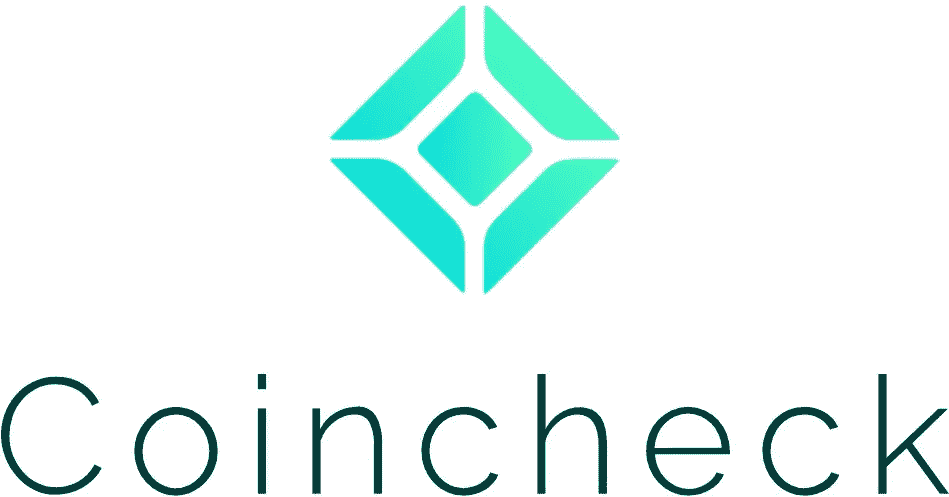
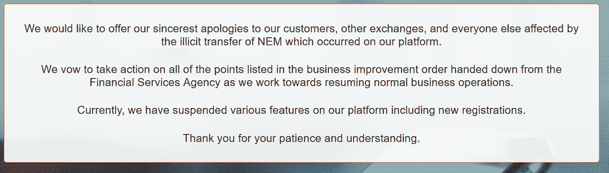
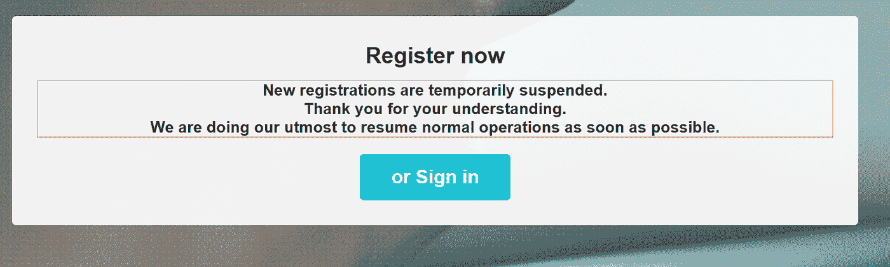
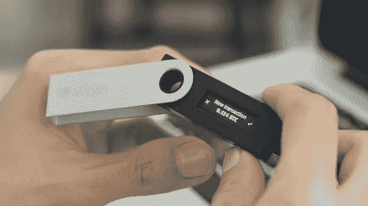

# 硬币检查:5 亿美元的黑客

> 原文：<https://medium.com/hackernoon/coincheck-the-half-a-billion-dollar-hack-84d0a30f92b1>

Before reading this article please read our disclaimer at the bottom of the article or [here](https://thebestoficos.com/disclaimer.html)

## 历史上最大的黑客攻击之一

# 介绍

2011 年 6 月 19 日，最大的比特币交易所，总部位于东京的比特币交易所 Mt. Gox 向其用户报告称，他们以多种方式损失了大约 85 万比特币，当时价值 4.5 亿美元(或现在约 100 亿美元)。这是加密货币历史上迄今为止最大的损失，对比特币的价格产生了严重影响。发生了一系列不寻常的错误，导致钱被盗，或以多种形式丢失。Mt Gox 是为什么[我们建议](https://hackernoon.com/what-you-need-to-know-about-managing-crypto-investments-b5d0852f9b91)把钱放在冰冷的钱包里而不是放在交易所的钱包里的主要例子之一。

上周，另一家东京比特币交易所 [Coincheck](https://coincheck.com/) 宣布他们丢失了大约 5 亿枚 NEM 代币，价值约 5 亿美元。Coincheck 估计有超过 250，000 人受到黑客攻击的影响，并保证这不是内部作案。这次黑客攻击非常不同，因为大部分货币是在一次事件中丢失的，而不是由于错误、黑客和疏忽造成的缓慢积累。

Coincheck 联系了 NEM 网络公司，看他们能否恢复交易。NEM 的创造者认为 Coincheck 完全是黑客的错，并决定他们不会分叉。因此，Coincheck 的团队被迫做一些更有趣的事情，这就是我们写这个故事的原因。Coincheck 在钞票上贴标签是为了追踪罪犯。

这个故事将集中在黑客的细节，标签如何工作，以及什么是 NEM 和硬币检查。

Image taken from Coincheck’s Homepage found [here](https://coincheck.com/).

# 能母

NEM 是一个使用 XEM 加密货币的网络，于 2015 年 3 月 31 日推出。该令牌基于他们所谓的“重要性证明”(PoI)，类似于利益证明(PoS)。PoI 区块由拥有大量 XEM 代币(如 PoS)的玩家验证，也由他们每天的交易量验证。本质上，网络给每个账户分配一个重要性等级。因此，这一指标将交易所置于 NEM 网络的重要位置。

他们希望 power 比比特币的工作证明(PoW)消耗更少的能量，但没有股份证明(PoS)带来的囤积行为。

# 硬币检查

Coincheck 是一个基于东京的比特币钱包和兑换服务，始于 2014 年 8 月。该交易所在日本非常重要，因为成千上万的商家依靠它接受用户的比特币交易。就在黑客攻击发生后，Coincheck 只会授权比特币的交易。交易所要求 NEM 基金会撤销黑客攻击，但显然 Coincheck 的 1 . 5 亿美元交易并不重要，不足以执行分叉。Coincheck 现在已经完全阻止在网络上创建新的用户帐户。

# 热门钱包

没有绝对安全的系统。Coincheck 是一个交易平台，允许用户交易 BTC、NEM 和其他加密货币。与所有交易所一样，用户可以存放法币或代币，并用它们换取其他代币或法币(出售)。交易所通常具有非常友好的登录系统和双因素身份验证，这使它们成为许多人存储加密货币的非常实用和简单的存储位置。

将你的加密货币存放在允许你在线访问的第三方的做法被称为热钱包。在众多类型的加密货币钱包中，热钱包是最不安全的([我们也写了一篇关于它的文章](https://hackernoon.com/what-you-need-to-know-about-managing-crypto-investments-b5d0852f9b91))。

存在多个故障点，包括:

*   被盗/被猜测的用户凭据
*   Exchange 员工模拟
*   恶意热钱包第三方
*   公司内部的腐败
*   交易所破产或违约，甚至银行挤兑
*   管理不善/疏忽
*   外部黑客

这些变量绝不是独立的。一个糟糕的系统也会影响其他系统，并可能使整个系统更加脆弱。

你相信交易所会保管你的钱包，并且总是让你使用，而不是其他人。你也相信交易所不会用你的钥匙谋取私利，他们的安全是最新的，永远不会被黑客攻击。

# 黑客

2018 年 1 月 27 日，Coincheck 网站上显示了以下消息:

Image taken from Coincheck’s Homepage found [here](https://coincheck.com/).

大约 2 天后，Coincheck 通过新闻发布会证实了大家的担心，并表示他们已经丢失了 [5 亿的 XEM 代币](http://www.gizmodo.co.uk/2018/01/280-million-goes-missing-from-japanese-crypto-exchange-coincheck/)。他们还证实，攻击不是内部的，有人侵入了他们的用户数据库和热钱包。

虽然攻击的细节尚未公开，但 Coincheck 已经解释了他们所采取的措施，以便纠正和纠正问题。作为一家交易所，Coincheck 可以获得大量可用资本。他们的第一件事将是通过一个 4 . 26 亿美元的受害者基金把一些菲亚特还给用户。

该公司还表示，他们不会分叉他们的区块链，而是将标记货币。

# 分叉和标记

区块链本质上是一个交易列表。交易可以被认证，因为用户的私钥被用来“签署”交易，然后任何人都可以使用他们的公钥来验证该交易。所有交易从一开始就是公开和开放的，它们被逐项列出并分成块。透明性和可追溯性的属性使得多个查看者能够就什么被传送给谁达成一致或共识。

2016 年 5 月，一个基于以太坊的名为 DAO(去中心化自治组织)的去中心化投资组织被黑了约 1.1 亿美元，导致以太坊价格暴跌。

以太坊使用区块链，因此是一个透明公开的分类账，所以理论上可以准确追踪资金去向。该属性还允许用户声明他们将不尊重某个日期之后发生的任何交易，并在某个约定的时间段之后恢复接受交易。这将影响这段时间内区块链上发生的每一笔交易，就好像它们从未发生过一样。这不仅仅影响某些交易子集，如一个交易所的交易，而是影响每个用户和交易所。

忽略区块链的其余部分或本质上创造你的现实(交易)的新版本的属性被称为分叉。

回到 2016 年，在 DAO 黑客攻击期间，以太坊基金会向社区提出了一个问题:*我们是否应该回到过去，开始只接受黑客攻击之前发生的交易？*这一决定实质上将使黑客攻击后发生的每一笔交易失去信誉，因此，如果你在黑客攻击后购买了 ETH，那笔交易实际上就不会发生，你的钱也就没了。

这很自然地将社区分成了支持和反对叉子的两派。其结果是以太坊一分为二，经典以太坊和以太坊。分叉加密货币导致价格暴跌，从此有了两个以太坊。

([你可以在这里](https://hackernoon.com/how-ethereum-lost-300-million-dollars-bfedf7ba0c19)阅读更多关于那把叉子的细节)。

XEM 开发团队对 Coincheck 的安全级别不满意，因此不认为该问题授予了分叉。因此，Coincheck 决定，应对这种情况的最佳方式是追踪谁偷了钱。这意味着他们正在追踪从黑客攻击中获利的每一个账户和交易。此举相当有趣，因为该公司将不得不向用户支付数亿美元的损失，并试图将罪犯绳之以法。

# 结论

从这个故事和其他类似的故事中可以学到很多东西。

**不要依赖热门钱包。**购买加密货币时，请确保您的钱不会在热门钱包中停留超过一天。而且只储存少量。

**不要相信第三方。**即使一家交易所做了所有正确的事情，社交黑客、愤怒的员工或其他一些不受他们控制的事件也总有可能造成重大损失。

**使用冷藏**。冷藏是安全专家最推荐的存储方法。它通常采取硬件钱包的形式，如 [Trezor](https://trezor.io/) 或 [Ledger](http://ledgerwallet.com/) 。

Image of the ledger nano found [here](https://99bitcoins.com/ledger-nano-s-review-bitcoin-wallet-better-than-trezor/).

随着加密货币市场的继续发展，像以太坊在 2016 年那样取得成功将变得更加困难。Coincheck 正在采取措施识别黑客，并将能够判断 XEM 是被出售给菲亚特，还是被兑换成其他货币。我们所能希望的是，这个黑客背后的犯罪分子和那些背后的道和 Mt Gox 被发现并绳之以法。

不管大多数人怎么想，加密货币并不完全是匿名的，如果像中本聪这样的人曾经购买过，人们将能够发现他们的身份。区块链的整个概念依赖于一个透明的交易列表，最终你可以链接谁购买了什么东西，并跟踪交易，一直追溯到加密货币的起源。

想帮忙吗？
在 Bountey 上支持我们！[https://www.bountey.com/bestoficos](https://www.bountey.com/bestoficos)

想在 ICOs 中保持最新？
在[https://thebestoficos.com](https://thebestoficos.com/)拜访我们

有一个有趣的故事？在 info@bestoficos.com 给我们写信

# 放弃

本网站及其包含的信息无意成为投资、金融、技术、税务或法律建议的来源。本网站不能代替专业建议和独立的事实验证。在没有首先评估你自己的个人财务状况，也没有咨询财务专家的情况下，千万不要使用这个网站上的想法和策略。本网站的所有内容仅供参考，按“原样”提供，不保证完整性、准确性、及时性或使用本网站所获得的结果。这只是一个存根，您对本网站的访问和使用取决于您是否接受并遵守[全部免责声明。](https://thebestoficos.com/disclaimer.html)免责声明适用于所有希望访问或使用本网站的访问者、用户和其他人。