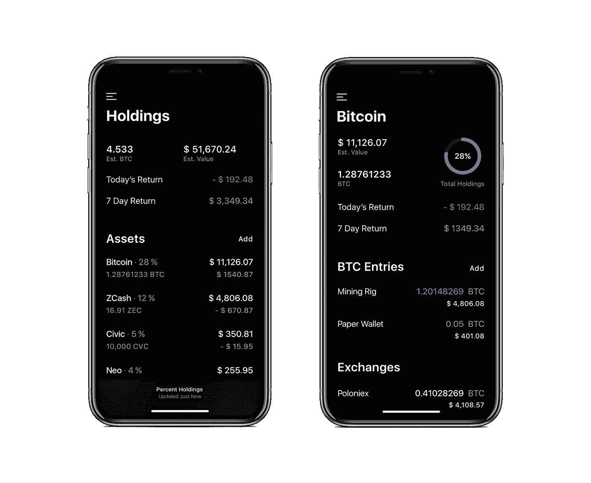

# Coindex 增加了币安和投资组合🙌

> 原文：<https://medium.com/hackernoon/coindex-adds-binance-portfolio-6b3f3629bf3c>

## 开始用最新版本的 Coindex 追踪你的持仓。

 [## App Store 上的 Coindex

### 阅读评论，比较客户评级，查看截图，并了解更多关于 Coindex 的信息。下载 Coindex 并在…上欣赏它

itunes.apple.com](https://itunes.apple.com/us/app/coindex/id1251487103?mt=8) 

[Download Coindex on iOS](http://coindexapp.com)

[在 iOS 上下载 Coindex](http://coindexapp.com)

## 有什么新鲜事？

币安市场和投资组合跟踪在这里！

*   观看所有你喜欢的币安市场，查看完整的历史数据，并了解新的资产。
*   跟踪您的投资组合在当地菲亚特的 1500 多项资产上的持有情况。
*   从比特币基地、GDAX、Poloniex、Bittrex 和币安自动同步您的收藏。
*   为了额外的隐私，从设置中启用触控 ID / Face ID，以确保没有其他人可以访问您的投资组合。

## 我们还包括了一些波兰的改进:

*   改进了错误处理，所以当交易所关闭时你不会被轰炸。
*   数据优化，因此数据加载更快，更可靠。
*   用户界面润色，为额外的光泽。

## 接触

[网站](http://coindexapp.com) / [电报](http://t.me/coindex)