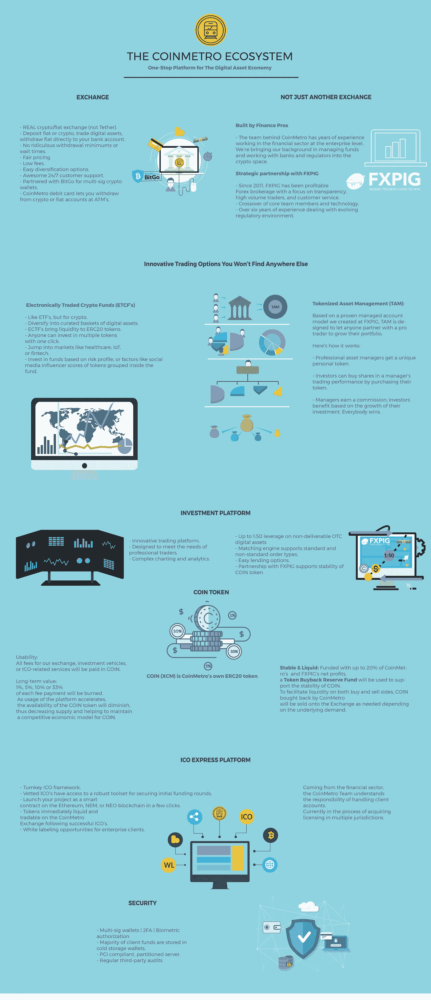

# coin metro——统治一切的下一代加密平台

> 原文：<https://medium.com/hackernoon/coinmetro-the-next-gen-crypto-platform-to-rule-them-all-8b9aafbee3>

## 回顾 [CoinMetro 平台](https://coinmetro.com/?ref=promo)。

[CoinMetro](https://coinmetro.com/?ref=promo) 是一个雄心勃勃的项目，希望为加密交易世界带来简单和安全，并为新手和经验丰富的投资者提供直观和用户友好的一站式平台。

它通过提供**即时加密到法定清算、强大的交易平台和独特的加密投资工具**来实现这一目标。这个项目是 Kevin Murcko 的创意，他是已经成立的外汇经纪公司 FXPIG 的首席执行官，该公司以其透明度和客户服务而闻名。

*更新:测试版将于 6 月 15 日发布，随后将于 7 月初正式发布。*

# 即时法定提款、借记卡和安全感

许多人仍然对进入加密市场保持警惕，或者由于缺乏访问的便利性而不能这样做。CoinMetro 试图解决这两个问题。

在安全方面，该平台将**积极在尽可能多的国家寻求许可和认证**，类似于其战略合作伙伴和老大哥 FXPIG。

在吸引普通人的问题上，CoinMetro 将提供**即时的菲亚特到加密和加密到菲亚特的存款和取款**。不仅如此，他们还将发行自己的 **CoinMetro 借记卡，可以在全球数百万台自动取款机上提供即时提现服务。**

所有这些都不是牵强附会，因为得益于他们的外汇平台，他们已经拥有了与监管机构和银行打交道的人脉和经验。

# 土著 XCM 代币和回购计划

该平台上的所有服务和费用将使用其本地 ERC-20 公用令牌-XCM 支付。每笔费用支付的一定比例将被烧掉，这确保了交易量上升时供应量下降。

为了提供市场增长和 XCM 价格的稳定性，**FXPIG 和 CoinMetro 季度净利润的 20%将用于回购 XCM** 。

根据交易者持有的 XCM 数量，他们将获得基本费率 0.1% 的费用折扣。除此之外，ICO 的参与者还将获得终身费用折扣。

除此之外，交易所的做市商将获得 0.05%的做市商奖金。

 [## CoinMetro (XCM) -价格跟踪和预测

### 跟踪 CoinMetro XCM 代币价格。包括 XCM 交易量和价格预测的计算器/模拟器。

xcmprice.com](https://xcmprice.com) 

# 连接传统投资和秘密世界

除了交易平台币安之外，Coinmetro 还将提供独特的投资选择，如加密 ETF 和令牌化资产管理(TAM)。

**加密 ETF**:你猜对了。除了加密之外，它将和普通 ETF 一样运作。你可以投资于精心策划的数字资产篮子，按照风险状况、行业和社交媒体评分等标准进行分类。

在硬币(XCM)令牌的推动下，**令牌化资产管理**将使用户能够根据他们的交易表现投资于职业经理人的投资组合，而职业经理人则受益于佣金。

# 代币销售和注册

代币预售正在进行，让您有机会享受额外的奖金和终身折扣。它的上限是 5000 万代币。主要的代币销售将于 2 月 21 日开始，上限设定为 3 亿英镑，每售出 5000 万英镑价格就会上涨。

**如何注册销售**？

访问[https://coin metro . exchange](https://coinmetro.exchange)和“**注册**创建账户。

要和团队取得联系，加入他们的[电报](https://t.me/CoinMetro)。这个团队反应非常迅速。

*更新:预售现已结束。在 2 月 21 日开始的主要代币销售活动之前，将会出现弹出式代币销售。这些将在 https://t.me/coinmetroupdates*和[宣布](https://t.me/coinmetroupdates)

*这些都不是财务建议&我不是财务顾问*