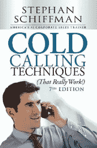
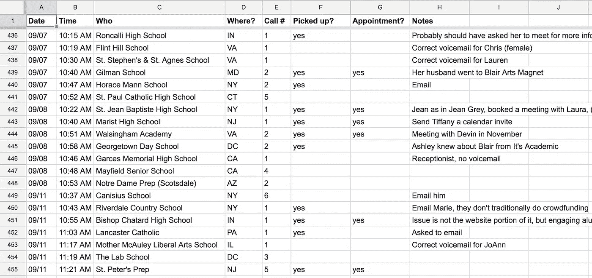
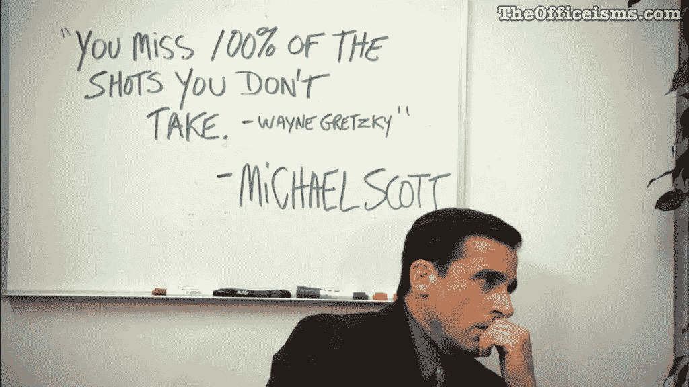

# 呼唤我的创业，以及我如何学会迎接挑战

> 原文：<https://medium.com/hackernoon/cold-calling-for-my-startup-and-how-i-learned-to-embrace-the-challenge-31f16728de48>

*(image by* [*Hannah Wei*](https://unsplash.com/photos/aso6SYJZGps?utm_source=unsplash&utm_medium=referral&utm_content=creditCopyText) *via* [*Unsplash*](http://unsplash.com/?utm_campaign=photographer-credit)*)*

作为一个与陌生人交谈时会变得焦虑的人，我最初被为我的[创业](https://www.boostmyschool.com/)打电话的责任所吓倒。如果我对一些小事感到紧张，比如打电话去商店看看什么时候开门，我怎么能通过电话销售产品呢？但我的初创公司需要与客户就销售和产品反馈进行交谈，所以我强迫自己打电话。一年后，回想我的初创公司的大部分销售是如何源自电话推销，以及我是如何逐渐接受电话推销过程的，这真是令人惊讶。

陌生来电体验的开始很有压力。在最初的几个电话中，我非常紧张，每次打电话我都花 15 分钟*排练 30 秒的剧本，并演练所有可能的应对场景。所有这些准备工作大部分都被浪费了，因为很少有学校真正拿起电话。我的焦虑也表现在打通的电话中；人们不断告诉我说慢点。尽管很焦虑，我还是预约了一些会议，这再次证明了打电话是接触客户的正确方式。*

Helpful cold calling book

最终，我在实践中变得更加得心应手，并在朋友推荐的[冷打电话技巧](https://www.amazon.com/gp/product/1440572178/ref=as_li_tl?ie=UTF8&tag=golmansax-20&camp=1789&creative=9325&linkCode=as2&creativeASIN=1440572178&linkId=2e26236756b4786173e942301eb118d6)的帮助下完善了我的电话流程。以下是一些帮助我克服最初对打电话的恐惧，并把我变成一名高效销售人员的建议。

# 每天打电话

当我第一次开始的时候，我选择星期二作为我打电话的日子。这最终对我的精神没有好处，因为我会害怕星期二，找任何借口不打那些电话。

每天至少打一个电话对我的精神有很大的帮助。这迫使我每天都要经历克服紧张的过程，几周后，我不再害怕了。几个星期后，我从每天只想打 1-2 个电话变成了每天打 10 多个电话也没问题。巨大的进步！

# 记录每个电话

我实施的一个最有用的过程是记录我打的每一个陌生电话。这有几个主要的好处:

1.  我可以很容易地看到我一天打了多少个电话，这让我坚持每天打电话的目标。
2.  对于每一个电话，我都记录下对方是否拿起电话，以及是否安排了会面。这使得计算重要的统计数据变得很容易，比如接诊率和会议率。
3.  我还记录了我给谁打电话，以及他们隶属于哪所学校。这确保了我不会给已经谈过的学校打电话。

A snapshot of my sales spreadsheet

这个电子表格的灵感来自于我之前提到的那本叫《陌生来电》的书。

# 做笔记

最初，当我一天只打几个电话时，我能够准确地记住每个电话中讨论的内容。我很快意识到，这个过程没有规模，因为我打电话越多，就开始忘记重要的细节(比如会议预定的时间)。

现在，每当我结束一个电话，我都会记下我觉得如果我再和那个人或学校交谈时应该记住的任何事情。其中包括:

*   我在和谁说话？
*   他们叫什么名字？(例如用 Jen 代替 Jennifer)
*   他们的名字是怎么发音的？(例如琴·葛蕾的吉恩)
*   他们提到竞争对手了吗？
*   如果他们不想见我，他们给出了什么理由？
*   他们说我应该什么时候回电话？

# 把每一个电话都当作一次胜利

特别是在我害怕打电话的时候，我会偶尔让自己紧张起来，不打电话给学校，因为我认为他们不会接电话(例如，周一不适合打电话)，或者我认为他们不想和我说话。然而，不打电话，我保证了不跟任何人说话的最坏结果。

Michael Scott said it best (image via [The Office-isms](http://www.theofficeisms.com/))

这就是为什么我不仅要庆祝预定的会议，还要庆祝打来的电话。首先，每个电话都是了解潜在客户的机会。即使电话转到了语音信箱，我也会记下对方的名字，电话号码是否是直拨的等等。其次，把每一个电话都当作一次胜利，这帮助我在一个电话不顺利的时候保持积极的态度。从我的电话统计数据中，我知道我平均需要打多少个电话来预约一个会议，而我打的每一个电话都会让我更接近找到那个会议。

# 把你的故事变成你的优势

当我开始打电话推销时，除了我以前的高中同学之外，我没有其他客户——我就是为他们开发产品的——所以把他们纳入我的销售脚本是有意义的。然而，直到我和学校通了电话，我才意识到这个故事对我有多大的好处。

我开始每个电话都提到我是一个帮助我的高中的开发者，学校会问我是如何开始的，我的学校在尝试什么。从我的故事开始让电话感觉更像一次谈话，而不是一次销售电话。虽然这个故事可能没有足够的吸引力来预订一笔交易，但至少足以让某人留在电话上。

当你与潜在客户交谈时，你不仅在销售解决方案，也在销售你自己。特别是在开始的时候，我的案例研究较少，信心不足，我的故事是一个重要的工具，让潜在客户想在我和 BoostMySchool 上冒险。

我非常感谢我的创业公司带我走上了学习如何打电话的道路。我不仅在销售环境中打电话更自如了，而且总体上对自己的演讲能力也更有信心了。当我和陌生人说话时，我不再紧张了，我也变得更善于思考了。这段旅程也坚定了我的信念，许多挑战，无论看起来多么令人生畏，都可以通过坚持、反思和实践的结合来克服。

对我的电话拜访流程有任何问题或想法吗？[发微博给我](https://twitter.com/golmansax)或[发邮件给我](https://golmansax.com/cdn-cgi/l/email-protection#c3abacafaea2ad83a4acafaea2adb0a2bbeda0acae)，我会很乐意分享的！

*原载于 2018 年 2 月 26 日*[*golmansax.com*](https://golmansax.com/blog/posts/2018/02/26/cold-calling-for-my-startup-and-how-i-learned-to-embrace-the-challenge/)*。*