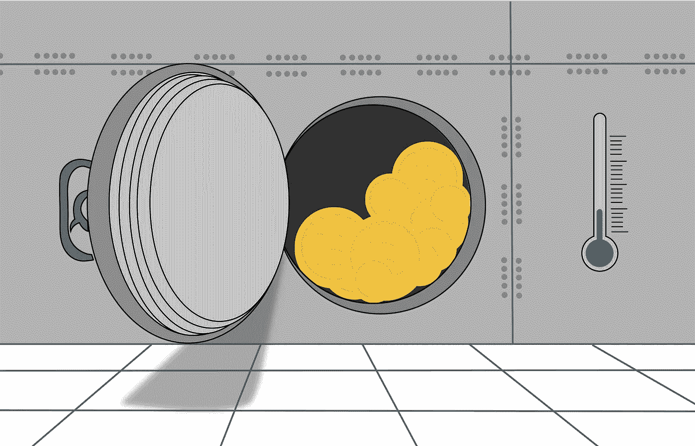
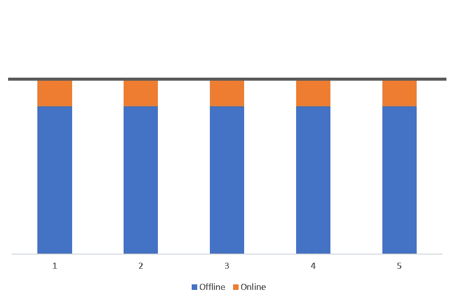
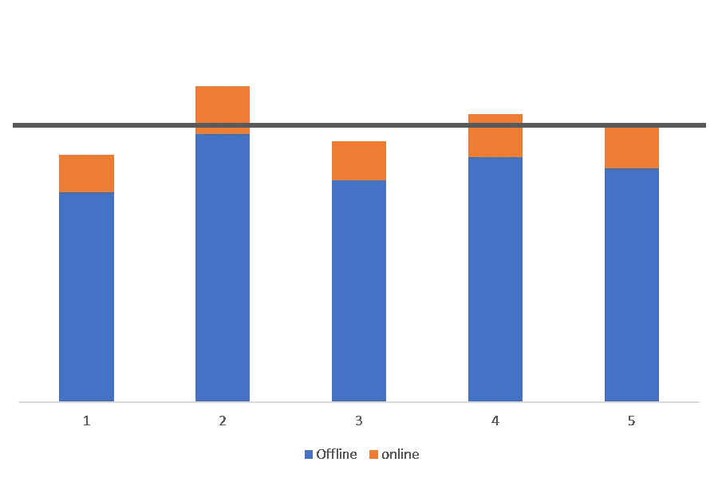
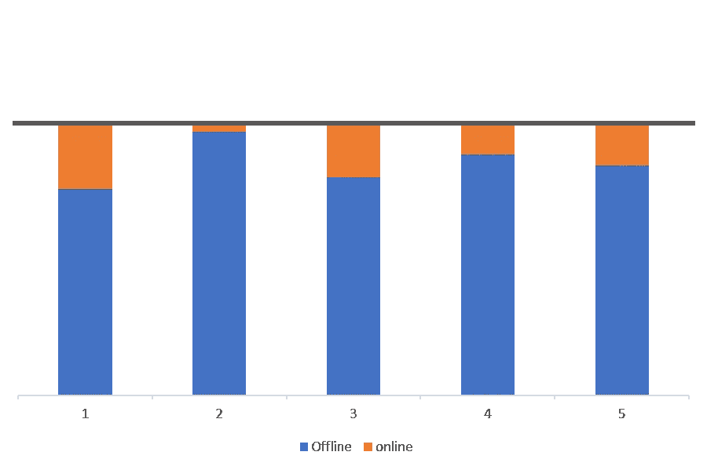
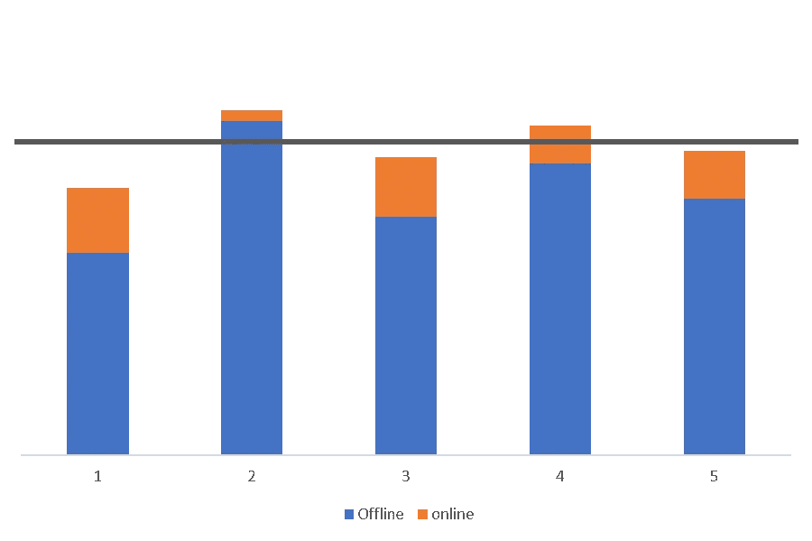
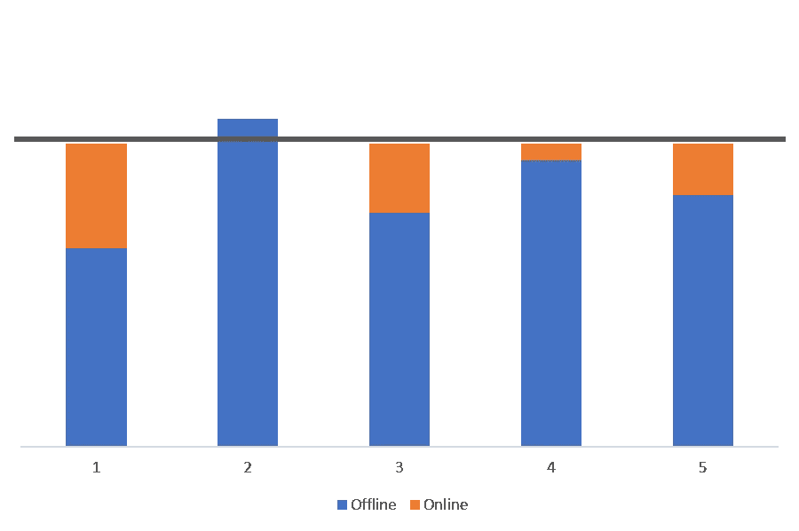
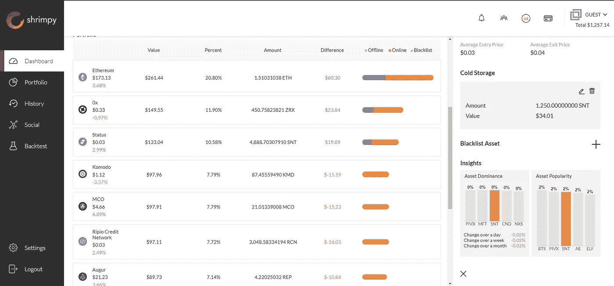
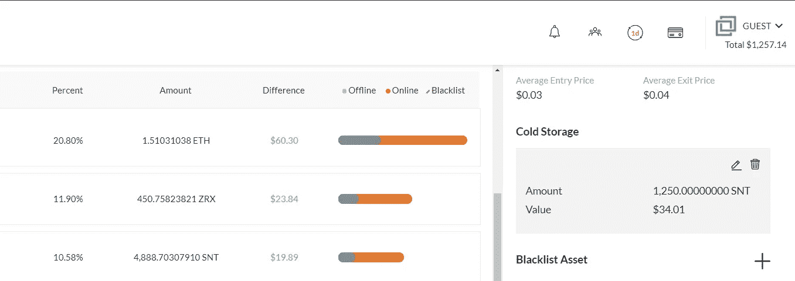

# 加密中组合再平衡的冷存储耦合

> 原文：<https://medium.com/hackernoon/cold-storage-coupling-for-portfolio-rebalancing-in-crypto-68806384d7c2>

加密货币空间设想了一个开放和去中心化的未来。尽管有一些应用程序正朝着这个方向发展，但我们离可靠的解决方案还有一段距离。低流动性、缓慢的交易时间和复杂的用户体验提供了不理想的情况。这并不是说这些问题最终不会得到解决，但目前，集中式平台对大多数投资者来说是有意义的。因此，我们需要考虑解决方案，以确保使用集中系统的投资组合的安全性。

不幸的是，到目前为止还没有好的解决方案。黑客的流行已经困扰了加密空间。投资者面临一个难题。他们是否应该在交易所管理自己的资产，在那里他们可以最大限度地发挥投资组合的潜力，或者他们是否应该离线储存资产，只是简单地 HODL。两个答案都不是最优的，所以对于大多数投资者来说，做出果断的决定仍然是一场斗争。

> 今天，不要再挣扎了。这个困难的决定有一个解决办法。

# 通过蓄冷耦合实现再平衡

用于再平衡的蓄冷耦合是这个问题的答案。当一个投资组合被重新平衡时，只有当前和目标配置之间的差值被交易。由于这通常是一个小数额，只有有限比例的投资组合需要在线维护，以完全重新平衡。其余资产可以保持离线。在重新平衡的计算过程中，这些被冷藏的资产可以被视为投资组合的一部分。本质上，假装资产在线，以便在重新平衡期间将所有持有的资产都包括在内。这提供了安全性、流动性和易用性之间的公平权衡。

如果你想了解更多关于再平衡的知识，你应该从下面两篇文章开始:

 [## 加密货币的投资组合再平衡

### 投资组合再平衡是投资者使用了几十年的策略。首先，投资者必须确定如何…

blog.shrimpy.io](https://blog.shrimpy.io/blog/portfolio-rebalancing-for-cryptocurrency)  [## 再平衡与 HODL:技术分析

### 这项研究的目的是描绘一幅公平的画面，说明再平衡作为一种策略如何符合霍德林。为了…

blog.shrimpy.io](https://blog.shrimpy.io/blog/rebalance-vs-hodl-a-technical-analysis) 

## 一个图解例子

在下一节中，我们将定义两种不同类型的资产。有些资产是在线的，有些是离线的。**在线**资产在交易所持有。这些资产是流动的，可以很容易地在不同的资产之间进行交易。**离线**资产存放在冷库或任何其他第三方服务中。这些资产不是流动的。这些资产不能通过再平衡工具进行交易。

下图将描述在线和离线资产。在线资产将被描绘为 ***橙色*** 。线下资产将被描绘为 ***蓝色*** 。每个条形图的大小由资产的价值决定。因此，当一项资产的价格上涨时，由于总价值增加，该项资产的价格就会变得更高。当一项资产的价格下降时，棒线会变小，因为该项资产的价值已经下降。这意味着如果两个条形大小相同，它们的值相等。

This figure shows a portfolio of 5 evenly distributed assets. The target allocation of each asset is therefore 20% of the portfolio.

在这个投资组合示例中，我们选择了 5 种不同的资产。为了简单起见，这些资产被简单地标记为 1 到 5。条形图显示 5 项资产中的每一项都按价值平均分配，因此必须为每项资产选择 20%的分配。因为我们有偶数分配，所以每次分配的目标值可以简单地定义为平均值。图表上显示的黑线是目标分配线。这是投资组合在每项资产上的理想分布。

条形图用蓝色的大线段表示每项资产的大部分价值都是离线持有的。这些蓝色部分不能在交易所交易，因此为了在重新平衡期间达到目标分配线，蓝色条必须始终保持在目标分配线以下。

This figure shows how the portfolio has deviated since the initial allocation. The target allocation for each asset is depicted by the dark line that intersects each bar graph.

在这个例子中，在投资组合被创建之后，随着每项资产的市场价值增加或减少，每项分配可能会偏离。这可以在上面的图像中观察到。当资产价值增加时，条形图中蓝色和橙色部分的大小也会增加。在这种情况下，资产 2 的表现超过了投资组合的其他部分。这使得该资产的蓝色部分更接近目标配置。

This figure shows how the portfolio looks when it is rebalanced after a period of price movement. The target allocation for each asset is depicted by the dark line that intersects each bar graph.

现在，我们将在资产被搁置一段时间后模拟重新平衡。上图展示了重新平衡后资产的分布情况。尽管配置出现了偏差，但交易所里的每种资产都有足够的流动性来实现完全的再平衡。但是，应该注意到，资产 2 的蓝色条形图越来越接近目标分配。

在本例中，将不提供任何干预来防止离线资产的价值(蓝色条形图部分)超过目标分配线。在真实的场景中，这是投资者应该从他们的第二号资产中取出一部分并转移到网上的时候。这将增加线上持有量(条形图橙色部分的大小)，并确保线下资产(条形图蓝色部分)永远不会超过目标分配线。

还可以观察到 1 号资产已经失去价值。随着其价值继续下降，该资产将在交易所积累。这提供了从交换中移除一些 1 号资产并将其送至冷藏的机会。这使交易所的交易量最小化，并使蓝色条形图部分更接近目标分配线。

This figure shows how the portfolio has deviated since the first rebalance. The target allocation for each asset is depicted by the dark line that intersects each bar graph.

一旦第一次重新平衡完成，每个资产又开始偏离。这导致每项资产继续偏离其初始分配。该图展示了第二项资产是如何越过目标分配线的。这意味着离线持有的资产的当前价值大于其目标配置。为了解决这个问题，应该将 2 号资产的一些离线持有的资产转为在线持有，以便下一次再平衡可以正确执行。

This figure shows how the portfolio looks when it is rebalanced after a second period of price movement. The target allocation for each asset is depicted by the dark line that intersects each bar graph.

经过第二次再平衡后，条形图的蓝色部分已经明显超过了目标分配线。上图展示了执行重新平衡后，蓝色条停留在目标分配线上方。原因是因为投资组合中的这部分资金是不流动的。它被冷藏起来，不能在交易所交易。结果，它不仅不能达到它的目标配置，而且没有其他资产能达到它们的目标配置。这表现在每个橙色条形图段和目标分配线之间的白色间隙。为了解决这个问题，必须将位于冷库中的一些资产 2 联机。下一次再平衡将使投资组合达到每项资产的目标配置。

# 公差带

整合冷藏以实现再平衡可以通过纳入公差带来推进。上面讨论的示例实现了一个策略，其中 85%的初始值保存在冷库中。由于偏差很大，当单个资产的太多价值离线存储时，这会导致不完全的重新平衡。

这个问题的解决方案是公差带。其工作方式是选择一个应保存在冷库中的目标百分比，以及任何给定资产允许的百分比容差。合理数字的一个例子是 90%的冷藏目标，容差为 5%。因此，每当一项资产超过离线持有的目标配置的 95%时，投资者应该将该资产目标配置的 5%上线。每当离线持有量超过目标配置的 85%时，该资产中目标配置的 5%应该被离线。之所以根据目标配置而不是投资组合中持有的资产的总价值来计算价值，是因为再平衡将试图达到目标配置。

# 带虾肉的冷库

Shrimpy 将继续创新允许用户保护其资产的方式。虽然当前的实现很简单，但是优化离线维护的资产的百分比是投资过程的一个重要方面。无论你是机构投资者还是个人，安全对你来说都很重要。

This figure is a screenshot from a Shrimpy portfolio that uses this cold storage strategy.

Shrimpy 通过应用程序中仪表板侧栏上的“冷存储”功能实现了这些想法。在这个投资组合示例中，我们看到了与上面讨论的蓝色和橙色条形图相同的模式。在 Shrimpy 中，灰色的代表“冷藏”资产，橙色的代表交易所的资产。当条形图的橙色部分消失时，额外的资产应该上线，以允许适当的流动性。随着条形的橙色部分变大，更多的资产可以离线。在上面的示例中，我们可以看到大约 80%的资产是离线存储的。

This figure demonstrates how “Cold Storage” balances are added to the Shrimpy application. Simply input the amount of each asset that is held in cold storage and it will instantly be included into your portfolio.

这张图片展示了在 Shrimpy 中添加“冷存储”资产的简单方法。只需选择冷藏的资产，然后指定该资产的金额。例如，如果您的硬件钱包中有 1 个 DASH，只需选择 DASH，然后在字段中输入 1，DASH 就会添加到您的冷存储中。

# 附加阅读

[***加密中的投资组合再平衡白皮书***](https://hackernoon.com/the-whitepaper-for-portfolio-rebalancing-in-crypto-ea6af634d35f)

[***多样化的加密用户表现更好***](https://blog.shrimpy.io/blog/crypto-users-who-diversify-perform-better)

[***加密组合再平衡回溯测试工具***](https://blog.shrimpy.io/blog/the-crypto-portfolio-rebalancing-backtest-tool)

[***创建黑仔加密货币投资组合的 10 个技巧***](https://blog.shrimpy.io/blog/10-tips-for-creating-a-killer-cryptocurrency-portfolio)

[***如何用这 24 种加密货币红旗***](https://blog.shrimpy.io/blog/how-to-avoid-scams-with-these-24-cryptocurrency-red-flags) 避免骗局

别忘了查看一下 [Shrimpy 网站](https://www.shrimpy.io/)，在 [Twitter](https://twitter.com/ShrimpyApp) 和[脸书](https://www.facebook.com/ShrimpyApp)上关注我们的更新，并在[Telegram](https://t.me/ShrimpyGroup)&[Discord](https://discord.gg/gXyy95y)上向我们令人惊叹的活跃社区提问。

留下你的评论，让我们知道你的平衡经验！

*捕虾队*