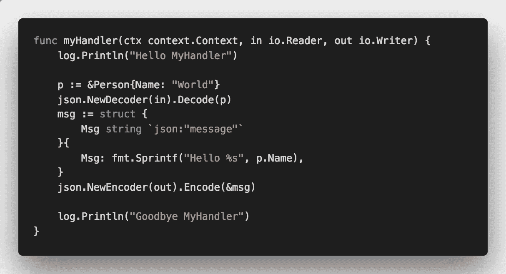
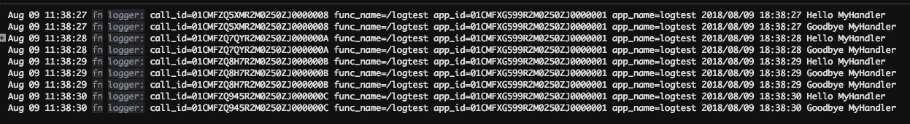

# 从无服务器 Fn 功能收集日志

> 原文：<https://medium.com/hackernoon/collecting-logs-from-serverless-fn-functions-a3bc6a7d8ec9>


Photo by [Ales Krivec](https://unsplash.com/@aleskrivec) on [Unsplash](https://unsplash.com/search/photos/log)

日志记录是做好一件非常重要的事情，尤其是在(微)服务和功能世界中，你必须跟踪数百个服务和功能中发生的事情。

在这篇文章中，我将简要介绍如何从 Fn 函数中收集日志

## 先决条件

*   [Fn CLI](https://github.com/fnproject/cli)
*   Fn 服务器(您可以使用`fn start`命令调出本地服务器)

# 创建一个简单的 Go 函数

从使用 Fn CLI ( `fn init --runtime go`)创建新功能开始。我在函数中添加了两个日志语句——hello 和 goodbye，如下所示:



Boilerplate Fn function with two logging statements added

让我们像这样部署和调用这个函数:

```
$ fn deploy --app logtest... deploy output ...$ fn call logtest /logtest
{"message":"Hello World"}
```

> 注意:除了运行`fn call`，你还可以列出你的应用程序的路线(`fn list routes [appname]`)，然后直接调用实际的端点。

所以我们从函数中得到响应——但是日志在哪里呢？

Fn CLI 有一个命令，允许您检索指定应用程序和呼叫 id 的日志。应用程序名称不足以获取日志——您需要更加具体，并提供一个调用 ID，该 ID 在您每次调用函数时都会被创建。要获得呼叫，你运行`fn list calls`命令并提供你的应用程序名称。

```
$ fn list calls logtest
```

您将收到一个响应，其中列出了对您的函数的所有调用，每个调用都有唯一的 ID、时间戳、应用程序和路线信息及状态:

```
ID: 01CMFXT9D3R2M0250ZJ0000004
App Id: 01CMFXG599R2M0250ZJ0000001
Route: /logtest
Created At: 2018-08-09T11:05:11.459-07:00
Started At: 2018-08-09T11:05:11.992-07:00
Completed At: 2018-08-09T11:05:11.996-07:00
Status: successID: 01CMFXK7KPR2M0250ZJ0000002
App Id: 01CMFXG599R2M0250ZJ0000001
Route: /logtest
Created At: 2018-08-09T11:01:20.246-07:00
Started At: 2018-08-09T11:01:20.776-07:00
Completed At: 2018-08-09T11:01:20.794-07:00
Status: success
```

> **注意**:您的函数可能会被调用很多次——您可以通过指定`--from-time`或`--to-time`选项，或者通过函数路径(`--path`)或返回的调用次数(`-n`)来过滤调用，从而轻松过滤出您想要的调用

让我们获取其中一个呼叫 id 并获取其日志:

```
$ fn get logs logtest 01CMFXK7KPR2M0250ZJ0000002
2018/08/09 18:01:20 Hello MyHandler
2018/08/09 18:01:20 Goodbye MyHandler
```

耶——我们得到了我们的日志！这一切都很好，但是对于数百个函数和跨越所有函数的成千上万个调用，没有人能够手动做到这一点。如果我们能在某个中心地方收集所有这些日志，那就方便多了。

# 收集日志

我已经决定尝试 [Papertrail](https://papertrail.com) ，看看如何将它与 Fn 连接起来，将我所有的功能日志发送到那里。

我已经在他们的网站上注册了，并快速完成了日志设置，以获得可以向其发送日志的端点——类似于`logsXYZ.papertrail.com:12345`。有了这个 URL，我可以配置我的应用程序，并告诉它我希望所有的日志都转到这个 URL。

为此我们。需要在 app 上这样设置`syslog-url`设置:

```
$ fn update app logtest --syslog-url=tls://[papertrail-endpoint]
app logtest update
```

用和前面一样的方法测试它——通过对函数进行几次调用。函数的输出仍然是相同的，如果我们检查调用日志，我们仍然应该看到与以前相同的日志。

但是，我们也会在 Papertrail 中获得相同的日志，如下所示:



Logs being sent to Papertrail

中央日志收集系统的好处是，它让您能够保留日志，搜索它们，甚至设置警报，如果你想。此外，您还可以通过应用程序名称或 ID 或功能或调用名称来过滤日志。这样，诊断发生了什么和哪里出了问题就变得容易多了。

# 结论

在这篇短文中，我们创建了一个样板文件 [Fn](https://fnproject.io) 函数，并将我们的应用配置为自动将所有日志发送到云日志收集系统(在我们的例子中，我们使用了 [Papertrail](https://papertrail.com) ，但是您也可以使用任何其他提供者)。

# 感谢阅读！

非常欢迎对本文的任何反馈！你也可以在 [Twitter](http://twitter.com/pjausovec) 和 [GitHub](http://github.com/peterj) 上关注我。如果你喜欢这个并且想在我写更多东西的时候得到通知，你应该订阅[我的时事通讯](https://tinyletter.com/pjausovec)！