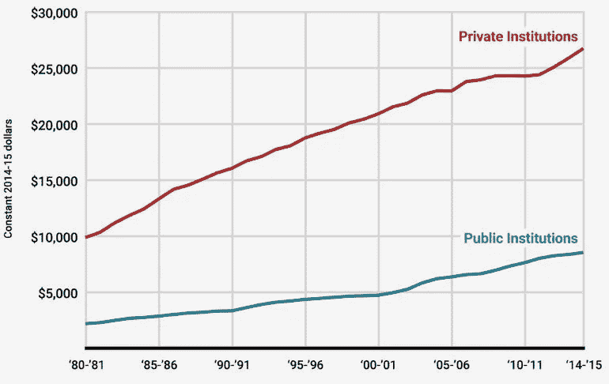
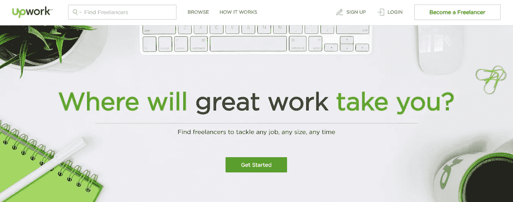
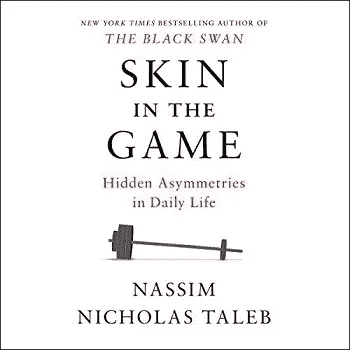

# 大学快不行了，自己设计教育吧。

> 原文：<https://medium.com/hackernoon/college-is-dying-design-your-own-education-830dd607dad7>

大学快不行了。

我指的不是这些机构——它们可能还会存在几十年。

我指的是范例。

为了获得教育，你必须:

1.  选择一个研究领域。
2.  部分移动性和可选性+数万美元。
3.  承诺 4 年的投资，但对你所选择的领域在现实世界中如何运作几乎一无所知。
4.  让一个中心规划者来决定在你的领域里什么是值得学习的。
5.  分配给你的老师没有多少选择的余地。
6.  注重理论胜于实践，注重记忆胜于解决问题。
7.  向游戏中没有皮肤的人学习。
8.  依靠一个机构提供的文件来证明你学到了东西。

尽管存在上述缺点，对于千禧一代之前的每一代人来说，上大学都是一个明智的选择。但是在过去的 15 年里，有两种趋势让这个决定变得更加可疑:

价格上涨，价值下降。

先说第一个。

# 学费上涨和金融期权

在 1987-1988 学年，公立大学的平均年学费是 3190 美元(根据今天的美元进行调整)。

2017-2018 学年，平均为 9970 美元——增长了 213%。

如果你选择私立大学，你将支付更多的费用——2017-2018 年的平均费用为 34740 美元。

Average tuition between 1980 and 2015 (inflation-adjusted). Source: National Center for Education Statistics.

越来越多的学生举债来资助他们的教育——大约 70%的大学毕业生带着学生债务离开大学，平均欠款高达 39400 美元。

人们往往低估了早年负债的危害。

这不是钱的问题，而是金融选择权的问题。

年轻人拥有的最有价值的东西是选择性——地点、职业、教育——一切都摆在桌面上。

大学一毕业就不得不开始偿还债务，这使得年轻人不太可能利用他们的选择权去做以下事情:

*   在一个伟大的导师手下做无薪实习。
*   在东南亚旅行半年。
*   创业。
*   追寻新发现的激情。

和无数其他的努力，一个人可以在二十出头的时候去追逐，去积累生活经验，利用机会。

没有什么比债务更能确保一个人呆在狭窄的空间里，永远不去探索他所有的选择。

而且不仅仅是毕业生要付钱；他们的父母也遭受了不断上涨的大学费用。

[旧范式:选择一个单一的研究领域。](https://medium.com/u/f138bf5466fe#1</h1><h2 id=)

## [新范式:结合来自多个学科的知识，创造一个强大的，独特的组合。](https://medium.com/u/f138bf5466fe#1</h1><h2 id=)

[互联网经济正在以太快的速度创造新的职业，以至于大学无法拿出与之相匹配的学位。这些职业中的许多需要两到三种不同的技能，这些技能不是在同一个学位甚至不是在同一个系里教授的。](https://medium.com/u/f138bf5466fe#1</h1><h2 id=)

[以加密货币为例，三年前你可能不知道这项新技术的存在。互联网上出现了一个新领域，对密码专家的需求很大。要深入理解加密货币，至少需要精通三个领域:经济学、密码学和计算机科学。](https://medium.com/u/f138bf5466fe#1</h1><h2 id=)

[成为一名成功的博客写手需要一套不同的技能——另一种互联网时代的职业。光是写作课是不行的，因为你需要了解市场营销，并有足够的商业技能来赚钱。](https://medium.com/u/f138bf5466fe#1</h1><h2 id=)

[通常是那些拥有独特技能和经验的人从人群中脱颖而出。正如斯科特·亚当斯所说:](https://medium.com/u/f138bf5466fe#1</h1><h2 id=)

> [“每个人都至少有几个领域，通过努力，他们可以进入前 25%。就我而言，我比大多数人都画得好，但我算不上艺术家。我并不比那些永远成不了大器的普通单口喜剧演员有趣，但我比大多数人都有趣。神奇的是，很少有人能画得好，能写段子。这两者的结合使得我的作品如此罕见。当你加上我的商业背景，我突然有了一个话题，很少有漫画家不亲身经历就能理解。](https://medium.com/u/f138bf5466fe#1</h1><h2 id=)
> 
> [资本主义奖励既稀有又有价值的东西。你把两种或两种以上的“好东西”组合在一起，直到没有人拥有你的组合，从而让自己变得稀有。"](https://medium.com/u/f138bf5466fe#1</h1><h2 id=)

# [#2](https://medium.com/u/f138bf5466fe#1</h1><h2 id=)

## [旧模式:部分移动性和可选性+数万美元。](https://medium.com/u/f138bf5466fe#1</h1><h2 id=)

## [新范式:保持你的选择开放，保持位置独立和无债务。](https://medium.com/u/f138bf5466fe#1</h1><h2 id=)

[就像我已经提到的，年轻的好处之一就是没有任何附加条件。你没有一个家庭要养活，而且你在这场竞赛中还处于起步阶段，你有能力去尝试。](https://medium.com/u/f138bf5466fe#1</h1><h2 id=)

[让自己在一个城市呆上四年，同时承担满满的日程和数千美元的债务——几乎完全消除了这种好处。](https://medium.com/u/f138bf5466fe#1</h1><h2 id=)

[你可以花不到 100 美元在网上参加几乎任何课程，设计适合你生活的学习计划，避免受地点的限制。](https://medium.com/u/f138bf5466fe#1</h1><h2 id=)

[你可以自由地接受一份给你宝贵经验的工作，心血来潮地搬到一个新城市去追求一个令人兴奋的机会，测试你新的商业想法，或者在越南旅行时开一个博客；当你在网上接受教育时，你几乎有无限的选择。](https://medium.com/u/f138bf5466fe#1</h1><h2 id=)

[A beautiful photo of rice terraces in Vietnam — because why not?](https://medium.com/u/f138bf5466fe#1</h1><h2 id=)

# [#3](https://medium.com/u/f138bf5466fe#1</h1><h2 id=)

## [旧范式:承诺 4 年的投资，但对你的领域在现实世界中如何运作一无所知。](https://medium.com/u/f138bf5466fe#1</h1><h2 id=)

## [新范式:一次承诺几个月，用你所在领域的实践经验重新评估。](https://medium.com/u/f138bf5466fe#1</h1><h2 id=)

[如果你从来没有花一天时间在某个领域工作，你怎么能选择用四年的时间在这个领域呢？](https://medium.com/u/f138bf5466fe#1</h1><h2 id=)

[更重要的是，您为什么要这样做？](https://medium.com/u/f138bf5466fe#1</h1><h2 id=)

[想象你想成为一名游戏开发者。在旧世界，你会申请一个 4 年的计算机科学项目——希望是一个提供游戏专业的项目。与博彩业真正接触需要很长时间，这对于判断您是否真的走上正轨至关重要。](https://medium.com/u/f138bf5466fe#1</h1><h2 id=)

[在新的世界里，你可以免费下载 Unity 游戏引擎，看几个小时的教程，你就可以运行你的第一个游戏了。](https://medium.com/u/f138bf5466fe#1</h1><h2 id=)

[当然，这很糟糕，但你会知道你是否玩得开心。](https://medium.com/u/f138bf5466fe#1</h1><h2 id=)

[如果你发现了，你可以花 6 到 8 个月的时间来提高你的技能，在 Udemy 上学习课程，加入独立开发者社区，在推特上与游戏行业的人交流，并尝试在 Upwork 上获得一些自由工作。](https://medium.com/u/f138bf5466fe#1</h1><h2 id=)

[一旦你和你想工作的行业有了真正的摩擦，你就可以决定是否要进一步投资或尝试其他东西。](https://medium.com/u/f138bf5466fe#1</h1><h2 id=)

[“Inside” — a critically acclaimed atmospheric adventure game created on the freely-available Unity engine.](https://medium.com/u/f138bf5466fe#1</h1><h2 id=)

# [#4](https://medium.com/u/f138bf5466fe#1</h1><h2 id=)

## [旧范式:让一个中央计划者来规定你所在领域中值得学习的东西。](https://medium.com/u/f138bf5466fe#1</h1><h2 id=)

## [新范式:构建自己的课程，并随着世界的变化和发展不断更新。](https://medium.com/u/f138bf5466fe#1</h1><h2 id=)

[在每个学科中，都有各种各样的主题，每天都有创新发生。当别人设计你的课程时，他们会告诉你什么值得学习，你应该关注什么。](https://medium.com/u/f138bf5466fe#1</h1><h2 id=)

[设计议程的中央计划者没有考虑到您的特殊兴趣，也可能不了解您所在领域的最新发展。这可能会导致你花时间在与你的目标不符或者你根本不感兴趣的课程上。](https://medium.com/u/f138bf5466fe#1</h1><h2 id=)

[让我们回到游戏开发者的例子。](https://medium.com/u/f138bf5466fe#1</h1><h2 id=)

[你想专注于手机游戏还是游戏机游戏？你想为一家像电子艺术这样的大公司工作，还是打算开一家自己的独立工作室？](https://medium.com/u/f138bf5466fe#1</h1><h2 id=)

[如何回答这些问题将决定你应该关注哪种编程语言，以及除了编码之外，你还应该发展哪些技能。](https://medium.com/u/f138bf5466fe#1</h1><h2 id=)

[不要把这些决定留给别人。您的时间宝贵而宝贵。](https://medium.com/u/f138bf5466fe#1</h1><h2 id=)

# [#5](https://medium.com/u/f138bf5466fe#1</h1><h2 id=)

## [旧模式:让你的老师分配给你，没有多少选择的余地。](https://medium.com/u/f138bf5466fe#1</h1><h2 id=)

## [新范式:为每一个科目选择你能找到的最好的老师。](https://medium.com/u/f138bf5466fe#1</h1><h2 id=)

[你向谁学习和你学到什么一样重要。](https://medium.com/u/f138bf5466fe#1</h1><h2 id=)

[通过注册大学，你将自己局限于少数在那里工作的老师。当您设计自己的教育时，您可以为每一个科目选择最好的老师——一个拥有您想要的经验和与您产生共鸣的教学风格的老师。](https://medium.com/u/f138bf5466fe#1</h1><h2 id=)

[如果你的目标是进入比特币编程领域，参加 Jimmy Song 的现场研讨会。如果你想成为一名更好的作家，马尔科姆·格拉德威尔提供在线课程。如果你想学习投资，阅读《自助餐》( Buffet )( T1)和《T2 》( Taleb )( T3)比哈佛的任何金融课程都有更高的投资回报率。](https://medium.com/u/f138bf5466fe#1</h1><h2 id=)

[Malcolm Gladwell, Author of bestsellers like “Outliers” and “Blink”, now shares how knowledge online.](https://medium.com/u/f138bf5466fe#1</h1><h2 id=)

[随着时间的推移，最好的老师将会被吸引到大规模的教学中，而不是在大学里，因为在大学里，影响力和经济补偿可以与他们的才华水平成比例。](https://medium.com/u/f138bf5466fe#1</h1><h2 id=)

[不管你是爱还是恨乔丹·彼得森，他现在比他作为一名大学教授所梦想的赚了更多的钱，影响了更多的人。](https://medium.com/u/f138bf5466fe#1</h1><h2 id=)

# [#6](https://medium.com/u/f138bf5466fe#1</h1><h2 id=)

## [旧范式:注重理论而非实践，死记硬背而非解决问题。](https://medium.com/u/f138bf5466fe#1</h1><h2 id=)

## [新范式:关注实践和解决实际问题(但研究有价值的理论)。](https://medium.com/u/f138bf5466fe#1</h1><h2 id=)

[如果你想成为一名平面设计师，哪个选项更有可能发展你的技能？](https://medium.com/u/f138bf5466fe#1</h1><h2 id=)

1.  [记忆艺术史的事实。](https://medium.com/u/f138bf5466fe#1</h1><h2 id=)
2.  [想办法为你在 Upwork 上招募的顾客找到合适的商标。](https://medium.com/u/f138bf5466fe#1</h1><h2 id=)

[Upwork — an online marketplace for talent. Credentials not required.](https://medium.com/u/f138bf5466fe#1</h1><h2 id=)

[如果你走第二条路，你将被迫回答一些基本问题:](https://medium.com/u/f138bf5466fe#1</h1><h2 id=)

*   [我如何清楚地了解客户想要什么？](https://medium.com/u/f138bf5466fe#1</h1><h2 id=)
*   [我应该向客户展示许多草图，还是应该等到我有了最终的设计？](https://medium.com/u/f138bf5466fe#1</h1><h2 id=)
*   [我喜欢这样吗？](https://medium.com/u/f138bf5466fe#1</h1><h2 id=)

[找到这些问题的答案会让你更快地实现目标，如果你觉得自己缺乏理论知识，没有什么能阻止你去获得它。注重实践、动手学习并不意味着你拒绝理论知识——只是你需要在投入时间之前确信它的有用性。](https://medium.com/u/f138bf5466fe#1</h1><h2 id=)

# [#7](https://medium.com/u/f138bf5466fe#1</h1><h2 id=)

## [旧范式:向游戏中没有皮肤的人学习。](https://medium.com/u/f138bf5466fe#1</h1><h2 id=)

## [新范式:向那些名声在外、与你的成功有利害关系的人学习。](https://medium.com/u/f138bf5466fe#1</h1><h2 id=)

[你应该担心你教授的任期。他从你的成功中获益甚少，如果你失败了，他几乎没有什么可失去的。换句话说——他与游戏无关。](https://medium.com/u/f138bf5466fe#1</h1><h2 id=)

[“](https://medium.com/u/f138bf5466fe#1</h1><h2 id=)[Skin in the Game](https://www.amazon.com/gp/product/042528462X/ref=as_li_tl?ie=UTF8&tag=omahwiza-20&camp=1789&creative=9325&linkCode=as2&creativeASIN=042528462X&linkId=90971b8cd26578e95647a8ef298c588b)” — the best book I read in 2018.

作为一名扑克玩家，我遇到的一个独特的概念是“教练盈利”，一名职业玩家将教练一名初学者，以换取学生在牌桌上一定比例的利润。如果学生一事无成，教练浪费了他的时间，但是如果学生成功了，他就能分享他的成功。这是一个很好的模型，原因有二:

1.  教练只带他能帮助的学生。
2.  教练致力于学生的成功。

“兰巴达学校”是一家成功的初创公司，它提供无前期成本的编码训练营——只有当你找到一份年薪至少 5 万美元的工作时，你才需要付费。当你报名参加他们的一个项目时，你知道他们会尽一切努力让你去，因为他们的生意依赖于此。

一个在 Udemy 上卖 15 美元课程的老师在游戏中可能没有这种水平的皮肤，但他仍然必须在他的空间里与其他老师竞争。如果这个课程不够优秀，它就不太可能脱颖而出，这会直接影响他的财务状况。

在公开市场上销售产品和服务的教师每天都必须赢得人们的信任，而他们总是会因为一些差评而失去信任。

在线消费者对评论的重视赋予了学生难以置信的力量。如果你买了一个 15 美元的高评分课程，并留下一个负面评价，讲师将遭受超过 15 美元的损失。这使得他的兴趣和你的更加一致，这是游戏中皮肤的直接结果。

# #8

## 旧范式:依靠一个机构提供的文件来证明你学到了东西。

## 新范式:让你的工作证明你的能力，而不是一张纸。

人家不在乎学历；他们关心的是把事情做好。

如果你确信你能做到，雇主会给你机会。如果你超出了他们的期望，他们会想尽一切办法留住你。

获得第一次机会总是很棘手。当我 21 岁的时候，我想进入软件行业。我没有任何经验或证书——只有在网上获得的一些基本技能——但我渴望学习和适应，我愿意努力工作和免费工作。

一位朋友帮我争取到了一份无薪实习:我无薪工作了五个月，这是我可以负担得起的，因为我没有债务，还有些积蓄(这也是金融期权)。

当项目结束时，我飞到哥伦比亚，在南美旅行了五个月，当我回来时，我能够利用我在以前项目中的工作获得一个入门级的职位，工资是最低工资的 3 倍——超过了我在人生那个阶段想做的一切。

今天，没有人问我为什么没有学位。当公司雇佣我做顾问时，他们唯一关心的是我已经做了九年了。

迈出这一步需要努力和一些创造力，但你可以赢得多年的生命作为回报。

# 也许你还是应该去上大学

我并不是建议任何人都不应该上大学，但我们需要把它看作是许多选择中的一个，而不是每个人的默认路径。

在我看来，如果满足以下条件，你就应该上大学:

1.  你确定你想在你所研究的领域里度过至少十年的时光。
2.  进入那个领域的唯一途径是获得大学学位。

如果那不是你，那么现在是拥抱新教育模式的最佳时机。

该模型使您能够:

1.  将几门学科的知识结合起来，创造一个强大的、独特的混合体。
2.  保持你的选择，保持位置独立和无债务。
3.  一次花几个月的时间，利用你所在领域的实践经验重新评估。
4.  建立自己的课程，并随着世界的变化和发展不断更新。
5.  为每门课挑选你能找到的最好的老师。
6.  注重实际，解决现实问题(但要学习有价值的理论)。
7.  向那些名声在外、与你的成功有利害关系的人学习。
8.  让你的工作证明你的能力，而不是一张纸。