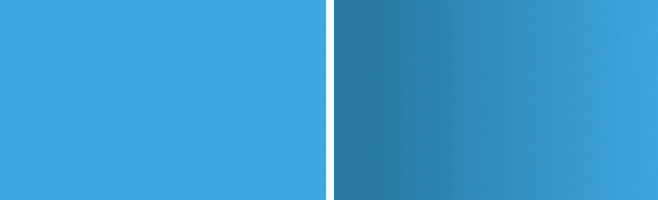
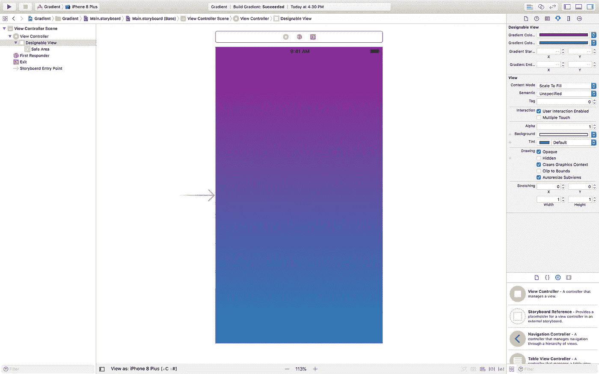

# 用渐变给它上色——iOS

> 原文：<https://medium.com/hackernoon/color-it-with-gradients-ios-a4b374c3c79f>

保持冷静，打造你自己的颜色🍭


我使用 iOS 已经很长时间了，相信我，一个应用要被更多的用户接受，就必须要有一个好看的视觉界面。好的设计、颜色、概念在构建一个伟大的 UI 时都很重要。

渐变是给颜色增添活力的因素之一。素色还是渐变色？让我们看看哪个更吸引眼球..



当然是第二个。不是吗？混合两种颜色比单一颜色更吸引人。

在本文中，我们将讨论如何在我们自己的应用程序中实现这一点。相信我，这看起来很简单。“更多的颜色而不是单一的颜色”。那么，让我们开始吧。

# 我们需要知道的事情

[核心动画框架](https://developer.apple.com/documentation/quartzcore) —渲染、合成和动画化视觉元素。

iOS 中的每个视图都有一个关联层，用于处理视图的所有绘图和动画。视图的层可以使用它的`[layer](https://developer.apple.com/documentation/uikit/uiview/1622436-layer)`属性来访问，这个属性是`CALayer`的一个对象。

[CALayer](https://developer.apple.com/documentation/quartzcore/calayer) —管理基于图像的内容并允许您在该内容上执行动画的对象。

> 图层的主要工作是管理您提供的可视内容，但是图层本身具有可以设置的可视属性，例如背景颜色、边框和阴影。

[CAGradientLayer](https://developer.apple.com/documentation/quartzcore/cagradientlayer) —在背景色上绘制颜色渐变的图层，填充图层的形状(包括圆角)。

> 您可以使用渐变图层来创建包含任意数量颜色的颜色渐变。默认情况下，颜色会均匀分布在整个层中，但是您可以选择指定位置，以便通过渐变来控制颜色位置。

让我们看看`CAGradientLayer`能给我们提供什么。

1.  `[colors](https://developer.apple.com/documentation/quartzcore/cagradientlayer/1462403-colors)` —我们需要制作渐变的颜色。它是一个`CGColorRef`对象的数组，也就是说，你必须提供`CGColor`，而不仅仅是`UIColor`的一个对象。**示例** : `[UIColor.red.cgColor, UIColor.blue.cgColor]`
2.  `[startPoint](https://developer.apple.com/documentation/quartzcore/cagradientlayer/1462408-startpoint)` —渐变的起点。
3.  `[endPoint](https://developer.apple.com/documentation/quartzcore/cagradientlayer/1462412-endpoint)` —渐变的终点。
4.  `[locations](https://developer.apple.com/documentation/quartzcore/cagradientlayer/1462410-locations)`—`NSNumber`对象的可选阵列，定义每个渐变停止点的位置。

你可以在这里查阅完整的文档[。](https://developer.apple.com/documentation/quartzcore/cagradientlayer)

# 编码它

好了，现在我们知道了梯度所需要的一切，让它工作只是时间问题。

让我们先来看看如何获得一个可以在视图的`layer`上使用的渐变。

伟大的..！！！我们现在有一个梯度。但是，等等..！！！为什么它不起作用🤔？刷新刷新刷新！！！不要..还是不行🤯。

啊啊..！！！我们忘了一件小事。仅仅有梯度是不够的。我们还必须将它应用到我们想要的视图中。我们真是太傻了🤦‍♀️.好吧，这就是我们如何将渐变应用到我们的视图中。

```
view.layer.addSublayer(gradientLayer)
```

这里，视图可以是任何元素，可以是`UIView`、`UIButton`、`UILabel`等。你可以用同样的方法对它们中的每一个应用渐变。对一个`UICollectionViewCell`应用渐变就像对其他元素应用渐变一样简单。将`CAGradientLayer`作为`sub-layer`添加到视图层。就这么简单。不是吗？

就是这样。这就是我们想要在屏幕上得到的好看的渐变。

行..！！！现在我们知道如何让它工作，我有一个问题。这纯粹是 UI 的事情吧？。我们能不在`Storyboard`本身🧐得到它吗？虽然没有那么多代码，但是为什么每次我需要渐变的时候都要写呢？为什么不改变故事板的`attribute inspector` 本身的一些属性呢🤔？如果我们也能做到，那就太容易了。

看来我们的要求越来越高了。😉LOL。我知道这种痛苦。改变`storyboard`本身的属性比通过代码做同样的事情更令人满意。我们走吧..🙂

# 把它放在故事板里..！！！✌️

`@IBDesignable`和`@IBInspectable`是我们可以用来达到这个目的的。

使用`IBInspectable`和`IBDesignable`，可以构建一个自定义界面来配置您的自定义控件，并在设计您的项目时实时呈现它们。

你可以在这里了解更多信息[。](http://nshipster.com/ibinspectable-ibdesignable/)

在故事板的`Class Inspector`中将视图的自定义类设置为`DesignableView`。这是它将如何出现在故事板的`Attributes Inspector`中。



对于一个优秀的 UI 来说，看到它的样子是必须的。一遍又一遍地编码同样的东西来获得完美的外观是非常累人和繁重的。这是故事板最大的优点之一，实际上这就是故事板的用途。**观感**最终的结果会是什么。

就是这样。编码一次，在任何地方使用。没有额外的代码，什么都没有。添加您想要在渐变中显示的任意数量的颜色。来吧，试试看。🤠

# 示例项目

您可以从[这里](https://github.com/pgpt10/GradientSample)下载示例项目。

# 促销

别忘了阅读我的其他文章:

1.  [Swift 4 中关于 Codable 的一切](https://hackernoon.com/everything-about-codable-in-swift-4-97d0e18a2999)
2.  [你一直想知道的关于 iOS 中通知的一切](https://medium.freecodecamp.org/ios-10-notifications-inshorts-all-in-one-ad727e03983a)
3.  [iOS 11 编码:如何将&拖放到集合&表中](https://hackernoon.com/drag-it-drop-it-in-collection-table-ios-11-6bd28795b313)
4.  [关于 iOS 10 中的今日扩展(Widget)你需要知道的一切](https://hackernoon.com/app-extensions-and-today-extensions-widget-in-ios-10-e2d9fd9957a8)
5.  [UICollectionViewCell 选择变得简单..！！](https://hackernoon.com/uicollectionviewcell-selection-made-easy-41dae148379d)

如果你有任何疑问，请随时发表评论。