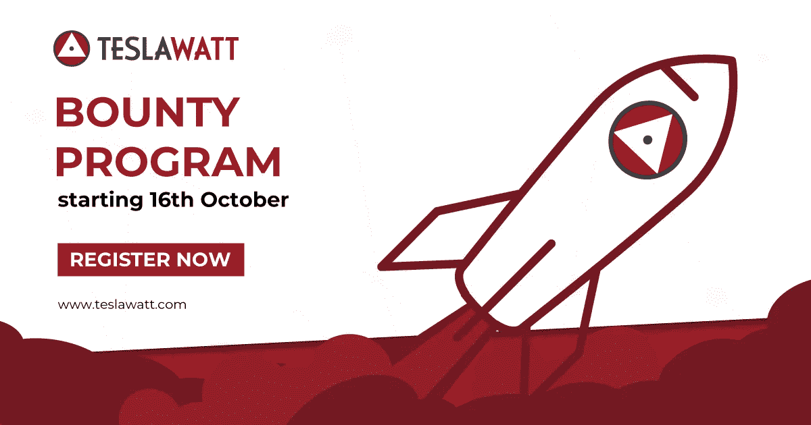
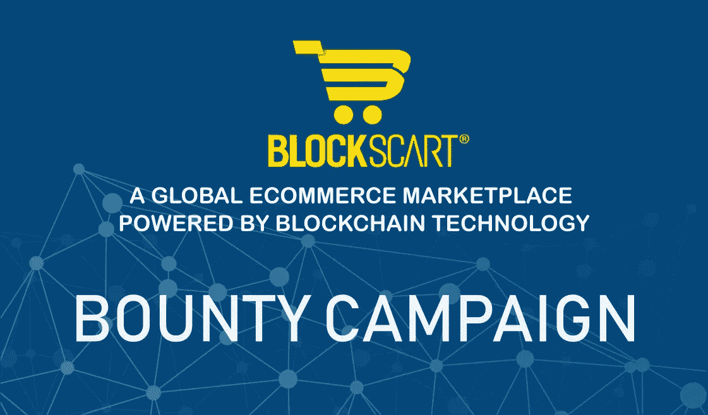

# 丰富多彩的赏金计划世界

> 原文：<https://medium.com/hackernoon/colorful-world-of-bounty-programs-d421df73f174>

## `Pirates. Bounties and bounty hunters. Nope, not your new Netflix/Hulu series but trendy blockchain/bitcoin topic.`

“black, brown, and white galleon ship scale model on brown wooden shelf” by [Andrew Neel](https://unsplash.com/@andrewtneel?utm_source=medium&utm_medium=referral) on [Unsplash](https://unsplash.com?utm_source=medium&utm_medium=referral)

过去几周，我一直在 ICOs 奖金计划的浑水中游泳。虽然导航通常很难，但如果你导航得当，你可以遇到闪亮的真正令人惊叹的程序，这些程序实际上可以为你赚一大笔钱，而不是一吨钱。

然而，任何有经验的赏金猎人都会告诉你，外面有很多垃圾。在其中导航可能是一项艰巨的任务。

但是，什么是赏金呢？

从本质上来说，赏金是区块链初创公司使用的一种营销策略，这些公司对搅动社区感兴趣，可以说是通过将一部分“加密资产”投资到社区来传播信息。

**嗯，什么？**简单来说，区块链的初创公司为用户提供公平的报酬，用于推广和/或改进他们的 ICO 产品。用户需要执行不同的任务，如社交媒体发布/共享等，为此他们可以获得 ICOs 原生令牌、其他加密货币，甚至法定货币。

让我们举几个例子，好吗？

## 特斯拉瓦特奖金计划

TeslaWatt 的主要目标是建立一个太阳能发电厂，为我们的新老客户提供独立能源。为了实现他们的计划，他们已经为公用事业令牌 TSW 建立了一个基础设施，这将使这一切成为现实。

TeslaWatt token #TSW 是一种基于以太坊的价值令牌。作为一个公用事业令牌，TSW 将使持有者能够继续使用 TeslaWatt 的解决方案，以及交易公用事业。

社交媒体赏金活动(在 Twitter、Telegram、BitcoinTalk 论坛、脸书和 LinkedIn 上)正在进行，共分配了 25 万 TSW 代币！

## 点击在官方 [BitcoinTalk 页面了解更多信息。](https://goo.gl/XXKKNk)

## 布洛克斯卡特奖金计划

BlockScart 将成为一个由区块链技术驱动的全球电子商务市场。他们使用 BLXS 硬币进行操作，参与者将获得 BLXS，这是一种 Waves 赞助的资产，通过 DEO(分散交易产品)以 0.05 美元的价格进行交易。

他们在 Telegram、脸书、Twitter、Instagram 和 Reddit 上开展竞选活动。

## 点击官方 [BitcoinTalk 页面](https://bitcointalk.org/index.php?topic=5051522.0)了解更多信息。

虽然这是区块链初创公司传播信息的最佳方式之一，但对于那些参与该项目的人来说，你怎么能确定这不是一个骗局呢？

虽然根据我的经验，我并没有所有的答案，但这些东西有助于从其他东西中定义好的东西:
-首先，也是最重要的是，研究规则以及它们在解释和促进他们的奖金计划的目的方面所花的时间。在你追随他们之前做一个调查。尽你所能找到关于 bounty 背后的公司的所有官方信息(总部地址，查看谷歌地图，谷歌我的企业列表，官方新闻稿和文章等)。
——深入挖掘一下这家公司和运营它的人，我不是在说他们的官方网站和 soc 简介。查看社交热点、论坛话题等。看看他们试图推广的东西是否有利益一致性。
——利用他们的电报渠道去熟悉他们。问一个你能想到的最愚蠢的问题，然后让他们讨论技术细节。
-看看他们代币的主要用途是什么。问问周围的人他们的解释是否有道理。
- **询问你关注的或你所在社区的专家**。
-查看谁分享/转发/发布了内容等。你会惊讶有多少虚假的个人资料会这样做(通常关注者/朋友的数量很少)。一旦你找到真实的个人资料，给他们发一条信息。问他们做了什么，为什么。

做完所有这些不会让你立刻成为一名成功的赏金猎人。但是它会给你一个很好的初学者框架，帮助你成为一名初学者。

顺便说一句，现在需要一个精通业务又有能力的赏金猎人。抓住时机，快乐狩猎。

## 继续阅读…链接:-)

有些人能比我更好地解释事情，他们的帖子对我帮助很大。我分享经验，他们分享知识。

[*【令牌组学:令牌使用、效用和价值的商业指南*](/@wmougayar/tokenomics-a-business-guide-to-token-usage-utility-and-value-b19242053416)[*ICO 赏金战役终极指南帕斯卡尔·泰尔曼*](https://blog.bounty0x.io/the-ultimate-guide-to-ico-bounty-campaigns-cccd8374f6ee)[*效用与安全令牌:为什么不能兼得？*](/@wmougayar/utility-vs-security-tokens-why-not-both-b23e199f84fc)[*如何从加密赏金程序中赚钱*](/coinmonks/how-to-make-money-from-crypto-bounty-programs-the-complete-guide-aa78726d308d)

## 如果你喜欢这个故事，请点击👏按钮，在[中](/@blockguyeddie)、[推特](https://twitter.com/blockguyeddie)、[脸书](https://www.facebook.com/groups/179414492752527/)关注我，分享出来帮助别人找到！

## 我错过了什么吗？让我知道。在下面的评论区分享你的想法。