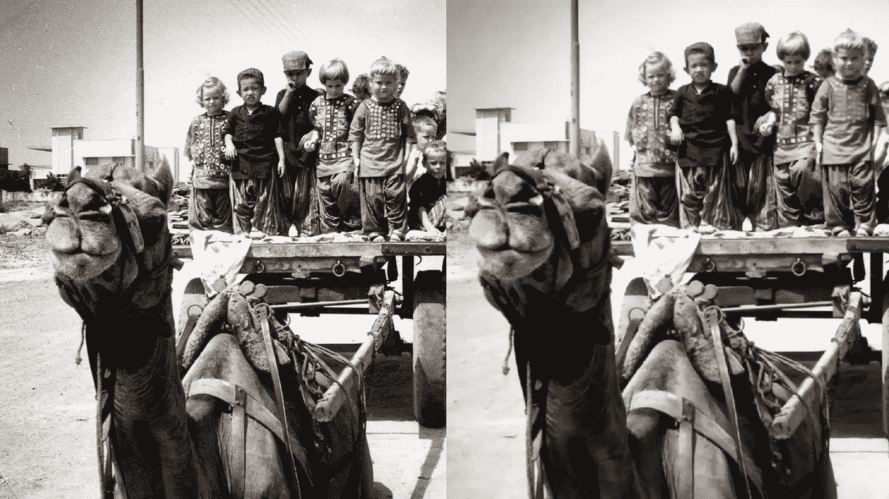
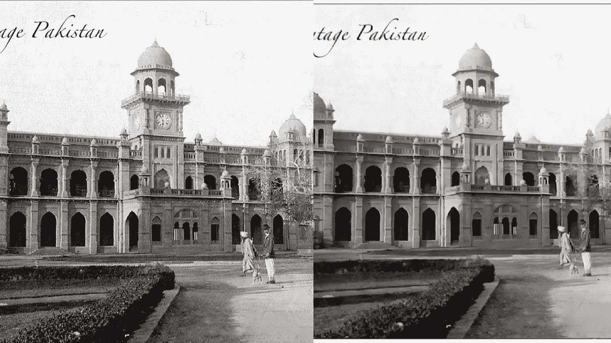
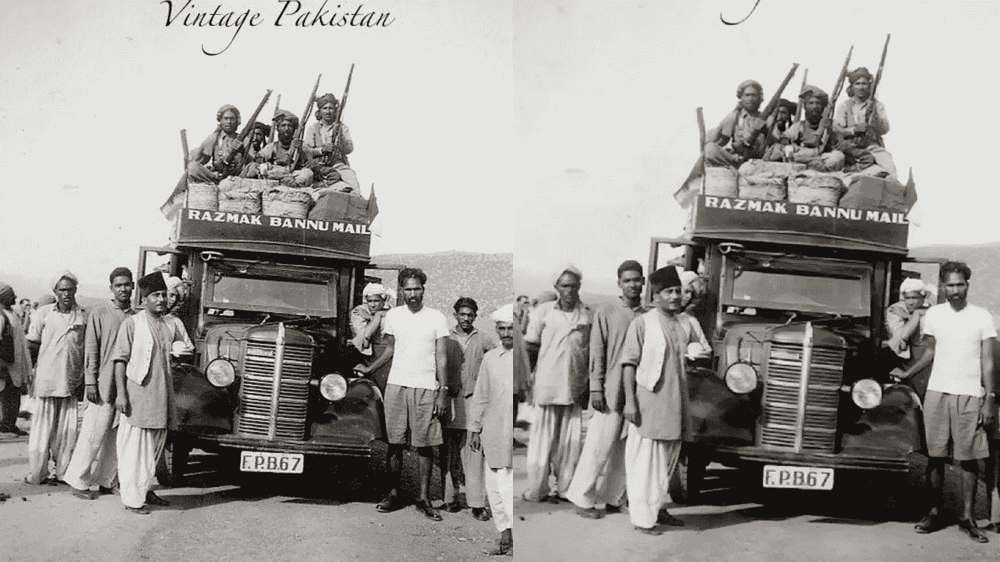
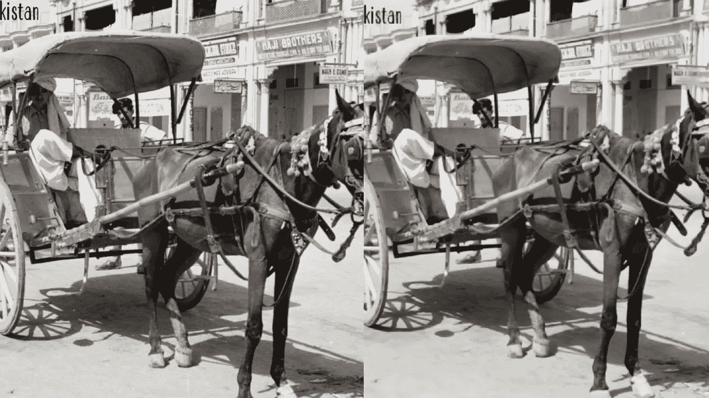
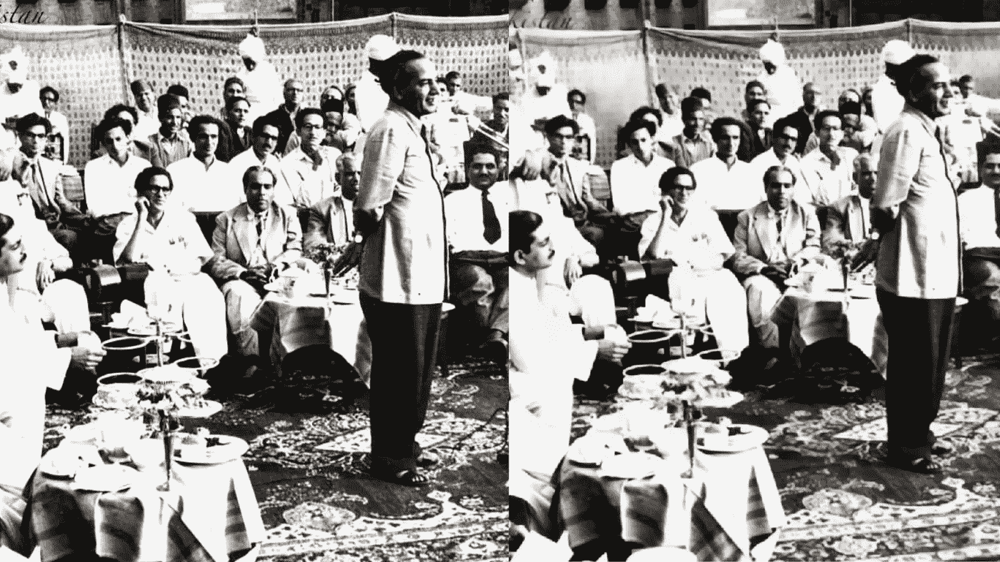
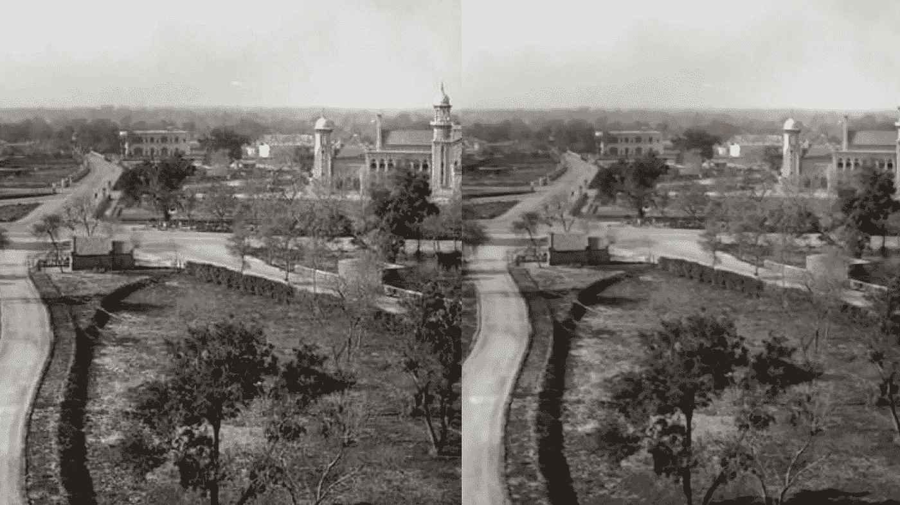
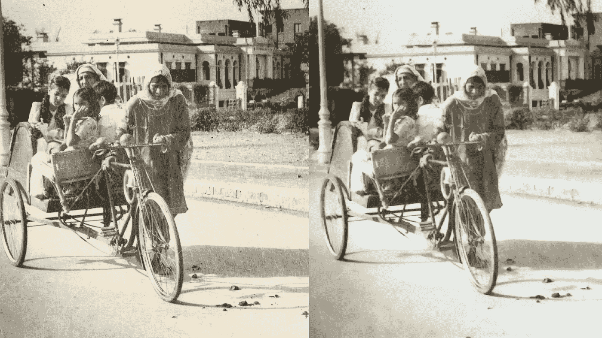
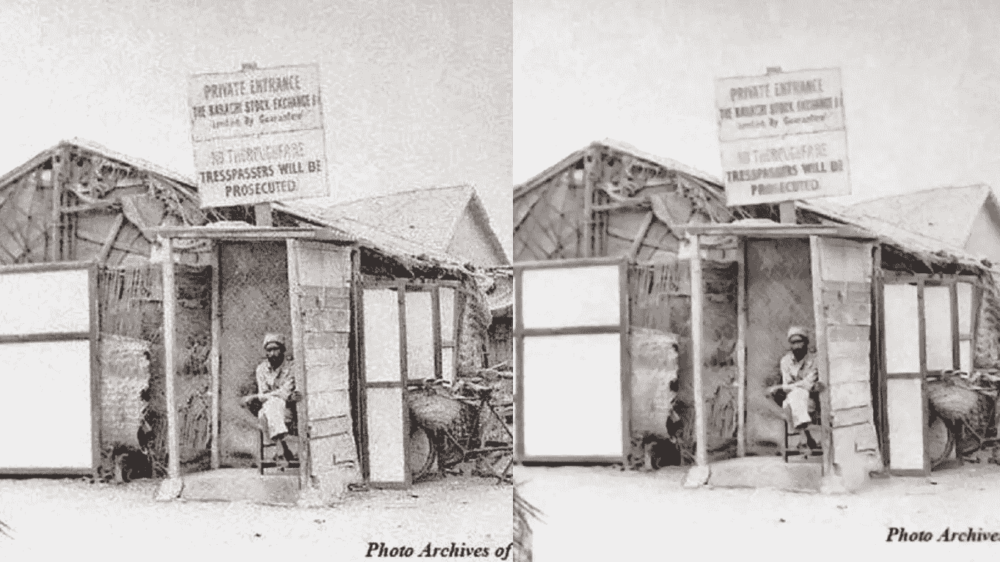

# 用深度学习着色巴基斯坦

> 原文：<https://medium.com/hackernoon/colorizing-pakistan-5697f7754b2a>

深度学习可以很有趣。你给它一些猫和狗的照片，它可以分辨出哪些照片是猫的，哪些是狗的。相反，你可以使用感知损失或 GANs(生成对抗网络)等技术将狗变成猫，也就是将一个图像变成另一个图像。

这有各种各样的应用。从令人惊叹的 AI 艺术，如将一种绘画风格转移到照片:[https://towardsdatascience . com/artistic-style-transfer-b 7566 a 216431](https://towardsdatascience.com/artistic-style-transfer-b7566a216431)

将黑白图像变成彩色。我就是这么做的。但在此之前，让我们先了解一下为什么会这样。

真的——深度学习在基本层面上的工作方式是，你向模型展示一堆数据，然后展示想要的结果(标签)。它自己找出将数据映射到标签的模式。

类似地，在这种情况下，我们可以做的是拍摄一组彩色照片，并将它们转换成黑白图像。一个相对容易的任务，因为我们是*删除*信息，而不是添加它。在 Python 中，使用 Pillow 之类的库可以很容易地做到这一点。

所以现在彩色照片是我们的数据，黑白对应图像是我们的标签。然后我们可以训练模型来理解这两个数据集之间的映射，它将学习黑白照片在彩色中的样子。一旦我们对它进行了训练，我们就可以用它来给任何黑白照片上色。

现在有趣的部分开始了，我们要测试一下！

我想挑选一些巴基斯坦的历史图片。有一个很棒的脸书团体叫做 [Vintage Pakistan](https://www.facebook.com/VintagePakistan/) 发布历史图片，通过这些图片看到这个国家的历史真的很酷。我抓了一些来看看它们会怎样出来。

还不错。我们可以看到在一些区域有一些奇怪的颜色，模型似乎倾向于一种暗米色，所以还有改进的空间。

The green tinge on the road might be because the model is getting pavement and grass mixed up.

尽管如此——这些图像看起来一点也不差:)

The famed poet Faiz Ahmad Faiz in action

它甚至可以很好地处理质量较低、略带黄色的旧照片。

当然还有这颗宝石…

The first stock exchange in Pakistan!

我会继续玩下去，也许会继续玩下去。让我知道你是否对你想看到的彩色照片有什么建议。