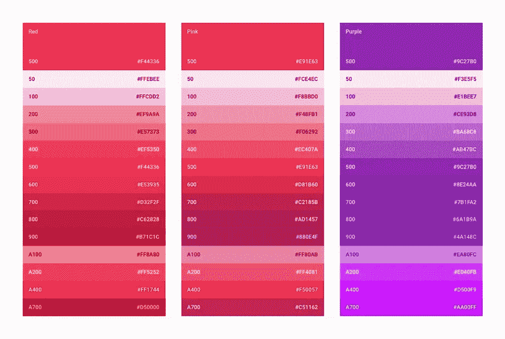

# 色彩和对比——无障碍设计的两大要素

> 原文：<https://medium.com/hackernoon/colour-and-contrast-the-2-essential-ingredients-of-accessible-design-f80f42484c5f>

我最近为我作为设计师工作的数字转换机构写了一篇文章。

*Our custom accessible colour palette incorporating Google Material Design*

在 DTA，我们[设计了](https://hackernoon.com/tagged/design)到 [13 项标准](https://www.dta.gov.au/standard/)，为政府提供简单、清晰、快捷的服务。标准 9 旨在为用户提供更便捷的服务，不管他们的环境如何。

在开发我们最新的性能仪表盘(澳大利亚最大的城市)时，我们学到了很多关于颜色和对比度的可访问性，我在下面分享了一些。

使用我们仪表板的主要人群是澳大利亚老年人。

超过七分之一的人年龄在 65 岁及以上，他们是澳大利亚人口中不断增长的一部分，预计在未来 50 年将翻一番。他们中的一半也被认为有低视力，这是一个不限于他们年龄组的问题。很多 40 岁以上的人不戴眼镜或双光眼镜就看不清小字。这是一种叫做[老花眼](http://www.allaboutvision.com/conditions/presbyopia.htm)的自然状态，也是 7 种已知颜色状态中的一种。

> 那么，这些条件是如何影响我们在[智能城市仪表盘](https://smart-cities.dashboard.gov.au/all-cities/overview)中选择颜色和对比度的呢？

# 颜色

我们工作的一个关键部分是使用颜色来帮助人们理解信息。对于患有不同颜色疾病的人来说，图表看起来完全不同。在澳大利亚，9%的人有某种形式的色盲。其他人的视力受到颜色对比和尺寸的影响。

*The chart as seen by someone with no colour condition.*

*The same chart as seen by people with different colour conditions.*

为了设计[智能城市仪表盘](https://smart-cities.dashboard.gov.au/all-cities/overview)，我们需要 6 种不同的颜色——每种颜色代表一个类别。但是颜色是非常主观的，根据你的文化和社会背景有不同的含义。正因为如此，我们避免了:

*   红色——通常用来表示危险或消极。
*   亮绿色——这可能有积极的含义。

在这些限制范围内选择 6 种颜色很难，但我们选择了基于谷歌材料设计颜色的调色板，最终选择了更中性的蓝绿色。我们还会选择哪些颜色相邻出现，以提高对比度，更容易区分它们。

然后，我们用一些已知的颜色条件来测试调色板。有不同的方法来做这种测试，但我们使用了 [Stark](http://www.getstark.co/) ，这个调色板表现得非常好。

## 应用模式会有所帮助

如果你需要在设计中使用很多不同的颜色，就很难找到合适的调色板。克服这一点的一个方法是叠加图案，使观众更容易区分类别。

*Patterns applied to charts help with colour conditions like Protanopia.*

应用图案有助于通过增加另一层视觉区别来解决颜色问题。对于多色图表尤其有用。

为了构建这些图表并应用这些模式，我们使用了[高级图表](https://www.highcharts.com/)中的可访问性模块。

# 对比

想出一个好的调色板是一回事，但我们还需要考虑对比度。

撰写《T4》这本书的人是万维网联盟(W3C)，这是一个为可访问性开发标准的国际组织。这是他们的[网络内容可访问性指南](https://www.w3.org/WAI/intro/wcag) (WCAG 2.0 AA)，这是我们为澳大利亚政府制定的[数字标准](https://www.dta.gov.au/standard/9-make-it-accessible/)的特色。它们还定义了文本、文本图像、对比度、大尺寸文本、用户界面、装饰和标识的最小对比度。

要符合 W3C 的标准并保持界面和谐工作，让用户看起来又好又舒服，这可能是一个挑战。在仪表板上，我们发现有一个好的颜色范围真的很有帮助。

谷歌材料设计允许我们使用广泛的色彩范围，这仍然是可管理的。我们还需要更多低端产品的颜色，所以我们创造了一种。这是一个很大的帮助，有微妙的背景工作，减轻了高对比度的可访问性效果工作的打击。

3 of the Google material design palettes. Showing a good range but limited in the lighter tones i.e. only 100 and a 50.

*The Smart City custom palette combined with Google Material Design.*

我们将调色板扩展到包括 20、40、60、80 和 90 度的色调。另外还有一部《黑暗中的 950》。这也是获得良好的对比度和范围以显示具有多个图例项的图表所必需的。

*Implementing the colour system using a main colour for each section and various tones within that colour range.*

通过使用这样的调色板，我们可以确保正确的对比度水平，以满足有颜色条件的人的需求，并通过使用字幕色调来帮助传达基本的数据信息，从而简化设计。

色彩和对比的设计意识遵循 [7 通用设计原则](http://universaldesign.ie/What-is-Universal-Design/The-7-Principles/)。这些原则旨在为所有人指导环境、产品和通信的设计。它直接适用于:

*   原则 1:公平使用
*   原则 2 使用的灵活性
*   原则 3:简单直观的使用
*   原则 4:可感知的信息。

# 帮助您入门的技巧和工具

无障碍设计是指每个元素都能很好地协同工作。  它有可能改变数百万人获取和使用政府服务的方式，让每个人的事情变得更容易，不管他们的情况如何。

最后，这里有一些关于无障碍视觉设计的提示:

## 大胆、生动、有意图

视觉效果不仅仅是取悦眼睛。它们创造了层次、清晰和意义。当屏幕上的可视元素有一个清晰的查看顺序时，它可以帮助用户专注于核心任务、功能和信息。

## 慎重选择颜色

选择一组颜色，它们可以很好地相互搭配，形成对比，便于使用。正确的颜色也能为你的内容定下基调，并有助于清晰地传达你的信息。

## 有意留白

创建一个大胆的界面，将用户带入体验中。

## 使用颜色

颜色是关键的组成部分。这是大胆的，图形和故意的。

## 想想背景

你设计的背景是什么？你的服务促进哪种活动？其目的是什么，何时、何地以及如何访问？

## 研究颜色背后的含义

每种颜色都有内涵。知道这些是什么，让它们符合你的目的。

## 考虑整个产品

单个的视觉元素和颜色很棒，但是它们如何在你产品的大画面中发挥作用呢？考虑整个产品的视觉效果如何影响对用户的意义和联系。

## 利用可用的色彩设计工具:

*   【getstark.co】—使用斯塔克与[草图](https://www.sketchapp.com/)一起工作。轻松检查色彩对比度，并通过不同的色彩条件查看您正在做什么。
*   [colordrop.io](https://colordrop.io/?ref=producthunt) —直观查看和搜索调色板的更好方式。
*   [lol colors](https://www.webdesignrankings.com/resources/lolcolors/?ref=producthunt)——完美呈现的调色板。
*   [material.io](https://material.io/color/#!/?view.left=0&view.right=0) —同时检查多个屏幕和调色板的对比度。
*   [coolors.co](https://coolors.co/002626-0e4749-95c623-e55812-efe7da)—一个大的单色调色板选择。

> 如果你想了解更多关于无障碍设计的信息，可以看看我们关于超越指南的博客。
> 
> 如果您对[城市仪表盘](https://www.dta.gov.au/blog/smart-cities-dashboard/)有任何疑问，请在下方留言或联系[dashboard@digital.gov.au](mailto:dashboard@digital.gov.au)。